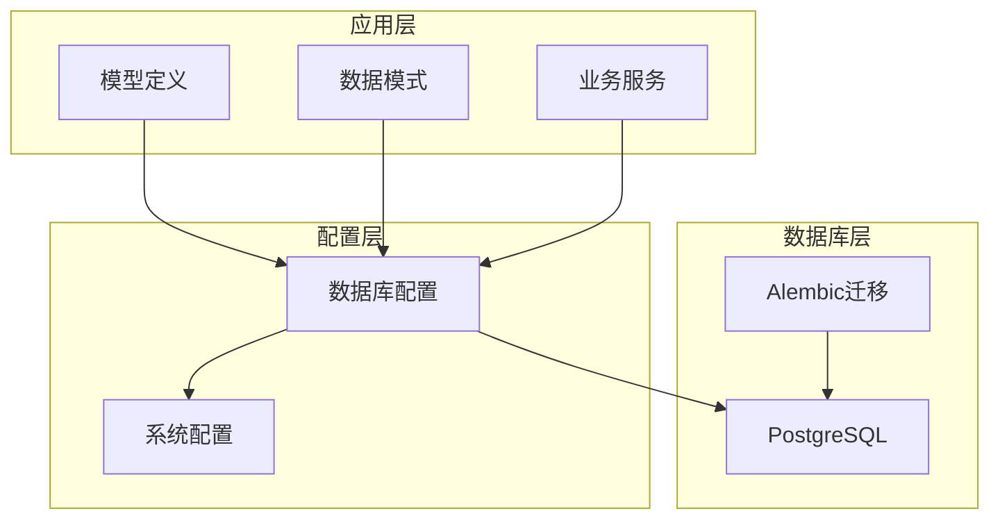
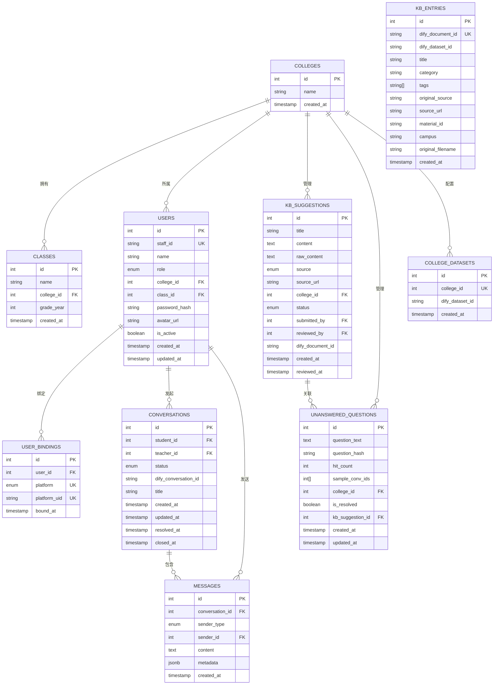
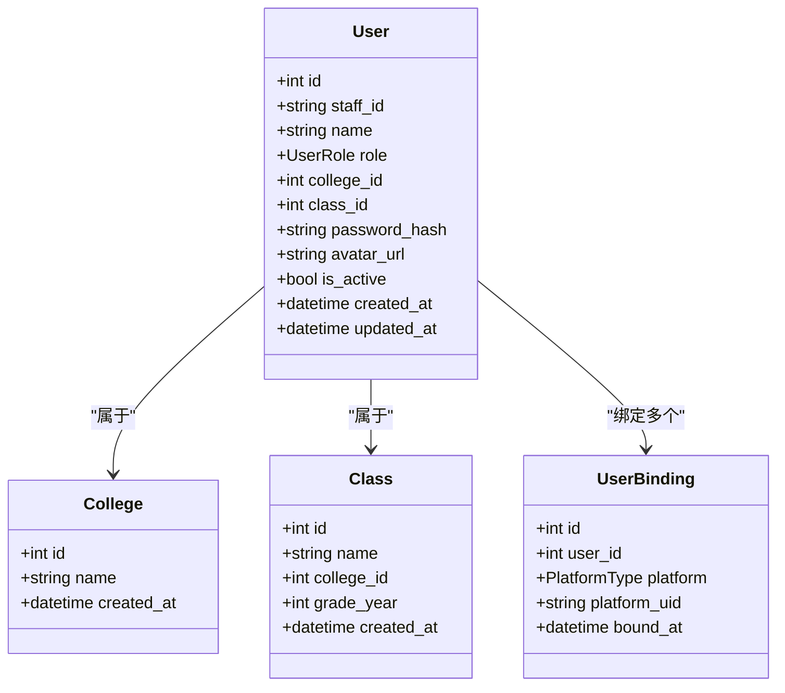
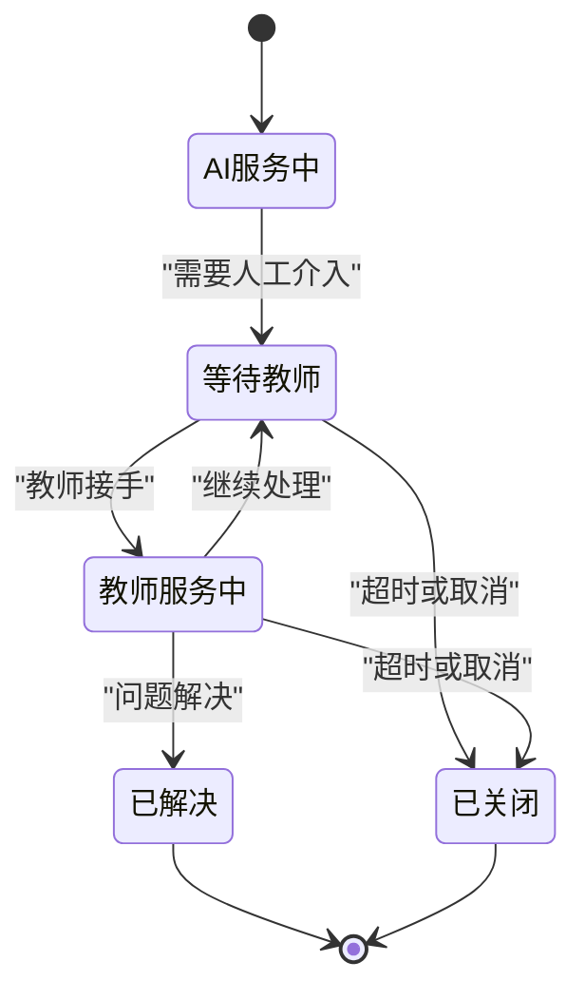
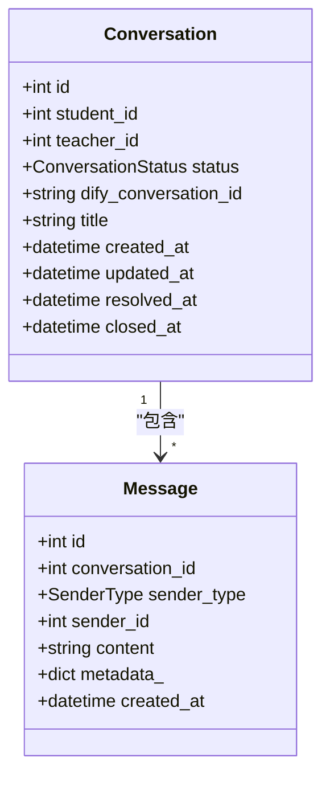
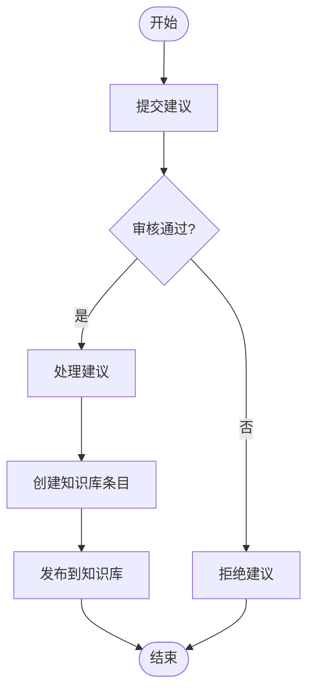
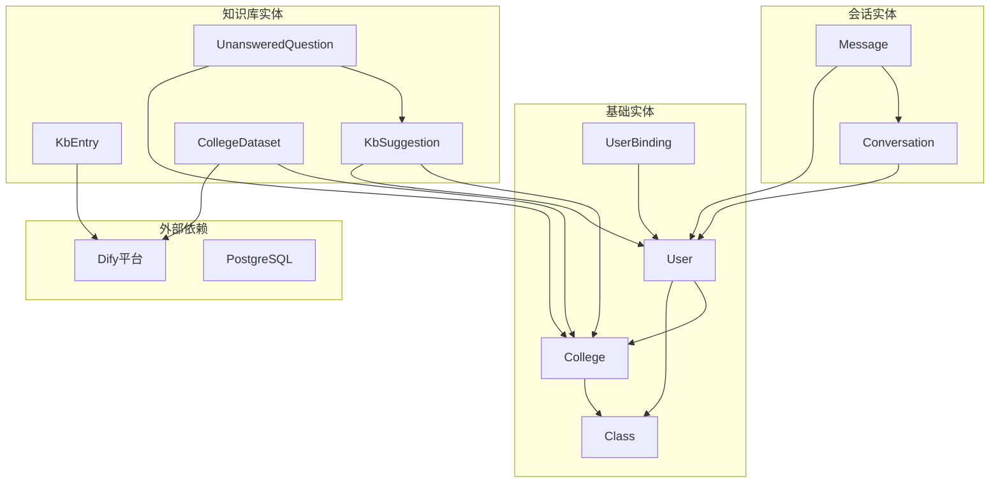

# 核心实体设计

<cite>
**本文档引用的文件**
- [services/gateway/app/models/user.py](file://services/gateway/app/models/user.py)
- [services/gateway/app/models/conversation.py](file://services/gateway/app/models/conversation.py)
- [services/gateway/app/models/knowledge.py](file://services/gateway/app/models/knowledge.py)
- [services/gateway/app/models/kb_entry.py](file://services/gateway/app/models/kb_entry.py)
- [services/gateway/alembic/versions/e11bb6c9d4b8_v2_initial_schema.py](file://services/gateway/alembic/versions/e11bb6c9d4b8_v2_initial_schema.py)
- [services/gateway/alembic/versions/ff1f0ab0c5f8_add_kb_entries_table.py](file://services/gateway/alembic/versions/ff1f0ab0c5f8_add_kb_entries_table.py)
- [services/gateway/app/database.py](file://services/gateway/app/database.py)
- [services/gateway/app/models/__init__.py](file://services/gateway/app/models/__init__.py)
- [services/gateway/app/schemas/conversation.py](file://services/gateway/app/schemas/conversation.py)
</cite>

## 目录
1. [简介](#简介)
2. [项目结构](#项目结构)
3. [核心组件](#核心组件)
4. [架构概览](#架构概览)
5. [详细组件分析](#详细组件分析)
6. [依赖关系分析](#依赖关系分析)
7. [性能考虑](#性能考虑)
8. [故障排除指南](#故障排除指南)
9. [结论](#结论)

## 简介

医小管 v2 是一个基于 PostgreSQL 数据库的智能问答系统，采用 SQLAlchemy ORM 框架进行数据建模。本文件详细解析系统的核心实体模型，包括用户(User)、会话(Conversation)、知识库条目(KBEntry)、知识库(Knowledge)等关键数据模型的设计理念和实现细节。

该系统采用异步数据库连接，支持多平台用户绑定，具备完整的会话管理功能和知识库增强机制。通过精心设计的实体关系和约束条件，确保了数据的完整性和业务逻辑的正确性。

## 项目结构

系统采用分层架构设计，核心模型位于 `services/gateway/app/models/` 目录下，数据库迁移脚本位于 `services/gateway/alembic/versions/` 目录中。

**图表来源**
- [services/gateway/app/models/__init__.py:1-5](file://services/gateway/app/models/__init__.py#L1-L5)
- [services/gateway/app/database.py:1-15](file://services/gateway/app/database.py#L1-L15)

**章节来源**
- [services/gateway/app/models/__init__.py:1-5](file://services/gateway/app/models/__init__.py#L1-L5)
- [services/gateway/app/database.py:1-15](file://services/gateway/app/database.py#L1-L15)

## 核心组件

系统包含四个核心实体模型，每个都经过精心设计以满足特定的业务需求：

### 用户管理实体
- **User**: 主要用户实体，支持多种角色类型
- **UserBinding**: 多平台用户绑定管理
- **College**: 学院信息管理
- **Class**: 班级信息管理

### 会话管理实体
- **Conversation**: 用户会话管理
- **Message**: 会话消息存储

### 知识库实体
- **KbEntry**: 知识库条目管理
- **KbSuggestion**: 知识库建议管理
- **UnansweredQuestion**: 未解答问题管理
- **CollegeDataset**: 学院数据集管理

**章节来源**
- [services/gateway/app/models/user.py:45-76](file://services/gateway/app/models/user.py#L45-L76)
- [services/gateway/app/models/conversation.py:26-63](file://services/gateway/app/models/conversation.py#L26-L63)
- [services/gateway/app/models/knowledge.py:22-62](file://services/gateway/app/models/knowledge.py#L22-L62)
- [services/gateway/app/models/kb_entry.py:9-31](file://services/gateway/app/models/kb_entry.py#L9-L31)

## 架构概览

系统采用异步数据库连接和 ORM 映射，通过精心设计的实体关系确保数据一致性。

**图表来源**
- [services/gateway/alembic/versions/e11bb6c9d4b8_v2_initial_schema.py:24-139](file://services/gateway/alembic/versions/e11bb6c9d4b8_v2_initial_schema.py#L24-L139)
- [services/gateway/alembic/versions/ff1f0ab0c5f8_add_kb_entries_table.py:24-39](file://services/gateway/alembic/versions/ff1f0ab0c5f8_add_kb_entries_table.py#L24-L39)

## 详细组件分析

### 用户实体 (User)

用户实体是系统的核心基础实体，支持三种角色类型：学生、教师和管理员。

#### 字段定义与约束

| 字段名 | 类型 | 约束 | 描述 |
|--------|------|------|------|
| id | int | 主键 | 用户唯一标识符 |
| staff_id | string | 唯一、非空 | 工号或员工编号 |
| name | string | 非空 | 用户姓名 |
| role | enum | 非空 | 用户角色：student/teacher/admin |
| college_id | int | 外键、可空 | 所属学院ID |
| class_id | int | 外键、可空 | 所属班级ID |
| password_hash | string | 非空 | 密码哈希值 |
| avatar_url | string | 可空 | 头像URL地址 |
| is_active | boolean | 默认true | 用户状态 |
| created_at | timestamp | 默认当前时间 | 创建时间 |
| updated_at | timestamp | 默认当前时间，更新时自动更新 | 更新时间 |

#### 关系映射

**图表来源**
- [services/gateway/app/models/user.py:45-76](file://services/gateway/app/models/user.py#L45-L76)

#### 生命周期管理

用户实体采用标准的CRUD操作模式：
- **创建**: 通过staff_id唯一性约束确保用户身份唯一
- **激活/停用**: 使用is_active字段控制用户状态
- **更新**: 自动更新updated_at字段记录变更时间
- **软删除**: 通过is_active字段实现逻辑删除

**章节来源**
- [services/gateway/app/models/user.py:45-58](file://services/gateway/app/models/user.py#L45-L58)

### 会话实体 (Conversation)

会话实体管理用户与系统的交互历史，支持AI服务、教师服务等多种状态。

#### 会话状态流程

#### 字段定义与约束

| 字段名 | 类型 | 约束 | 描述 |
|--------|------|------|------|
| id | int | 主键 | 会话唯一标识符 |
| student_id | int | 外键、非空 | 学生用户ID |
| teacher_id | int | 外键、可空 | 教师用户ID |
| status | enum | 非空 | 会话状态 |
| dify_conversation_id | string | 可空 | Dify平台会话ID |
| title | string | 非空 | 会话标题 |
| created_at | timestamp | 默认当前时间 | 创建时间 |
| updated_at | timestamp | 默认当前时间，更新时自动更新 | 更新时间 |
| resolved_at | timestamp | 可空 | 解决时间 |
| closed_at | timestamp | 可空 | 关闭时间 |

#### 消息实体设计

消息实体支持四种发送者类型，确保完整的对话历史记录。

**图表来源**
- [services/gateway/app/models/conversation.py:26-63](file://services/gateway/app/models/conversation.py#L26-L63)

#### 性能优化

会话查询通过索引优化：
- `idx_conversations_student`: 学生ID查询优化
- `idx_conversations_status`: 状态过滤优化
- `idx_messages_conversation`: 会话消息查询优化
- `idx_messages_created`: 时间序列查询优化

**章节来源**
- [services/gateway/app/models/conversation.py:26-44](file://services/gateway/app/models/conversation.py#L26-L44)

### 知识库实体 (Knowledge)

知识库实体支持知识库增强和问题管理功能。

#### 知识库建议流程

#### 字段定义与约束

**KbSuggestion 实体**
| 字段名 | 类型 | 约束 | 描述 |
|--------|------|------|------|
| id | int | 主键 | 建议唯一标识符 |
| title | string | 非空 | 建议标题 |
| content | text | 非空 | 建议内容 |
| raw_content | text | 可空 | 原始内容 |
| source | enum | 非空 | 来源类型 |
| source_url | string | 可空 | 来源URL |
| college_id | int | 外键、可空 | 学院ID |
| status | enum | 非空 | 建议状态 |
| submitted_by | int | 外键、非空 | 提交人ID |
| reviewed_by | int | 外键、可空 | 审核人ID |
| dify_document_id | string | 可空 | Dify文档ID |
| created_at | timestamp | 默认当前时间 | 创建时间 |
| reviewed_at | timestamp | 可空 | 审核时间 |

**UnansweredQuestion 实体**
| 字段名 | 类型 | 约束 | 描述 |
|--------|------|------|------|
| id | int | 主键 | 问题唯一标识符 |
| question_text | text | 非空 | 问题文本 |
| question_hash | string | 非空 | 问题哈希值 |
| hit_count | int | 默认1 | 命中次数 |
| sample_conv_ids | int[] | 可空 | 示例会话ID数组 |
| college_id | int | 外键、可空 | 学院ID |
| is_resolved | boolean | 默认false | 是否已解决 |
| kb_suggestion_id | int | 外键、可空 | 关联的知识库建议ID |
| created_at | timestamp | 默认当前时间 | 创建时间 |
| updated_at | timestamp | 默认当前时间，更新时自动更新 | 更新时间 |

**章节来源**
- [services/gateway/app/models/knowledge.py:22-53](file://services/gateway/app/models/knowledge.py#L22-L53)

### 知识库条目实体 (KBEntry)

知识库条目实体用于管理Dify文档与原始来源的映射关系。

#### 字段定义与约束

| 字段名 | 类型 | 约束 | 描述 |
|--------|------|------|------|
| id | int | 主键 | 条目唯一标识符 |
| dify_document_id | string | 唯一、非空 | Dify文档ID |
| dify_dataset_id | string | 非空 | Dify数据集ID |
| title | string | 非空 | 条目标题 |
| category | string | 可空 | 分类信息 |
| tags | string[] | 可空 | 标签数组 |
| original_source | string | 可空 | 原始来源描述 |
| source_url | string | 可空 | 原始URL |
| material_id | string | 可空 | 物料ID |
| campus | string | 可空 | 校区信息 |
| original_filename | string | 可空 | 原始文件名 |
| created_at | timestamp | 默认当前时间 | 创建时间 |

#### 数据完整性保证

知识库条目通过以下机制保证数据完整性：
- **唯一性约束**: dify_document_id 唯一性确保文档映射的唯一性
- **索引优化**: title 字段建立索引支持快速检索
- **外键关联**: 与Dify平台的数据集保持关联

**章节来源**
- [services/gateway/app/models/kb_entry.py:9-31](file://services/gateway/app/models/kb_entry.py#L9-L31)

## 依赖关系分析

系统采用模块化设计，各实体之间通过外键关系建立清晰的依赖关系。

**图表来源**
- [services/gateway/app/models/user.py:23-76](file://services/gateway/app/models/user.py#L23-L76)
- [services/gateway/app/models/conversation.py:26-63](file://services/gateway/app/models/conversation.py#L26-L63)
- [services/gateway/app/models/knowledge.py:22-62](file://services/gateway/app/models/knowledge.py#L22-L62)
- [services/gateway/app/models/kb_entry.py:9-31](file://services/gateway/app/models/kb_entry.py#L9-L31)

### 外键约束分析

系统通过严格的外键约束确保数据一致性：

1. **用户层级**: User → College, User → Class
2. **会话层级**: Conversation → User(student), Conversation → User(teacher), Message → Conversation
3. **知识库层级**: KbSuggestion → College, KbSuggestion → User(submitted_by/reviewed_by), UnansweredQuestion → KbSuggestion
4. **平台集成**: UserBinding → User, KbEntry → Dify平台

**章节来源**
- [services/gateway/alembic/versions/e11bb6c9d4b8_v2_initial_schema.py:35-137](file://services/gateway/alembic/versions/e11bb6c9d4b8_v2_initial_schema.py#L35-L137)

## 性能考虑

系统在设计时充分考虑了性能优化：

### 数据库索引策略
- **会话查询**: 在status和student_id字段建立复合索引
- **消息查询**: 在conversation_id和created_at字段建立复合索引
- **知识库检索**: 在kb_entries.title字段建立索引

### 连接池配置
- **连接池大小**: 10个连接
- **异步连接**: 支持高并发请求处理
- **连接复用**: 通过expire_on_commit参数优化连接使用

### 查询优化
- **延迟加载**: 关系字段采用延迟加载减少不必要的查询
- **批量操作**: 支持批量插入和更新操作
- **分页查询**: 提供高效的分页查询机制

## 故障排除指南

### 常见问题及解决方案

#### 数据库连接问题
- **症状**: 连接超时或连接失败
- **原因**: 连接池耗尽或数据库不可达
- **解决方案**: 检查数据库配置和网络连接，适当调整连接池大小

#### 外键约束错误
- **症状**: 外键约束违反错误
- **原因**: 删除父记录时存在子记录
- **解决方案**: 先删除子记录再删除父记录，或使用级联删除

#### 唯一性约束冲突
- **症状**: 唯一性约束违反错误
- **原因**: 重复的staff_id或dify_document_id
- **解决方案**: 检查数据唯一性，生成新的唯一标识符

#### 性能问题
- **症状**: 查询响应缓慢
- **原因**: 缺少必要的索引或查询条件不当
- **解决方案**: 添加适当的索引，优化查询语句

**章节来源**
- [services/gateway/app/database.py:6-7](file://services/gateway/app/database.py#L6-L7)

## 结论

医小管 v2 的核心实体模型设计体现了以下特点：

1. **清晰的层次结构**: 从基础的用户管理到复杂的会话和知识库管理，层次分明
2. **严格的数据约束**: 通过外键、唯一性约束和枚举类型确保数据完整性
3. **灵活的关系映射**: 支持一对多、多对多关系，适应复杂的业务场景
4. **完善的生命周期管理**: 支持用户状态管理、会话状态流转和知识库内容管理
5. **高性能设计**: 通过索引优化、连接池配置和异步处理提升系统性能

这些设计为医小管 v2 提供了坚实的数据基础，支持其作为智能问答系统的核心功能需求。通过持续的维护和优化，系统能够稳定地支持教学场景中的各种复杂业务需求。