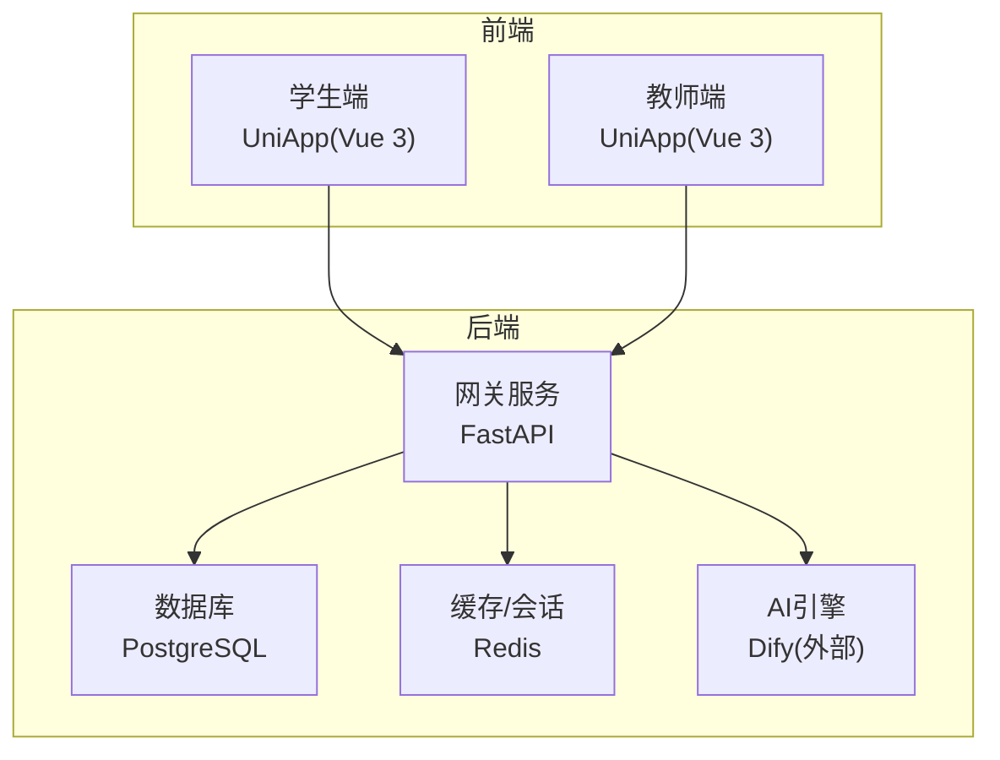
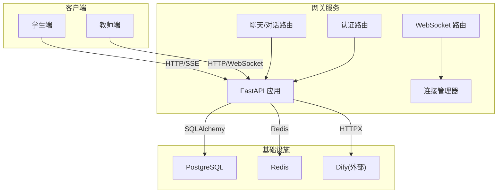
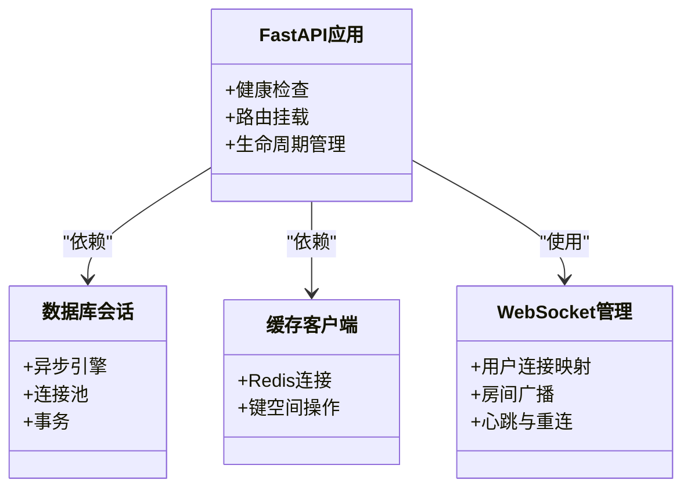
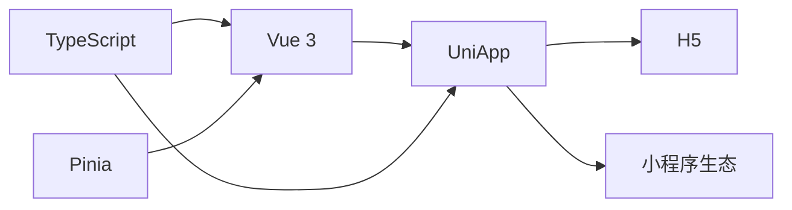
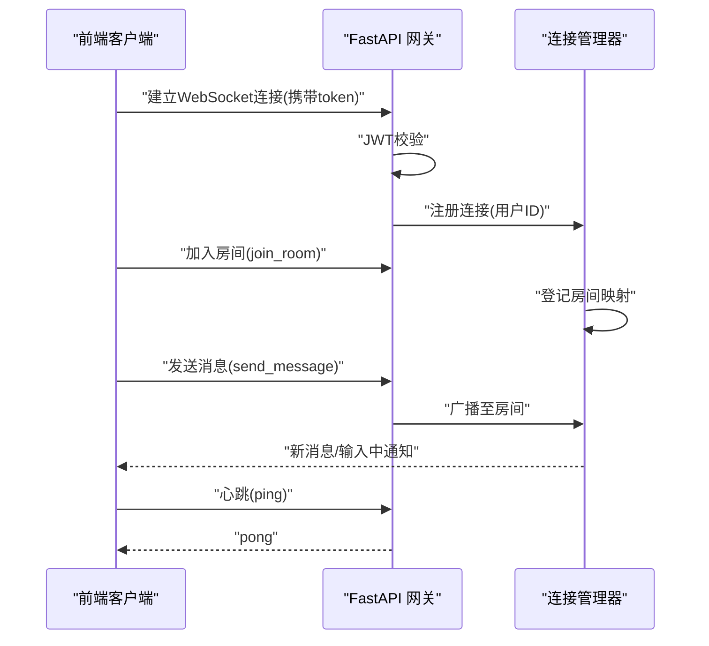
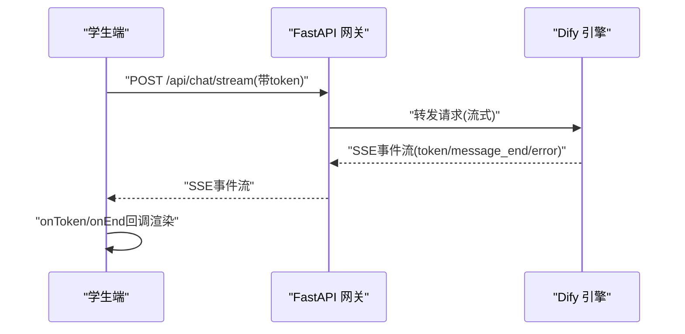
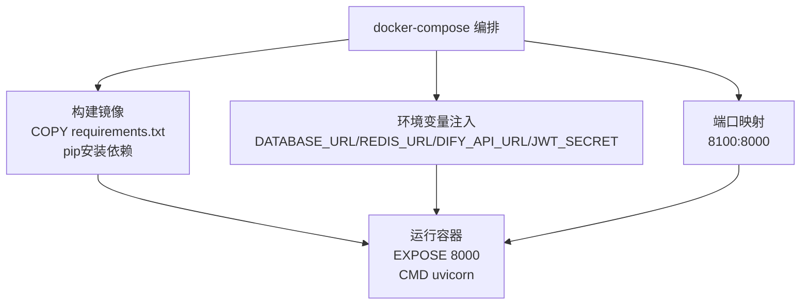
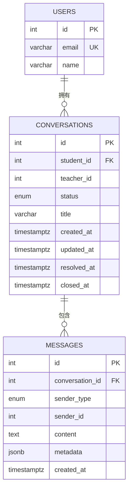
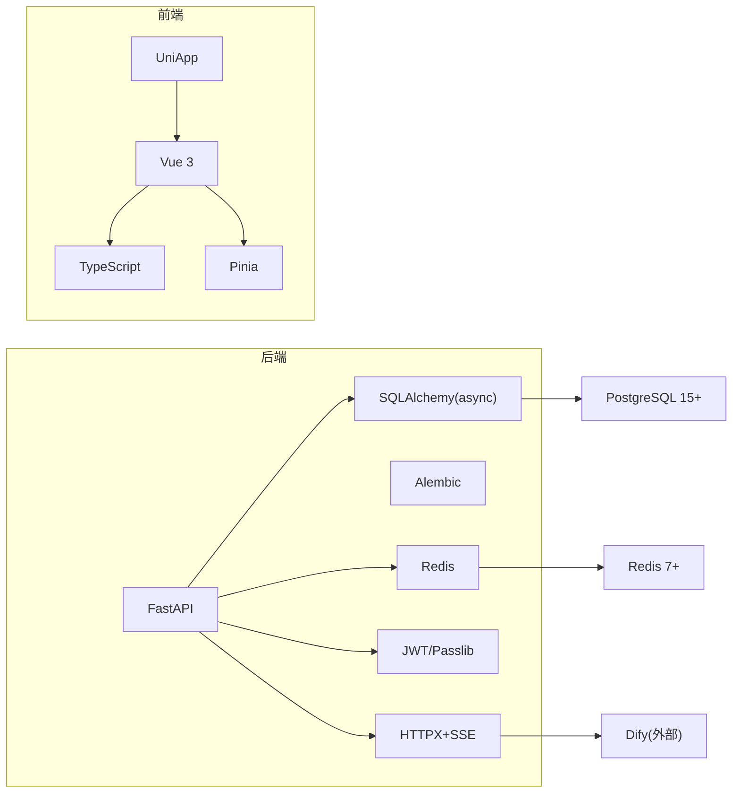

# 技术栈选型

<cite>
**本文引用的文件**
- [README.md](file://README.md)
- [requirements.txt](file://services/gateway/requirements.txt)
- [Dockerfile](file://services/gateway/Dockerfile)
- [docker-compose.yml](file://deploy/docker-compose.yml)
- [main.py](file://services/gateway/app/main.py)
- [database.py](file://services/gateway/app/database.py)
- [conversation.py](file://services/gateway/app/models/conversation.py)
- [ws_manager.py](file://services/gateway/app/services/ws_manager.py)
- [ws.py](file://services/gateway/app/routers/ws.py)
- [package.json（学生端）](file://apps/student-app/package.json)
- [package.json（教师端）](file://apps/teacher-app/package.json)
- [websocket.ts（学生端）](file://apps/student-app/src/utils/websocket.ts)
- [sse.ts（学生端）](file://apps/student-app/src/utils/sse.ts)
- [websocket.ts（教师端）](file://apps/teacher-app/src/utils/websocket.ts)
- [tsconfig.json（学生端）](file://apps/student-app/tsconfig.json)
- [tsconfig.json（教师端）](file://apps/teacher-app/tsconfig.json)
- [alembic.ini](file://services/gateway/alembic.ini)
</cite>

## 目录
1. [引言](#引言)
2. [项目结构](#项目结构)
3. [核心组件](#核心组件)
4. [架构总览](#架构总览)
5. [详细组件分析](#详细组件分析)
6. [依赖关系分析](#依赖关系分析)
7. [性能考量](#性能考量)
8. [故障排查指南](#故障排查指南)
9. [结论](#结论)
10. [附录](#附录)

## 引言
本文件面向“医小管 v2”项目，系统阐述技术栈选型与架构设计，重点覆盖：
- 后端技术栈：Python、FastAPI、SQLAlchemy、PostgreSQL、Redis 的选择原因与优势
- 前端技术栈：Vue.js 3、UniApp、TypeScript 的架构考量
- 实时通信：WebSocket、Server-Sent Events（SSE）的选型依据与实现
- 容器化与部署：Docker、Docker Compose 的选择理由与配置要点
- 替代方案对比与权衡
- 版本兼容性与依赖管理策略

## 项目结构
项目采用多模块分层组织：
- 后端网关服务：基于 FastAPI 的 API 网关，负责认证、对话路由、WebSocket 管理、与 AI 引擎（Dify）交互
- 学生端与教师端：基于 UniApp 的跨平台前端应用，统一使用 Vue 3 + TypeScript
- 部署：Docker 容器化，docker-compose 编排，独立服务镜像构建与运行
- 数据与迁移：PostgreSQL + SQLAlchemy + Alembic

图表来源
- [main.py:16-28](file://services/gateway/app/main.py#L16-L28)
- [docker-compose.yml:3-22](file://deploy/docker-compose.yml#L3-L22)

章节来源
- [README.md:1-18](file://README.md#L1-L18)
- [docker-compose.yml:1-22](file://deploy/docker-compose.yml#L1-L22)

## 核心组件
- 后端框架：FastAPI 提供高性能异步 API、自动生成 OpenAPI 文档、类型安全与高并发能力
- 数据访问：SQLAlchemy ORM + asyncpg + 异步会话，支持 PostgreSQL 15+，具备良好的事务与连接池控制
- 缓存与会话：Redis 7+ 用于会话、限流、临时状态存储
- 实时通信：WebSocket（单连接 + 房间模式）与 SSE（流式响应）双通道
- 前端框架：Vue 3 + UniApp，统一跨 H5/小程序生态；TypeScript 提升类型安全
- 容器化：Python 3.12 基础镜像，pip 安装依赖，Uvicorn 运行 ASGI 应用

章节来源
- [requirements.txt:1-29](file://services/gateway/requirements.txt#L1-L29)
- [package.json（学生端）:1-37](file://apps/student-app/package.json#L1-L37)
- [package.json（教师端）:1-46](file://apps/teacher-app/package.json#L1-L46)
- [Dockerfile:1-14](file://services/gateway/Dockerfile#L1-L14)

## 架构总览
后端以 FastAPI 为核心，提供认证、对话管理、动作处理与 WebSocket 能力，并通过 HTTP 与 Dify 交互；前端通过 WebSocket 与 SSE 分别实现双向实时与流式 AI 输出。

图表来源
- [main.py:10-14](file://services/gateway/app/main.py#L10-L14)
- [ws.py:11-34](file://services/gateway/app/routers/ws.py#L11-L34)
- [ws_manager.py:8-24](file://services/gateway/app/services/ws_manager.py#L8-L24)
- [docker-compose.yml:11-16](file://deploy/docker-compose.yml#L11-L16)

## 详细组件分析

### 后端技术栈选型与优势
- Python：生态成熟、异步生态完善、运维友好
- FastAPI：自动生成接口文档、类型驱动开发、内置中间件与依赖注入、高并发
- SQLAlchemy（异步）：ORM 易维护、类型安全、与 Alembic 协作完成数据库演进
- PostgreSQL 15+：ACID、JSONB、全文检索、扩展丰富、生产级稳定性
- Redis 7+：高性能键值存储、发布订阅、会话与缓存

图表来源
- [main.py:16-28](file://services/gateway/app/main.py#L16-L28)
- [database.py:6-14](file://services/gateway/app/database.py#L6-L14)
- [ws_manager.py:20-24](file://services/gateway/app/services/ws_manager.py#L20-L24)

章节来源
- [requirements.txt:1-29](file://services/gateway/requirements.txt#L1-L29)
- [database.py:1-15](file://services/gateway/app/database.py#L1-L15)
- [alembic.ini:86-89](file://services/gateway/alembic.ini#L86-L89)

### 前端技术栈选型与架构考量
- Vue 3：组合式 API、更好的 TypeScript 支持、更小体积与更高性能
- UniApp：一套代码多端运行（H5、微信小程序等），降低维护成本
- TypeScript：静态类型检查、IDE 智能提示、可维护性与可测试性提升
- 状态管理：Pinia（轻量、易用、TypeScript 友好）

图表来源
- [package.json（学生端）:11-21](file://apps/student-app/package.json#L11-L21)
- [package.json（教师端）:11-31](file://apps/teacher-app/package.json#L11-L31)
- [tsconfig.json（学生端）:1-14](file://apps/student-app/tsconfig.json#L1-L14)
- [tsconfig.json（教师端）:1-14](file://apps/teacher-app/tsconfig.json#L1-L14)

章节来源
- [package.json（学生端）:1-37](file://apps/student-app/package.json#L1-L37)
- [package.json（教师端）:1-46](file://apps/teacher-app/package.json#L1-L46)
- [tsconfig.json（学生端）:1-14](file://apps/student-app/tsconfig.json#L1-L14)
- [tsconfig.json（教师端）:1-14](file://apps/teacher-app/tsconfig.json#L1-L14)

### 实时通信：WebSocket 与 SSE 选型
- WebSocket：全双工、低延迟、适合多方会话（学生/教师/AI）、心跳与重连机制完善
- SSE：服务端持续推送、简单可靠、适合流式输出（如 AI token 流）
- 两端实现：学生端与教师端均提供 WebSocket 管理器，支持房间加入/离开、消息派发、心跳与指数退避重连；SSE 工具函数解析事件流并回调

图表来源
- [ws.py:11-34](file://services/gateway/app/routers/ws.py#L11-L34)
- [ws_manager.py:25-58](file://services/gateway/app/services/ws_manager.py#L25-L58)

图表来源
- [sse.ts（学生端）:13-68](file://apps/student-app/src/utils/sse.ts#L13-L68)

章节来源
- [websocket.ts（学生端）:1-153](file://apps/student-app/src/utils/websocket.ts#L1-L153)
- [websocket.ts（教师端）:1-169](file://apps/teacher-app/src/utils/websocket.ts#L1-L169)
- [ws.py:11-34](file://services/gateway/app/routers/ws.py#L11-L34)
- [ws_manager.py:8-24](file://services/gateway/app/services/ws_manager.py#L8-L24)
- [sse.ts（学生端）:1-69](file://apps/student-app/src/utils/sse.ts#L1-L69)

### 容器化与部署：Docker 与 Docker Compose
- 基础镜像：python:3.12-slim，精简且稳定
- 依赖安装：使用国内镜像源加速，集中安装 requirements.txt
- 运行方式：Uvicorn 执行 ASGI 应用入口
- 编排：docker-compose 将网关服务暴露端口、注入环境变量（数据库、Redis、Dify、JWT 密钥），复用已有数据库与缓存服务

图表来源
- [Dockerfile:1-14](file://services/gateway/Dockerfile#L1-L14)
- [docker-compose.yml:4-22](file://deploy/docker-compose.yml#L4-L22)

章节来源
- [Dockerfile:1-14](file://services/gateway/Dockerfile#L1-L14)
- [docker-compose.yml:1-22](file://deploy/docker-compose.yml#L1-L22)

### 数据模型与迁移策略
- 使用 SQLAlchemy 异步 ORM 定义会话与消息模型，含索引优化与 JSONB 字段
- 使用 Alembic 进行数据库迁移，支持脚手架与日志配置

图表来源
- [conversation.py:26-63](file://services/gateway/app/models/conversation.py#L26-L63)
- [alembic.ini:86-89](file://services/gateway/alembic.ini#L86-L89)

章节来源
- [conversation.py:1-63](file://services/gateway/app/models/conversation.py#L1-L63)
- [alembic.ini:1-150](file://services/gateway/alembic.ini#L1-L150)

## 依赖关系分析
- 后端依赖：FastAPI、Uvicorn、SQLAlchemy asyncio、asyncpg、Alembic、Redis、HTTPX、Pydantic Settings、JWT、bcrypt、pytest
- 前端依赖：@dcloudio/uni-app、vue、pinia、typescript、sass、vite、vue-tsc 等
- 运行时：PostgreSQL 15+、Redis 7+、Dify（外部服务）

图表来源
- [requirements.txt:1-29](file://services/gateway/requirements.txt#L1-L29)
- [package.json（学生端）:11-35](file://apps/student-app/package.json#L11-L35)
- [package.json（教师端）:11-44](file://apps/teacher-app/package.json#L11-L44)

章节来源
- [requirements.txt:1-29](file://services/gateway/requirements.txt#L1-L29)
- [package.json（学生端）:1-37](file://apps/student-app/package.json#L1-L37)
- [package.json（教师端）:1-46](file://apps/teacher-app/package.json#L1-L46)

## 性能考量
- 异步 I/O：FastAPI + SQLAlchemy asyncio + asyncpg，减少阻塞，提高吞吐
- 连接池：数据库连接池与 Redis 客户端连接池，避免频繁创建销毁
- WebSocket：单连接 + 房间广播，减少连接数；心跳与指数退避重连保障稳定性
- SSE：流式传输，降低长轮询开销，适合 AI token 流
- 缓存：热点数据与会话状态放入 Redis，减轻数据库压力
- 部署：容器化隔离与资源限制，便于弹性伸缩

## 故障排查指南
- 健康检查：后端提供 /health，检查 PostgreSQL、Redis、Dify 可达性
- 日志：Alembic 与 SQLAlchemy 日志级别配置，便于定位迁移与查询问题
- WebSocket：关注 ping/pong 心跳、房间加入/离开、错误消息类型
- SSE：关注事件类型与 JSON 解析，确保流式读取完整

章节来源
- [main.py:30-68](file://services/gateway/app/main.py#L30-L68)
- [alembic.ini:115-150](file://services/gateway/alembic.ini#L115-L150)
- [ws.py:59-112](file://services/gateway/app/routers/ws.py#L59-L112)

## 结论
本项目在技术栈选择上兼顾了高性能、可维护性与跨平台能力：
- 后端以 FastAPI + SQLAlchemy + PostgreSQL + Redis 构建高可用网关，配合 Alembic 管理数据库演进
- 前端采用 Vue 3 + UniApp + TypeScript，统一多端体验并提升类型安全
- 实时通信采用 WebSocket 与 SSE 双通道，满足多方会话与流式输出场景
- 容器化与编排简化部署与运维，便于扩展与迭代

## 附录

### 替代方案与权衡
- Web 框架：Django/Flask/Tornado 等；FastAPI 在异步、类型安全、文档自动生成方面更具优势
- 数据库：MySQL/MariaDB/SQLite；PostgreSQL 在 JSONB、扩展与生产稳定性更优
- 缓存：Memcached/LevelDB；Redis 在会话与发布订阅场景更契合
- 前端：React/Nuxt/Vite；Vue 3 + UniApp 在多端复用与生态适配上更合适
- 实时通信：gRPC/长轮询；WebSocket + SSE 在复杂度与性能之间取得平衡
- 容器化：Kubernetes/Podman；Docker Compose 更适合中小型项目快速上线

### 版本兼容性与依赖管理策略
- Python 3.12、FastAPI 0.115+、SQLAlchemy 2.0+、asyncpg 0.30+、Redis 5.0+、PostgreSQL 15+
- 前端：Vue 3.4+、UniApp 3.0、TypeScript 4.9、Vite 5.2
- 依赖管理：后端集中于 requirements.txt，前端集中于 package.json；容器镜像固定基础版本，避免漂移
- 迁移管理：Alembic 脚本化，遵循“不可回滚破坏性变更”的最佳实践

章节来源
- [requirements.txt:1-29](file://services/gateway/requirements.txt#L1-L29)
- [package.json（学生端）:1-37](file://apps/student-app/package.json#L1-L37)
- [package.json（教师端）:1-46](file://apps/teacher-app/package.json#L1-L46)
- [Dockerfile:1-14](file://services/gateway/Dockerfile#L1-L14)
- [alembic.ini:1-150](file://services/gateway/alembic.ini#L1-L150)