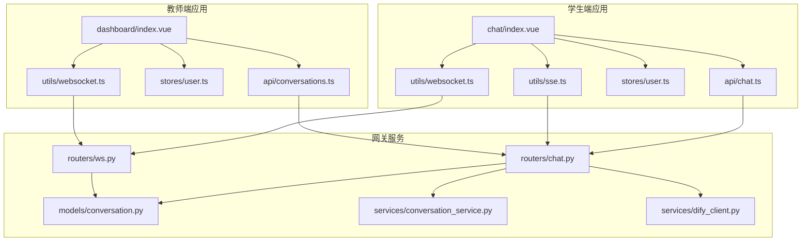
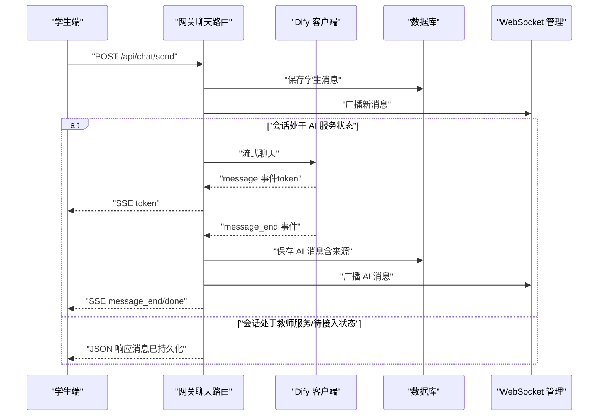
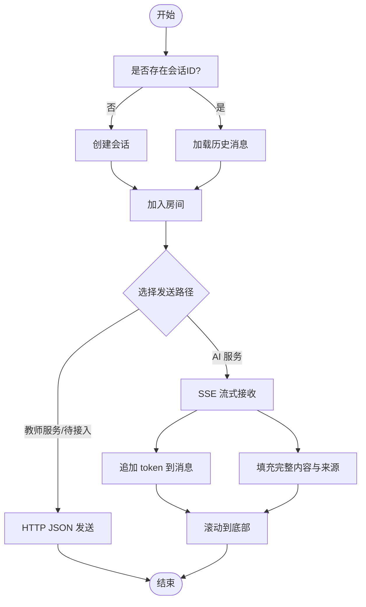
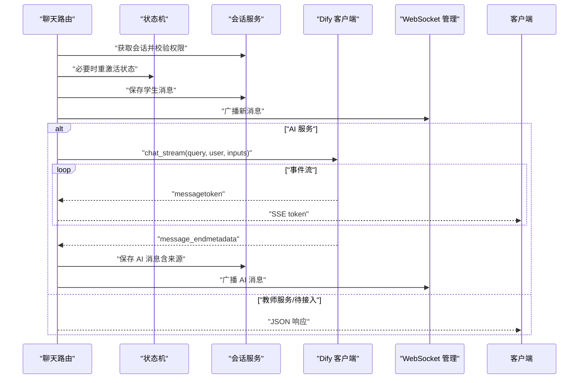
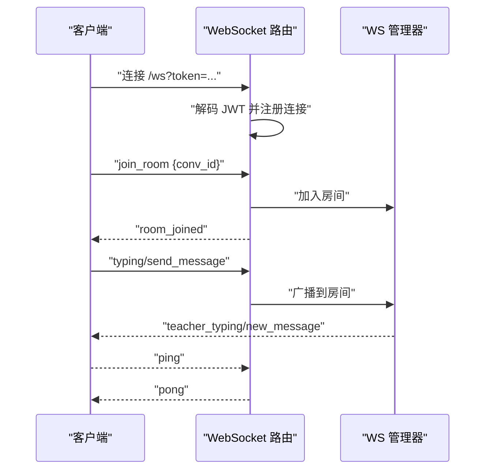
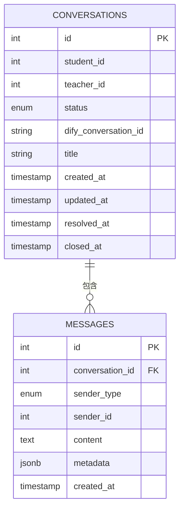
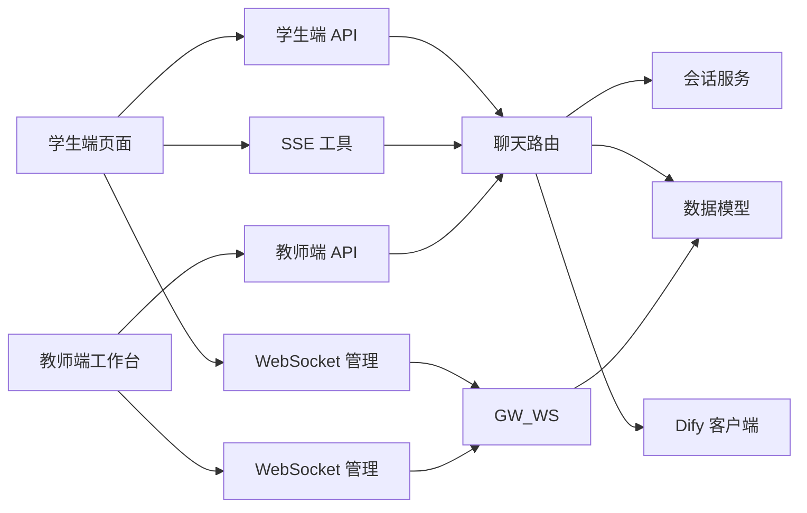

# 数据流设计

<cite>
**本文档引用的文件**
- [apps/student-app/src/pages/chat/index.vue](file://apps/student-app/src/pages/chat/index.vue)
- [apps/student-app/src/utils/sse.ts](file://apps/student-app/src/utils/sse.ts)
- [apps/student-app/src/utils/websocket.ts](file://apps/student-app/src/utils/websocket.ts)
- [apps/student-app/src/stores/user.ts](file://apps/student-app/src/stores/user.ts)
- [apps/teacher-app/src/pages/dashboard/index.vue](file://apps/teacher-app/src/pages/dashboard/index.vue)
- [apps/teacher-app/src/stores/user.ts](file://apps/teacher-app/src/stores/user.ts)
- [apps/teacher-app/src/api/conversations.ts](file://apps/teacher-app/src/api/conversations.ts)
- [apps/student-app/src/api/chat.ts](file://apps/student-app/src/api/chat.ts)
- [apps/student-app/src/types/chat.ts](file://apps/student-app/src/types/chat.ts)
- [apps/teacher-app/src/types/api.ts](file://apps/teacher-app/src/types/api.ts)
- [services/gateway/app/routers/chat.py](file://services/gateway/app/routers/chat.py)
- [services/gateway/app/routers/ws.py](file://services/gateway/app/routers/ws.py)
- [services/gateway/app/services/conversation_service.py](file://services/gateway/app/services/conversation_service.py)
- [services/gateway/app/models/conversation.py](file://services/gateway/app/models/conversation.py)
- [services/gateway/app/services/dify_client.py](file://services/gateway/app/services/dify_client.py)
</cite>

## 目录
1. [引言](#引言)
2. [项目结构](#项目结构)
3. [核心组件](#核心组件)
4. [架构总览](#架构总览)
5. [详细组件分析](#详细组件分析)
6. [依赖分析](#依赖分析)
7. [性能考虑](#性能考虑)
8. [故障排查指南](#故障排查指南)
9. [结论](#结论)
10. [附录](#附录)

## 引言
本文件面向“医小管 v2”项目，聚焦于系统中的数据流设计，覆盖以下方面：
- 用户输入数据的处理流程（文本消息、触发转人工等）
- 会话状态的数据传递（AI 服务、教师接入、状态变更）
- AI 响应数据的处理机制（SSE 流式传输、消息聚合、来源引用）
- 多媒体与系统状态的处理策略（概念性说明）
- 数据验证与清洗机制（输入校验、格式转换、安全过滤）
- 数据持久化策略与时机（实时消息与历史消息）
- 数据流图与时序图，帮助开发者快速理解复杂业务流程

## 项目结构
系统采用前后端分离与多应用架构：
- 前端包含学生端与教师端两个 uni-app 应用，分别负责聊天交互与工作台管理
- 后端网关服务基于 FastAPI，提供聊天、会话、WebSocket、认证与状态机等能力
- 数据模型位于后端，采用 SQLAlchemy ORM 映射 conversations 与 messages 表
- AI 对接通过 Dify 客户端进行流式调用，并在后端聚合与持久化

图表来源
- [apps/student-app/src/pages/chat/index.vue:198-649](file://apps/student-app/src/pages/chat/index.vue#L198-L649)
- [apps/student-app/src/utils/sse.ts:1-69](file://apps/student-app/src/utils/sse.ts#L1-L69)
- [apps/student-app/src/utils/websocket.ts:1-153](file://apps/student-app/src/utils/websocket.ts#L1-L153)
- [apps/student-app/src/stores/user.ts:1-56](file://apps/student-app/src/stores/user.ts#L1-L56)
- [apps/teacher-app/src/pages/dashboard/index.vue:1-669](file://apps/teacher-app/src/pages/dashboard/index.vue#L1-L669)
- [apps/teacher-app/src/stores/user.ts:1-63](file://apps/teacher-app/src/stores/user.ts#L1-L63)
- [apps/teacher-app/src/api/conversations.ts:1-44](file://apps/teacher-app/src/api/conversations.ts#L1-L44)
- [apps/student-app/src/api/chat.ts:1-36](file://apps/student-app/src/api/chat.ts#L1-L36)
- [services/gateway/app/routers/chat.py:1-191](file://services/gateway/app/routers/chat.py#L1-L191)
- [services/gateway/app/routers/ws.py:1-119](file://services/gateway/app/routers/ws.py#L1-L119)
- [services/gateway/app/models/conversation.py:1-63](file://services/gateway/app/models/conversation.py#L1-L63)
- [services/gateway/app/services/conversation_service.py:1-179](file://services/gateway/app/services/conversation_service.py#L1-L179)
- [services/gateway/app/services/dify_client.py:1-105](file://services/gateway/app/services/dify_client.py#L1-L105)

章节来源
- [apps/student-app/src/pages/chat/index.vue:198-649](file://apps/student-app/src/pages/chat/index.vue#L198-L649)
- [apps/teacher-app/src/pages/dashboard/index.vue:138-252](file://apps/teacher-app/src/pages/dashboard/index.vue#L138-L252)
- [services/gateway/app/routers/chat.py:1-191](file://services/gateway/app/routers/chat.py#L1-L191)

## 核心组件
- 学生端聊天页面：负责输入、渲染、SSE 流式接收、WebSocket 通知、转人工请求
- SSE 工具：解析服务端事件，分发 token、结束与错误
- WebSocket 管理：连接、心跳、房间加入/离开、消息广播
- 用户状态管理：本地存储 token 与用户信息，初始化时自动连接 WS
- 教师端工作台：展示待处理会话、跳转详情
- 网关聊天路由：学生消息入口、AI 流式响应、教师路径、状态机与广播
- 会话服务：权限校验、会话与消息 CRUD、更新会话时间
- 数据模型：会话与消息实体、枚举状态与发送者类型
- Dify 客户端：封装 Dify 流式聊天接口，产出事件流

章节来源
- [apps/student-app/src/pages/chat/index.vue:279-326](file://apps/student-app/src/pages/chat/index.vue#L279-L326)
- [apps/student-app/src/utils/sse.ts:13-68](file://apps/student-app/src/utils/sse.ts#L13-L68)
- [apps/student-app/src/utils/websocket.ts:20-150](file://apps/student-app/src/utils/websocket.ts#L20-L150)
- [apps/student-app/src/stores/user.ts:24-52](file://apps/student-app/src/stores/user.ts#L24-L52)
- [apps/teacher-app/src/pages/dashboard/index.vue:200-211](file://apps/teacher-app/src/pages/dashboard/index.vue#L200-L211)
- [services/gateway/app/routers/chat.py:22-102](file://services/gateway/app/routers/chat.py#L22-L102)
- [services/gateway/app/services/conversation_service.py:148-179](file://services/gateway/app/services/conversation_service.py#L148-L179)
- [services/gateway/app/models/conversation.py:26-63](file://services/gateway/app/models/conversation.py#L26-L63)
- [services/gateway/app/services/dify_client.py:22-69](file://services/gateway/app/services/dify_client.py#L22-L69)

## 架构总览
系统数据流分为两条主线：
- AI 服务主线：学生发起消息 → 网关保存消息 → 调用 Dify 流式接口 → SSE 逐步返回 token → 聚合完成保存 AI 消息 → 广播至房间
- 教师服务主线：学生消息进入非 AI 状态 → 网关返回 JSON 响应（消息已持久化）→ WebSocket 广播新消息 → 教师端收到通知

图表来源
- [services/gateway/app/routers/chat.py:22-102](file://services/gateway/app/routers/chat.py#L22-L102)
- [services/gateway/app/services/dify_client.py:22-69](file://services/gateway/app/services/dify_client.py#L22-L69)
- [apps/student-app/src/utils/sse.ts:13-68](file://apps/student-app/src/utils/sse.ts#L13-L68)
- [services/gateway/app/services/conversation_service.py:148-179](file://services/gateway/app/services/conversation_service.py#L148-L179)
- [services/gateway/app/routers/ws.py:11-119](file://services/gateway/app/routers/ws.py#L11-L119)

## 详细组件分析

### 学生端聊天页面数据流
- 输入与状态
  - 输入框内容与发送按钮可用性由计算属性控制
  - 会话 ID 与状态在页面生命周期中加载与维护
- 创建与加载会话
  - 首次发送时若无会话则创建；随后加载历史消息并加入房间
- 发送消息
  - 若状态为教师服务/待接入，走 HTTP JSON 路径
  - 若状态为 AI 服务，走 SSE 流式路径
- SSE 接收
  - 逐 token 追加到当前 AI 消息，滚动到底部
  - 结束时填充完整内容与来源，停止流式态
- WebSocket 通知
  - 监听新消息与状态变更，插入系统提示与教师消息
- 转人工
  - 当 AI 拒答时长按弹出菜单，调用转人工接口并更新状态

图表来源
- [apps/student-app/src/pages/chat/index.vue:369-481](file://apps/student-app/src/pages/chat/index.vue#L369-L481)
- [apps/student-app/src/utils/sse.ts:13-68](file://apps/student-app/src/utils/sse.ts#L13-L68)

章节来源
- [apps/student-app/src/pages/chat/index.vue:240-276](file://apps/student-app/src/pages/chat/index.vue#L240-L276)
- [apps/student-app/src/pages/chat/index.vue:328-350](file://apps/student-app/src/pages/chat/index.vue#L328-L350)
- [apps/student-app/src/pages/chat/index.vue:369-481](file://apps/student-app/src/pages/chat/index.vue#L369-L481)
- [apps/student-app/src/utils/sse.ts:13-68](file://apps/student-app/src/utils/sse.ts#L13-L68)

### 网关聊天路由与状态机
- 角色限制：仅学生可调用发送接口
- 会话校验与状态检查：支持 AI 服务、待接入、教师服务；已解决状态可重激活
- 消息持久化：先保存学生消息，再广播
- AI 路径：调用 Dify 流式接口，边播 token 边聚合，结束后保存 AI 消息并广播
- 教师路径：直接返回 JSON（消息已持久化）

图表来源
- [services/gateway/app/routers/chat.py:22-102](file://services/gateway/app/routers/chat.py#L22-L102)
- [services/gateway/app/routers/chat.py:105-191](file://services/gateway/app/routers/chat.py#L105-L191)
- [services/gateway/app/services/conversation_service.py:148-179](file://services/gateway/app/services/conversation_service.py#L148-L179)
- [services/gateway/app/services/dify_client.py:22-69](file://services/gateway/app/services/dify_client.py#L22-L69)

章节来源
- [services/gateway/app/routers/chat.py:22-102](file://services/gateway/app/routers/chat.py#L22-L102)
- [services/gateway/app/routers/chat.py:105-191](file://services/gateway/app/routers/chat.py#L105-L191)

### WebSocket 通知与房间管理
- 认证：通过查询参数携带 JWT，解码后建立连接
- 房间：以“conv:{id}”命名房间，支持加入/离开
- 上行消息：ping、join_room、leave_room、typing、send_message
- 下行消息：new_message、status_changed、escalation_notify、teacher_typing、pong、error
- 心跳：每 30 秒 ping，断线重连并自动 re-join 房间

图表来源
- [services/gateway/app/routers/ws.py:11-119](file://services/gateway/app/routers/ws.py#L11-L119)
- [apps/student-app/src/utils/websocket.ts:20-150](file://apps/student-app/src/utils/websocket.ts#L20-L150)

章节来源
- [services/gateway/app/routers/ws.py:11-119](file://services/gateway/app/routers/ws.py#L11-L119)
- [apps/student-app/src/utils/websocket.ts:20-150](file://apps/student-app/src/utils/websocket.ts#L20-L150)

### 数据模型与持久化
- 会话表：记录学生/教师关联、状态、标题、时间戳与 Dify 会话 ID
- 消息表：记录发送者类型/ID、内容、元数据（如来源）、时间戳
- 会话服务：新增消息时更新会话 updated_at，确保排序与检索效率

图表来源
- [services/gateway/app/models/conversation.py:26-63](file://services/gateway/app/models/conversation.py#L26-L63)
- [services/gateway/app/services/conversation_service.py:148-179](file://services/gateway/app/services/conversation_service.py#L148-L179)

章节来源
- [services/gateway/app/models/conversation.py:26-63](file://services/gateway/app/models/conversation.py#L26-L63)
- [services/gateway/app/services/conversation_service.py:148-179](file://services/gateway/app/services/conversation_service.py#L148-L179)

### 类型与接口映射
- 学生端消息类型：包含角色、内容、来源、时间戳、流式标记
- 会话与消息响应类型：与后端模型字段对应，便于统一渲染
- 教师端会话/消息类型：用于工作台与详情页展示

章节来源
- [apps/student-app/src/types/chat.ts:7-37](file://apps/student-app/src/types/chat.ts#L7-L37)
- [apps/teacher-app/src/types/api.ts:17-42](file://apps/teacher-app/src/types/api.ts#L17-L42)

## 依赖分析
- 前端依赖
  - 学生端：页面组件依赖 API、SSE 工具、WebSocket 管理与用户状态
  - 教师端：工作台依赖 API、WebSocket 管理与用户状态
- 后端依赖
  - 路由依赖：数据库会话、当前用户、状态机、Dify 客户端、WS 管理器
  - 服务层：会话服务封装权限与 CRUD，模型定义数据结构
  - Dify 客户端：封装流式聊天接口，向上游提供事件流

图表来源
- [apps/student-app/src/pages/chat/index.vue:203-206](file://apps/student-app/src/pages/chat/index.vue#L203-L206)
- [apps/teacher-app/src/pages/dashboard/index.vue:153-154](file://apps/teacher-app/src/pages/dashboard/index.vue#L153-L154)
- [services/gateway/app/routers/chat.py:11-16](file://services/gateway/app/routers/chat.py#L11-L16)
- [services/gateway/app/routers/ws.py:1-5](file://services/gateway/app/routers/ws.py#L1-L5)

章节来源
- [apps/student-app/src/pages/chat/index.vue:203-206](file://apps/student-app/src/pages/chat/index.vue#L203-L206)
- [apps/teacher-app/src/pages/dashboard/index.vue:153-154](file://apps/teacher-app/src/pages/dashboard/index.vue#L153-L154)
- [services/gateway/app/routers/chat.py:11-16](file://services/gateway/app/routers/chat.py#L11-L16)
- [services/gateway/app/routers/ws.py:1-5](file://services/gateway/app/routers/ws.py#L1-L5)

## 性能考虑
- SSE 流式传输：前端逐 token 渲染，降低首屏延迟；后端聚合完成后一次性落库，避免频繁写入
- WebSocket 广播：房间维度广播，减少无效推送；心跳与断线重连保障稳定性
- 数据库索引：会话与消息表建立复合索引，优化分页与排序查询
- 会话更新：每次新增消息时仅更新会话 updated_at，避免全量扫描

## 故障排查指南
- SSE 接收异常
  - 检查后端是否正确返回 SSE 头与事件类型
  - 前端解析逻辑需容错 JSON 解析错误与事件类型缺失
- WebSocket 断线
  - 关注心跳与重连策略；确认房间重加入逻辑
  - 检查 JWT 解码与连接注册流程
- AI 服务不可用
  - 后端捕获 Dify 错误事件并回传前端
  - 前端展示错误提示并停止流式态
- 权限与状态
  - 确认当前用户角色与会话状态；已解决状态需重激活后方可继续 AI 服务

章节来源
- [apps/student-app/src/utils/sse.ts:46-67](file://apps/student-app/src/utils/sse.ts#L46-L67)
- [apps/student-app/src/utils/websocket.ts:129-135](file://apps/student-app/src/utils/websocket.ts#L129-L135)
- [services/gateway/app/routers/chat.py:145-153](file://services/gateway/app/routers/chat.py#L145-L153)
- [services/gateway/app/routers/ws.py:40-42](file://services/gateway/app/routers/ws.py#L40-L42)

## 结论
本设计将“学生输入—AI/教师响应—实时通知—历史持久化”形成闭环，通过 SSE 与 WebSocket 实现低延迟与高并发的用户体验，同时以状态机与权限校验确保流程可控与数据安全。建议在后续版本中进一步完善教师端消息写库与安全过滤策略，持续优化 AI 拒答识别与转人工引导。

## 附录
- 数据验证与清洗建议
  - 输入校验：长度限制、字符集过滤、敏感词拦截
  - 格式转换：Markdown 渲染、时间格式化、来源截断
  - 安全过滤：XSS 防护、HTML 白名单、链接外链标识
- 多媒体与系统状态
  - 多媒体：建议扩展消息类型与元数据字段，统一上传与预览
  - 系统状态：通过状态机与 WS 广播保持前端一致，避免竞态
- 持久化策略
  - 实时数据：消息入库即广播，确保一致性
  - 历史数据：分页查询与缓存结合，优化加载性能