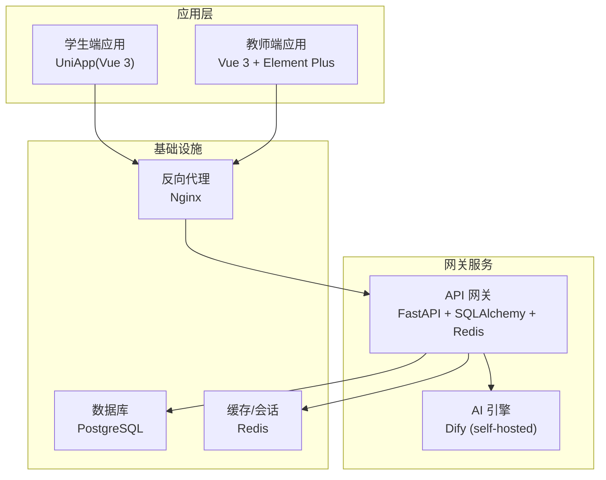
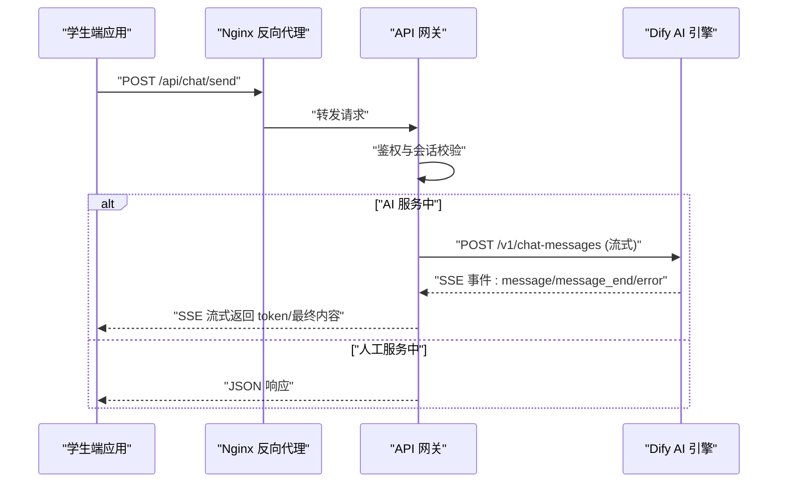
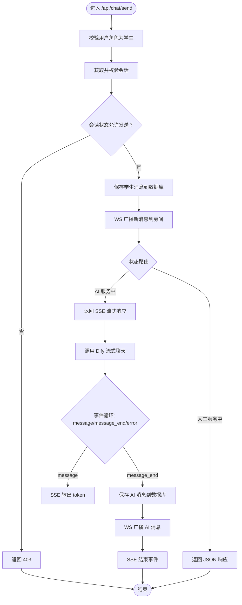
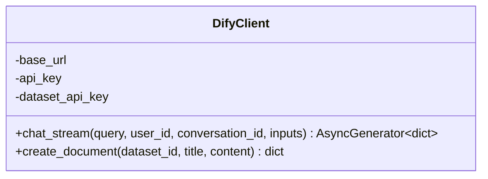
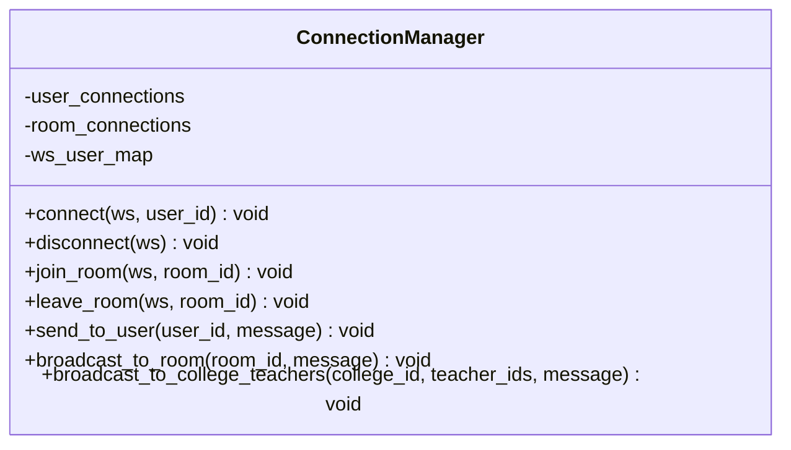
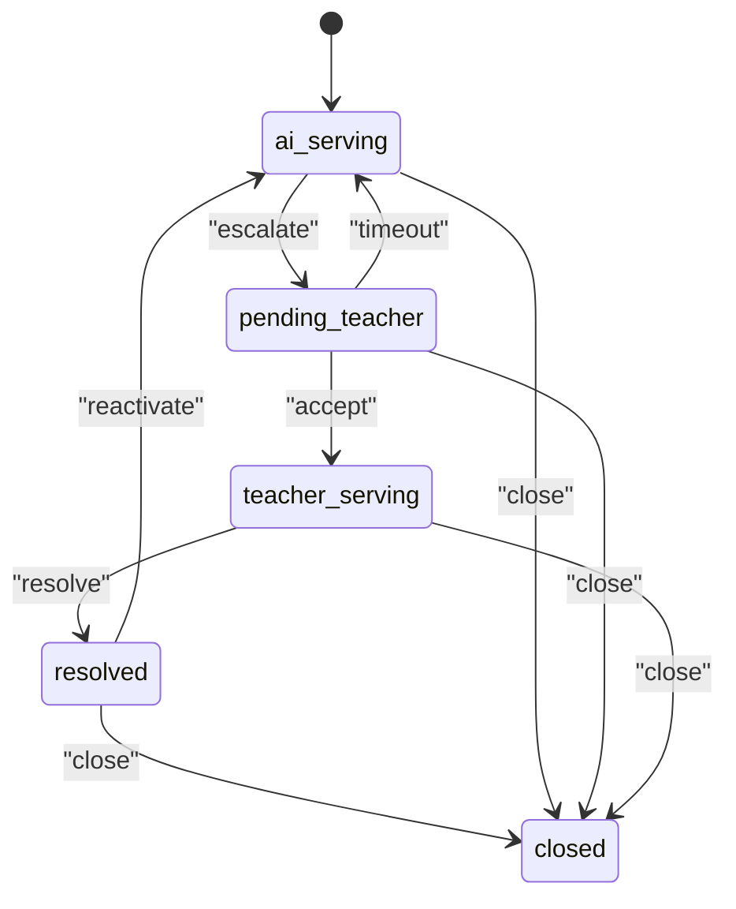
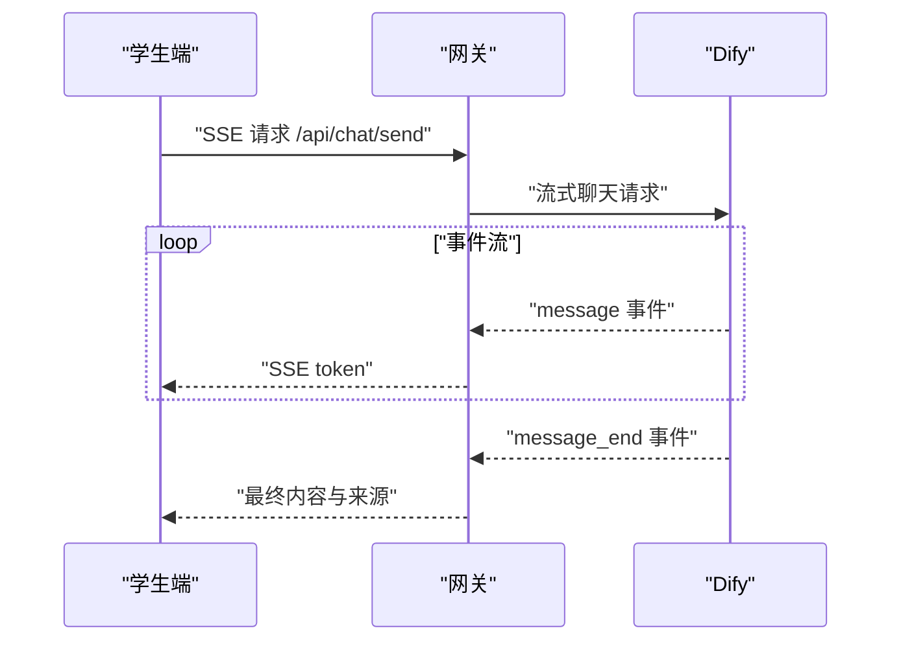
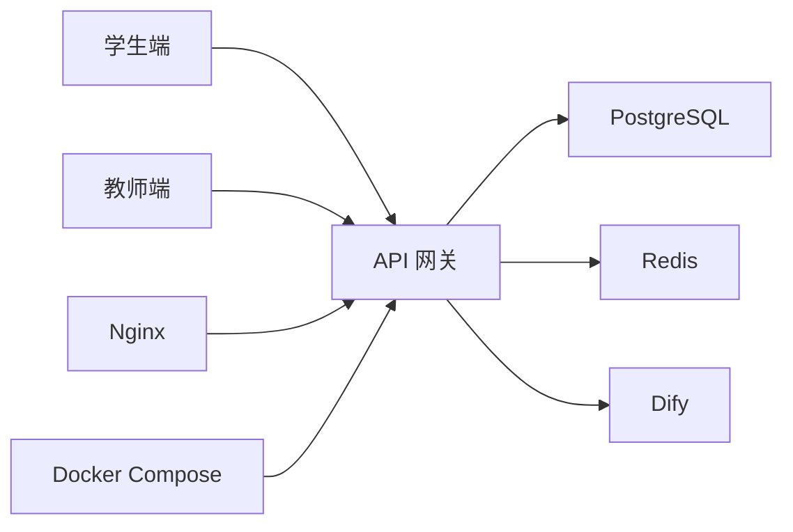

# 整体架构概览

<cite>
**本文引用的文件**
- [README.md](file://README.md)
- [main.py](file://services/gateway/app/main.py)
- [config.py](file://services/gateway/app/config.py)
- [chat.py](file://services/gateway/app/routers/chat.py)
- [dify_client.py](file://services/gateway/app/services/dify_client.py)
- [ws_manager.py](file://services/gateway/app/services/ws_manager.py)
- [state_machine.py](file://services/gateway/app/services/state_machine.py)
- [gateway.conf](file://deploy/nginx/gateway.conf)
- [docker-compose.yml](file://deploy/docker-compose.yml)
- [main.ts（学生端）](file://apps/student-app/src/main.ts)
- [main.ts（教师端）](file://apps/teacher-app/src/main.ts)
- [chat.ts（学生端 API）](file://apps/student-app/src/api/chat.ts)
- [sse.ts（学生端）](file://apps/student-app/src/utils/sse.ts)
- [websocket.ts（教师端）](file://apps/teacher-app/src/utils/websocket.ts)
</cite>

## 目录
1. [引言](#引言)
2. [项目结构](#项目结构)
3. [核心组件](#核心组件)
4. [架构总览](#架构总览)
5. [详细组件分析](#详细组件分析)
6. [依赖分析](#依赖分析)
7. [性能考虑](#性能考虑)
8. [故障排查指南](#故障排查指南)
9. [结论](#结论)
10. [附录](#附录)

## 引言
本文件为“医小管 v2”项目的整体架构概览，面向技术与非技术读者，系统化阐述系统的高层设计与运行机制。项目采用前后端分离架构，以 API 网关为核心枢纽，结合事件驱动（WebSocket）与流式响应（SSE）实现与 AI 引擎（Dify）的协同工作。系统边界清晰，包含学生端应用、教师端应用与 API 网关服务；同时通过反向代理（Nginx）与容器编排（Docker Compose）实现部署与流量治理。

## 项目结构
项目采用多模块分层组织：
- 应用层：学生端（UniApp）、教师端（Vue 3 + Element Plus）
- 网关服务：基于 FastAPI 的 API 网关，负责认证、会话管理、状态机、AI 调用与 WebSocket 管理
- 部署层：Nginx 反向代理、Docker Compose 编排
- 文档与脚本：设计文档、迁移脚本、测试脚本

图表来源
- [main.py:1-78](file://services/gateway/app/main.py#L1-L78)
- [config.py:1-31](file://services/gateway/app/config.py#L1-L31)
- [gateway.conf:1-36](file://deploy/nginx/gateway.conf#L1-L36)
- [docker-compose.yml:1-22](file://deploy/docker-compose.yml#L1-L22)

章节来源
- [README.md:1-18](file://README.md#L1-L18)
- [main.py:1-78](file://services/gateway/app/main.py#L1-L78)
- [config.py:1-31](file://services/gateway/app/config.py#L1-L31)
- [gateway.conf:1-36](file://deploy/nginx/gateway.conf#L1-L36)
- [docker-compose.yml:1-22](file://deploy/docker-compose.yml#L1-L22)

## 核心组件
- API 网关（Gateway）
  - 负责健康检查、路由挂载、认证鉴权、会话与消息持久化、状态机控制、SSE 流式响应与 WebSocket 管理
  - 关键能力：/api/chat/send（AI 流式回答）、/api/conversations（会话管理）、/ws（实时通信）
- AI 客户端（DifyClient）
  - 封装 Dify 的流式聊天接口，支持事件驱动的数据流解析与错误处理
- WebSocket 管理（ConnectionManager）
  - 用户级连接与会话房间广播，支撑教师端实时接收消息与状态变更
- 状态机（ConversationStateMachine）
  - 定义会话生命周期状态与动作转换规则，确保业务流程合规
- 应用层（学生端/教师端）
  - 学生端通过 SSE 实时接收 AI 回答；教师端通过 WebSocket 加入会话房间，参与人工服务

章节来源
- [main.py:1-78](file://services/gateway/app/main.py#L1-L78)
- [chat.py:1-191](file://services/gateway/app/routers/chat.py#L1-L191)
- [dify_client.py:1-105](file://services/gateway/app/services/dify_client.py#L1-L105)
- [ws_manager.py:1-100](file://services/gateway/app/services/ws_manager.py#L1-L100)
- [state_machine.py:1-96](file://services/gateway/app/services/state_machine.py#L1-L96)

## 架构总览
系统采用“网关 + 事件驱动 + AI 流式”的混合架构：
- 前后端分离：学生端/教师端均为独立前端应用，通过网关统一暴露 REST 与 WebSocket 接口
- 微服务理念：网关作为单一入口，内部聚合认证、会话、状态机、AI 调用与实时通信，职责清晰、边界明确
- 事件驱动：通过 WebSocket 实现教师端与网关的双向事件通信；通过 SSE 实现 AI 流式输出
- 可观测性：网关提供健康检查端点，便于容器编排与运维监控

图表来源
- [chat.py:22-102](file://services/gateway/app/routers/chat.py#L22-L102)
- [dify_client.py:22-69](file://services/gateway/app/services/dify_client.py#L22-L69)
- [gateway.conf:12-27](file://deploy/nginx/gateway.conf#L12-L27)

章节来源
- [README.md:5-11](file://README.md#L5-L11)
- [main.py:30-68](file://services/gateway/app/main.py#L30-L68)
- [gateway.conf:1-36](file://deploy/nginx/gateway.conf#L1-L36)

## 详细组件分析

### API 网关（Gateway）
- 职责
  - 路由与中间件：统一健康检查、数据库与 Redis 连通性检测、Dify 服务可用性探测
  - 认证与授权：基于 JWT 的用户上下文注入
  - 会话与消息：会话创建、消息持久化、状态机驱动的状态流转
  - 实时通信：WebSocket 连接管理与房间广播
  - AI 集成：封装 Dify 流式聊天接口，按事件类型转发至客户端
- 关键流程
  - /api/chat/send：根据会话状态决定走 AI 流式或人工路径，并通过 SSE/WS 推送消息
  - /api/conversations：提供会话列表、详情、消息查询与升级（Escalation）等操作
  - /ws：教师端加入会话房间，接收消息与状态变更事件

图表来源
- [chat.py:22-191](file://services/gateway/app/routers/chat.py#L22-L191)
- [dify_client.py:22-69](file://services/gateway/app/services/dify_client.py#L22-L69)
- [ws_manager.py:71-81](file://services/gateway/app/services/ws_manager.py#L71-L81)

章节来源
- [main.py:16-78](file://services/gateway/app/main.py#L16-L78)
- [chat.py:1-191](file://services/gateway/app/routers/chat.py#L1-L191)
- [config.py:1-31](file://services/gateway/app/config.py#L1-L31)

### AI 客户端（DifyClient）
- 职责
  - 封装 Dify 的流式聊天接口，解析 SSE 事件，向上层提供统一的异步事件生成器
  - 支持首次对话时 conversation_id 的回填与后续对话复用
- 设计要点
  - 使用 httpx + aconnect_sse 实现标准 SSE 连接与事件解析
  - 对非 JSON 数据进行容错处理，避免中断事件流
  - 提供 Dataset API 的文档创建能力（用于知识库迁移）

图表来源
- [dify_client.py:11-105](file://services/gateway/app/services/dify_client.py#L11-L105)

章节来源
- [dify_client.py:1-105](file://services/gateway/app/services/dify_client.py#L1-L105)

### WebSocket 管理（ConnectionManager）
- 职责
  - 维护用户级连接集合与房间广播集合，支持向用户或房间推送消息
  - 提供心跳、断线清理、重连恢复（自动 re-join 房间）等能力
- 设计要点
  - 双层映射：user_connections 与 room_connections，降低耦合
  - 广播失败时自动清理无效连接，保证内存与性能

图表来源
- [ws_manager.py:8-100](file://services/gateway/app/services/ws_manager.py#L8-L100)

章节来源
- [ws_manager.py:1-100](file://services/gateway/app/services/ws_manager.py#L1-L100)

### 状态机（ConversationStateMachine）
- 职责
  - 定义会话状态与动作的合法转换矩阵，执行状态更新与系统消息写入
- 设计要点
  - 明确的动作包括 escalate、accept、timeout、resolve、reactivate、close
  - 自动记录系统消息，便于审计与回溯

图表来源
- [state_machine.py:19-31](file://services/gateway/app/services/state_machine.py#L19-L31)

章节来源
- [state_machine.py:1-96](file://services/gateway/app/services/state_machine.py#L1-L96)

### 应用层（学生端/教师端）
- 学生端
  - 通过 SSE 接收 AI 流式回答，支持 token 级增量渲染与最终内容合并
  - 提供会话与消息查询、升级到人工服务等操作
- 教师端
  - 通过 WebSocket 加入会话房间，接收消息与状态变更事件
  - 支持心跳保活、断线重连、自动 re-join 房间

图表来源
- [chat.ts（学生端 API）:1-36](file://apps/student-app/src/api/chat.ts#L1-L36)
- [sse.ts（学生端）:13-68](file://apps/student-app/src/utils/sse.ts#L13-L68)
- [chat.py:105-191](file://services/gateway/app/routers/chat.py#L105-L191)

章节来源
- [main.ts（学生端）:1-11](file://apps/student-app/src/main.ts#L1-L11)
- [main.ts（教师端）:1-25](file://apps/teacher-app/src/main.ts#L1-L25)
- [chat.ts（学生端 API）:1-36](file://apps/student-app/src/api/chat.ts#L1-L36)
- [sse.ts（学生端）:1-69](file://apps/student-app/src/utils/sse.ts#L1-L69)
- [websocket.ts（教师端）:1-169](file://apps/teacher-app/src/utils/websocket.ts#L1-L169)

## 依赖分析
- 组件耦合
  - 网关对数据库（SQLAlchemy）、缓存（Redis）、AI 引擎（Dify）存在直接依赖
  - 应用层通过网关暴露的 REST/WS 接口间接耦合，降低对后端细节的感知
- 外部集成
  - Nginx 作为统一入口，提供 API 与 WebSocket 的代理与超时设置
  - Docker Compose 将网关服务与外部数据库/缓存解耦，便于本地与生产环境复用

图表来源
- [main.py:1-78](file://services/gateway/app/main.py#L1-L78)
- [config.py:1-31](file://services/gateway/app/config.py#L1-L31)
- [gateway.conf:1-36](file://deploy/nginx/gateway.conf#L1-L36)
- [docker-compose.yml:1-22](file://deploy/docker-compose.yml#L1-L22)

章节来源
- [main.py:1-78](file://services/gateway/app/main.py#L1-L78)
- [config.py:1-31](file://services/gateway/app/config.py#L1-L31)
- [gateway.conf:1-36](file://deploy/nginx/gateway.conf#L1-L36)
- [docker-compose.yml:1-22](file://deploy/docker-compose.yml#L1-L22)

## 性能考虑
- 流式传输
  - SSE 与 Dify 的事件流减少首字节延迟，提升交互体验
- 连接管理
  - WebSocket 连接池与房间广播，避免重复连接与广播风暴
- 缓存与数据库
  - Redis 用于会话与临时状态，PostgreSQL 用于持久化，读写分离与索引优化可进一步提升吞吐
- 超时与重试
  - Nginx 对 WebSocket 设置长超时，网关对 Dify 请求设置合理超时与错误降级策略

## 故障排查指南
- 健康检查
  - 通过 /health 端点检查数据库、Redis 与 Dify 的连通性
- 日志定位
  - 网关与 AI 客户端均记录事件解析与异常信息，便于定位 SSE 中断或 Dify 错误
- 连接问题
  - 教师端 WebSocket 断线重连与自动 re-join 房间，若仍无法接收消息，检查网关日志与房间映射
- 配置核对
  - 确认 Dify API 地址、密钥与数据集密钥正确，数据库与 Redis 连接字符串有效

章节来源
- [main.py:30-68](file://services/gateway/app/main.py#L30-L68)
- [dify_client.py:1-105](file://services/gateway/app/services/dify_client.py#L1-L105)
- [ws_manager.py:1-100](file://services/gateway/app/services/ws_manager.py#L1-L100)

## 结论
医小管 v2 通过“网关 + 事件驱动 + AI 流式”的架构实现了高内聚、低耦合的服务组织方式。网关承担统一入口与业务编排职责，前端通过 SSE/WS 与后端保持实时交互，AI 服务以事件流形式无缝接入。该设计在可扩展性、可维护性与性能方面取得良好平衡，适合持续演进与规模化部署。

## 附录
- 快速启动
  - 通过 Docker Compose 启动网关服务，Nginx 提供反向代理与 WebSocket 支持
- 技术栈
  - 后端：FastAPI + SQLAlchemy + Alembic
  - AI 引擎：Dify（自托管）
  - 数据库：PostgreSQL 15+ / Redis 7+
  - 前端：学生端 UniApp（Vue 3），教师端 Vue 3 + Element Plus

章节来源
- [README.md:12-18](file://README.md#L12-L18)
- [docker-compose.yml:1-22](file://deploy/docker-compose.yml#L1-L22)
- [gateway.conf:1-36](file://deploy/nginx/gateway.conf#L1-L36)