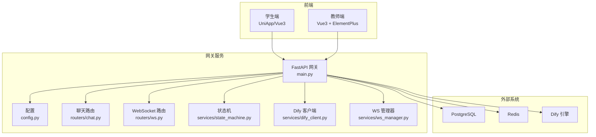
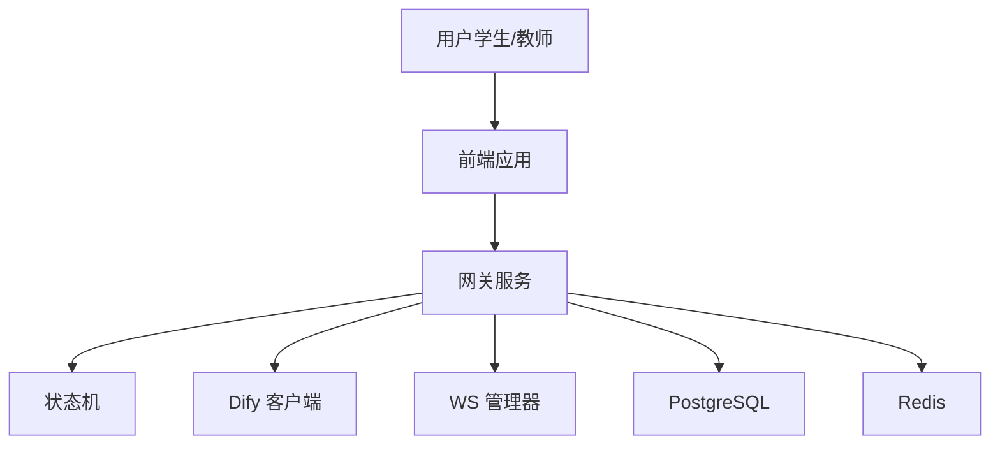
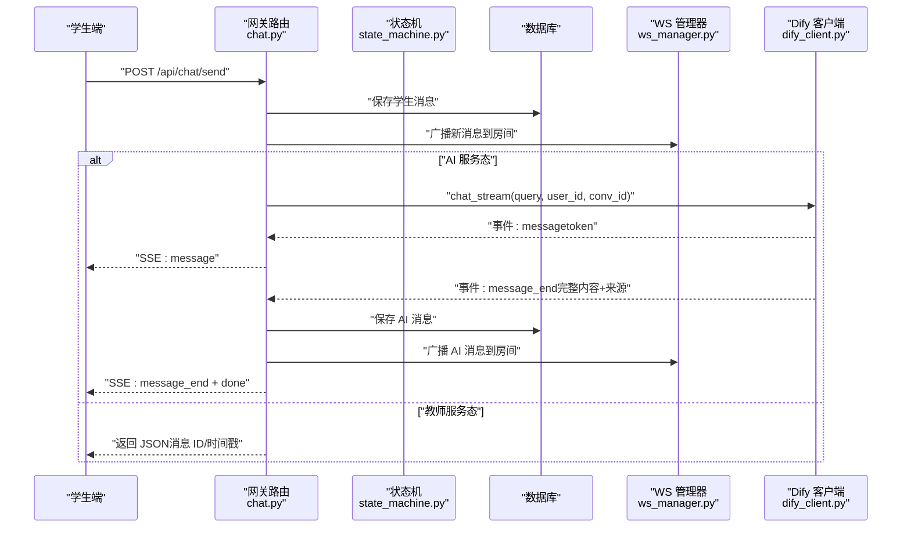
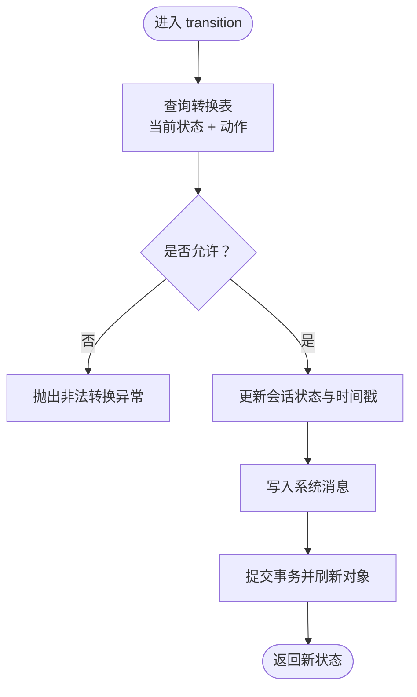
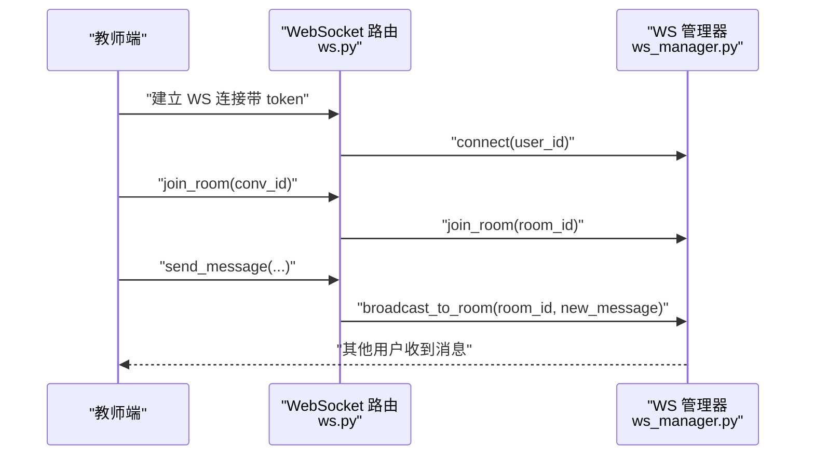
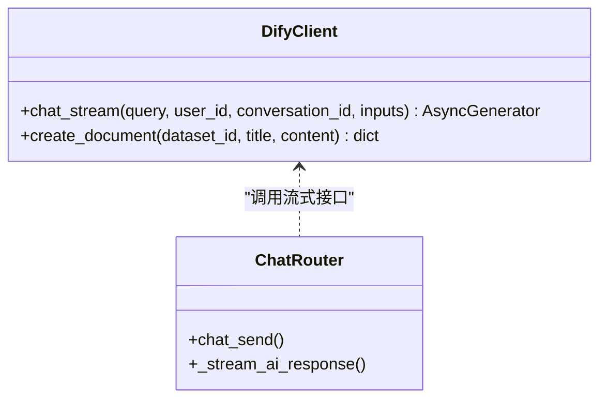
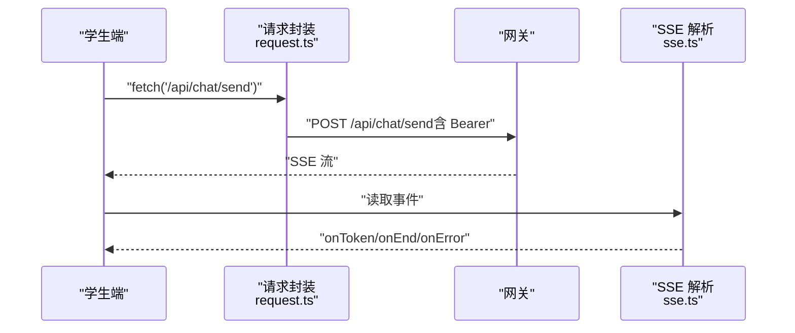
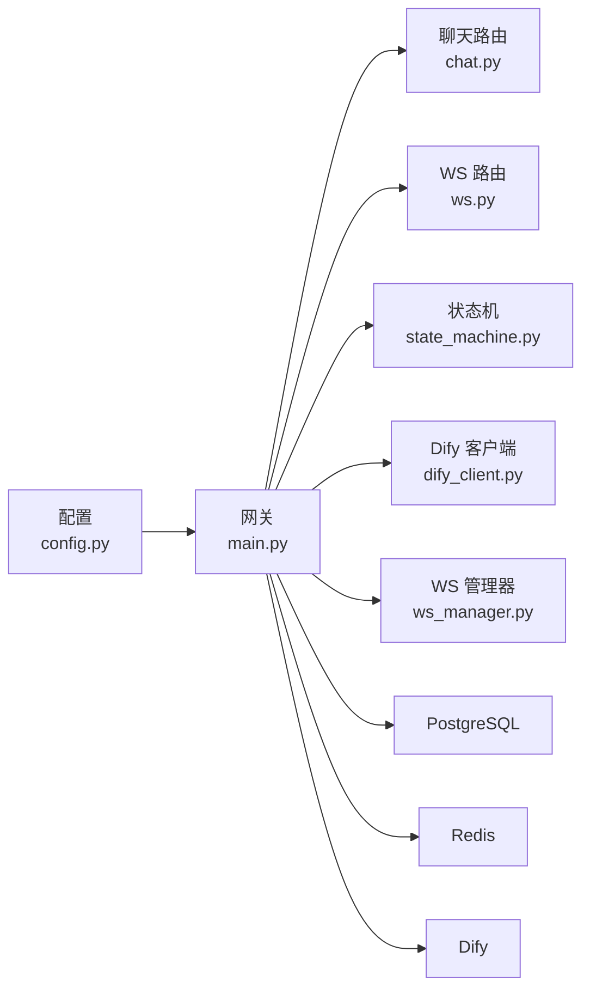

# 架构设计

<cite>
**本文引用的文件**
- [README.md](file://README.md)
- [main.py](file://services/gateway/app/main.py)
- [config.py](file://services/gateway/app/config.py)
- [chat.py](file://services/gateway/app/routers/chat.py)
- [ws.py](file://services/gateway/app/routers/ws.py)
- [state_machine.py](file://services/gateway/app/services/state_machine.py)
- [dify_client.py](file://services/gateway/app/services/dify_client.py)
- [ws_manager.py](file://services/gateway/app/services/ws_manager.py)
- [request.ts](file://apps/student-app/src/utils/request.ts)
- [sse.ts](file://apps/student-app/src/utils/sse.ts)
- [websocket.ts](file://apps/teacher-app/src/utils/websocket.ts)
- [main.ts（学生端）](file://apps/student-app/src/main.ts)
- [main.ts（教师端）](file://apps/teacher-app/src/main.ts)
- [docker-compose.yml](file://deploy/docker-compose.yml)
</cite>

## 目录
1. [引言](#引言)
2. [项目结构](#项目结构)
3. [核心组件](#核心组件)
4. [架构总览](#架构总览)
5. [详细组件分析](#详细组件分析)
6. [依赖分析](#依赖分析)
7. [性能考量](#性能考量)
8. [故障排查指南](#故障排查指南)
9. [结论](#结论)
10. [附录](#附录)

## 引言
本架构设计文档面向架构师与高级开发者，系统化阐述“医小管 v2”项目的整体架构与关键设计决策。项目采用前后端分离与微服务网关模式，以 FastAPI 作为统一入口，结合事件驱动（SSE/WS）、状态机驱动的会话流转、以及自托管 Dify AI 引擎，形成“AI 服务 + 实时通信 + 会话状态管理”的闭环。

## 项目结构
- 前端应用
  - 学生端：基于 UniApp/Vue 3，负责消息发送、SSE 流式接收、登录态管理。
  - 教师端：基于 Vue 3 + Element Plus，负责 WebSocket 实时互动、房间加入/离开、心跳保活。
- 网关服务（Gateway）
  - 使用 FastAPI 提供认证、会话、聊天、WebSocket 等统一入口，并集成 Dify AI 引擎。
  - 通过状态机管理会话生命周期，通过 WS 管理器实现房间广播与用户连接管理。
- 部署
  - 通过 docker-compose 启动网关服务，连接现有 PostgreSQL 与 Redis；Dify 作为独立服务对接。

图表来源
- [main.py:1-78](file://services/gateway/app/main.py#L1-L78)
- [config.py:1-31](file://services/gateway/app/config.py#L1-L31)
- [chat.py:1-191](file://services/gateway/app/routers/chat.py#L1-L191)
- [ws.py:1-119](file://services/gateway/app/routers/ws.py#L1-L119)
- [state_machine.py:1-96](file://services/gateway/app/services/state_machine.py#L1-L96)
- [dify_client.py:1-105](file://services/gateway/app/services/dify_client.py#L1-L105)
- [ws_manager.py:1-100](file://services/gateway/app/services/ws_manager.py#L1-L100)

章节来源
- [README.md:1-18](file://README.md#L1-L18)
- [docker-compose.yml:1-22](file://deploy/docker-compose.yml#L1-L22)

## 核心组件
- 网关入口与健康检查
  - FastAPI 应用在生命周期中初始化 Redis 连接，提供 /health 健康检查，检测数据库、缓存与 Dify 服务可用性。
- 路由与职责划分
  - 认证、会话、动作、聊天、WebSocket 路由分别承担不同业务域，便于演进与隔离。
- 会话状态机
  - 基于状态表驱动的状态转换，确保会话流转合法且可审计。
- Dify 客户端
  - 封装 Dify 的流式聊天接口，支持事件分发与错误处理。
- WebSocket 管理器
  - 用户连接与房间广播的集中管理，支持心跳、重连与房间恢复。

章节来源
- [main.py:16-68](file://services/gateway/app/main.py#L16-L68)
- [chat.py:22-103](file://services/gateway/app/routers/chat.py#L22-L103)
- [state_machine.py:19-31](file://services/gateway/app/services/state_machine.py#L19-L31)
- [dify_client.py:22-69](file://services/gateway/app/services/dify_client.py#L22-L69)
- [ws_manager.py:8-58](file://services/gateway/app/services/ws_manager.py#L8-L58)

## 架构总览
- 技术栈与选型
  - 后端：FastAPI（高性能异步）、SQLAlchemy（ORM）、Alembic（迁移）。
  - 数据库：PostgreSQL（持久化会话与用户）、Redis（缓存与会话状态）。
  - AI 引擎：Dify（self-hosted，提供流式聊天能力）。
  - 前端：学生端 UniApp/Vue3（SSE 流式渲染），教师端 Vue3（WebSocket 实时互动）。
- 架构模式
  - 网关模式：统一入口、鉴权、路由与集成。
  - 事件驱动：SSE 流式输出 + WebSocket 房间广播。
  - 状态机：会话状态转换与系统消息记录。
  - 分层设计：路由层、服务层、模型层、工具层清晰分离。

图表来源
- [main.py:24-28](file://services/gateway/app/main.py#L24-L28)
- [config.py:6-26](file://services/gateway/app/config.py#L6-L26)
- [state_machine.py:34-95](file://services/gateway/app/services/state_machine.py#L34-L95)
- [dify_client.py:11-105](file://services/gateway/app/services/dify_client.py#L11-L105)
- [ws_manager.py:8-99](file://services/gateway/app/services/ws_manager.py#L8-L99)

## 详细组件分析

### 组件一：聊天与 AI 服务集成（SSE 流式）
- 流程概述
  - 学生发送消息 → 校验会话状态 → 保存消息 → 广播至房间 → 若处于 AI 服务态则触发 Dify 流式响应 → 边到边渲染 token → 结束后保存完整回答并广播。
- 关键要点
  - 状态检查：仅允许在特定状态发送消息，避免并发与状态不一致。
  - 流式回放：SSE 事件类型区分 message/message_end/error，前端按事件增量渲染。
  - 来源引用：message_end 中携带检索来源摘要，前端展示引用信息。
  - Dify 集成：首次对话时更新 conversation_id，保证上下文连续性。

图表来源
- [chat.py:22-103](file://services/gateway/app/routers/chat.py#L22-L103)
- [chat.py:105-191](file://services/gateway/app/routers/chat.py#L105-L191)
- [state_machine.py:34-95](file://services/gateway/app/services/state_machine.py#L34-L95)
- [dify_client.py:22-69](file://services/gateway/app/services/dify_client.py#L22-L69)
- [ws_manager.py:71-81](file://services/gateway/app/services/ws_manager.py#L71-L81)

章节来源
- [chat.py:22-103](file://services/gateway/app/routers/chat.py#L22-L103)
- [chat.py:105-191](file://services/gateway/app/routers/chat.py#L105-L191)
- [dify_client.py:22-69](file://services/gateway/app/services/dify_client.py#L22-L69)
- [ws_manager.py:71-81](file://services/gateway/app/services/ws_manager.py#L71-L81)

### 组件二：会话状态机（状态驱动）
- 设计要点
  - 明确的状态转换表，覆盖 escalate、accept、timeout、resolve、reactivate、close 等动作。
  - 自动写入系统消息，记录状态变更原因与附加元数据。
  - 针对 accept/resolve/close 等动作更新教师、解决时间、关闭时间等字段。
- 错误处理
  - 非法转换抛出异常，避免状态漂移。

图表来源
- [state_machine.py:34-95](file://services/gateway/app/services/state_machine.py#L34-L95)

章节来源
- [state_machine.py:19-31](file://services/gateway/app/services/state_machine.py#L19-L31)
- [state_machine.py:34-95](file://services/gateway/app/services/state_machine.py#L34-L95)

### 组件三：WebSocket 实时通信（房间广播）
- 设计要点
  - JWT 认证：连接时通过 query 参数传递 token，解码后绑定用户身份。
  - 房间模型：房间 ID 为 “conv:{conversation_id}”，支持加入/离开/广播。
  - 消息类型：支持 ping/pong、join_room、leave_room、typing、send_message 等。
  - 教师端示例：维护连接池、心跳、重连、房间恢复与发送队列。
- 前端集成
  - 学生端：SSE 流式渲染；教师端：WS 实时互动。

图表来源
- [ws.py:11-119](file://services/gateway/app/routers/ws.py#L11-L119)
- [ws_manager.py:25-81](file://services/gateway/app/services/ws_manager.py#L25-L81)
- [websocket.ts:26-114](file://apps/teacher-app/src/utils/websocket.ts#L26-L114)

章节来源
- [ws.py:11-119](file://services/gateway/app/routers/ws.py#L11-L119)
- [ws_manager.py:8-99](file://services/gateway/app/services/ws_manager.py#L8-L99)
- [websocket.ts:9-169](file://apps/teacher-app/src/utils/websocket.ts#L9-L169)

### 组件四：Dify 客户端（事件驱动）
- 设计要点
  - 封装 Dify 的流式聊天接口，统一事件类型（message/message_end/error）。
  - 首次对话时捕获 conversation_id 并回写到数据库。
  - 错误兜底：非 JSON 数据告警，异常时返回 error 事件。
- 集成方式
  - 网关路由在收到事件后进行前端转发与数据库落盘。

图表来源
- [dify_client.py:11-105](file://services/gateway/app/services/dify_client.py#L11-L105)
- [chat.py:105-191](file://services/gateway/app/routers/chat.py#L105-L191)

章节来源
- [dify_client.py:22-69](file://services/gateway/app/services/dify_client.py#L22-L69)
- [chat.py:105-191](file://services/gateway/app/routers/chat.py#L105-L191)

### 组件五：前端集成（请求与流式处理）
- 学生端
  - 请求封装：自动注入 Authorization，处理 401、422 等错误并跳转登录。
  - SSE：解析 message/message_end/error 事件，增量渲染与结束处理。
- 教师端
  - WS 管理器：连接、心跳、重连、房间恢复、发送队列与事件分发。

图表来源
- [request.ts:5-43](file://apps/student-app/src/utils/request.ts#L5-L43)
- [chat.py:86-93](file://services/gateway/app/routers/chat.py#L86-L93)
- [sse.ts:13-68](file://apps/student-app/src/utils/sse.ts#L13-L68)

章节来源
- [request.ts:5-43](file://apps/student-app/src/utils/request.ts#L5-L43)
- [sse.ts:1-69](file://apps/student-app/src/utils/sse.ts#L1-L69)
- [main.ts（学生端）:1-11](file://apps/student-app/src/main.ts#L1-L11)
- [main.ts（教师端）:9-19](file://apps/teacher-app/src/main.ts#L9-L19)
- [websocket.ts:26-114](file://apps/teacher-app/src/utils/websocket.ts#L26-L114)

## 依赖分析
- 组件耦合
  - 路由层依赖服务层（状态机、Dify 客户端、WS 管理器），保持控制流清晰。
  - 前端通过网关暴露的 API 与事件协议进行交互，降低对后端实现细节的耦合。
- 外部依赖
  - PostgreSQL/Redis：持久化与缓存。
  - Dify：AI 能力与流式事件。
- 配置中心
  - 网关配置集中于 settings，通过环境变量注入，便于部署与运维。

图表来源
- [config.py:1-31](file://services/gateway/app/config.py#L1-L31)
- [main.py:1-23](file://services/gateway/app/main.py#L1-L23)
- [chat.py:1-19](file://services/gateway/app/routers/chat.py#L1-L19)
- [ws.py:1-8](file://services/gateway/app/routers/ws.py#L1-L8)
- [state_machine.py:1-6](file://services/gateway/app/services/state_machine.py#L1-L6)
- [dify_client.py:1-6](file://services/gateway/app/services/dify_client.py#L1-L6)
- [ws_manager.py:1-5](file://services/gateway/app/services/ws_manager.py#L1-L5)

章节来源
- [config.py:1-31](file://services/gateway/app/config.py#L1-L31)
- [main.py:1-23](file://services/gateway/app/main.py#L1-L23)

## 性能考量
- 异步与流式
  - FastAPI 异步 I/O 与 httpx 流式 SSE/WS，降低阻塞与内存占用。
- 缓存与连接
  - Redis 用于会话状态与缓存，减少数据库压力；WS 管理器集中连接，避免重复握手。
- 负载与扩展
  - 网关可水平扩展；Dify 可独立扩缩容；数据库与缓存需配合读写分离与连接池优化。
- 前端体验
  - SSE 增量渲染与 WS 实时互动，提升交互流畅度；教师端 WS 心跳与重连保障稳定性。

## 故障排查指南
- 健康检查
  - /health 检查数据库、Redis、Dify 可用性，定位基础设施问题。
- 认证与权限
  - 401：前端自动登出并跳转登录页；确认 Authorization 与 token 有效。
  - 403：检查会话状态与角色权限。
- SSE/WS
  - SSE：关注 message/message_end/error 事件是否完整到达；检查网关到前端链路。
  - WS：关注 ping/pong 心跳、重连次数、房间加入/离开是否成功。
- Dify 集成
  - 首次对话 conversation_id 为空时，确认 Dify 返回与回写逻辑；错误事件需在前端提示。

章节来源
- [main.py:30-68](file://services/gateway/app/main.py#L30-L68)
- [request.ts:25-36](file://apps/student-app/src/utils/request.ts#L25-L36)
- [ws.py:59-60](file://services/gateway/app/routers/ws.py#L59-L60)
- [websocket.ts:148-154](file://apps/teacher-app/src/utils/websocket.ts#L148-L154)
- [chat.py:145-153](file://services/gateway/app/routers/chat.py#L145-L153)

## 结论
医小管 v2 采用“网关 + 状态机 + 事件驱动”的架构组合，既满足了 AI 服务与实时通信的复杂场景，又具备良好的可扩展性与可维护性。通过明确的组件边界与事件协议，系统可在后续阶段平滑引入知识库、多轮对话、教师排班等功能。

## 附录
- 部署与运行
  - 使用 docker-compose 启动网关服务，映射端口并注入环境变量；数据库与缓存复用现有实例。
- 开发与调试
  - 建议在本地启用 Vite 代理将 /api 转发至网关端口，简化跨域与联调。

章节来源
- [docker-compose.yml:4-21](file://deploy/docker-compose.yml#L4-L21)