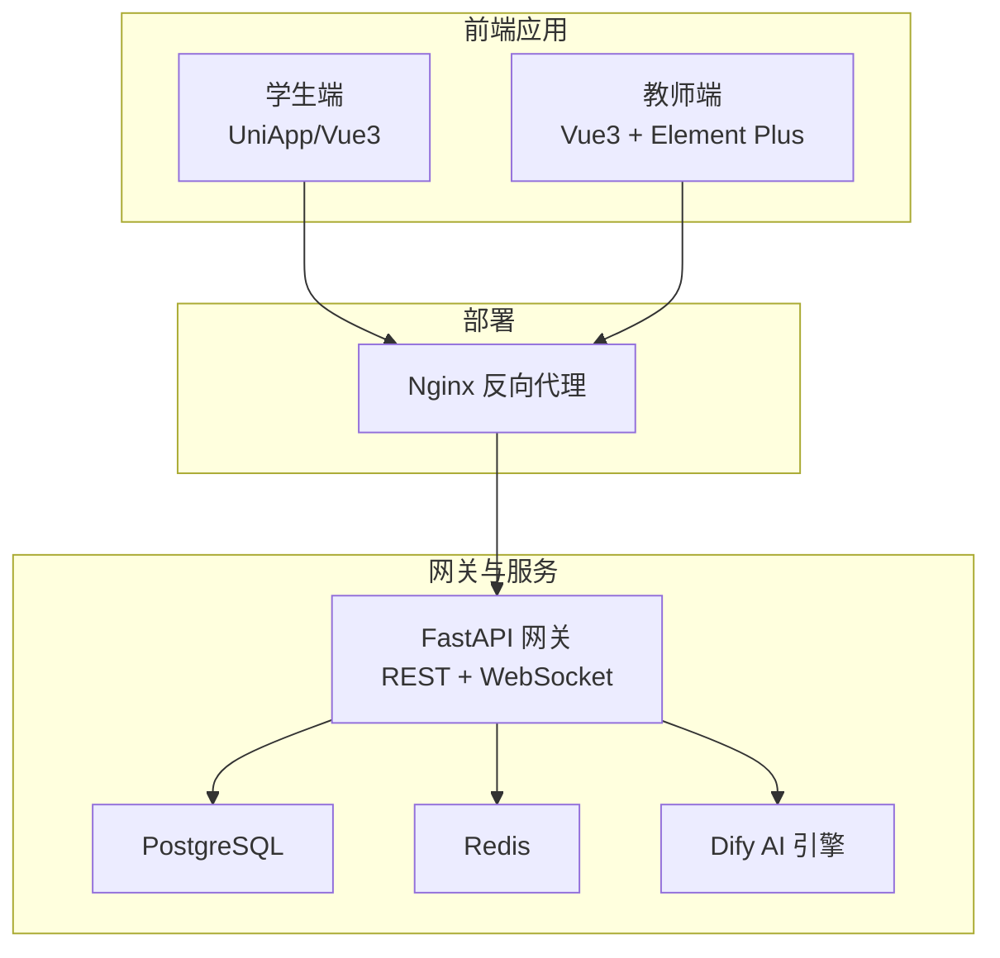
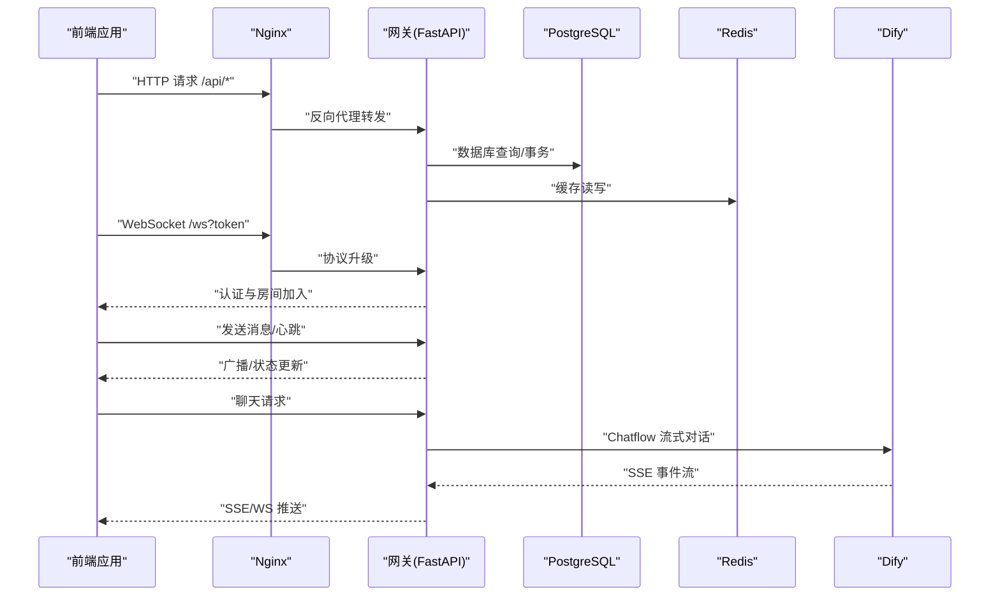
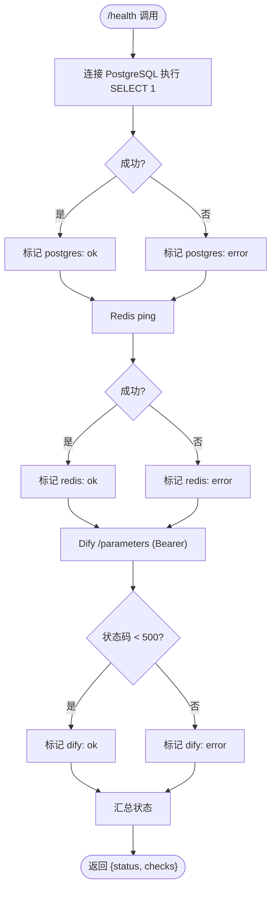
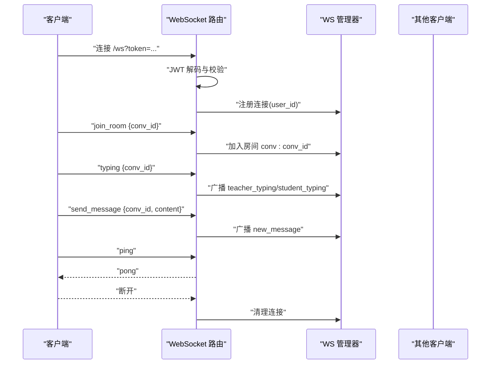
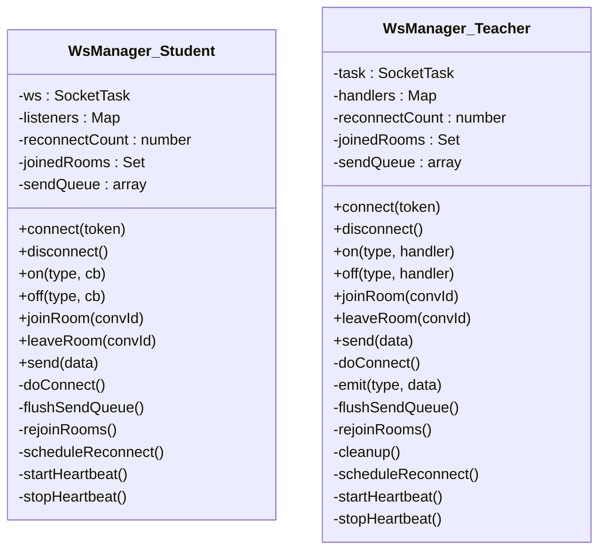
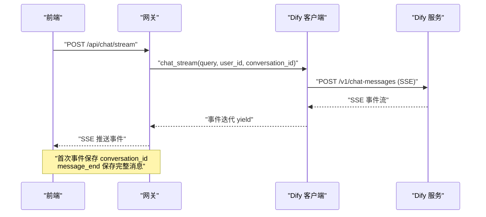
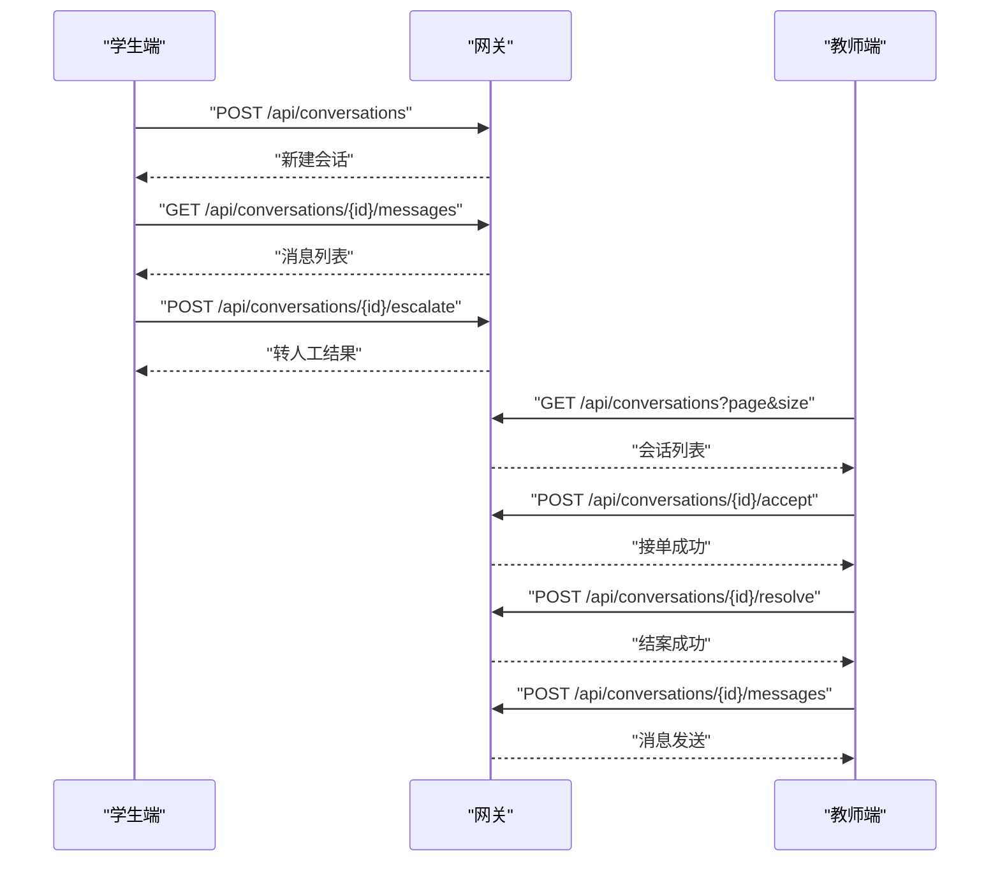
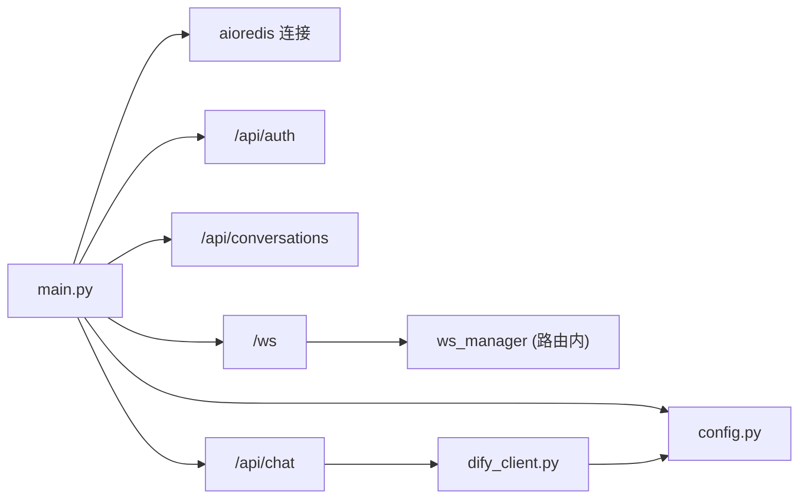

# 系统集成架构

<cite>
**本文引用的文件**
- [README.md](file://README.md)
- [gateway/main.py](file://services/gateway/app/main.py)
- [gateway/config.py](file://services/gateway/app/config.py)
- [gateway/routers/ws.py](file://services/gateway/app/routers/ws.py)
- [gateway/services/dify_client.py](file://services/gateway/app/services/dify_client.py)
- [nginx/gateway.conf](file://deploy/nginx/gateway.conf)
- [student-app/utils/websocket.ts](file://apps/student-app/src/utils/websocket.ts)
- [teacher-app/utils/websocket.ts](file://apps/teacher-app/src/utils/websocket.ts)
- [student-app/api/chat.ts](file://apps/student-app/src/api/chat.ts)
- [teacher-app/api/conversations.ts](file://apps/teacher-app/src/api/conversations.ts)
- [student-app/stores/user.ts](file://apps/student-app/src/stores/user.ts)
- [teacher-app/stores/user.ts](file://apps/teacher-app/src/stores/user.ts)
- [dify/yixiaoguan-chatflow.yml](file://deploy/dify/yixiaoguan-chatflow.yml)
</cite>

## 目录
1. [引言](#引言)
2. [项目结构](#项目结构)
3. [核心组件](#核心组件)
4. [架构总览](#架构总览)
5. [详细组件分析](#详细组件分析)
6. [依赖分析](#依赖分析)
7. [性能考虑](#性能考虑)
8. [故障排除指南](#故障排除指南)
9. [结论](#结论)
10. [附录](#附录)

## 引言
本文件面向“医小管 v2”项目的系统集成架构，聚焦以下目标：
- 前后端交互模式：前端应用通过 REST API 与后端网关交互；实时通信通过 WebSocket 实现。
- 后端服务与数据库、缓存的连接管理：基于异步 ORM 与连接池的健康检查与资源生命周期管理。
- WebSocket 服务器与 API 网关的协作机制：统一入口、认证、房间广播与心跳保活。
- 与 Dify AI 服务的集成：封装流式对话调用、错误处理与超时策略。
- 实时通信系统：连接建立、消息路由、状态同步与断线重连。
- 配置方法与故障排除：关键配置项、常见问题定位与修复建议。
- 性能监控与日志记录：健康检查、日志输出与可观测性建议。

## 项目结构
项目采用多模块分层组织：
- 前端应用：学生端与教师端分别使用 UniApp/Vue3 构建，共享通用工具与类型定义。
- 后端网关：FastAPI 提供 REST API 与 WebSocket 服务，负责认证、路由与外部服务集成。
- 部署与网关：Nginx 反向代理承载 API 与 WebSocket 协议升级。
- AI 引擎：Dify（自托管）作为对话与检索增强生成（RAG）引擎。

图表来源
- [gateway/main.py:16-28](file://services/gateway/app/main.py#L16-L28)
- [nginx/gateway.conf:4-27](file://deploy/nginx/gateway.conf#L4-L27)

章节来源
- [README.md:5-11](file://README.md#L5-L11)
- [gateway/main.py:16-28](file://services/gateway/app/main.py#L16-L28)
- [nginx/gateway.conf:4-27](file://deploy/nginx/gateway.conf#L4-L27)

## 核心组件
- 网关服务（FastAPI）
  - 提供健康检查、REST 路由与 WebSocket 端点。
  - 管理 Redis 连接生命周期，执行数据库与 Redis 健康检查。
- WebSocket 管理
  - 统一的连接注册、房间加入/离开、广播与心跳。
- Dify 客户端
  - 封装 Dify Chatflow 流式 SSE 调用，支持错误数据过滤与事件透传。
- 前端 WebSocket 管理器
  - 学生端与教师端各自维护单连接、房间集合、发送队列与指数退避重连。
- API 层
  - 学生端与教师端分别封装 REST API 请求，统一通过网关暴露。

章节来源
- [gateway/main.py:30-68](file://services/gateway/app/main.py#L30-L68)
- [gateway/routers/ws.py:11-119](file://services/gateway/app/routers/ws.py#L11-L119)
- [gateway/services/dify_client.py:22-69](file://services/gateway/app/services/dify_client.py#L22-L69)
- [student-app/utils/websocket.ts:3-153](file://apps/student-app/src/utils/websocket.ts#L3-L153)
- [teacher-app/utils/websocket.ts:9-169](file://apps/teacher-app/src/utils/websocket.ts#L9-L169)
- [student-app/api/chat.ts:9-35](file://apps/student-app/src/api/chat.ts#L9-L35)
- [teacher-app/api/conversations.ts:8-43](file://apps/teacher-app/src/api/conversations.ts#L8-L43)

## 架构总览
整体交互链路如下：
- 前端通过 Nginx 反向代理访问网关的 REST 与 WebSocket。
- 网关进行 JWT 认证与业务路由，必要时调用 Dify 的 Chatflow 流式接口。
- WebSocket 用于实时消息广播与状态同步，支持心跳与断线重连。
- 健康检查统一探测数据库、缓存与 AI 引擎可用性。

图表来源
- [nginx/gateway.conf:13-27](file://deploy/nginx/gateway.conf#L13-L27)
- [gateway/main.py:70-78](file://services/gateway/app/main.py#L70-L78)
- [gateway/routers/ws.py:11-119](file://services/gateway/app/routers/ws.py#L11-L119)
- [gateway/services/dify_client.py:22-69](file://services/gateway/app/services/dify_client.py#L22-L69)

## 详细组件分析

### 网关健康检查与外部依赖
- 健康检查路径返回数据库、缓存与 Dify 的可用性状态。
- Dify 检查使用短超时，避免阻塞整体健康状态。
- Redis 连接在 lifespan 中创建与关闭，确保资源释放。

图表来源
- [gateway/main.py:30-68](file://services/gateway/app/main.py#L30-L68)

章节来源
- [gateway/main.py:30-68](file://services/gateway/app/main.py#L30-L68)

### WebSocket 服务器与房间广播
- WebSocket 入口通过查询参数携带 JWT，解码后校验用户身份与角色。
- 连接建立后支持 join_room/leave_room、typing 广播、ping/pong 心跳。
- 房间命名以 conv:* 为单位，便于按会话维度广播。

图表来源
- [gateway/routers/ws.py:11-119](file://services/gateway/app/routers/ws.py#L11-L119)

章节来源
- [gateway/routers/ws.py:11-119](file://services/gateway/app/routers/ws.py#L11-L119)

### 前端 WebSocket 管理器（学生端与教师端）
- 统一的连接管理类，支持：
  - 单连接、房间集合、发送队列与心跳定时器。
  - 断线自动指数退避重连，最大重连次数限制。
  - 连接恢复后自动 re-join 房间并 flush 发送队列。
- 学生端与教师端代码结构相似，差异在于事件分发与错误处理细节。

图表来源
- [student-app/utils/websocket.ts:3-153](file://apps/student-app/src/utils/websocket.ts#L3-L153)
- [teacher-app/utils/websocket.ts:9-169](file://apps/teacher-app/src/utils/websocket.ts#L9-L169)

章节来源
- [student-app/utils/websocket.ts:3-153](file://apps/student-app/src/utils/websocket.ts#L3-L153)
- [teacher-app/utils/websocket.ts:9-169](file://apps/teacher-app/src/utils/websocket.ts#L9-L169)

### Dify 集成与流式对话
- Dify 客户端封装 Chatflow 流式调用，使用 SSE 事件源。
- 事件透传包括 message、message_end、error 等，调用方需处理 conversation_id 生命周期与消息持久化。
- 超时设置与异常捕获保障稳定性；非 JSON SSE 数据进行告警记录。

图表来源
- [gateway/services/dify_client.py:22-69](file://services/gateway/app/services/dify_client.py#L22-L69)
- [dify/yixiaoguan-chatflow.yml:100-127](file://deploy/dify/yixiaoguan-chatflow.yml#L100-L127)

章节来源
- [gateway/services/dify_client.py:22-69](file://services/gateway/app/services/dify_client.py#L22-L69)
- [dify/yixiaoguan-chatflow.yml:100-127](file://deploy/dify/yixiaoguan-chatflow.yml#L100-L127)

### API 调用与页面交互
- 学生端与教师端分别封装 REST API，统一通过网关暴露。
- 学生端：创建会话、分页查询会话与消息、转人工。
- 教师端：分页查询会话、获取详情、分页查询消息、接单与结案、发送消息。

图表来源
- [student-app/api/chat.ts:9-35](file://apps/student-app/src/api/chat.ts#L9-L35)
- [teacher-app/api/conversations.ts:8-43](file://apps/teacher-app/src/api/conversations.ts#L8-L43)

章节来源
- [student-app/api/chat.ts:9-35](file://apps/student-app/src/api/chat.ts#L9-L35)
- [teacher-app/api/conversations.ts:8-43](file://apps/teacher-app/src/api/conversations.ts#L8-L43)

## 依赖分析
- 外部依赖
  - 数据库：PostgreSQL（异步 ORM）
  - 缓存：Redis（异步客户端）
  - AI 引擎：Dify（HTTP/SSE）
  - 反向代理：Nginx（HTTP/WS 升级）
- 内部耦合
  - 网关主进程在 lifespan 中注入 Redis 实例，供各路由复用。
  - WebSocket 路由依赖 WS 管理器进行连接与房间管理。
  - Dify 客户端通过配置对象读取 Dify 地址与密钥。

图表来源
- [gateway/main.py:16-28](file://services/gateway/app/main.py#L16-L28)
- [gateway/config.py:3-31](file://services/gateway/app/config.py#L3-L31)
- [gateway/services/dify_client.py:14-18](file://services/gateway/app/services/dify_client.py#L14-L18)

章节来源
- [gateway/main.py:16-28](file://services/gateway/app/main.py#L16-L28)
- [gateway/config.py:3-31](file://services/gateway/app/config.py#L3-L31)
- [gateway/services/dify_client.py:14-18](file://services/gateway/app/services/dify_client.py#L14-L18)

## 性能考虑
- 连接池与异步 I/O
  - 使用异步 SQLAlchemy 与 aioredis，减少阻塞，提升并发能力。
- 超时与重试
  - Dify SSE 调用设置合理超时；前端 WebSocket 管理器采用指数退避重连，避免风暴重连。
- 负载均衡与扩展
  - Nginx 作为统一入口，可横向扩展网关实例；Redis 与数据库需具备高可用与读写分离能力。
- 观测性
  - 健康检查返回聚合状态；建议增加指标采集（如 Prometheus）与日志集中化（如 ELK）。

## 故障排除指南
- 健康检查异常
  - 若数据库或缓存不可用，检查连接字符串与网络可达性；查看健康检查返回的具体错误信息。
- Dify 不可用
  - 校验 Dify 地址与 API Key；确认 Dify 服务运行状态与网络连通；缩短超时时间以快速失败。
- WebSocket 连接失败
  - 检查 Nginx 是否正确配置 WebSocket 升级头；确认 token 有效且未过期；观察前端重连日志。
- 断线重连频繁
  - 检查网络抖动与心跳间隔；适当调整最大重连次数与退避上限。
- SSE 事件解析失败
  - Dify 客户端对非 JSON SSE 数据进行告警记录，排查上游数据格式或网络截断。

章节来源
- [gateway/main.py:30-68](file://services/gateway/app/main.py#L30-L68)
- [gateway/services/dify_client.py:64-69](file://services/gateway/app/services/dify_client.py#L64-L69)
- [nginx/gateway.conf:20-27](file://deploy/nginx/gateway.conf#L20-L27)
- [student-app/utils/websocket.ts:129-135](file://apps/student-app/src/utils/websocket.ts#L129-L135)
- [teacher-app/utils/websocket.ts:148-154](file://apps/teacher-app/src/utils/websocket.ts#L148-L154)

## 结论
本架构以 FastAPI 网关为核心，结合 Nginx 反向代理、Redis 与 PostgreSQL，实现了稳定可靠的 REST 与 WebSocket 服务。通过封装 Dify 的流式对话能力，满足智能问答与 RAG 场景。前端采用统一的 WebSocket 管理器，提供断线重连与房间广播能力。建议在生产环境中完善可观测性与弹性伸缩策略，并持续优化 AI 对话的超时与重试策略。

## 附录

### 关键配置项
- 网关配置（来自配置对象）
  - 数据库连接串、Redis 连接串
  - JWT 密钥、算法与过期时长
  - Dify API 地址、API Key、全局知识库 ID、数据集 API Key
  - 微信相关（P1 阶段）
- Nginx 配置要点
  - API 路由代理至网关
  - WebSocket 协议升级头与超时设置
  - Dify 控制台内网访问控制

章节来源
- [gateway/config.py:6-26](file://services/gateway/app/config.py#L6-L26)
- [nginx/gateway.conf:13-34](file://deploy/nginx/gateway.conf#L13-L34)