# 设计模式应用

<cite>
**本文档引用的文件**
- [state_machine.py](file://services/gateway/app/services/state_machine.py)
- [ws_manager.py](file://services/gateway/app/services/ws_manager.py)
- [deps.py](file://services/gateway/app/utils/deps.py)
- [conversation.py](file://services/gateway/app/models/conversation.py)
- [conversation_service.py](file://services/gateway/app/services/conversation_service.py)
- [chat.py](file://services/gateway/app/routers/chat.py)
- [ws.py](file://services/gateway/app/routers/ws.py)
- [main.py](file://services/gateway/app/main.py)
- [websocket.ts](file://apps/student-app/src/utils/websocket.ts)
- [websocket.ts](file://apps/teacher-app/src/utils/websocket.ts)
- [user.ts](file://apps/student-app/src/stores/user.ts)
- [index.vue](file://apps/student-app/src/pages/chat/index.vue)
- [index.vue](file://apps/teacher-app/src/pages/dashboard/index.vue)
</cite>

## 目录
1. [引言](#引言)
2. [项目结构](#项目结构)
3. [核心组件](#核心组件)
4. [架构概览](#架构概览)
5. [详细组件分析](#详细组件分析)
6. [依赖分析](#依赖分析)
7. [性能考虑](#性能考虑)
8. [故障排除指南](#故障排除指南)
9. [结论](#结论)

## 引言

医小管 v2 项目是一个基于 FastAPI 的智能校园助手系统，采用了多种设计模式来实现复杂的功能需求。本文档深入分析项目中应用的设计模式，包括状态机模式、依赖注入模式、观察者模式和工厂模式，并提供具体的应用场景和最佳实践指导。

## 项目结构

医小管 v2 项目采用前后端分离架构，主要分为以下层次：

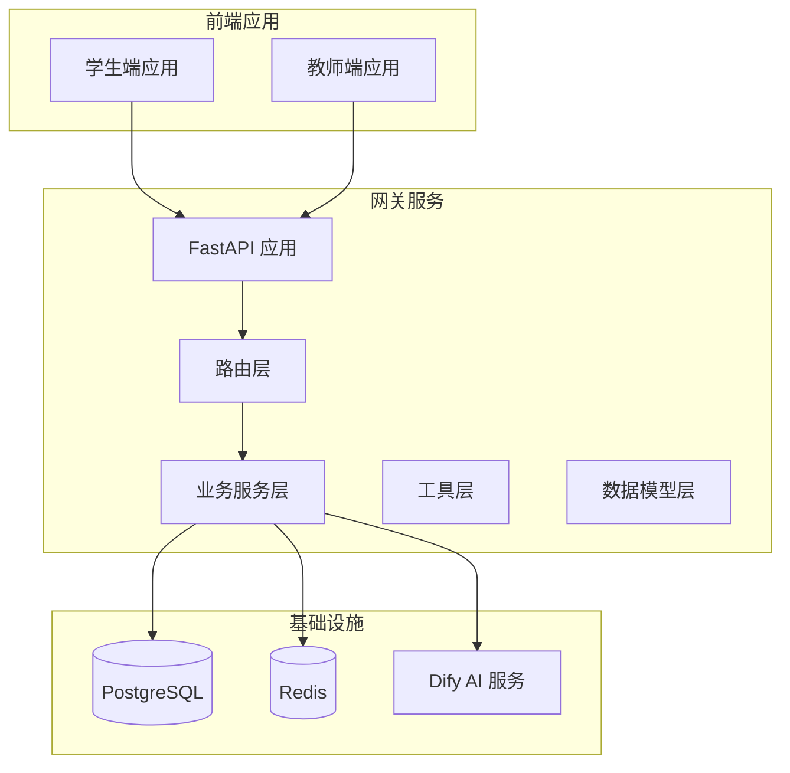

**图表来源**
- [main.py:1-78](file://services/gateway/app/main.py#L1-L78)
- [chat.py:1-191](file://services/gateway/app/routers/chat.py#L1-L191)

**章节来源**
- [main.py:1-78](file://services/gateway/app/main.py#L1-L78)
- [chat.py:1-191](file://services/gateway/app/routers/chat.py#L1-L191)

## 核心组件

### 状态机服务
状态机模式在会话管理系统中发挥着关键作用，实现了复杂的业务状态流转控制。

### WebSocket 管理器
ConnectionManager 类实现了观察者模式，负责管理 WebSocket 连接和消息广播。

### 依赖注入系统
FastAPI 的依赖注入机制提供了灵活的服务解析和生命周期管理。

### 实时通信框架
前端和后端都实现了观察者模式，支持实时消息传递和状态同步。

**章节来源**
- [state_machine.py:1-96](file://services/gateway/app/services/state_machine.py#L1-L96)
- [ws_manager.py:1-100](file://services/gateway/app/services/ws_manager.py#L1-L100)
- [deps.py:1-40](file://services/gateway/app/utils/deps.py#L1-L40)

## 架构概览

系统采用分层架构，每层都有明确的职责分工：

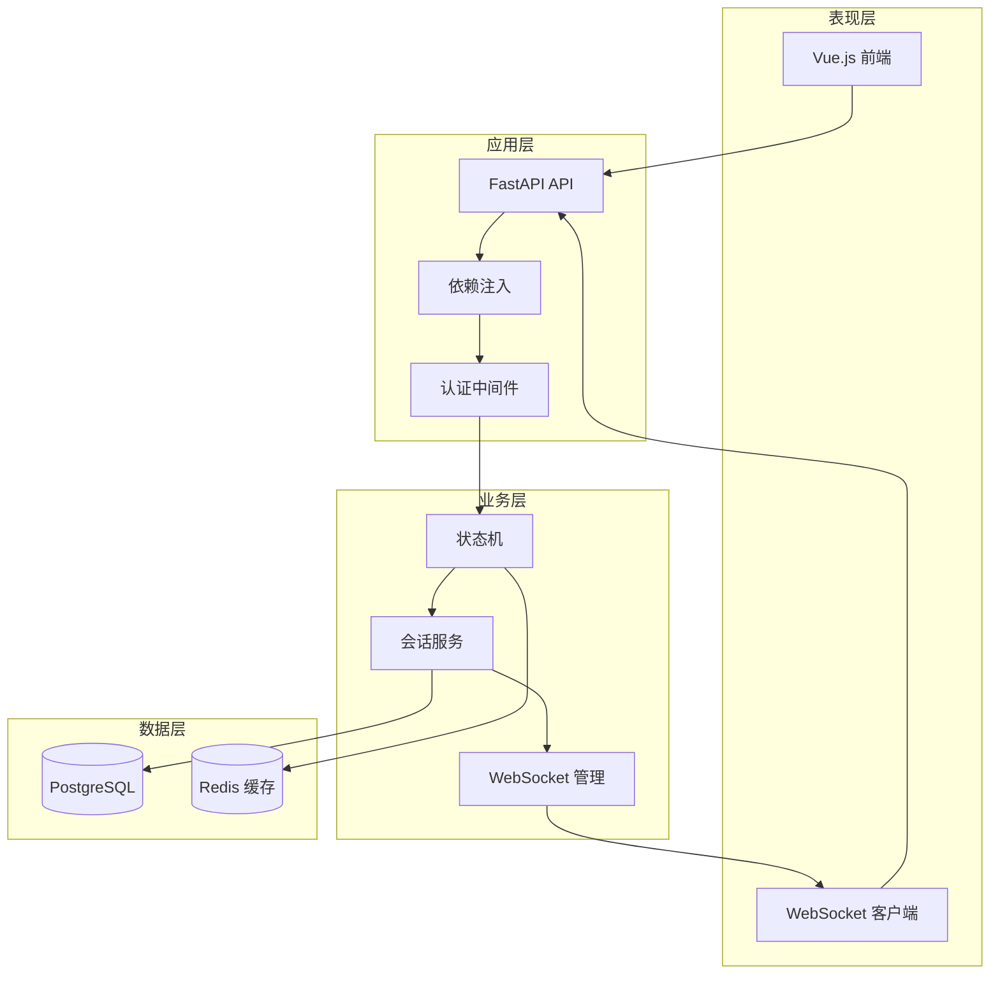

**图表来源**
- [main.py:1-78](file://services/gateway/app/main.py#L1-L78)
- [ws_manager.py:1-100](file://services/gateway/app/services/ws_manager.py#L1-L100)
- [state_machine.py:1-96](file://services/gateway/app/services/state_machine.py#L1-L96)

## 详细组件分析

### 状态机模式应用

#### 状态定义
会话状态机定义了完整的状态流转体系：

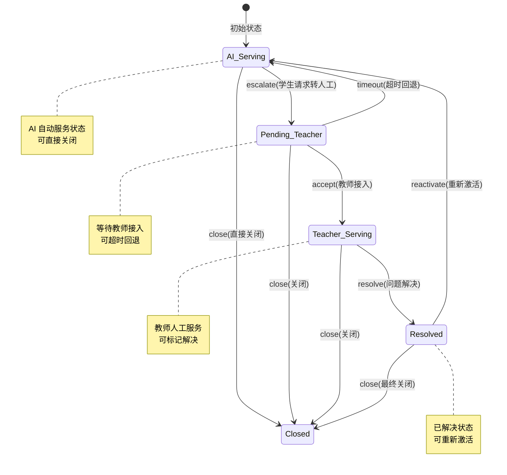

**图表来源**
- [state_machine.py:19-31](file://services/gateway/app/services/state_machine.py#L19-L31)
- [conversation.py:11-16](file://services/gateway/app/models/conversation.py#L11-L16)

#### 状态转换规则
状态转换通过严格的规则表控制：

| 当前状态 | 动作 | 目标状态 | 条件 |
|---------|------|----------|------|
| ai_serving | escalate | pending_teacher | 学生请求转人工 |
| ai_serving | close | closed | 直接关闭 |
| pending_teacher | accept | teacher_serving | 教师接入 |
| pending_teacher | timeout | ai_serving | 超时回退 |
| pending_teacher | close | closed | 关闭 |
| teacher_serving | resolve | resolved | 问题解决 |
| teacher_serving | close | closed | 关闭 |
| resolved | reactivate | ai_serving | 学生继续提问 |
| resolved | close | closed | 最终关闭 |

#### 状态持久化机制
状态转换不仅更新数据库状态，还记录系统消息：

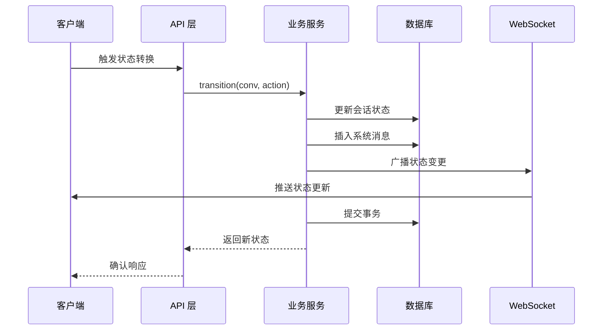

**图表来源**
- [state_machine.py:34-96](file://services/gateway/app/services/state_machine.py#L34-L96)
- [chat.py:43-51](file://services/gateway/app/routers/chat.py#L43-L51)

**章节来源**
- [state_machine.py:1-96](file://services/gateway/app/services/state_machine.py#L1-L96)
- [conversation.py:1-63](file://services/gateway/app/models/conversation.py#L1-L63)
- [chat.py:1-191](file://services/gateway/app/routers/chat.py#L1-L191)

### 依赖注入模式应用

#### 依赖解析机制
FastAPI 的依赖注入系统提供了强大的服务解析能力：

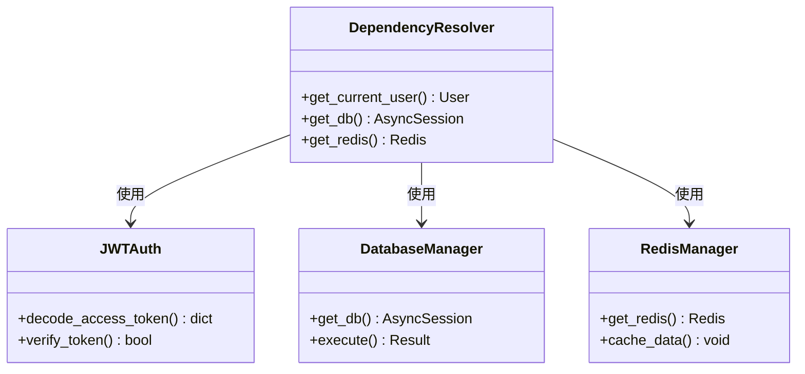

**图表来源**
- [deps.py:14-39](file://services/gateway/app/utils/deps.py#L14-L39)
- [main.py:16-22](file://services/gateway/app/main.py#L16-L22)

#### 生命周期管理
依赖注入提供了完善的生命周期管理：

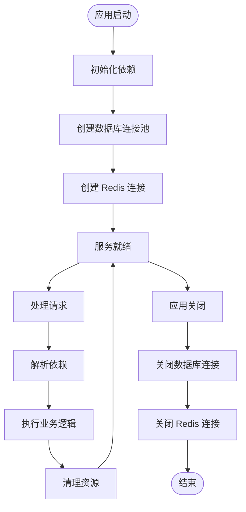

**图表来源**
- [main.py:16-22](file://services/gateway/app/main.py#L16-L22)
- [deps.py:14-39](file://services/gateway/app/utils/deps.py#L14-L39)

**章节来源**
- [deps.py:1-40](file://services/gateway/app/utils/deps.py#L1-L40)
- [main.py:1-78](file://services/gateway/app/main.py#L1-L78)

### 观察者模式实现

#### WebSocket 连接管理
ConnectionManager 类实现了观察者模式的核心功能：

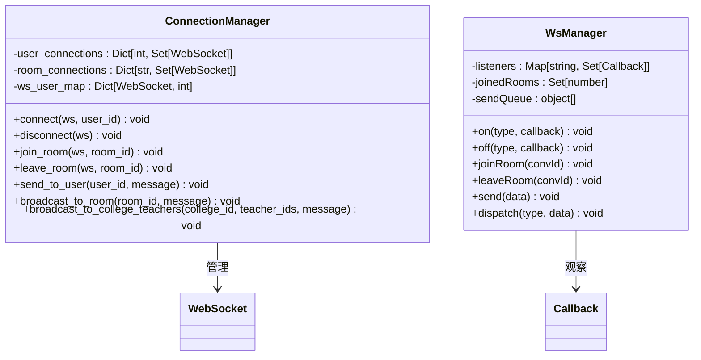

**图表来源**
- [ws_manager.py:8-99](file://services/gateway/app/services/ws_manager.py#L8-L99)
- [websocket.ts:3-152](file://apps/student-app/src/utils/websocket.ts#L3-L152)

#### 实时通信流程
观察者模式确保了实时通信的可靠性：

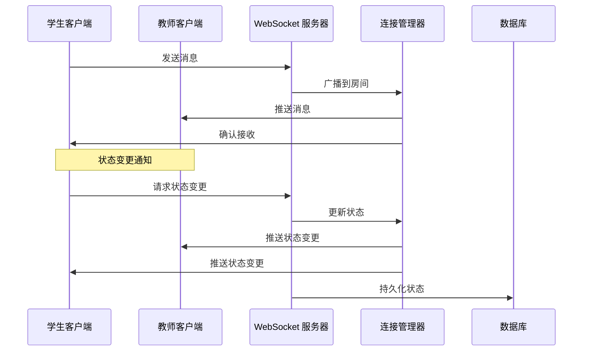

**图表来源**
- [ws_manager.py:59-81](file://services/gateway/app/services/ws_manager.py#L59-L81)
- [ws.py:62-106](file://services/gateway/app/routers/ws.py#L62-L106)

**章节来源**
- [ws_manager.py:1-100](file://services/gateway/app/services/ws_manager.py#L1-L100)
- [ws.py:1-119](file://services/gateway/app/routers/ws.py#L1-L119)
- [websocket.ts:1-153](file://apps/student-app/src/utils/websocket.ts#L1-L153)

### 工厂模式应用

#### 会话服务工厂
会话服务提供了多种工厂方法来创建不同类型的会话：

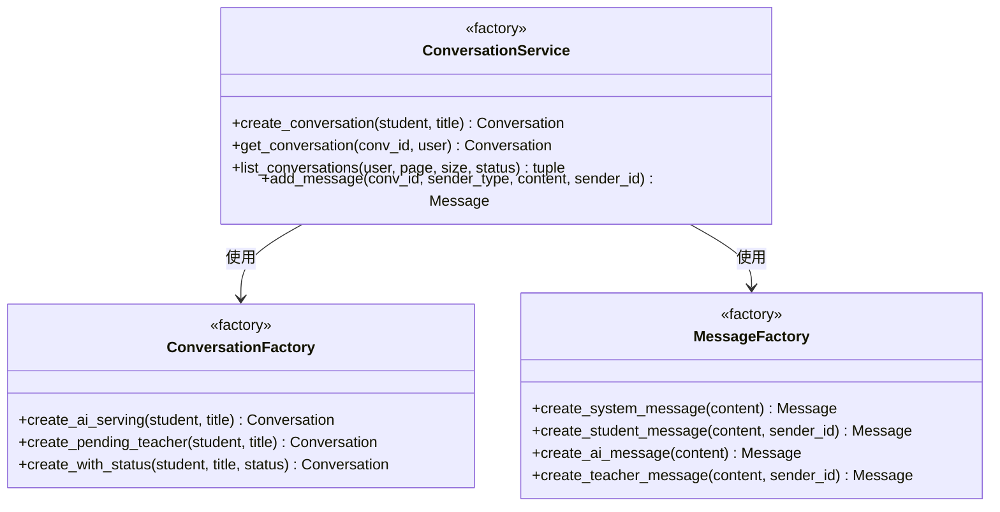

**图表来源**
- [conversation_service.py:29-179](file://services/gateway/app/services/conversation_service.py#L29-L179)

#### 服务创建策略
工厂模式确保了服务创建的一致性和可扩展性：

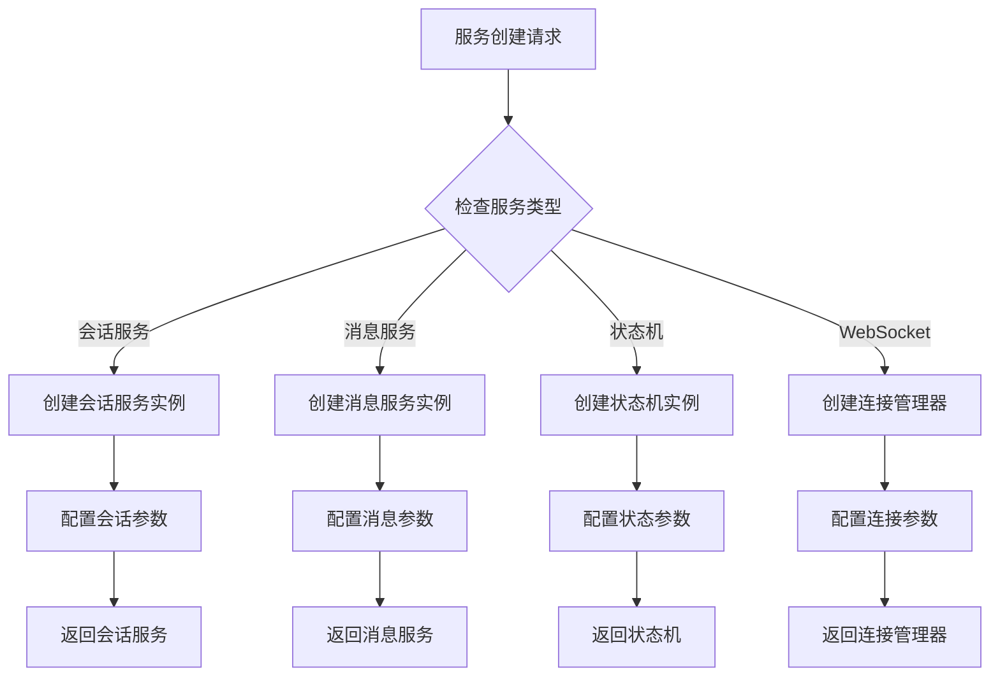

**图表来源**
- [conversation_service.py:29-51](file://services/gateway/app/services/conversation_service.py#L29-L51)

**章节来源**
- [conversation_service.py:1-179](file://services/gateway/app/services/conversation_service.py#L1-L179)

## 依赖分析

### 组件耦合关系

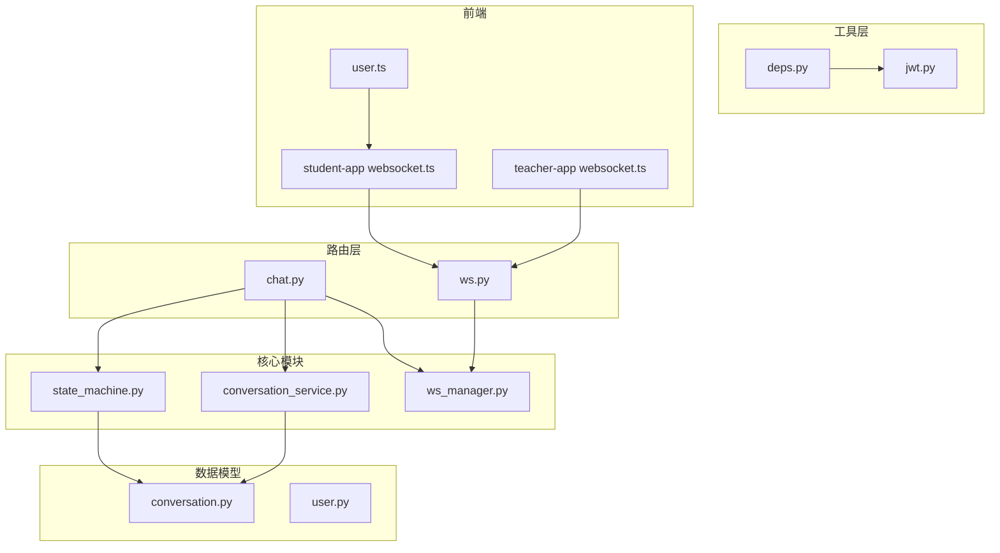

**图表来源**
- [chat.py:1-191](file://services/gateway/app/routers/chat.py#L1-L191)
- [ws.py:1-119](file://services/gateway/app/routers/ws.py#L1-L119)
- [state_machine.py:1-96](file://services/gateway/app/services/state_machine.py#L1-L96)

### 依赖循环检测
系统采用了良好的模块化设计，避免了循环依赖：

- **路由层**不直接依赖业务服务，通过依赖注入解耦
- **业务服务**不直接依赖外部 API，通过接口抽象
- **前端**通过标准化的 WebSocket 协议与后端通信

**章节来源**
- [chat.py:1-191](file://services/gateway/app/routers/chat.py#L1-L191)
- [ws.py:1-119](file://services/gateway/app/routers/ws.py#L1-L119)
- [deps.py:1-40](file://services/gateway/app/utils/deps.py#L1-L40)

## 性能考虑

### 状态机优化
- 使用内存中的状态转换表避免重复查询
- 批量操作减少数据库往返次数
- 异步处理提升并发性能

### WebSocket 连接管理
- 连接池复用减少连接建立开销
- 心跳检测及时发现断线
- 断线重连指数退避算法

### 依赖注入优化
- 单例模式减少对象创建成本
- 异步依赖延迟加载
- 连接池管理数据库连接

## 故障排除指南

### 状态机异常处理
当发生非法状态转换时，系统会抛出 `InvalidTransition` 异常：

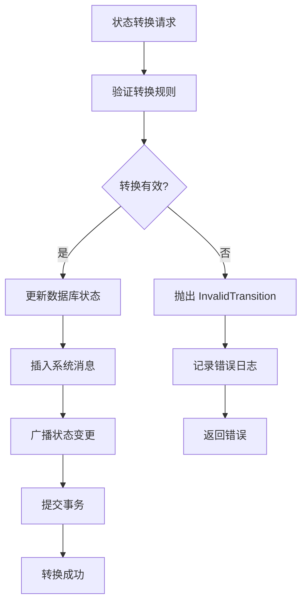

**图表来源**
- [state_machine.py:46-48](file://services/gateway/app/services/state_machine.py#L46-L48)

### WebSocket 连接问题诊断
常见问题及解决方案：

1. **连接失败**: 检查 JWT 令牌有效性
2. **消息丢失**: 验证房间加入状态
3. **断线重连**: 检查指数退避算法
4. **内存泄漏**: 确保连接清理和监听器注销

**章节来源**
- [state_machine.py:8-13](file://services/gateway/app/services/state_machine.py#L8-L13)
- [ws_manager.py:137-149](file://services/gateway/app/services/ws_manager.py#L137-L149)

## 结论

医小管 v2 项目成功应用了多种设计模式来构建一个高性能、可维护的智能校园助手系统。通过状态机模式实现复杂的业务状态管理，通过依赖注入提供灵活的服务解析机制，通过观察者模式实现可靠的实时通信，通过工厂模式确保服务创建的一致性和可扩展性。

这些设计模式的应用不仅提升了系统的架构质量，也为未来的功能扩展和维护提供了坚实的基础。建议在后续开发中继续遵循这些设计原则，确保系统的持续演进和稳定性。