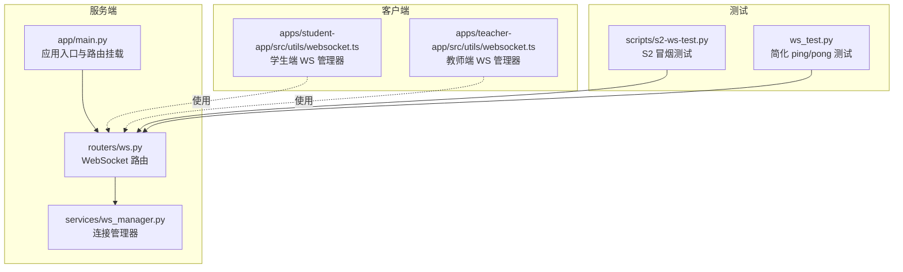
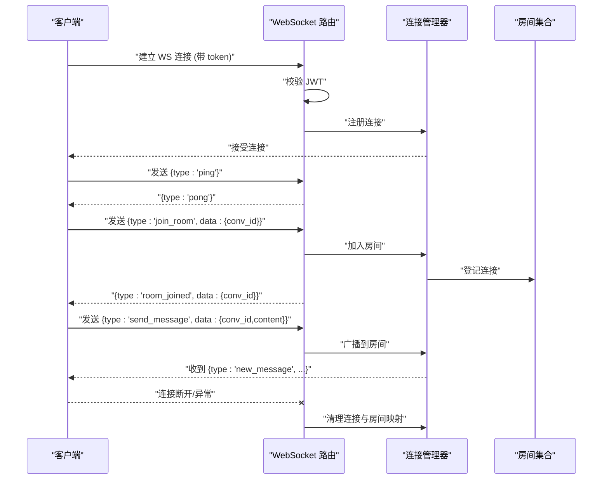
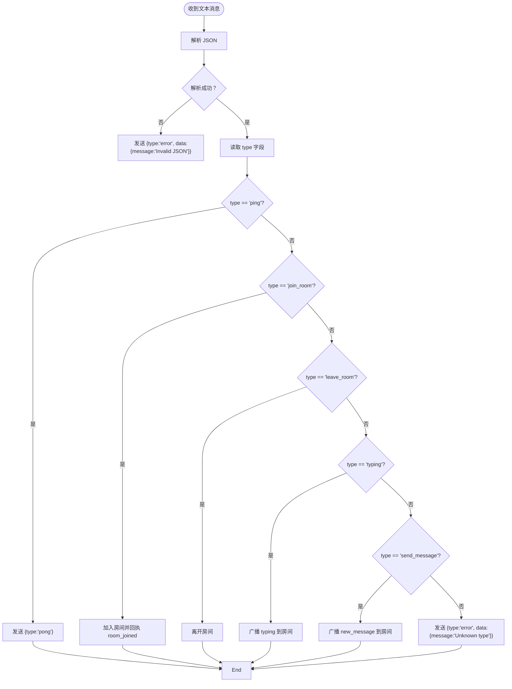
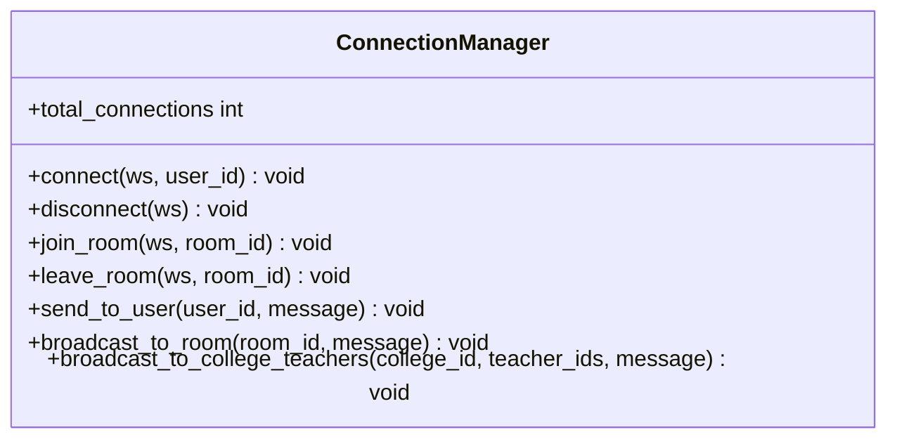
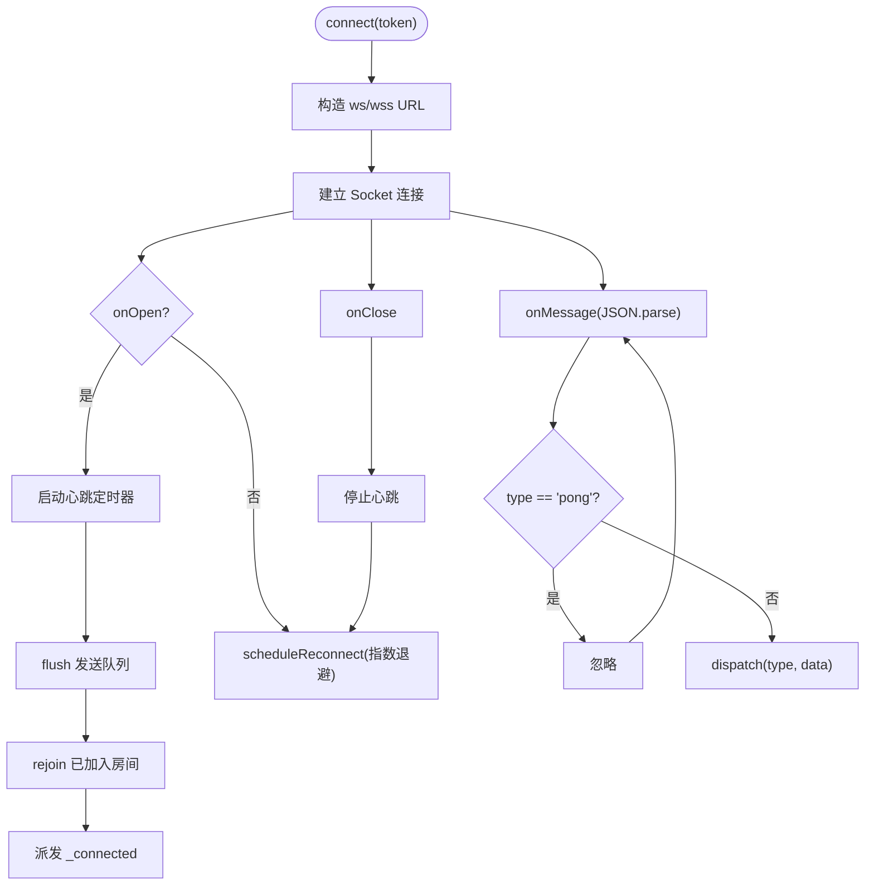
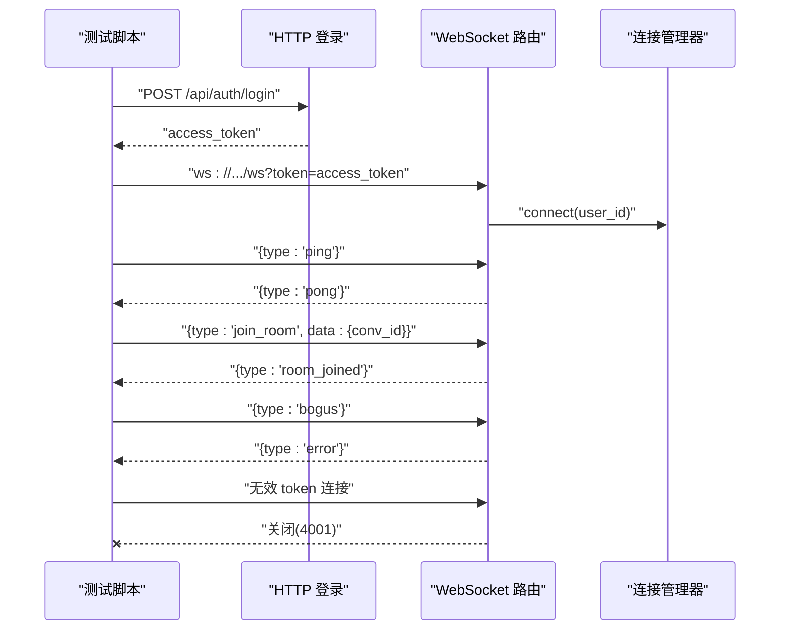
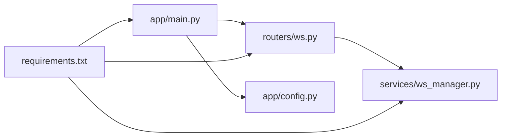

# WebSocket 测试

<cite>
**本文引用的文件**
- [scripts/s2-ws-test.py](file://scripts/s2-ws-test.py)
- [ws_test.py](file://ws_test.py)
- [services/gateway/app/routers/ws.py](file://services/gateway/app/routers/ws.py)
- [services/gateway/app/services/ws_manager.py](file://services/gateway/app/services/ws_manager.py)
- [apps/student-app/src/utils/websocket.ts](file://apps/student-app/src/utils/websocket.ts)
- [apps/teacher-app/src/utils/websocket.ts](file://apps/teacher-app/src/utils/websocket.ts)
- [services/gateway/app/main.py](file://services/gateway/app/main.py)
- [services/gateway/app/config.py](file://services/gateway/app/config.py)
- [s2-e-smoke-test.md](file://s2-e-smoke-test.md)
- [s2-final.md](file://s2-final.md)
- [services/gateway/requirements.txt](file://services/gateway/requirements.txt)
</cite>

## 目录
1. [简介](#简介)
2. [项目结构](#项目结构)
3. [核心组件](#核心组件)
4. [架构总览](#架构总览)
5. [详细组件分析](#详细组件分析)
6. [依赖分析](#依赖分析)
7. [性能考虑](#性能考虑)
8. [故障排查指南](#故障排查指南)
9. [结论](#结论)
10. [附录](#附录)

## 简介
本文件面向“医小管 v2”项目的 WebSocket 实时通信测试，系统化梳理连接建立、消息收发、并发与稳定性、错误处理与性能测试方法，并提供可复用的测试脚本与自动化执行流程建议。文档同时覆盖客户端（学生端与教师端）的 WebSocket 管理器行为与服务端路由、连接管理器的实现细节，帮助测试工程师在不同阶段（冒烟、回归、压测）高效落地。

## 项目结构
围绕 WebSocket 的测试与实现，涉及以下关键位置：
- 服务端 FastAPI 路由与连接管理器：负责认证、消息分发与房间广播
- 客户端 WebSocket 管理器：封装连接、心跳、重连、入退房与消息队列
- 测试脚本：Python 脚本用于连接建立、消息往返、异常路径验证
- 文档与配置：健康检查、环境变量与依赖清单

图表来源
- [services/gateway/app/main.py:70-78](file://services/gateway/app/main.py#L70-L78)
- [services/gateway/app/routers/ws.py:11-34](file://services/gateway/app/routers/ws.py#L11-L34)
- [services/gateway/app/services/ws_manager.py:8-24](file://services/gateway/app/services/ws_manager.py#L8-L24)
- [apps/student-app/src/utils/websocket.ts:1-153](file://apps/student-app/src/utils/websocket.ts#L1-L153)
- [apps/teacher-app/src/utils/websocket.ts:1-169](file://apps/teacher-app/src/utils/websocket.ts#L1-L169)
- [scripts/s2-ws-test.py:1-51](file://scripts/s2-ws-test.py#L1-L51)
- [ws_test.py:1-9](file://ws_test.py#L1-L9)

章节来源
- [services/gateway/app/main.py:70-78](file://services/gateway/app/main.py#L70-L78)
- [services/gateway/app/routers/ws.py:11-34](file://services/gateway/app/routers/ws.py#L11-L34)
- [services/gateway/app/services/ws_manager.py:8-24](file://services/gateway/app/services/ws_manager.py#L8-L24)
- [apps/student-app/src/utils/websocket.ts:1-153](file://apps/student-app/src/utils/websocket.ts#L1-L153)
- [apps/teacher-app/src/utils/websocket.ts:1-169](file://apps/teacher-app/src/utils/websocket.ts#L1-L169)
- [scripts/s2-ws-test.py:1-51](file://scripts/s2-ws-test.py#L1-L51)
- [ws_test.py:1-9](file://ws_test.py#L1-L9)

## 核心组件
- 服务端 WebSocket 路由：提供 /ws 端点，基于查询参数携带 JWT 进行认证；支持 ping/pong、入退房、打字广播、消息广播等协议类型
- 连接管理器：维护用户连接集合与房间连接集合，支持按用户或房间广播，具备断线清理能力
- 客户端 WebSocket 管理器：统一处理连接生命周期、心跳、重连、入退房、消息队列与事件分发
- 测试脚本：提供冒烟测试与简化测试，覆盖连接、心跳、未知类型、无效令牌等关键路径

章节来源
- [services/gateway/app/routers/ws.py:11-34](file://services/gateway/app/routers/ws.py#L11-L34)
- [services/gateway/app/services/ws_manager.py:8-24](file://services/gateway/app/services/ws_manager.py#L8-L24)
- [apps/student-app/src/utils/websocket.ts:1-153](file://apps/student-app/src/utils/websocket.ts#L1-L153)
- [apps/teacher-app/src/utils/websocket.ts:1-169](file://apps/teacher-app/src/utils/websocket.ts#L1-L169)
- [scripts/s2-ws-test.py:1-51](file://scripts/s2-ws-test.py#L1-L51)
- [ws_test.py:1-9](file://ws_test.py#L1-L9)

## 架构总览
下图展示从客户端发起连接到服务端处理与广播的整体流程，以及心跳与错误处理的关键节点。

图表来源
- [services/gateway/app/routers/ws.py:35-118](file://services/gateway/app/routers/ws.py#L35-L118)
- [services/gateway/app/services/ws_manager.py:25-81](file://services/gateway/app/services/ws_manager.py#L25-L81)

## 详细组件分析

### 服务端 WebSocket 路由与消息协议
- 认证：从查询参数解析 token，解码失败则关闭连接（4001）
- 协议类型：
  - 上行：ping、join_room、leave_room、typing、send_message
  - 下行：pong、room_joined、new_message、teacher_typing、student_typing、error
- 错误处理：JSON 解析失败返回 error；未知类型返回 error；异常捕获后断开连接

图表来源
- [services/gateway/app/routers/ws.py:47-112](file://services/gateway/app/routers/ws.py#L47-L112)

章节来源
- [services/gateway/app/routers/ws.py:11-34](file://services/gateway/app/routers/ws.py#L11-L34)
- [services/gateway/app/routers/ws.py:47-112](file://services/gateway/app/routers/ws.py#L47-L112)

### 连接管理器（ConnectionManager）
- 用户连接映射：user_id → set[WebSocket]，便于按用户推送
- 房间连接映射：room_id → set[WebSocket]，便于房间广播
- 断线清理：移除失效连接并从房间集合中剔除
- 广播实现：遍历房间连接逐个发送，失败则标记为死连接并清理

图表来源
- [services/gateway/app/services/ws_manager.py:8-99](file://services/gateway/app/services/ws_manager.py#L8-L99)

章节来源
- [services/gateway/app/services/ws_manager.py:8-99](file://services/gateway/app/services/ws_manager.py#L8-L99)

### 客户端 WebSocket 管理器（学生端/教师端）
- 统一行为：
  - 连接：根据当前协议与主机拼接 ws/wss 地址，建立连接
  - 心跳：每 30 秒发送 ping，忽略 pong
  - 重连：指数退避，最大延迟限制，最多 N 次
  - 房间：记录已入房间列表，断线后自动 re-join
  - 发送队列：未连接时缓存消息，连接恢复后 flush
  - 事件分发：按 type 分发到监听者
- 学生端与教师端实现基本一致，差异在于部分回调命名与日志输出

图表来源
- [apps/student-app/src/utils/websocket.ts:20-64](file://apps/student-app/src/utils/websocket.ts#L20-L64)
- [apps/student-app/src/utils/websocket.ts:137-149](file://apps/student-app/src/utils/websocket.ts#L137-L149)
- [apps/teacher-app/src/utils/websocket.ts:26-114](file://apps/teacher-app/src/utils/websocket.ts#L26-L114)
- [apps/teacher-app/src/utils/websocket.ts:148-165](file://apps/teacher-app/src/utils/websocket.ts#L148-L165)

章节来源
- [apps/student-app/src/utils/websocket.ts:1-153](file://apps/student-app/src/utils/websocket.ts#L1-L153)
- [apps/teacher-app/src/utils/websocket.ts:1-169](file://apps/teacher-app/src/utils/websocket.ts#L1-L169)

### 测试脚本与执行流程
- scripts/s2-ws-test.py：完整冒烟测试，覆盖登录获取 token、连接 WS、ping/pong、join_room、未知类型、无效 token 关闭码
- ws_test.py：简化版 ping/pong 测试，便于快速验证

图表来源
- [scripts/s2-ws-test.py:8-47](file://scripts/s2-ws-test.py#L8-L47)
- [services/gateway/app/routers/ws.py:35-42](file://services/gateway/app/routers/ws.py#L35-L42)
- [services/gateway/app/services/ws_manager.py:25-32](file://services/gateway/app/services/ws_manager.py#L25-L32)

章节来源
- [scripts/s2-ws-test.py:1-51](file://scripts/s2-ws-test.py#L1-L51)
- [ws_test.py:1-9](file://ws_test.py#L1-L9)

## 依赖分析
- 应用入口挂载 WebSocket 路由，确保 /ws 可用
- 配置文件提供数据库、Redis、JWT、Dify 等运行时参数
- 依赖清单包含 FastAPI、uvicorn、SQLAlchemy、Redis、JWT、httpx 等

图表来源
- [services/gateway/app/main.py:70-78](file://services/gateway/app/main.py#L70-L78)
- [services/gateway/app/config.py:3-31](file://services/gateway/app/config.py#L3-L31)
- [services/gateway/requirements.txt:1-29](file://services/gateway/requirements.txt#L1-L29)

章节来源
- [services/gateway/app/main.py:70-78](file://services/gateway/app/main.py#L70-L78)
- [services/gateway/app/config.py:3-31](file://services/gateway/app/config.py#L3-L31)
- [services/gateway/requirements.txt:1-29](file://services/gateway/requirements.txt#L1-L29)

## 性能考虑
- 并发连接与房间广播
  - 当前实现对房间内每个连接逐一发送，异常连接会被标记并清理；建议在高并发场景下评估广播路径的吞吐瓶颈
- 心跳与保活
  - 客户端每 30 秒发送 ping，服务端立即响应 pong；建议监控心跳丢失导致的断线重连频率
- 连接池与资源
  - uvicorn 默认多进程/协程模型，需结合实际部署规模评估并发上限；Redis 与数据库连接池配置需与压力测试结果匹配
- 内存与 GC
  - 长连接与消息队列在高负载下可能产生内存增长，建议在压测中观察堆内存与对象存活情况
- 建议的压测指标
  - 连接成功率、消息延迟分布、丢包率、重连次数、CPU/内存/连接数曲线、房间广播 QPS

[本节为通用指导，无需具体文件分析]

## 故障排查指南
- 连接被拒绝（4001）
  - 现象：使用无效 token 连接后立即关闭
  - 处理：检查 token 生成与有效期、JWT 密钥一致性
- 未知消息类型
  - 现象：收到 error 类型消息，包含 message 字段
  - 处理：核对客户端发送的消息类型是否受支持
- 心跳异常
  - 现象：长时间无 pong 或频繁断线
  - 处理：检查网络质量、代理超时、客户端心跳定时器
- 房间广播未达
  - 现象：send_message 后未收到 new_message
  - 处理：确认 join_room 成功、房间 ID 格式、广播实现与房间映射
- 重连风暴
  - 现象：短时间内大量重连
  - 处理：检查退避参数、服务端异常日志、客户端断线原因

章节来源
- [services/gateway/app/routers/ws.py:35-42](file://services/gateway/app/routers/ws.py#L35-L42)
- [services/gateway/app/routers/ws.py:108-112](file://services/gateway/app/routers/ws.py#L108-L112)
- [apps/student-app/src/utils/websocket.ts:129-135](file://apps/student-app/src/utils/websocket.ts#L129-L135)
- [apps/teacher-app/src/utils/websocket.ts:148-154](file://apps/teacher-app/src/utils/websocket.ts#L148-L154)

## 结论
本文基于现有代码与测试脚本，构建了针对“医小管 v2” WebSocket 的测试体系：从连接建立、心跳、房间广播到错误处理与冒烟验证均有对应实现与流程。建议在回归与压测阶段持续完善消息格式校验、状态同步与广播一致性、异常路径与资源回收的观测指标，以保障实时通信的稳定性与可观测性。

[本节为总结，无需具体文件分析]

## 附录

### 测试策略与用例清单
- 连接建立测试
  - 使用有效 token 建立连接并握手成功
  - 使用无效 token 连接应被拒绝（4001）
- 消息发送接收测试
  - ping/pong 往返验证
  - join_room/leave_room 成功回执
  - send_message 广播 new_message
  - typing 广播教师/学生 typing
- 实时消息传递策略
  - 消息格式验证：type 与 data 结构校验
  - 状态同步测试：入退房、消息广播后的状态一致性
  - 错误处理测试：未知类型、JSON 解析失败、网络抖动
- 并发与稳定性测试
  - 多房间并发广播
  - 大量客户端同时入退房
  - 心跳中断与恢复
- 自动化执行流程
  - 依赖安装：websockets
  - 执行顺序：登录获取 token → 运行冒烟测试脚本 → 观察结果与日志

章节来源
- [scripts/s2-ws-test.py:8-47](file://scripts/s2-ws-test.py#L8-L47)
- [ws_test.py:1-9](file://ws_test.py#L1-L9)
- [s2-e-smoke-test.md:17-38](file://s2-e-smoke-test.md#L17-L38)
- [s2-final.md:22-36](file://s2-final.md#L22-L36)