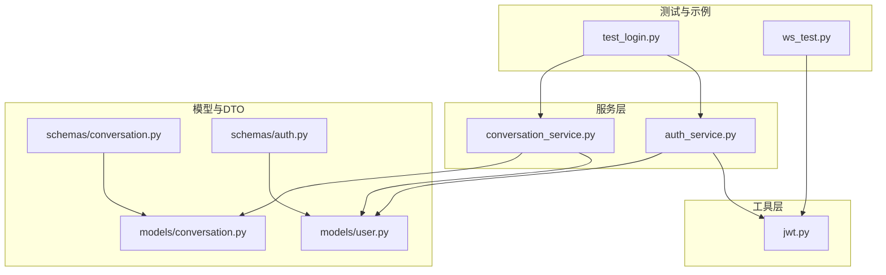
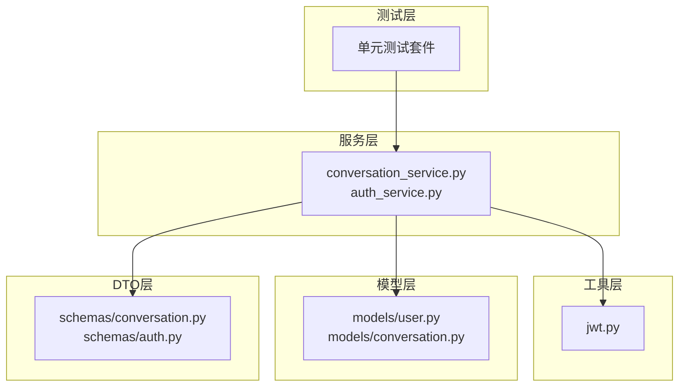
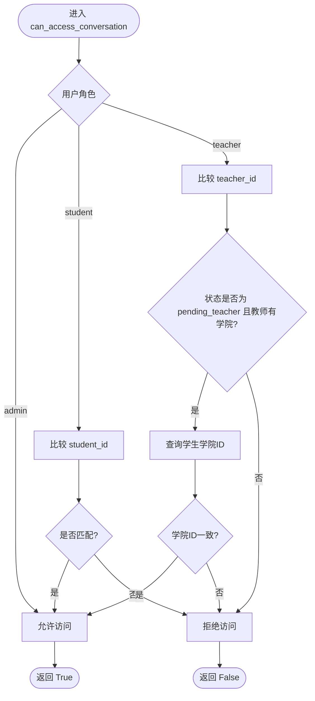
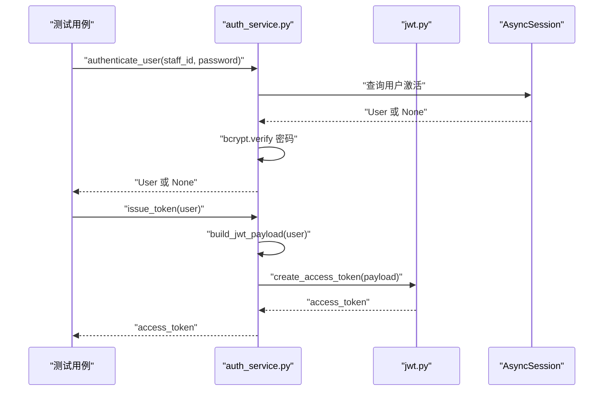
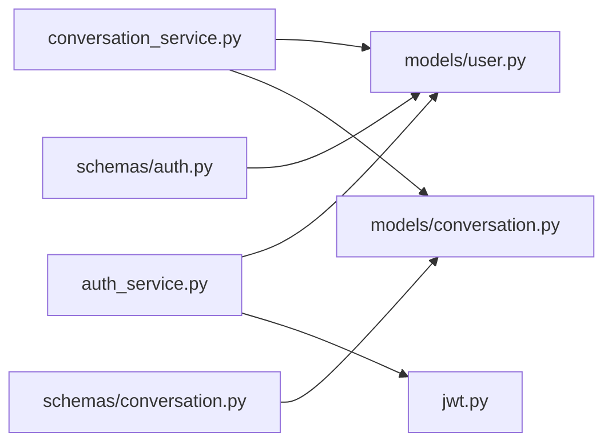

# 单元测试

<cite>
**本文引用的文件**
- [conversation_service.py](file://services/gateway/app/services/conversation_service.py)
- [jwt.py](file://services/gateway/app/utils/jwt.py)
- [auth_service.py](file://services/gateway/app/services/auth_service.py)
- [conversation.py](file://services/gateway/app/models/conversation.py)
- [user.py](file://services/gateway/app/models/user.py)
- [conversation.py](file://services/gateway/app/schemas/conversation.py)
- [auth.py](file://services/gateway/app/schemas/auth.py)
- [test_login.py](file://test_login.py)
- [ws_test.py](file://ws_test.py)
</cite>

## 目录
1. [引言](#引言)
2. [项目结构](#项目结构)
3. [核心组件](#核心组件)
4. [架构总览](#架构总览)
5. [详细组件分析](#详细组件分析)
6. [依赖分析](#依赖分析)
7. [性能考虑](#性能考虑)
8. [故障排查指南](#故障排查指南)
9. [结论](#结论)
10. [附录](#附录)

## 引言
本文件面向“医小管 v2”后端服务层的单元测试设计与实践，聚焦以下目标：
- 明确单元测试的设计原则与最佳实践：测试用例编写规范、Mock 对象使用、断言策略。
- 针对 conversation_service.py 的业务逻辑进行测试设计，覆盖权限校验、会话与消息管理、分页与统计等场景。
- 针对 JWT 工具函数与认证服务进行测试设计，覆盖签发与解码、负载构建与令牌发放。
- 提供异步函数、异常处理、边界条件的测试思路与示例路径。
- 给出测试覆盖率与质量标准建议。

## 项目结构
后端服务位于 services/gateway，采用 FastAPI + SQLAlchemy Async 架构。与单元测试直接相关的核心模块如下：
- 服务层：app/services/conversation_service.py、app/services/auth_service.py
- 工具层：app/utils/jwt.py
- 数据模型：app/models/conversation.py、app/models/user.py
- 数据传输对象：app/schemas/conversation.py、app/schemas/auth.py
- 端到端示例脚本：test_login.py、ws_test.py

图示来源
- [conversation_service.py:1-179](file://services/gateway/app/services/conversation_service.py#L1-L179)
- [auth_service.py:1-35](file://services/gateway/app/services/auth_service.py#L1-L35)
- [jwt.py:1-17](file://services/gateway/app/utils/jwt.py#L1-L17)
- [conversation.py:1-63](file://services/gateway/app/models/conversation.py#L1-L63)
- [user.py:1-76](file://services/gateway/app/models/user.py#L1-L76)
- [conversation.py:1-50](file://services/gateway/app/schemas/conversation.py#L1-L50)
- [auth.py:1-23](file://services/gateway/app/schemas/auth.py#L1-L23)
- [test_login.py:1-52](file://test_login.py#L1-L52)
- [ws_test.py:1-9](file://ws_test.py#L1-L9)

章节来源
- [conversation_service.py:1-179](file://services/gateway/app/services/conversation_service.py#L1-L179)
- [jwt.py:1-17](file://services/gateway/app/utils/jwt.py#L1-L17)
- [auth_service.py:1-35](file://services/gateway/app/services/auth_service.py#L1-L35)
- [conversation.py:1-63](file://services/gateway/app/models/conversation.py#L1-L63)
- [user.py:1-76](file://services/gateway/app/models/user.py#L1-L76)
- [conversation.py:1-50](file://services/gateway/app/schemas/conversation.py#L1-L50)
- [auth.py:1-23](file://services/gateway/app/schemas/auth.py#L1-L23)
- [test_login.py:1-52](file://test_login.py#L1-L52)
- [ws_test.py:1-9](file://ws_test.py#L1-L9)

## 核心组件
- 会话服务（conversation_service.py）：提供会话与消息的创建、查询、分页、权限校验等能力；涉及异步数据库操作与复杂权限分支。
- 认证服务（auth_service.py）：负责用户认证、JWT 负载构建与令牌签发；依赖 bcrypt 与 JWT 工具。
- JWT 工具（jwt.py）：封装 JWT 的签发与解码，异常由底层库抛出。
- 数据模型（models）：定义枚举、表结构与关系，为服务层提供 ORM 基础。
- DTO（schemas）：定义请求/响应结构，用于接口契约与序列化。

章节来源
- [conversation_service.py:1-179](file://services/gateway/app/services/conversation_service.py#L1-L179)
- [auth_service.py:1-35](file://services/gateway/app/services/auth_service.py#L1-L35)
- [jwt.py:1-17](file://services/gateway/app/utils/jwt.py#L1-L17)
- [conversation.py:1-63](file://services/gateway/app/models/conversation.py#L1-L63)
- [user.py:1-76](file://services/gateway/app/models/user.py#L1-L76)
- [conversation.py:1-50](file://services/gateway/app/schemas/conversation.py#L1-L50)
- [auth.py:1-23](file://services/gateway/app/schemas/auth.py#L1-L23)

## 架构总览
下图展示服务层与工具层、模型层之间的交互关系，以及测试关注点：

图示来源
- [conversation_service.py:1-179](file://services/gateway/app/services/conversation_service.py#L1-L179)
- [auth_service.py:1-35](file://services/gateway/app/services/auth_service.py#L1-L35)
- [jwt.py:1-17](file://services/gateway/app/utils/jwt.py#L1-L17)
- [conversation.py:1-63](file://services/gateway/app/models/conversation.py#L1-L63)
- [user.py:1-76](file://services/gateway/app/models/user.py#L1-L76)
- [conversation.py:1-50](file://services/gateway/app/schemas/conversation.py#L1-L50)
- [auth.py:1-23](file://services/gateway/app/schemas/auth.py#L1-L23)

## 详细组件分析

### 会话服务（conversation_service.py）单元测试设计
- 测试目标
  - can_access_conversation：覆盖管理员直通、学生仅限本人、教师在不同状态下的跨学院与同学院访问规则。
  - create_conversation：验证学生创建会话、默认标题、系统消息插入与提交流程。
  - list_conversations：验证学生全状态查看、教师本学院待接单+自接单、管理员全量；含可选状态过滤与分页计数。
  - get_conversation：验证存在性检查与权限校验。
  - list_messages：验证分页与排序。
  - add_message：验证消息写入、会话更新时间刷新。
- Mock 策略
  - 使用 SQLAlchemy Async Mock Session 替换真实连接，模拟 select/execute/flush/commit/refresh 行为。
  - 对外部依赖（如数据库查询结果）通过 patch 返回预期值。
- 断言策略
  - 结果对象字段断言（如 id、student_id、status）。
  - 分页返回 total 与 items 数量一致性断言。
  - 权限返回布尔值断言与异常抛出断言（若存在）。
- 异步与边界条件
  - 异步函数使用 pytest-asyncio 运行器；确保 await 正确执行。
  - 边界：空结果集、分页越界、状态枚举边界、None 场景（如教师无学院）。
- 示例路径
  - [can_access_conversation:7-26](file://services/gateway/app/services/conversation_service.py#L7-L26)
  - [create_conversation:29-51](file://services/gateway/app/services/conversation_service.py#L29-L51)
  - [list_conversations:54-110](file://services/gateway/app/services/conversation_service.py#L54-L110)
  - [get_conversation:113-126](file://services/gateway/app/services/conversation_service.py#L113-L126)
  - [list_messages:129-145](file://services/gateway/app/services/conversation_service.py#L129-L145)
  - [add_message:148-178](file://services/gateway/app/services/conversation_service.py#L148-L178)

图示来源
- [conversation_service.py:7-26](file://services/gateway/app/services/conversation_service.py#L7-L26)

章节来源
- [conversation_service.py:1-179](file://services/gateway/app/services/conversation_service.py#L1-L179)

### JWT 工具与认证服务单元测试设计
- 测试目标
  - create_access_token：验证负载编码、过期时间计算、算法与密钥正确性。
  - decode_access_token：验证解码成功与异常抛出（无效/过期令牌）。
  - authenticate_user：验证用户名存在性、激活状态、密码校验。
  - build_jwt_payload：验证负载字段完整性与类型。
  - issue_token：验证从用户到令牌的完整链路。
- Mock 策略
  - patch settings 中的 jwt_secret、jwt_algorithm、jwt_expire_hours。
  - patch bcrypt.verify 返回指定布尔值以模拟成功/失败。
  - patch jwt.encode/decode 行为，控制返回值或异常。
- 断言策略
  - encode 返回字符串非空且符合预期格式；decode 返回字典包含必要键。
  - 认证失败时返回 None；成功时返回 User 对象。
- 示例路径
  - [create_access_token:6-11](file://services/gateway/app/utils/jwt.py#L6-L11)
  - [decode_access_token:14-16](file://services/gateway/app/utils/jwt.py#L14-L16)
  - [authenticate_user:8-17](file://services/gateway/app/services/auth_service.py#L8-L17)
  - [build_jwt_payload:20-29](file://services/gateway/app/services/auth_service.py#L20-L29)
  - [issue_token:32-34](file://services/gateway/app/services/auth_service.py#L32-L34)

图示来源
- [auth_service.py:1-35](file://services/gateway/app/services/auth_service.py#L1-L35)
- [jwt.py:1-17](file://services/gateway/app/utils/jwt.py#L1-L17)

章节来源
- [jwt.py:1-17](file://services/gateway/app/utils/jwt.py#L1-L17)
- [auth_service.py:1-35](file://services/gateway/app/services/auth_service.py#L1-L35)

### 数据模型与 DTO 测试设计
- 测试目标
  - 枚举值与默认值：验证 ConversationStatus、SenderType、UserRole 合法性。
  - ORM 字段映射：验证主键、外键、索引、JSONB 元数据字段。
  - Pydantic DTO：验证请求/响应字段存在、类型与 from_attributes。
- Mock 策略
  - 直接实例化模型与 DTO，不依赖数据库。
- 断言策略
  - 枚举成员存在且值正确；ORM 列属性存在；Pydantic 模型可构造与序列化。
- 示例路径
  - [Conversation/Message 枚举与字段:11-63](file://services/gateway/app/models/conversation.py#L11-L63)
  - [User/College/Class/Binding 枚举与字段:10-76](file://services/gateway/app/models/user.py#L10-L76)
  - [Conversation/Message DTO:5-49](file://services/gateway/app/schemas/conversation.py#L5-L49)
  - [Login/Token/UserInfo DTO:4-23](file://services/gateway/app/schemas/auth.py#L4-L23)

章节来源
- [conversation.py:1-63](file://services/gateway/app/models/conversation.py#L1-L63)
- [user.py:1-76](file://services/gateway/app/models/user.py#L1-L76)
- [conversation.py:1-50](file://services/gateway/app/schemas/conversation.py#L1-L50)
- [auth.py:1-23](file://services/gateway/app/schemas/auth.py#L1-L23)

### 异步函数、异常处理与边界条件测试
- 异步函数
  - 使用 pytest-asyncio 标记测试协程；确保 await 所有异步调用。
  - 示例路径：[add_message:148-178](file://services/gateway/app/services/conversation_service.py#L148-L178)
- 异常处理
  - JWT 解码异常：当令牌无效或过期时，decode_access_token 抛出 JWTError；测试应断言异常类型。
  - 认证失败：authenticate_user 返回 None；测试应断言 None。
  - 权限不足：get_conversation 返回 None；测试应断言 None。
- 边界条件
  - 分页：page=1,size=最大值；越界返回空列表但 total 正确。
  - 状态：枚举边界（ai_serving/pending_teacher/teacher_serving/resolved/closed）。
  - 教师无学院：返回 False 或拒绝访问。
  - 空标题：创建会话默认标题。
  - 空元数据：消息 metadata 为空时不会写入。
- 示例路径
  - [decode_access_token 异常:14-16](file://services/gateway/app/utils/jwt.py#L14-L16)
  - [get_conversation 权限校验:113-126](file://services/gateway/app/services/conversation_service.py#L113-L126)

章节来源
- [conversation_service.py:1-179](file://services/gateway/app/services/conversation_service.py#L1-L179)
- [jwt.py:1-17](file://services/gateway/app/utils/jwt.py#L1-L17)

## 依赖分析
- 服务层依赖
  - conversation_service 依赖 models 中的 Conversation/Message/User 枚举与表结构，以及 SQLAlchemy Async Session。
  - auth_service 依赖 models.User，并依赖 jwt 工具进行令牌签发。
- 工具层依赖
  - jwt 工具依赖配置项（密钥、算法、过期小时），并依赖第三方库进行编码/解码。
- DTO 层依赖
  - schemas 作为 Pydantic 模型，与 models 保持字段一致性，便于序列化与反序列化。

图示来源
- [conversation_service.py:1-179](file://services/gateway/app/services/conversation_service.py#L1-L179)
- [auth_service.py:1-35](file://services/gateway/app/services/auth_service.py#L1-L35)
- [jwt.py:1-17](file://services/gateway/app/utils/jwt.py#L1-L17)
- [conversation.py:1-63](file://services/gateway/app/models/conversation.py#L1-L63)
- [user.py:1-76](file://services/gateway/app/models/user.py#L1-L76)
- [conversation.py:1-50](file://services/gateway/app/schemas/conversation.py#L1-L50)
- [auth.py:1-23](file://services/gateway/app/schemas/auth.py#L1-L23)

章节来源
- [conversation_service.py:1-179](file://services/gateway/app/services/conversation_service.py#L1-L179)
- [auth_service.py:1-35](file://services/gateway/app/services/auth_service.py#L1-L35)
- [jwt.py:1-17](file://services/gateway/app/utils/jwt.py#L1-L17)
- [conversation.py:1-63](file://services/gateway/app/models/conversation.py#L1-L63)
- [user.py:1-76](file://services/gateway/app/models/user.py#L1-L76)
- [conversation.py:1-50](file://services/gateway/app/schemas/conversation.py#L1-L50)
- [auth.py:1-23](file://services/gateway/app/schemas/auth.py#L1-L23)

## 性能考虑
- 测试性能
  - 使用内存数据库（如 SQLite 内存模式）或专用测试数据库，避免网络延迟。
  - 合理批量插入与事务提交，减少多次 flush/commit。
- 断言与 Mock
  - 尽量使用最小化 Mock，避免过度隔离导致测试失真。
  - 对热点路径（如 can_access_conversation、list_conversations）进行基准测试，记录耗时。
- 并发与异步
  - 异步测试中避免不必要的并发，优先保证顺序一致性；如需并发，使用合适的事件循环与超时设置。

## 故障排查指南
- 常见问题
  - JWT 解码失败：检查 settings 中密钥与算法是否与签发一致；确认令牌未过期。
  - 认证失败：核对用户是否存在、是否激活、密码哈希是否正确。
  - 权限拒绝：核对用户角色、会话归属与教师跨学院访问条件。
  - 分页错误：核对 page*size 是否超过总数；确认 count 查询与分页查询一致。
- 排查步骤
  - 在测试中打印关键参数与返回值，定位断言失败点。
  - 使用更细粒度的断言（字段级、数量级），缩小问题范围。
  - 对异常路径增加日志输出，确保异常被捕获与断言。
- 示例路径
  - [test_login.py 端到端示例:1-52](file://test_login.py#L1-L52)
  - [ws_test.py WebSocket 健康检查:1-9](file://ws_test.py#L1-L9)

章节来源
- [test_login.py:1-52](file://test_login.py#L1-L52)
- [ws_test.py:1-9](file://ws_test.py#L1-L9)

## 结论
- 单元测试应围绕服务层核心业务展开，结合 Mock 与断言策略，覆盖异步、异常与边界条件。
- JWT 与认证服务的测试需严格控制外部依赖（配置、第三方库），并通过 patch 实现可控输入与输出。
- 数据模型与 DTO 的测试应确保字段一致性与序列化行为正确。
- 建议在 CI 中引入覆盖率报告与质量阈值，持续提升测试质量与稳定性。

## 附录
- 测试用例编写规范
  - 命名：test_xxx_with_yyy_conditions。
  - 结构：Arrange（准备）、Act（执行）、Assert（断言）。
  - 异步：使用 pytest-asyncio；确保 await。
  - Mock：最小化、可读性强、可维护。
- 覆盖率与质量标准（建议）
  - 语句覆盖率 ≥ 80%，分支覆盖率 ≥ 70%，函数/类覆盖率 ≥ 90%。
  - 关键路径（权限、认证、消息与会话管理）覆盖率 ≥ 95%。
  - 异常路径与边界条件必须有测试覆盖。
  - CI 中失败即阻断，覆盖率低于阈值禁止合并。