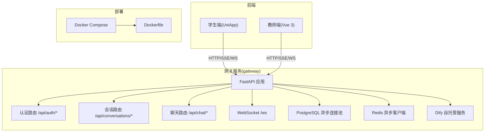
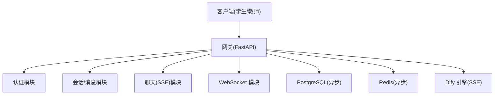
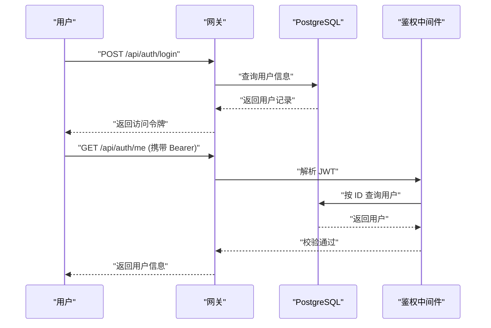
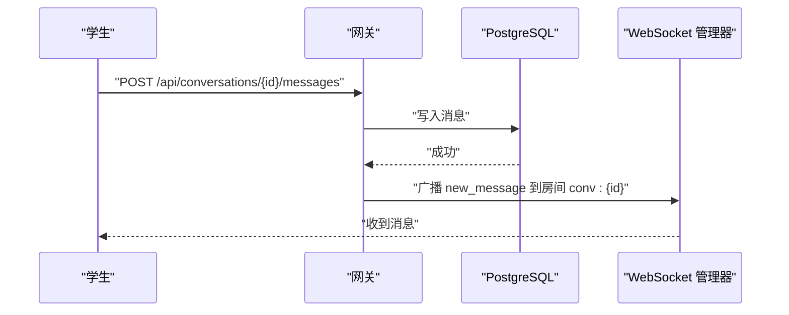
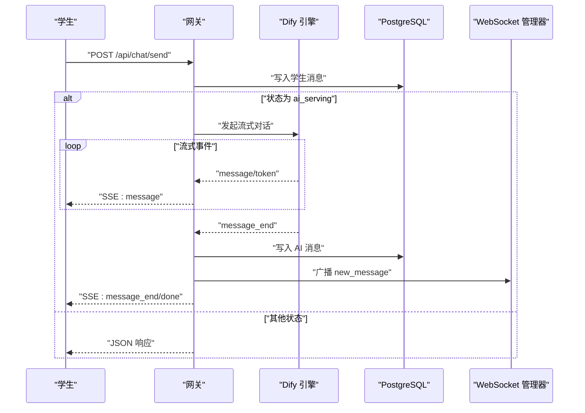
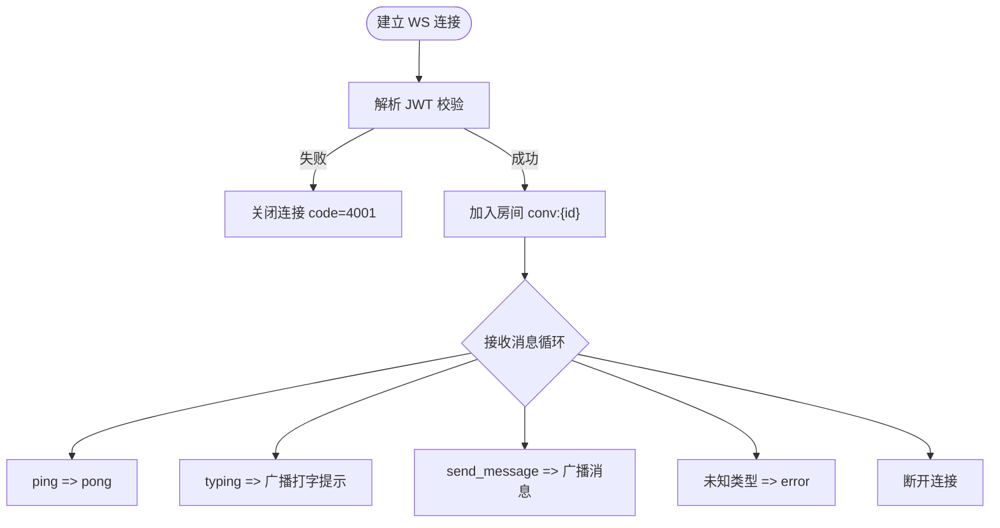
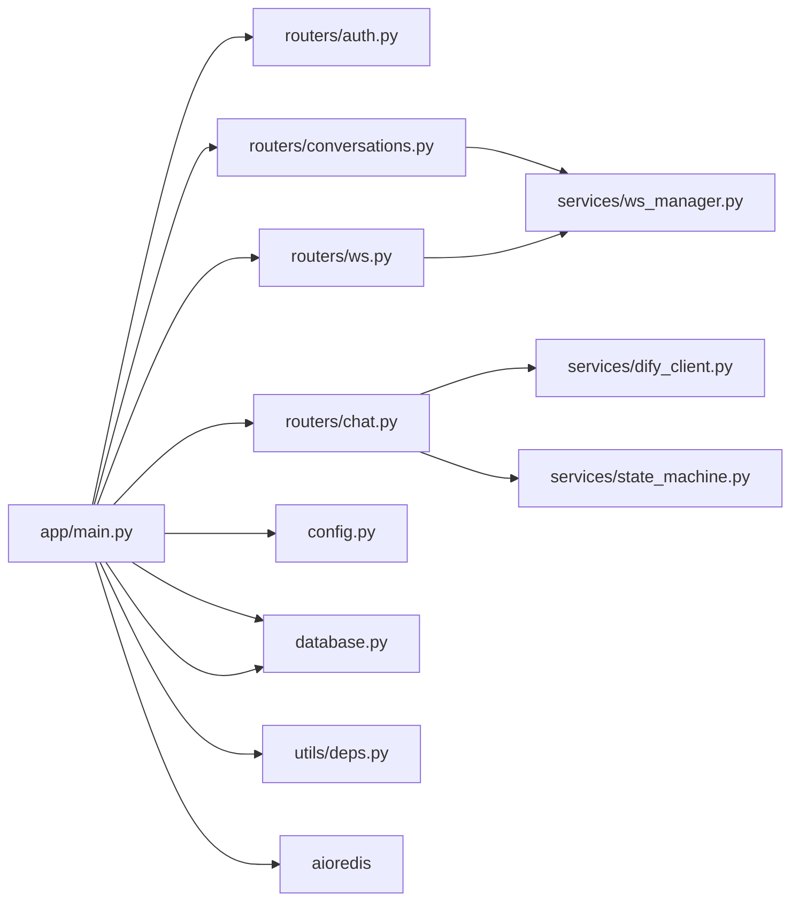

# 性能测试

<cite>
**本文引用的文件**
- [README.md](file://README.md)
- [docker-compose.yml](file://deploy/docker-compose.yml)
- [Dockerfile](file://services/gateway/Dockerfile)
- [requirements.txt](file://services/gateway/requirements.txt)
- [main.py](file://services/gateway/app/main.py)
- [config.py](file://services/gateway/app/config.py)
- [database.py](file://services/gateway/app/database.py)
- [deps.py](file://services/gateway/app/utils/deps.py)
- [auth.py](file://services/gateway/app/routers/auth.py)
- [conversations.py](file://services/gateway/app/routers/conversations.py)
- [chat.py](file://services/gateway/app/routers/chat.py)
- [ws.py](file://services/gateway/app/routers/ws.py)
- [s2-smoke-test.sh](file://scripts/s2-smoke-test.sh)
- [s2-ws-test.py](file://scripts/s2-ws-test.py)
</cite>

## 目录
1. [引言](#引言)
2. [项目结构](#项目结构)
3. [核心组件](#核心组件)
4. [架构总览](#架构总览)
5. [详细组件分析](#详细组件分析)
6. [依赖分析](#依赖分析)
7. [性能考虑](#性能考虑)
8. [故障排查指南](#故障排查指南)
9. [结论](#结论)
10. [附录](#附录)

## 引言
本指南面向“医小管 v2”系统的性能测试与优化，覆盖负载测试、压力测试、并发测试等策略；定义关键性能指标（响应时间、吞吐量、资源利用率等）的测量方法；给出基准测试的实施步骤（环境搭建、测试数据准备、执行与结果分析）；并提供优化建议、瓶颈识别方法与监控告警配置思路。目标是帮助测试与研发团队在真实业务场景下评估系统容量与稳定性，并持续改进。

## 项目结构
- 后端网关采用 FastAPI + SQLAlchemy 异步 ORM + Redis 缓存，容器化部署并通过 Docker Compose 编排。
- 前端为 UniApp（学生端）与 Vue 3（教师端），通过网关统一暴露 REST API 与 WebSocket。
- AI 引擎采用自托管 Dify，网关负责鉴权、会话管理、消息持久化与流式响应转发。

图表来源
- [docker-compose.yml:1-22](file://deploy/docker-compose.yml#L1-L22)
- [Dockerfile:1-14](file://services/gateway/Dockerfile#L1-L14)
- [main.py:1-78](file://services/gateway/app/main.py#L1-L78)
- [requirements.txt:1-29](file://services/gateway/requirements.txt#L1-L29)

章节来源
- [README.md:1-18](file://README.md#L1-L18)
- [docker-compose.yml:1-22](file://deploy/docker-compose.yml#L1-L22)
- [Dockerfile:1-14](file://services/gateway/Dockerfile#L1-L14)
- [requirements.txt:1-29](file://services/gateway/requirements.txt#L1-L29)

## 核心组件
- 应用生命周期与健康检查：应用启动时初始化 Redis 客户端，提供 /health 健康检查，包含数据库、缓存与 Dify 服务连通性探测。
- 认证与鉴权：基于 JWT 的 Bearer 令牌，依赖数据库查询用户信息，校验有效性与激活状态。
- 会话与消息：支持分页列表、消息读取、消息发送（含广播）、状态机流转（S2/S3 阶段）。
- 聊天与流式响应：S2 阶段学生消息写库并广播；S3 阶段引入 Dify 流式 SSE，边生成边推送。
- WebSocket：基于 JWT 认证，支持加入/离开房间、打字提示、心跳 ping/pong、未知类型错误处理。
- 数据库与缓存：异步 SQLAlchemy 引擎，连接池大小可控；Redis 用于会话状态与缓存。

章节来源
- [main.py:16-68](file://services/gateway/app/main.py#L16-L68)
- [deps.py:14-39](file://services/gateway/app/utils/deps.py#L14-L39)
- [auth.py:12-34](file://services/gateway/app/routers/auth.py#L12-L34)
- [conversations.py:21-128](file://services/gateway/app/routers/conversations.py#L21-L128)
- [chat.py:22-191](file://services/gateway/app/routers/chat.py#L22-L191)
- [ws.py:11-119](file://services/gateway/app/routers/ws.py#L11-L119)
- [database.py:6-14](file://services/gateway/app/database.py#L6-L14)
- [config.py:6-28](file://services/gateway/app/config.py#L6-L28)

## 架构总览
系统以“网关层-业务层-存储层-外部引擎”的分层设计运行。网关负责统一入口、鉴权、状态机与消息广播；业务层完成会话与消息的持久化；存储层包含 PostgreSQL（异步）与 Redis；外部引擎为 Dify，提供流式对话能力。

图表来源
- [main.py:70-78](file://services/gateway/app/main.py#L70-L78)
- [chat.py:105-191](file://services/gateway/app/routers/chat.py#L105-L191)
- [ws.py:11-119](file://services/gateway/app/routers/ws.py#L11-L119)

## 详细组件分析

### 认证与鉴权性能要点
- JWT 解析与数据库查询：每次受保护接口均需解析令牌并查询用户状态，存在数据库访问开销。
- 优化建议：
  - 使用 Redis 缓存活跃用户会话或令牌黑名单，降低数据库压力。
  - 对高频端点启用更细粒度的缓存（如用户基本信息）。
  - 合理设置令牌过期时间，平衡安全与鉴权成本。

图表来源
- [auth.py:12-34](file://services/gateway/app/routers/auth.py#L12-L34)
- [deps.py:14-39](file://services/gateway/app/utils/deps.py#L14-L39)

章节来源
- [auth.py:12-34](file://services/gateway/app/routers/auth.py#L12-L34)
- [deps.py:14-39](file://services/gateway/app/utils/deps.py#L14-L39)

### 会话与消息处理性能要点
- 分页查询与消息广播：列表与消息读取支持分页参数控制；消息发送后通过 WebSocket 广播，可能产生多路推送。
- 优化建议：
  - 限制分页大小上限，避免一次性拉取过多数据。
  - 对房间广播进行去重与限速，防止风暴效应。
  - 将消息写入与广播解耦，必要时引入队列异步处理。

图表来源
- [conversations.py:81-128](file://services/gateway/app/routers/conversations.py#L81-L128)

章节来源
- [conversations.py:21-128](file://services/gateway/app/routers/conversations.py#L21-L128)

### 聊天与流式响应性能要点
- SSE 流式输出：S3 阶段引入 Dify 流式响应，边生成边推送到客户端，对网络与服务器带宽要求较高。
- 优化建议：
  - 控制事件节流与缓冲区大小，避免频繁小包。
  - 在网关侧增加超时与重试策略，提升鲁棒性。
  - 对 AI 消息进行去噪与摘要，减少传输体积。

图表来源
- [chat.py:22-191](file://services/gateway/app/routers/chat.py#L22-L191)

章节来源
- [chat.py:22-191](file://services/gateway/app/routers/chat.py#L22-L191)

### WebSocket 性能要点
- 认证与房间管理：基于 JWT 认证，支持加入/离开房间、打字提示、心跳检测与错误处理。
- 优化建议：
  - 限制每个用户的房间数量与并发连接数。
  - 对未知类型消息快速拒绝，避免资源占用。
  - 结合心跳与断线重连策略，提升稳定性。

图表来源
- [ws.py:11-119](file://services/gateway/app/routers/ws.py#L11-L119)

章节来源
- [ws.py:11-119](file://services/gateway/app/routers/ws.py#L11-L119)

## 依赖分析
- 外部依赖：PostgreSQL（异步驱动）、Redis（异步客户端）、Dify（HTTPX SSE）、JWT（python-jose）。
- 内部依赖：路由模块依赖服务层与模型层；服务层依赖数据库与 Redis；WebSocket 管理器依赖 Redis 实现广播。

图表来源
- [main.py:10-14](file://services/gateway/app/main.py#L10-L14)
- [chat.py:14-16](file://services/gateway/app/routers/chat.py#L14-L16)
- [conversations.py:16-16](file://services/gateway/app/routers/conversations.py#L16-L16)
- [ws.py:2-4](file://services/gateway/app/routers/ws.py#L2-L4)

章节来源
- [requirements.txt:1-29](file://services/gateway/requirements.txt#L1-L29)
- [main.py:1-78](file://services/gateway/app/main.py#L1-L78)

## 性能考虑
- 关键指标定义与测量
  - 响应时间：端到端请求耗时（P50/P90/P95），区分认证、会话、消息、聊天（SSE）、WS 等路径。
  - 吞吐量：每秒请求数（QPS），按路由维度统计。
  - 资源利用率：CPU、内存、网络、磁盘 IO；数据库连接池使用率、Redis 命中率。
  - 错误率：4xx/5xx 比例与错误分布（认证失败、会话不存在、状态不允许等）。
- 测试策略
  - 负载测试：逐步提升并发用户数，观察响应时间与错误率拐点。
  - 压力测试：超过峰值容量，验证系统退化行为与恢复能力。
  - 并发测试：重点验证 WebSocket 房间广播、消息写入与 Dify 流式响应的并发稳定性。
- 基准测试实施步骤
  - 环境搭建：使用 Docker Compose 启动网关、数据库与缓存；确保 Dify 可达。
  - 测试数据准备：准备若干学生/教师账号与会话数据，预热数据库索引。
  - 执行流程：先冒烟脚本验证链路，再执行性能脚本（可参考现有脚本结构扩展）。
  - 结果分析：对比不同并发下的指标变化，定位瓶颈（数据库、缓存、Dify、WS）。
- 优化建议
  - 数据库：调整连接池大小、索引优化、慢查询分析；对热点表分片或只读副本。
  - 缓存：热点数据预热、合理过期策略、降级回源策略。
  - 网关：启用压缩、限流与熔断；优化路由与中间件链路。
  - WebSocket：连接数与房间数限制、心跳与断线重连、广播去重。
  - Dify：连接池与超时配置、重试与降级策略、日志采样。
- 监控与告警
  - 指标采集：Prometheus/Grafana 或云监控，覆盖 CPU/内存/IO、QPS/响应时间、错误率、数据库/Redis 指标。
  - 告警阈值：针对 P95 响应时间、错误率、连接池饱和、Dify 超时等设置阈值。
  - 日志：结构化日志，关键路径埋点（鉴权、消息写入、Dify 流式、WS 广播）。

章节来源
- [s2-smoke-test.sh:1-130](file://scripts/s2-smoke-test.sh#L1-L130)
- [s2-ws-test.py:1-51](file://scripts/s2-ws-test.py#L1-L51)
- [docker-compose.yml:1-22](file://deploy/docker-compose.yml#L1-L22)
- [database.py:6-7](file://services/gateway/app/database.py#L6-L7)

## 故障排查指南
- 健康检查异常
  - 现象：/health 返回 degraded。
  - 排查：检查数据库连通性、Redis ping、Dify 参数端点可达性。
- 认证失败
  - 现象：401 未授权。
  - 排查：确认 JWT 有效、用户存在且激活、令牌未过期。
- 会话不存在或状态不允许
  - 现象：404/403。
  - 排查：确认会话 ID、用户权限、状态机流转是否符合预期。
- Dify 流式异常
  - 现象：SSE 中途断开或报错。
  - 排查：检查 Dify 服务可用性、网络延迟、超时与重试配置。
- WebSocket 断开
  - 现象：连接被关闭或无法加入房间。
  - 排查：确认 JWT 有效、房间 ID、未知消息类型、心跳超时。

章节来源
- [main.py:30-68](file://services/gateway/app/main.py#L30-L68)
- [deps.py:19-35](file://services/gateway/app/utils/deps.py#L19-L35)
- [conversations.py:94-100](file://services/gateway/app/routers/conversations.py#L94-L100)
- [chat.py:150-153](file://services/gateway/app/routers/chat.py#L150-L153)
- [ws.py:40-42](file://services/gateway/app/routers/ws.py#L40-L42)

## 结论
通过对“医小管 v2”网关层的性能测试与优化，可在保障用户体验的前提下提升系统容量与稳定性。建议以冒烟测试为基础，结合负载/压力/并发测试，围绕数据库、缓存、Dify 与 WebSocket 四大瓶颈维度持续优化，并建立完善的监控与告警体系，确保线上问题可发现、可定位、可恢复。

## 附录
- 环境变量与配置
  - 数据库连接串、Redis 地址、Dify API 地址与密钥、JWT 密钥与算法。
- 部署与编排
  - 使用 Docker Compose 启动，端口映射与网络配置需注意与历史版本隔离。
- 现有脚本参考
  - 冒烟测试脚本与 WebSocket 测试脚本可用于构建自动化测试框架的基础用例。

章节来源
- [config.py:6-28](file://services/gateway/app/config.py#L6-L28)
- [docker-compose.yml:11-16](file://deploy/docker-compose.yml#L11-L16)
- [s2-smoke-test.sh:1-130](file://scripts/s2-smoke-test.sh#L1-L130)
- [s2-ws-test.py:1-51](file://scripts/s2-ws-test.py#L1-L51)