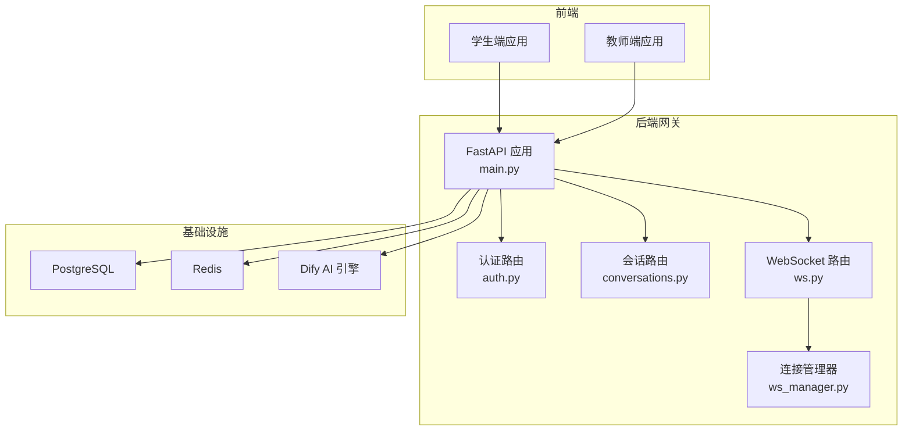
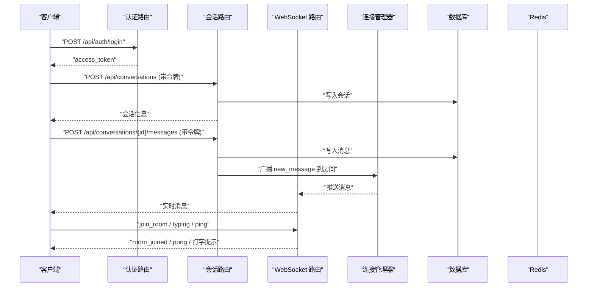
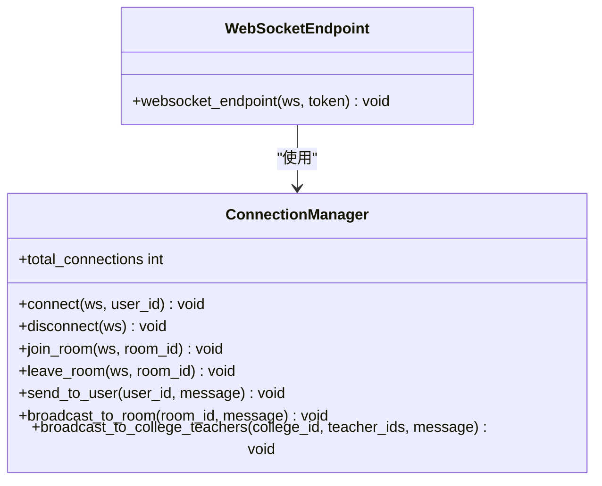
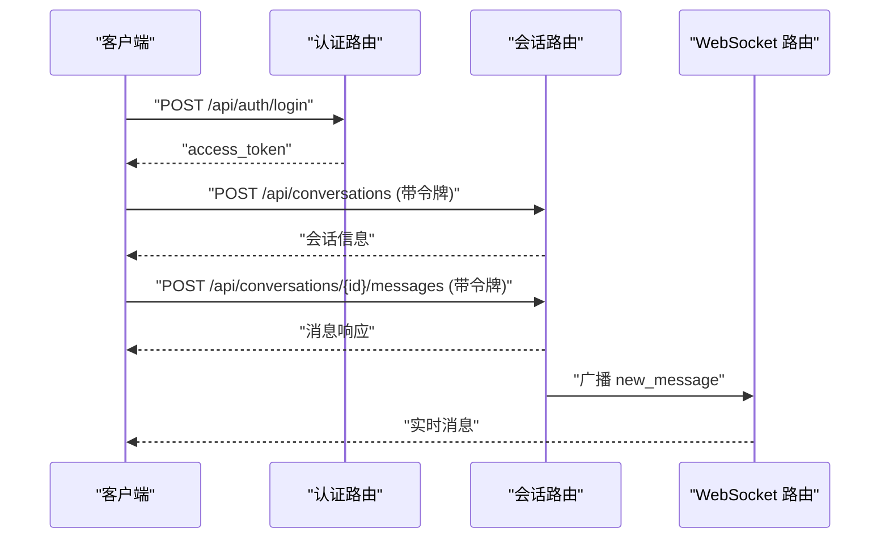
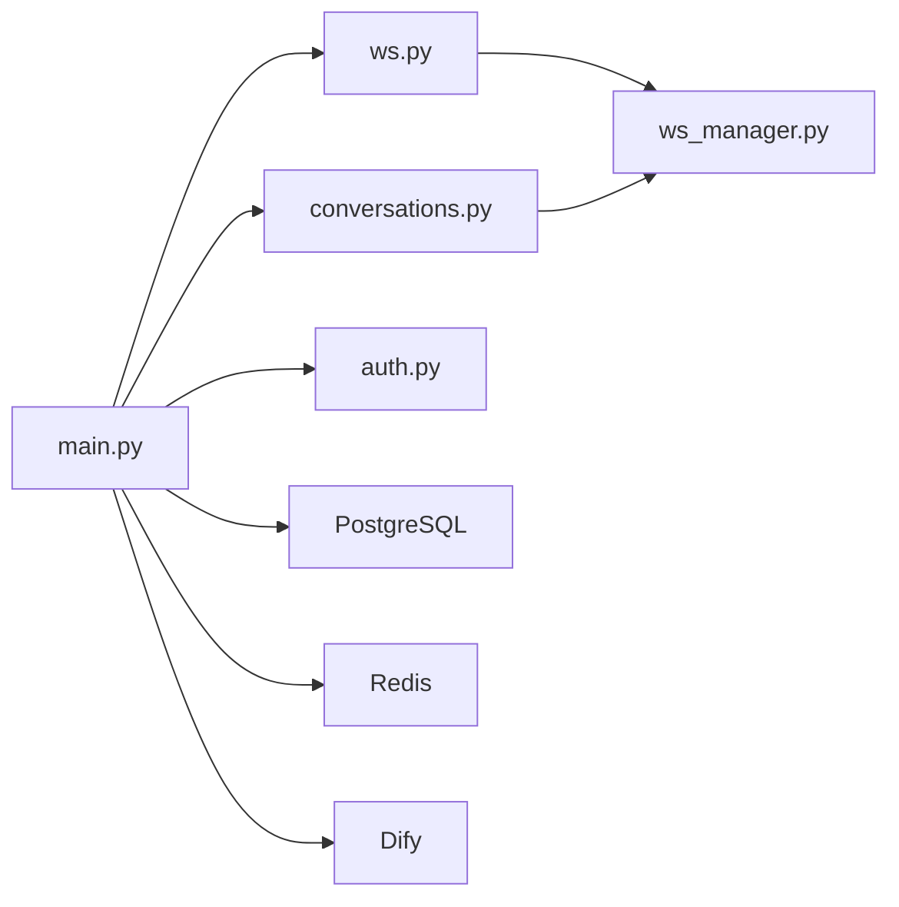

# 测试策略

<cite>
**本文引用的文件**
- [README.md](file://README.md)
- [test_login.py](file://test_login.py)
- [ws_test.py](file://ws_test.py)
- [scripts/s2-ws-test.py](file://scripts/s2-ws-test.py)
- [scripts/s2-smoke-test.sh](file://scripts/s2-smoke-test.sh)
- [services/gateway/app/main.py](file://services/gateway/app/main.py)
- [services/gateway/app/routers/ws.py](file://services/gateway/app/routers/ws.py)
- [services/gateway/app/services/ws_manager.py](file://services/gateway/app/services/ws_manager.py)
- [services/gateway/app/utils/jwt.py](file://services/gateway/app/utils/jwt.py)
- [services/gateway/app/routers/auth.py](file://services/gateway/app/routers/auth.py)
- [services/gateway/app/routers/conversations.py](file://services/gateway/app/routers/conversations.py)
- [deploy/docker-compose.yml](file://deploy/docker-compose.yml)
- [apps/student-app/package.json](file://apps/student-app/package.json)
- [apps/teacher-app/package.json](file://apps/teacher-app/package.json)
</cite>

## 目录
1. [引言](#引言)
2. [项目结构](#项目结构)
3. [核心组件](#核心组件)
4. [架构总览](#架构总览)
5. [详细组件分析](#详细组件分析)
6. [依赖关系分析](#依赖关系分析)
7. [性能考量](#性能考量)
8. [故障排查指南](#故障排查指南)
9. [结论](#结论)
10. [附录](#附录)

## 引言
本文件为“医小管 v2”项目的测试策略文档，围绕测试金字塔（单元测试、集成测试、端到端测试）展开，结合现有脚本与后端路由实现，给出 WebSocket 实时通信测试方法、API 接口测试指南、测试环境搭建与管理、自动化测试与持续集成流程建议，以及测试覆盖率与质量保证措施。

## 项目结构
- 后端网关采用 FastAPI，提供认证、会话与聊天、WebSocket 等接口，并通过健康检查对外暴露依赖连通性。
- 前端包含学生端与教师端应用，基于 UniApp/Vue3 构建，前端测试能力可通过官方生态进行扩展。
- 部署使用 Docker Compose 将网关容器化，便于快速搭建测试环境。

图表来源
- [services/gateway/app/main.py:1-78](file://services/gateway/app/main.py#L1-L78)
- [services/gateway/app/routers/auth.py:1-35](file://services/gateway/app/routers/auth.py#L1-L35)
- [services/gateway/app/routers/conversations.py:1-129](file://services/gateway/app/routers/conversations.py#L1-L129)
- [services/gateway/app/routers/ws.py:1-119](file://services/gateway/app/routers/ws.py#L1-L119)
- [services/gateway/app/services/ws_manager.py:1-100](file://services/gateway/app/services/ws_manager.py#L1-L100)

章节来源
- [README.md:1-18](file://README.md#L1-L18)
- [deploy/docker-compose.yml:1-22](file://deploy/docker-compose.yml#L1-L22)

## 核心组件
- 认证与用户信息：提供登录与当前用户信息查询，返回访问令牌用于后续请求鉴权。
- 会话与消息：支持创建会话、分页列出会话、获取会话详情、分页获取消息、发送消息；消息发送后通过 WebSocket 广播。
- WebSocket：基于 JWT 认证，支持加入/离开房间、打字提示、心跳 ping/pong、未知类型消息返回错误；连接断开与异常处理完善。
- 连接管理器：维护用户连接与房间连接映射，支持按用户推送与房间广播，具备断线清理能力。

章节来源
- [services/gateway/app/routers/auth.py:1-35](file://services/gateway/app/routers/auth.py#L1-L35)
- [services/gateway/app/routers/conversations.py:1-129](file://services/gateway/app/routers/conversations.py#L1-L129)
- [services/gateway/app/routers/ws.py:1-119](file://services/gateway/app/routers/ws.py#L1-L119)
- [services/gateway/app/services/ws_manager.py:1-100](file://services/gateway/app/services/ws_manager.py#L1-L100)
- [services/gateway/app/utils/jwt.py:1-17](file://services/gateway/app/utils/jwt.py#L1-L17)

## 架构总览
下图展示从客户端到后端网关、数据库与缓存的关键交互路径，以及 WebSocket 的实时广播机制。

图表来源
- [services/gateway/app/routers/auth.py:1-35](file://services/gateway/app/routers/auth.py#L1-L35)
- [services/gateway/app/routers/conversations.py:1-129](file://services/gateway/app/routers/conversations.py#L1-L129)
- [services/gateway/app/routers/ws.py:1-119](file://services/gateway/app/routers/ws.py#L1-L119)
- [services/gateway/app/services/ws_manager.py:1-100](file://services/gateway/app/services/ws_manager.py#L1-L100)

## 详细组件分析

### 测试金字塔与实施策略
- 单元测试（Unit Tests）
  - 目标：验证核心业务逻辑与工具函数的正确性，如 JWT 编解码、消息广播、房间加入/离开等。
  - 建议：针对 ws_manager 的广播与用户映射、jwt 工具函数编写独立单元测试，确保边界条件与异常分支覆盖。
  - 章节来源
    - [services/gateway/app/services/ws_manager.py:1-100](file://services/gateway/app/services/ws_manager.py#L1-L100)
    - [services/gateway/app/utils/jwt.py:1-17](file://services/gateway/app/utils/jwt.py#L1-L17)

- 集成测试（Integration Tests）
  - 目标：验证路由与数据库、缓存、外部服务的协同工作，如认证登录、会话创建与消息发送、WebSocket 连接与广播。
  - 建议：使用 FastAPI 的 TestClient 或 httpx.AsyncClient 对路由进行集成测试；对 WS 使用 websockets 库模拟连接与消息收发。
  - 章节来源
    - [services/gateway/app/main.py:1-78](file://services/gateway/app/main.py#L1-L78)
    - [services/gateway/app/routers/auth.py:1-35](file://services/gateway/app/routers/auth.py#L1-L35)
    - [services/gateway/app/routers/conversations.py:1-129](file://services/gateway/app/routers/conversations.py#L1-L129)
    - [services/gateway/app/routers/ws.py:1-119](file://services/gateway/app/routers/ws.py#L1-L119)

- 端到端测试（E2E）
  - 目标：模拟真实用户场景，覆盖完整业务流，如学生登录、创建会话、发送消息、教师接收与回复、 escalate/accept/resolve 状态流转。
  - 建议：基于现有脚本扩展为 E2E 测试套件，结合 Docker Compose 启动环境，使用 curl 或 httpx 进行顺序编排。
  - 章节来源
    - [scripts/s2-smoke-test.sh:1-130](file://scripts/s2-smoke-test.sh#L1-L130)
    - [test_login.py:1-52](file://test_login.py#L1-L52)

### WebSocket 实时通信测试
- 连接测试
  - 使用 websockets 库连接 ws://localhost:8100/ws?token={token}，验证握手成功与心跳 ping/pong。
  - 章节来源
    - [ws_test.py:1-9](file://ws_test.py#L1-L9)
    - [scripts/s2-ws-test.py:1-51](file://scripts/s2-ws-test.py#L1-L51)

- 消息传递测试
  - 加入房间：发送 join_room，期望收到 room_joined。
  - 打字提示：发送 typing，期望收到对应角色的 typing 事件。
  - 新消息广播：发送 send_message，期望房间内其他连接收到 new_message。
  - 章节来源
    - [services/gateway/app/routers/ws.py:1-119](file://services/gateway/app/routers/ws.py#L1-L119)
    - [services/gateway/app/services/ws_manager.py:1-100](file://services/gateway/app/services/ws_manager.py#L1-L100)

- 并发与稳定性测试
  - 多连接并发：多个客户端同时加入同一房间，验证广播一致性与去重。
  - 断线恢复：模拟网络抖动后重连，验证房间状态与消息补发策略。
  - 异常处理：未知消息类型返回 error；无效 token 主动关闭连接。
  - 章节来源
    - [services/gateway/app/routers/ws.py:1-119](file://services/gateway/app/routers/ws.py#L1-L119)

- WebSocket 类图

图表来源
- [services/gateway/app/services/ws_manager.py:1-100](file://services/gateway/app/services/ws_manager.py#L1-L100)
- [services/gateway/app/routers/ws.py:1-119](file://services/gateway/app/routers/ws.py#L1-L119)

### API 接口测试指南
- 功能测试
  - 登录与鉴权：POST /api/auth/login 返回 access_token；GET /api/auth/me 验证令牌有效性。
  - 会话管理：POST /api/conversations 创建会话；GET /api/conversations 分页查询；GET /api/conversations/{id} 获取详情。
  - 消息管理：GET /api/conversations/{id}/messages 分页获取；POST /api/conversations/{id}/messages 发送消息。
  - 章节来源
    - [services/gateway/app/routers/auth.py:1-35](file://services/gateway/app/routers/auth.py#L1-L35)
    - [services/gateway/app/routers/conversations.py:1-129](file://services/gateway/app/routers/conversations.py#L1-L129)

- 性能测试
  - 压力与并发：对 /api/chat、/api/conversations/{id}/messages 等高频接口进行并发压测，关注响应时间与错误率。
  - WebSocket 广播：统计房间内 N 个连接的广播延迟与丢包率。
  - 章节来源
    - [services/gateway/app/routers/conversations.py:1-129](file://services/gateway/app/routers/conversations.py#L1-L129)
    - [services/gateway/app/routers/ws.py:1-119](file://services/gateway/app/routers/ws.py#L1-L119)

- 安全测试
  - 令牌泄露防护：验证 /api/auth/me 在无令牌或无效令牌时返回 401/403。
  - 权限控制：教师仅能回复其正在服务的会话；状态机非法转换应返回 409。
  - JWT 校验：伪造或过期令牌应被拒绝。
  - 章节来源
    - [services/gateway/app/routers/conversations.py:1-129](file://services/gateway/app/routers/conversations.py#L1-L129)
    - [services/gateway/app/utils/jwt.py:1-17](file://services/gateway/app/utils/jwt.py#L1-L17)

- API 调用序列图（示例：登录与发送消息）

图表来源
- [services/gateway/app/routers/auth.py:1-35](file://services/gateway/app/routers/auth.py#L1-L35)
- [services/gateway/app/routers/conversations.py:1-129](file://services/gateway/app/routers/conversations.py#L1-L129)
- [services/gateway/app/routers/ws.py:1-119](file://services/gateway/app/routers/ws.py#L1-L119)

### 测试环境搭建与管理
- 本地启动
  - 使用 Docker Compose 启动网关服务，默认监听 8100 端口，连接宿主机上的 PostgreSQL 与 Redis。
  - 章节来源
    - [deploy/docker-compose.yml:1-22](file://deploy/docker-compose.yml#L1-L22)

- 测试数据准备
  - 使用现有脚本进行冒烟测试，验证登录、会话创建、消息发送、状态流转等关键路径。
  - 章节来源
    - [scripts/s2-smoke-test.sh:1-130](file://scripts/s2-smoke-test.sh#L1-L130)
    - [test_login.py:1-52](file://test_login.py#L1-L52)

- 前端测试工具配置
  - 学生端与教师端 package.json 中包含 uni-automator 等开发依赖，可用于前端自动化测试与 UI 回归。
  - 章节来源
    - [apps/student-app/package.json:1-37](file://apps/student-app/package.json#L1-L37)
    - [apps/teacher-app/package.json:1-46](file://apps/teacher-app/package.json#L1-L46)

### 自动化测试与持续集成
- 建议流水线阶段
  - 代码检查：类型检查、静态分析。
  - 单元测试：覆盖 ws_manager 与 jwt 工具。
  - 集成测试：使用 TestClient 或 httpx 对路由进行测试。
  - 端到端测试：基于 s2-smoke-test.sh 与 s2-ws-test.py 的逻辑封装为 CI 可执行任务。
  - 健康检查：/health 接口验证数据库、缓存、AI 引擎连通性。
  - 章节来源
    - [services/gateway/app/main.py:1-78](file://services/gateway/app/main.py#L1-L78)

- 覆盖率与质量门禁
  - 使用 pytest-cov 或 coverage.py 收集后端覆盖率，设置阈值门禁。
  - 前端覆盖率可通过 Vite/UniApp 生态工具收集。
  - 章节来源
    - [apps/student-app/package.json:1-37](file://apps/student-app/package.json#L1-L37)
    - [apps/teacher-app/package.json:1-46](file://apps/teacher-app/package.json#L1-L46)

### 测试覆盖率分析与质量保证
- 后端覆盖率建议指标
  - 行覆盖率 ≥ 80%，分支覆盖率 ≥ 60%。
  - 关键路径：JWT 解码、房间广播、错误处理、状态机转换。
- 前端覆盖率建议指标
  - 组件与工具函数覆盖率 ≥ 70%，UI 回归用例 ≥ 90%。
- 质量门禁
  - 未达标的 PR 禁止合并；阻塞性问题必须修复后再合入。

## 依赖关系分析
- 组件耦合
  - WebSocket 路由依赖连接管理器；会话路由在写入消息后触发 WS 广播，形成跨模块协作。
- 外部依赖
  - PostgreSQL、Redis、Dify AI 引擎；健康检查统一验证依赖可用性。
- 依赖图

图表来源
- [services/gateway/app/main.py:1-78](file://services/gateway/app/main.py#L1-L78)
- [services/gateway/app/routers/ws.py:1-119](file://services/gateway/app/routers/ws.py#L1-L119)
- [services/gateway/app/services/ws_manager.py:1-100](file://services/gateway/app/services/ws_manager.py#L1-L100)
- [services/gateway/app/routers/conversations.py:1-129](file://services/gateway/app/routers/conversations.py#L1-L129)
- [services/gateway/app/routers/auth.py:1-35](file://services/gateway/app/routers/auth.py#L1-L35)

## 性能考量
- 数据库与缓存
  - 优化分页查询参数范围，避免超大页大小导致内存压力。
  - 对热点会话房间使用 Redis 缓存消息索引，降低数据库压力。
- WebSocket
  - 控制广播频率与消息体大小，避免拥塞；对异常连接及时清理。
- API
  - 对高频接口启用限流与熔断，保护下游依赖。

## 故障排查指南
- 常见问题定位
  - 401/403：检查令牌是否有效、角色权限是否匹配。
  - 404：确认资源 ID 是否存在。
  - 409：状态机非法转换，需先完成前置动作。
  - WS 连接被关闭：检查 token 是否有效、房间是否存在。
- 健康检查
  - /health 返回 degraded 时，逐项检查数据库、缓存、AI 引擎连通性。
- 章节来源
  - [services/gateway/app/main.py:30-68](file://services/gateway/app/main.py#L30-L68)
  - [services/gateway/app/routers/conversations.py:1-129](file://services/gateway/app/routers/conversations.py#L1-L129)
  - [services/gateway/app/routers/ws.py:1-119](file://services/gateway/app/routers/ws.py#L1-L119)

## 结论
通过测试金字塔分层、以现有脚本为基础扩展自动化测试、结合 Docker Compose 快速搭建环境，并在 CI 中引入覆盖率与质量门禁，可系统性提升医小管 v2 的质量与交付效率。WebSocket 与 API 的测试重点在于认证、权限、广播一致性与异常处理，建议持续完善测试用例并纳入回归流程。

## 附录
- 现有脚本参考
  - 登录与消息链路：[test_login.py:1-52](file://test_login.py#L1-L52)
  - WebSocket 冒烟测试：[scripts/s2-ws-test.py:1-51](file://scripts/s2-ws-test.py#L1-L51)
  - 端到端冒烟脚本：[scripts/s2-smoke-test.sh:1-130](file://scripts/s2-smoke-test.sh#L1-L130)
- 健康检查与路由挂载
  - [services/gateway/app/main.py:1-78](file://services/gateway/app/main.py#L1-L78)
- WebSocket 协议与消息类型
  - [services/gateway/app/routers/ws.py:1-119](file://services/gateway/app/routers/ws.py#L1-L119)