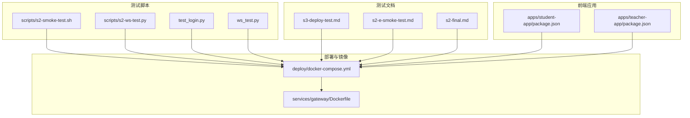
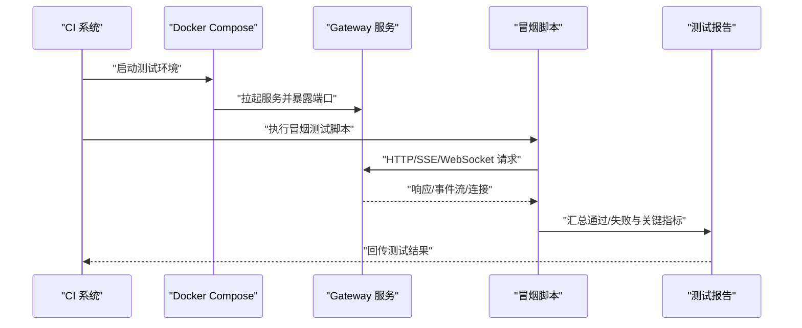
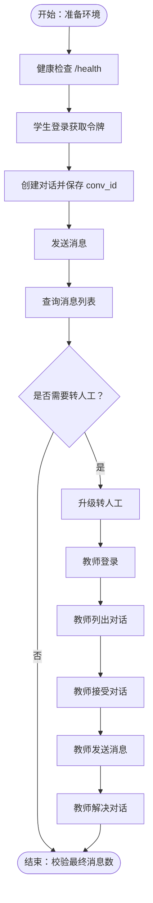
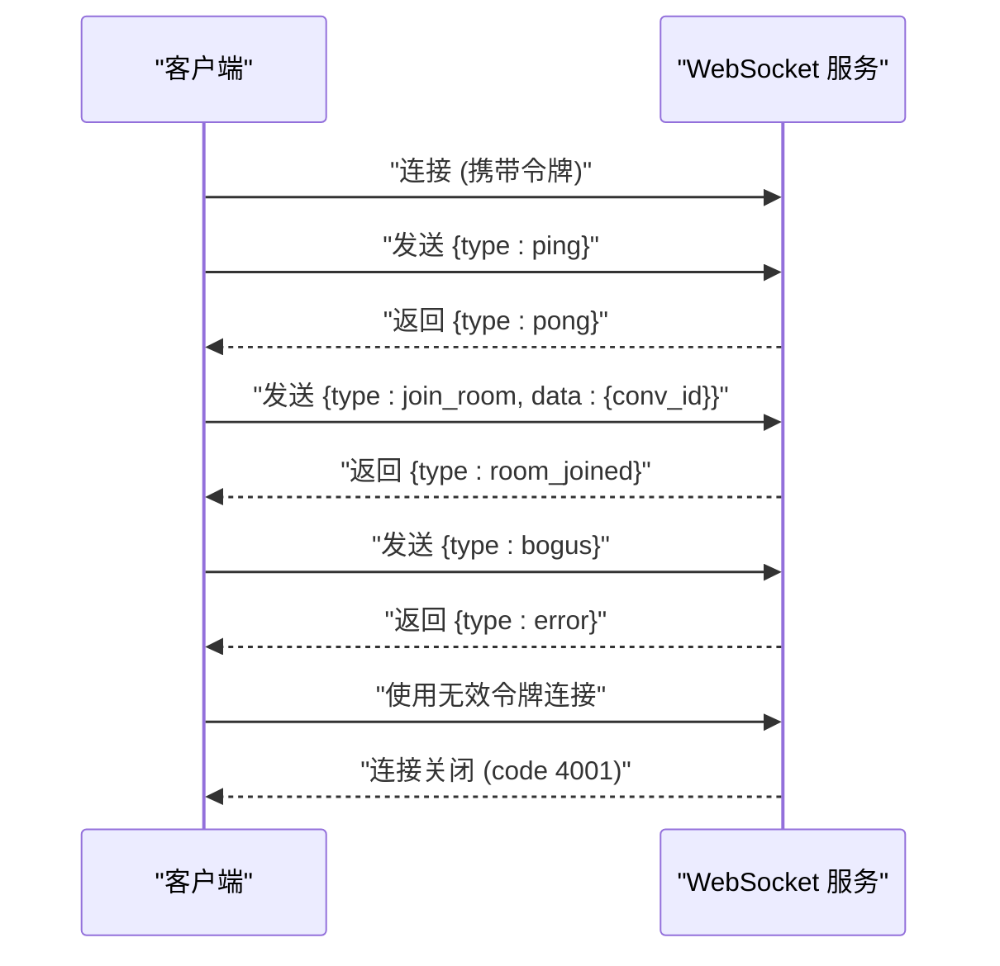
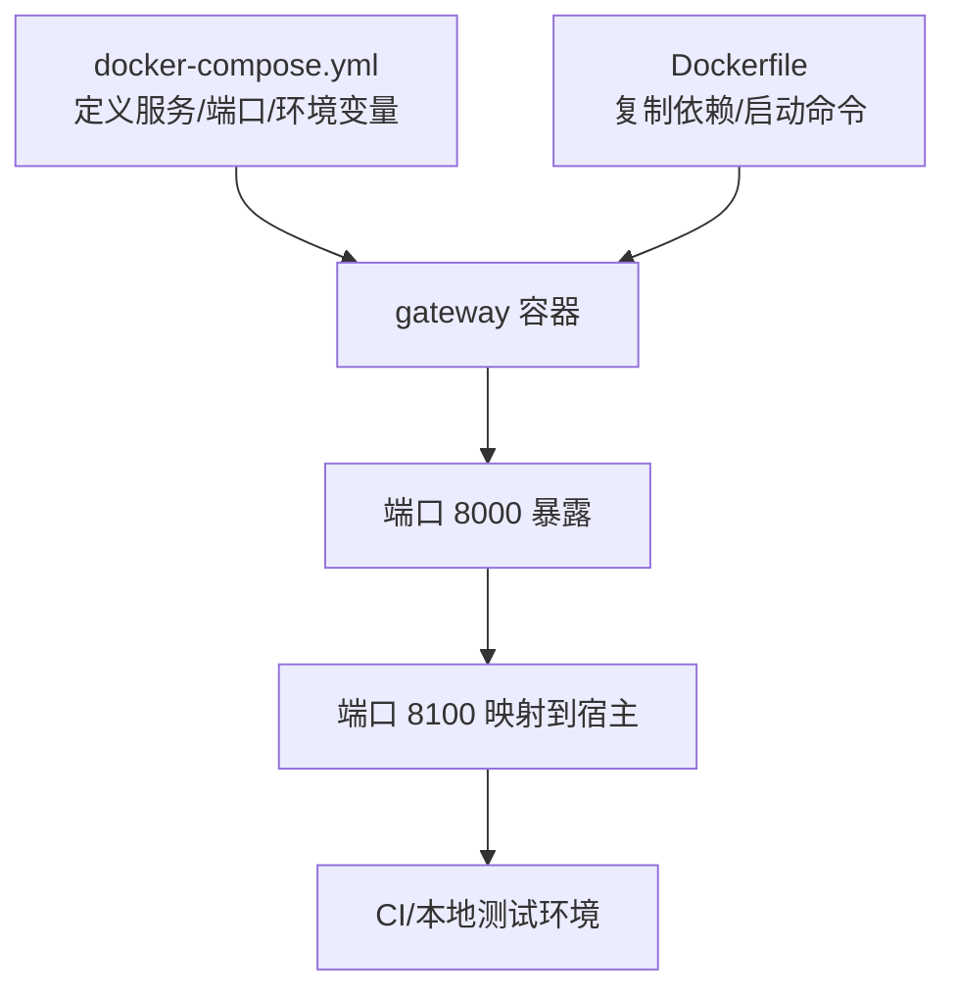
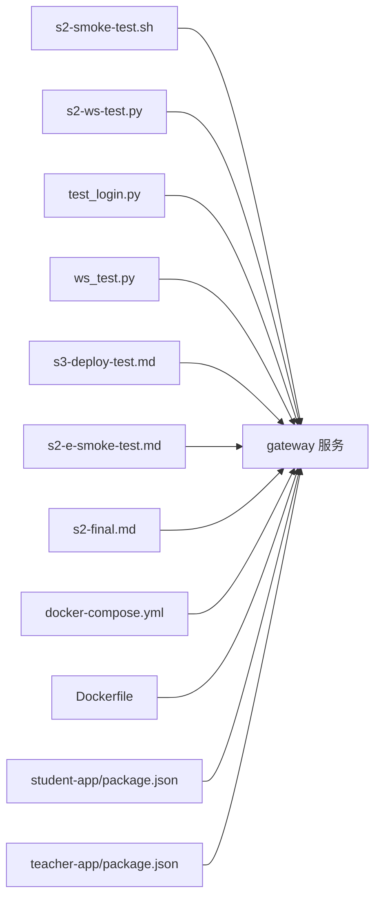

# 自动化测试

<cite>
**本文引用的文件**
- [README.md](file://README.md)
- [scripts/s2-smoke-test.sh](file://scripts/s2-smoke-test.sh)
- [scripts/s2-ws-test.py](file://scripts/s2-ws-test.py)
- [test_login.py](file://test_login.py)
- [ws_test.py](file://ws_test.py)
- [s3-deploy-test.md](file://s3-deploy-test.md)
- [s2-e-smoke-test.md](file://s2-e-smoke-test.md)
- [s2-final.md](file://s2-final.md)
- [deploy/docker-compose.yml](file://deploy/docker-compose.yml)
- [services/gateway/Dockerfile](file://services/gateway/Dockerfile)
- [apps/student-app/package.json](file://apps/student-app/package.json)
- [apps/teacher-app/package.json](file://apps/teacher-app/package.json)
</cite>

## 目录
1. [引言](#引言)
2. [项目结构](#项目结构)
3. [核心组件](#核心组件)
4. [架构总览](#架构总览)
5. [详细组件分析](#详细组件分析)
6. [依赖关系分析](#依赖关系分析)
7. [性能考虑](#性能考虑)
8. [故障排查指南](#故障排查指南)
9. [结论](#结论)
10. [附录](#附录)

## 引言
本实施文档面向“医小管 v2”项目的持续集成与自动化测试，聚焦以下目标：
- 在持续集成中落地测试流程：自动化测试脚本、测试环境自动搭建、测试报告生成与分析。
- 实现冒烟测试自动化：服务可用性检查、核心功能验证、部署后验证。
- 测试任务的调度与管理：定时测试、触发测试、并行测试策略。
- 测试数据的自动化管理与测试环境的版本控制。

文档基于仓库现有脚本与说明文件进行梳理，并给出可操作的实践建议与可视化图示，帮助团队在 CI 中稳定运行自动化测试。

## 项目结构
围绕自动化测试的关键目录与文件如下：
- 脚本层：scripts/ 下包含冒烟测试与 WebSocket 测试脚本，用于端到端验证。
- 文档层：s3-deploy-test.md、s2-e-smoke-test.md、s2-final.md 等，描述测试步骤、期望结果与环境准备。
- 部署层：deploy/docker-compose.yml 定义容器化网关服务；services/gateway/Dockerfile 定义后端镜像构建。
- 前端应用：apps/student-app、apps/teacher-app 的 package.json 展示前端工程化与测试相关依赖（如 uni-automator）。
- 后端服务：services/gateway 提供 API、WebSocket、认证与会话管理等能力，是测试的主要对象。

图表来源
- [deploy/docker-compose.yml:1-22](file://deploy/docker-compose.yml#L1-L22)
- [services/gateway/Dockerfile:1-14](file://services/gateway/Dockerfile#L1-L14)
- [scripts/s2-smoke-test.sh:1-130](file://scripts/s2-smoke-test.sh#L1-L130)
- [scripts/s2-ws-test.py:1-51](file://scripts/s2-ws-test.py#L1-L51)
- [test_login.py:1-52](file://test_login.py#L1-L52)
- [ws_test.py:1-9](file://ws_test.py#L1-L9)
- [s3-deploy-test.md:1-75](file://s3-deploy-test.md#L1-L75)
- [s2-e-smoke-test.md:1-48](file://s2-e-smoke-test.md#L1-L48)
- [s2-final.md:1-38](file://s2-final.md#L1-L38)
- [apps/student-app/package.json:1-37](file://apps/student-app/package.json#L1-L37)
- [apps/teacher-app/package.json:1-46](file://apps/teacher-app/package.json#L1-L46)

章节来源
- [README.md:1-18](file://README.md#L1-L18)
- [deploy/docker-compose.yml:1-22](file://deploy/docker-compose.yml#L1-L22)
- [services/gateway/Dockerfile:1-14](file://services/gateway/Dockerfile#L1-L14)

## 核心组件
- 冒烟测试脚本（HTTP/SSE/状态机）
  - scripts/s2-smoke-test.sh：覆盖登录、用户信息、对话创建、消息收发、升级转人工、教师接管与解决等完整链路，包含错误场景校验。
  - test_login.py：以 httpx 为基础的简化版冒烟流程，便于在 CI 中直接调用。
- WebSocket 冒烟测试
  - scripts/s2-ws-test.py：验证 ping/pong、加入房间、未知类型处理、无效令牌关闭等行为。
  - ws_test.py：最小化 WebSocket ping/pong验证，便于快速回归。
- 部署与环境准备
  - deploy/docker-compose.yml：定义网关服务端口映射、环境变量与外部依赖连接。
  - services/gateway/Dockerfile：后端镜像构建与启动命令。
- 前端测试基础
  - apps/student-app/package.json、apps/teacher-app/package.json：包含 uni-automator 等前端自动化测试依赖，可用于 UI 回归与端到端测试。

章节来源
- [scripts/s2-smoke-test.sh:1-130](file://scripts/s2-smoke-test.sh#L1-L130)
- [test_login.py:1-52](file://test_login.py#L1-L52)
- [scripts/s2-ws-test.py:1-51](file://scripts/s2-ws-test.py#L1-L51)
- [ws_test.py:1-9](file://ws_test.py#L1-L9)
- [deploy/docker-compose.yml:1-22](file://deploy/docker-compose.yml#L1-L22)
- [services/gateway/Dockerfile:1-14](file://services/gateway/Dockerfile#L1-L14)
- [apps/student-app/package.json:1-37](file://apps/student-app/package.json#L1-L37)
- [apps/teacher-app/package.json:1-46](file://apps/teacher-app/package.json#L1-L46)

## 架构总览
下图展示自动化测试在 CI 中的典型执行路径：CI 触发 → 拉起测试环境 → 执行冒烟脚本 → 产出测试报告。

图表来源
- [deploy/docker-compose.yml:1-22](file://deploy/docker-compose.yml#L1-L22)
- [scripts/s2-smoke-test.sh:1-130](file://scripts/s2-smoke-test.sh#L1-L130)
- [scripts/s2-ws-test.py:1-51](file://scripts/s2-ws-test.py#L1-L51)

## 详细组件分析

### 组件一：冒烟测试脚本（HTTP/SSE/状态机）
- 功能要点
  - 登录与鉴权：学生与教师分别登录，获取访问令牌。
  - 会话生命周期：创建对话、发送消息、查询消息列表、状态机推进（升级转人工、教师接管、解决）。
  - 错误场景：错误密码返回码校验、已解决状态下不允许再次升级。
  - SSE 关键路径：AI 对话应产生多事件流（消息、消息结束、完成），并与数据库落库一致。
- 可靠性保障
  - 步骤间保存令牌与资源 ID，避免跨步骤状态丢失。
  - 使用 curl 或 httpx，确保在 CI 中可稳定运行。
- 可扩展性
  - 将关键参数（staff_id、密码、内容）抽取为配置或环境变量，便于不同环境复用。

图表来源
- [scripts/s2-smoke-test.sh:1-130](file://scripts/s2-smoke-test.sh#L1-L130)
- [s3-deploy-test.md:30-72](file://s3-deploy-test.md#L30-L72)

章节来源
- [scripts/s2-smoke-test.sh:1-130](file://scripts/s2-smoke-test.sh#L1-L130)
- [test_login.py:1-52](file://test_login.py#L1-L52)
- [s3-deploy-test.md:30-72](file://s3-deploy-test.md#L30-L72)

### 组件二：WebSocket 冒烟测试
- 功能要点
  - 连接建立：携带有效令牌连接 ws://localhost:8100/ws。
  - 心跳机制：发送 ping，接收 pong。
  - 房间加入：join_room 成功返回 room_joined。
  - 错误处理：未知消息类型返回 error；无效令牌导致连接被关闭。
- 可靠性保障
  - 使用超时等待，避免阻塞；对异常连接关闭做兼容处理。
  - 与 HTTP 冒烟测试配合，覆盖实时通信链路。

图表来源
- [scripts/s2-ws-test.py:1-51](file://scripts/s2-ws-test.py#L1-L51)
- [ws_test.py:1-9](file://ws_test.py#L1-L9)

章节来源
- [scripts/s2-ws-test.py:1-51](file://scripts/s2-ws-test.py#L1-L51)
- [ws_test.py:1-9](file://ws_test.py#L1-L9)

### 组件三：部署与环境准备
- Docker Compose
  - 端口映射：8100:8000，避免与 v1 冲突。
  - 环境变量：数据库、Redis、Dify API、JWT Secret。
  - 外部主机别名：host.docker.internal，便于容器内访问宿主机服务。
- Dockerfile
  - 基于 Python 3.12 slim，安装依赖后启动 Uvicorn。
- 前端工程化
  - 包含 uni-automator 等依赖，为 UI 自动化测试提供基础。

图表来源
- [deploy/docker-compose.yml:1-22](file://deploy/docker-compose.yml#L1-L22)
- [services/gateway/Dockerfile:1-14](file://services/gateway/Dockerfile#L1-L14)

章节来源
- [deploy/docker-compose.yml:1-22](file://deploy/docker-compose.yml#L1-L22)
- [services/gateway/Dockerfile:1-14](file://services/gateway/Dockerfile#L1-L14)
- [apps/student-app/package.json:1-37](file://apps/student-app/package.json#L1-L37)
- [apps/teacher-app/package.json:1-46](file://apps/teacher-app/package.json#L1-L46)

### 组件四：测试数据与环境版本控制
- 测试数据管理
  - 使用 Alembic 进行数据库迁移，确保测试前后数据一致性。
  - 在 CI 中清理测试数据（删除 conversations 与 messages），避免状态污染。
- 环境版本控制
  - 通过 docker-compose.yml 与 Dockerfile 固定后端镜像与依赖版本。
  - 前端工程通过 package.json 管理依赖版本，保证测试环境一致性。

章节来源
- [s3-deploy-test.md:14-28](file://s3-deploy-test.md#L14-L28)
- [s2-final.md:11-15](file://s2-final.md#L11-L15)
- [deploy/docker-compose.yml:1-22](file://deploy/docker-compose.yml#L1-L22)
- [services/gateway/Dockerfile:1-14](file://services/gateway/Dockerfile#L1-L14)
- [apps/student-app/package.json:1-37](file://apps/student-app/package.json#L1-L37)
- [apps/teacher-app/package.json:1-46](file://apps/teacher-app/package.json#L1-L46)

## 依赖关系分析
- 脚本对服务的依赖
  - HTTP/SSE/WebSocket 依赖 gateway 服务的可用性与端口映射。
  - Dify 集成需正确配置 API Key 与 Dataset Key。
- 前后端耦合点
  - 前端应用通过 API 与 WebSocket 与后端交互，测试需同时覆盖接口与实时通信。
- CI 依赖
  - Docker 与 Python 环境；网络连通性；外部服务（PostgreSQL、Redis、Dify）可达。

图表来源
- [scripts/s2-smoke-test.sh:1-130](file://scripts/s2-smoke-test.sh#L1-L130)
- [scripts/s2-ws-test.py:1-51](file://scripts/s2-ws-test.py#L1-L51)
- [test_login.py:1-52](file://test_login.py#L1-L52)
- [ws_test.py:1-9](file://ws_test.py#L1-L9)
- [s3-deploy-test.md:1-75](file://s3-deploy-test.md#L1-L75)
- [s2-e-smoke-test.md:1-48](file://s2-e-smoke-test.md#L1-L48)
- [s2-final.md:1-38](file://s2-final.md#L1-L38)
- [deploy/docker-compose.yml:1-22](file://deploy/docker-compose.yml#L1-L22)
- [services/gateway/Dockerfile:1-14](file://services/gateway/Dockerfile#L1-L14)
- [apps/student-app/package.json:1-37](file://apps/student-app/package.json#L1-L37)
- [apps/teacher-app/package.json:1-46](file://apps/teacher-app/package.json#L1-L46)

## 性能考虑
- 并发与超时
  - WebSocket 测试设置超时，避免长时间阻塞；HTTP 请求使用短超时与重试策略。
- 数据清理
  - 在每次测试前清理测试数据，减少查询与写入开销。
- 端口与网络
  - 使用稳定的端口映射与 host.docker.internal 别名，降低网络抖动影响。
- 依赖版本
  - 固定 Python、Docker 与前端依赖版本，减少环境差异导致的性能波动。

## 故障排查指南
- 常见问题定位
  - 服务未就绪：先执行健康检查，确认 /health 返回正常。
  - 认证失败：核对 staff_id、密码与 JWT Secret；检查令牌有效期。
  - SSE 无事件流：确认 Dify 配置正确，查看网关日志。
  - WebSocket 连接失败：检查令牌有效性与房间号；观察关闭码。
- 数据一致性
  - 使用 Alembic 迁移与测试前清理，避免历史数据干扰。
- 日志与报告
  - 在 CI 中收集网关日志与测试输出，形成可追溯的报告。

章节来源
- [s3-deploy-test.md:34-36](file://s3-deploy-test.md#L34-L36)
- [s2-e-smoke-test.md:34-38](file://s2-e-smoke-test.md#L34-L38)
- [s2-final.md:17-20](file://s2-final.md#L17-L20)

## 结论
通过将冒烟测试脚本、WebSocket 测试与容器化部署结合，可在 CI 中稳定地执行自动化测试。建议进一步完善：
- 将冒烟测试封装为可配置的 CI Job，支持定时与触发两种模式。
- 引入并行测试策略，按模块拆分测试集，提升吞吐。
- 建立测试报告模板与告警机制，提高问题发现效率。
- 强化测试数据与环境版本控制，确保可重复性与可追溯性。

## 附录
- 测试任务调度与管理
  - 定时测试：在 CI 中配置周期性 Job，每日/每周运行冒烟测试。
  - 触发测试：在 PR/MR 合并前自动运行冒烟测试，失败则阻断合并。
  - 并行测试：将 HTTP、WebSocket、UI（前端）测试拆分为独立 Job 并行执行。
- 测试报告与分析
  - 输出 JSON/HTML 报告，包含步骤明细、状态码、关键字段与耗时。
  - 对失败用例截图/抓包，辅助根因分析。
- 测试数据与环境版本控制
  - 使用 Alembic 管理数据库迁移；在 CI 中执行迁移与清理。
  - 固定 Docker 镜像与依赖版本，确保环境一致性。