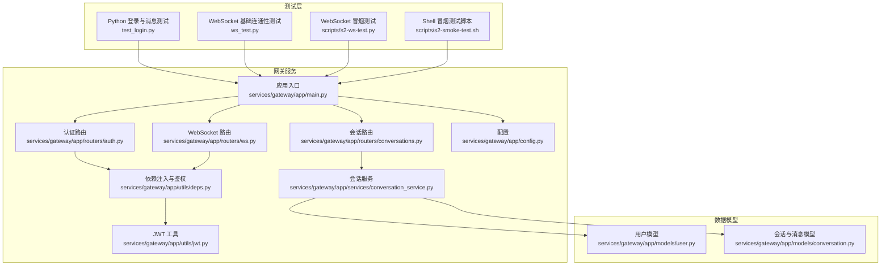
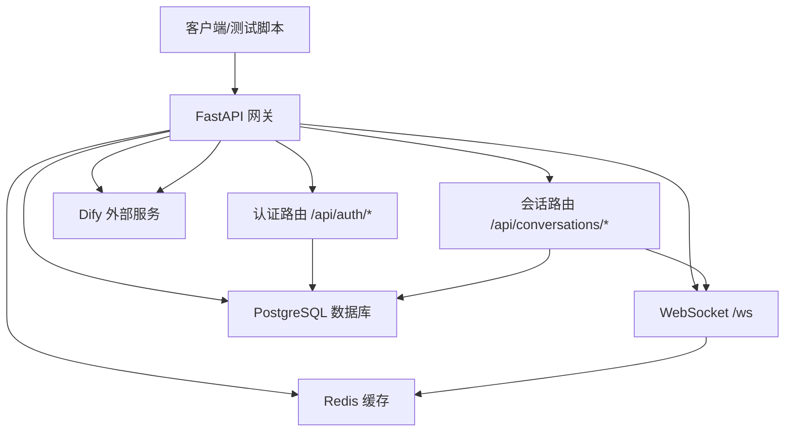
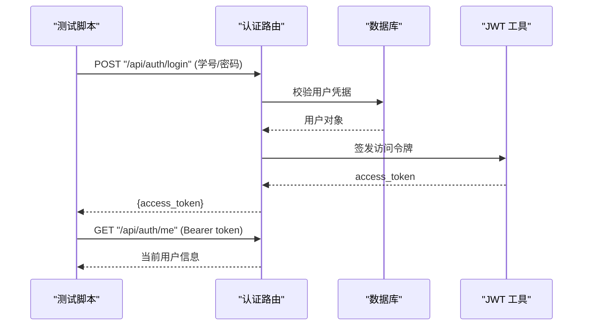
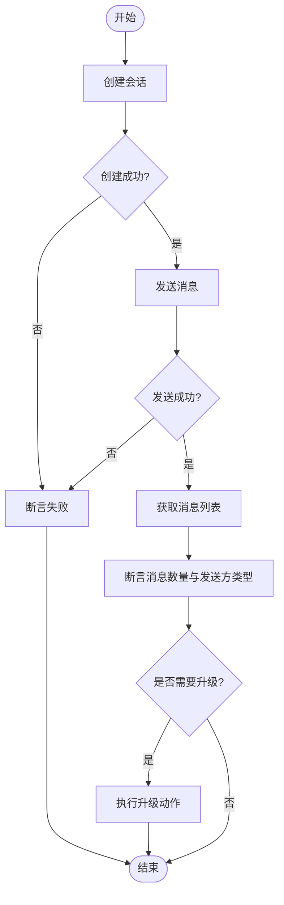
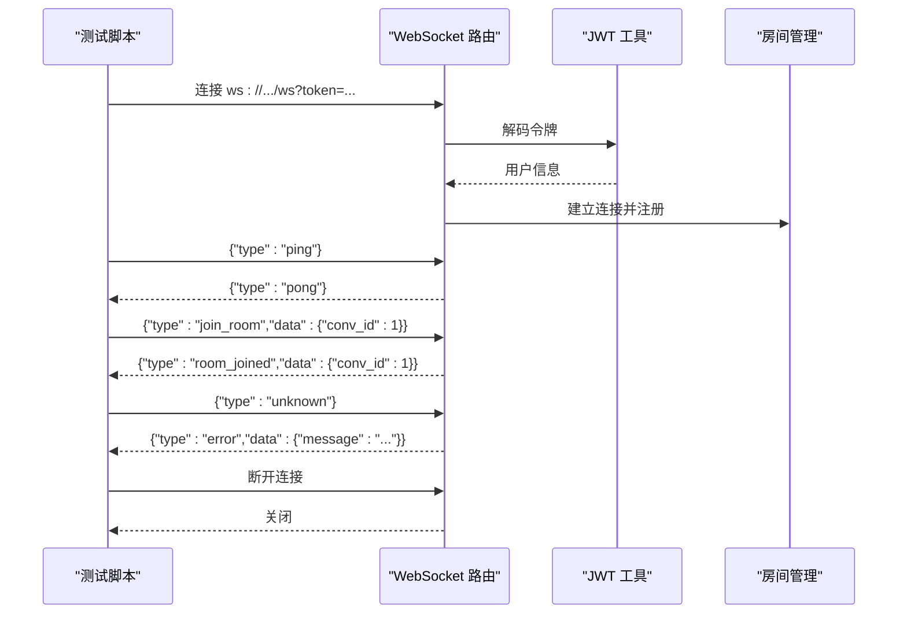
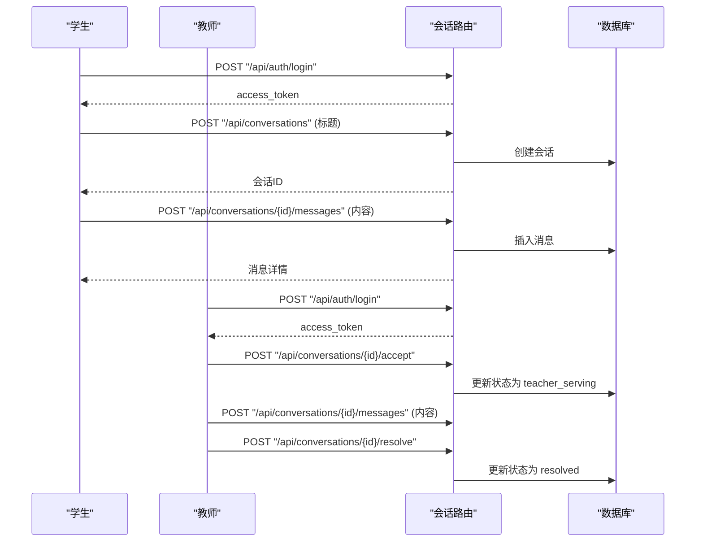
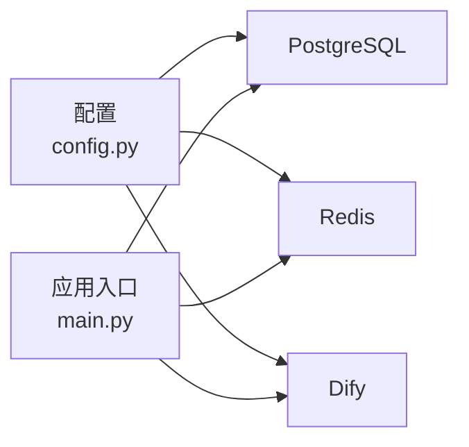

# 集成测试

<cite>
**本文引用的文件**
- [test_login.py](file://test_login.py)
- [ws_test.py](file://ws_test.py)
- [s2-ws-test.py](file://scripts/s2-ws-test.py)
- [s2-smoke-test.sh](file://scripts/s2-smoke-test.sh)
- [main.py](file://services/gateway/app/main.py)
- [auth.py](file://services/gateway/app/routers/auth.py)
- [conversations.py](file://services/gateway/app/routers/conversations.py)
- [ws.py](file://services/gateway/app/routers/ws.py)
- [conversation_service.py](file://services/gateway/app/services/conversation_service.py)
- [config.py](file://services/gateway/app/config.py)
- [conversation.py](file://services/gateway/app/models/conversation.py)
- [user.py](file://services/gateway/app/models/user.py)
- [deps.py](file://services/gateway/app/utils/deps.py)
- [jwt.py](file://services/gateway/app/utils/jwt.py)
</cite>

## 目录
1. [引言](#引言)
2. [项目结构](#项目结构)
3. [核心组件](#核心组件)
4. [架构总览](#架构总览)
5. [详细组件分析](#详细组件分析)
6. [依赖分析](#依赖分析)
7. [性能考虑](#性能考虑)
8. [故障排查指南](#故障排查指南)
9. [结论](#结论)
10. [附录](#附录)

## 引言
本文件面向“医小管 v2”系统的集成测试，围绕网关服务的端到端业务流程进行测试设计与实施说明。内容涵盖认证流程测试、会话管理测试、消息传递测试以及 WebSocket 通信测试，并提供测试数据准备与清理策略、测试环境配置与依赖管理的最佳实践。目标是帮助测试人员与开发者快速理解并执行完整的集成测试方案。

## 项目结构
- 测试脚本位于仓库根目录与 scripts 目录中，分别提供 Python 与 Shell 的集成测试样例。
- 网关服务采用 FastAPI 构建，路由模块化组织，包含认证、会话、动作、聊天与 WebSocket 等子路由。
- 数据模型定义了用户、会话与消息的状态机与字段约束，为测试提供稳定的业务边界。

图表来源
- [main.py:1-78](file://services/gateway/app/main.py#L1-L78)
- [auth.py:1-35](file://services/gateway/app/routers/auth.py#L1-L35)
- [conversations.py:1-129](file://services/gateway/app/routers/conversations.py#L1-L129)
- [ws.py:1-119](file://services/gateway/app/routers/ws.py#L1-L119)
- [conversation_service.py:1-179](file://services/gateway/app/services/conversation_service.py#L1-L179)
- [deps.py:1-40](file://services/gateway/app/utils/deps.py#L1-L40)
- [jwt.py:1-17](file://services/gateway/app/utils/jwt.py#L1-L17)
- [config.py:1-31](file://services/gateway/app/config.py#L1-L31)
- [user.py:1-76](file://services/gateway/app/models/user.py#L1-L76)
- [conversation.py:1-63](file://services/gateway/app/models/conversation.py#L1-L63)

章节来源
- [main.py:1-78](file://services/gateway/app/main.py#L1-L78)
- [auth.py:1-35](file://services/gateway/app/routers/auth.py#L1-L35)
- [conversations.py:1-129](file://services/gateway/app/routers/conversations.py#L1-L129)
- [ws.py:1-119](file://services/gateway/app/routers/ws.py#L1-L119)
- [conversation_service.py:1-179](file://services/gateway/app/services/conversation_service.py#L1-L179)
- [deps.py:1-40](file://services/gateway/app/utils/deps.py#L1-L40)
- [jwt.py:1-17](file://services/gateway/app/utils/jwt.py#L1-L17)
- [config.py:1-31](file://services/gateway/app/config.py#L1-L31)
- [user.py:1-76](file://services/gateway/app/models/user.py#L1-L76)
- [conversation.py:1-63](file://services/gateway/app/models/conversation.py#L1-L63)

## 核心组件
- 认证与会话路由：提供登录、个人信息查询、会话创建与消息收发等接口，用于验证用户身份与业务流程。
- WebSocket 路由：提供基于 JWT 的连接认证、房间加入/离开、打字状态广播与消息广播等能力，用于实时通信测试。
- 会话服务：封装会话与消息的增删改查逻辑，包含权限校验与状态机控制，是集成测试的关键断言点。
- 配置与依赖：集中管理数据库、Redis、Dify、JWT 等外部依赖，确保测试环境一致性。

章节来源
- [auth.py:12-35](file://services/gateway/app/routers/auth.py#L12-L35)
- [conversations.py:21-129](file://services/gateway/app/routers/conversations.py#L21-L129)
- [ws.py:11-119](file://services/gateway/app/routers/ws.py#L11-L119)
- [conversation_service.py:7-179](file://services/gateway/app/services/conversation_service.py#L7-L179)
- [config.py:3-31](file://services/gateway/app/config.py#L3-L31)
- [deps.py:14-40](file://services/gateway/app/utils/deps.py#L14-L40)
- [jwt.py:6-17](file://services/gateway/app/utils/jwt.py#L6-L17)

## 架构总览
下图展示从客户端到网关再到数据库与外部服务的整体链路，以及集成测试关注的关键路径。

图表来源
- [main.py:30-78](file://services/gateway/app/main.py#L30-L78)
- [auth.py:12-35](file://services/gateway/app/routers/auth.py#L12-L35)
- [conversations.py:21-129](file://services/gateway/app/routers/conversations.py#L21-L129)
- [ws.py:11-119](file://services/gateway/app/routers/ws.py#L11-L119)
- [config.py:6-26](file://services/gateway/app/config.py#L6-L26)

## 详细组件分析

### 认证流程测试
- 目标：验证登录成功、失败、携带令牌访问受保护资源、权限校验等。
- 关键断言：
  - 登录返回有效访问令牌；错误密码返回 401。
  - 使用 Bearer 令牌访问 /api/auth/me 返回当前用户信息。
  - 未授权或失效令牌访问受保护接口返回 401。
- 测试步骤参考：
  - 使用 Python 脚本进行登录与用户信息查询。
  - 使用 Shell 脚本进行冒烟测试，覆盖错误密码场景与最终状态断言。

图表来源
- [auth.py:12-35](file://services/gateway/app/routers/auth.py#L12-L35)
- [deps.py:14-35](file://services/gateway/app/utils/deps.py#L14-L35)
- [jwt.py:6-17](file://services/gateway/app/utils/jwt.py#L6-L17)

章节来源
- [auth.py:12-35](file://services/gateway/app/routers/auth.py#L12-L35)
- [deps.py:14-35](file://services/gateway/app/utils/deps.py#L14-L35)
- [jwt.py:6-17](file://services/gateway/app/utils/jwt.py#L6-L17)
- [test_login.py:4-18](file://test_login.py#L4-L18)
- [s2-smoke-test.sh:5-23](file://scripts/s2-smoke-test.sh#L5-L23)

### 会话管理测试
- 目标：验证会话创建、列表查询、详情获取、消息收发、状态流转与权限控制。
- 关键断言：
  - 学生仅能创建会话，教师不可创建。
  - 列表查询按角色返回不同范围的数据。
  - 会话详情需具备访问权限。
  - 消息发送根据角色设置发送方类型，且更新会话时间戳。
- 流程参考：
  - 创建会话 → 发送消息 → 获取消息列表 → 升级会话（若需要）。

图表来源
- [conversations.py:21-129](file://services/gateway/app/routers/conversations.py#L21-L129)
- [conversation_service.py:29-179](file://services/gateway/app/services/conversation_service.py#L29-L179)
- [conversation.py:11-63](file://services/gateway/app/models/conversation.py#L11-L63)
- [user.py:10-76](file://services/gateway/app/models/user.py#L10-L76)

章节来源
- [conversations.py:21-129](file://services/gateway/app/routers/conversations.py#L21-L129)
- [conversation_service.py:7-179](file://services/gateway/app/services/conversation_service.py#L7-L179)
- [conversation.py:11-63](file://services/gateway/app/models/conversation.py#L11-L63)
- [user.py:10-76](file://services/gateway/app/models/user.py#L10-L76)
- [test_login.py:21-51](file://test_login.py#L21-L51)
- [s2-smoke-test.sh:25-126](file://scripts/s2-smoke-test.sh#L25-L126)

### WebSocket 通信测试
- 目标：验证连接认证、房间加入/离开、打字状态广播、消息广播与错误处理。
- 关键断言：
  - 有效令牌连接成功，ping/pong 正常。
  - 加入房间后收到房间加入确认。
  - 发送未知消息类型返回错误。
  - 无效令牌导致连接关闭。
- 测试脚本：
  - Python 脚本提供基础连通性验证。
  - Shell 脚本提供冒烟测试，覆盖多种消息类型与异常分支。

图表来源
- [ws.py:11-119](file://services/gateway/app/routers/ws.py#L11-L119)
- [jwt.py:14-17](file://services/gateway/app/utils/jwt.py#L14-L17)

章节来源
- [ws.py:11-119](file://services/gateway/app/routers/ws.py#L11-L119)
- [jwt.py:14-17](file://services/gateway/app/utils/jwt.py#L14-L17)
- [ws_test.py:2-9](file://ws_test.py#L2-L9)
- [s2-ws-test.py:8-48](file://scripts/s2-ws-test.py#L8-L48)

### 端到端业务流程测试
- 学生登录 → 创建会话 → 发送消息 → 获取消息 → 教师登录 → 接单 → 回复 → 结案 → 最终消息断言。
- 关键断言：
  - 会话状态按预期流转（ai_serving → pending_teacher → teacher_serving → resolved）。
  - 教师仅能对已接单会话进行回复。
  - 升级动作在特定状态下允许，非法状态返回冲突。

图表来源
- [conversations.py:21-129](file://services/gateway/app/routers/conversations.py#L21-L129)
- [conversation_service.py:29-179](file://services/gateway/app/services/conversation_service.py#L29-L179)
- [conversation.py:11-63](file://services/gateway/app/models/conversation.py#L11-L63)
- [s2-smoke-test.sh:64-129](file://scripts/s2-smoke-test.sh#L64-L129)

章节来源
- [conversations.py:21-129](file://services/gateway/app/routers/conversations.py#L21-L129)
- [conversation_service.py:29-179](file://services/gateway/app/services/conversation_service.py#L29-L179)
- [conversation.py:11-63](file://services/gateway/app/models/conversation.py#L11-L63)
- [s2-smoke-test.sh:64-129](file://scripts/s2-smoke-test.sh#L64-L129)

## 依赖分析
- 外部依赖：PostgreSQL、Redis、Dify。
- 环境变量：数据库连接、Redis 连接、JWT 密钥与算法、Dify 地址与密钥。
- 健康检查：/health 接口同时探测数据库、缓存与外部服务可用性。

图表来源
- [config.py:6-26](file://services/gateway/app/config.py#L6-L26)
- [main.py:30-68](file://services/gateway/app/main.py#L30-L68)

章节来源
- [config.py:6-26](file://services/gateway/app/config.py#L6-L26)
- [main.py:30-68](file://services/gateway/app/main.py#L30-L68)

## 性能考虑
- 并发与超时：HTTP 客户端请求设置合理超时，避免阻塞测试执行。
- 批量与分页：消息列表接口支持分页参数，建议在测试中覆盖边界值（最小/最大页大小）。
- 广播与房间：WebSocket 广播应避免在单测中产生过多并发连接，建议串行或限流执行。
- 缓存与数据库：Redis 用于会话状态与缓存，注意在测试期间隔离数据，避免跨用例污染。

## 故障排查指南
- 认证失败
  - 确认登录凭据正确，错误密码返回 401。
  - 检查 Bearer 令牌是否随请求头发送。
- 权限不足
  - 学生无法创建会话（403）。
  - 教师仅能回复已接单会话。
- 会话不存在或无权限
  - 查询会话详情或消息列表时，若无权限返回 404 或 403。
- WebSocket 连接异常
  - 无效令牌导致连接关闭（4001）。
  - 未知消息类型返回错误。
- 外部服务异常
  - /health 中 Dify 探测失败时，检查 Dify 地址与密钥配置。

章节来源
- [auth.py:14-21](file://services/gateway/app/routers/auth.py#L14-L21)
- [conversations.py:28-31](file://services/gateway/app/routers/conversations.py#L28-L31)
- [conversations.py:98-100](file://services/gateway/app/routers/conversations.py#L98-L100)
- [conversations.py:60-62](file://services/gateway/app/routers/conversations.py#L60-L62)
- [ws.py:40-42](file://services/gateway/app/routers/ws.py#L40-L42)
- [ws.py:108-112](file://services/gateway/app/routers/ws.py#L108-L112)
- [main.py:51-61](file://services/gateway/app/main.py#L51-L61)

## 结论
本文档提供了“医小管 v2”网关服务的集成测试策略与实施方案，覆盖认证、会话管理、消息传递与 WebSocket 通信等关键路径。通过结合 Python 与 Shell 测试脚本，配合明确的断言与故障排查指引，能够高效验证端到端业务流程的正确性与稳定性。

## 附录

### 测试数据准备与清理策略
- 测试数据库
  - 使用独立的测试数据库实例或容器，避免与生产数据混用。
  - 在测试前初始化必要数据（如教师与学生用户、知识库条目等），测试后清理或回滚。
- 模拟数据
  - 使用固定凭证进行登录（例如学生与教师的 staff_id 与密码），便于脚本自动化。
  - 会话标题与消息内容使用稳定字符串，便于断言。
- 清理策略
  - 会话与消息删除：通过会话服务提供的删除逻辑或直接 SQL 清理。
  - 房间与连接：WebSocket 测试结束后主动断开连接，避免悬挂连接影响后续测试。

### 测试环境配置与依赖管理最佳实践
- 环境变量
  - 通过 .env 文件统一管理数据库、Redis、JWT 与 Dify 的配置项。
  - 不同测试阶段（冒烟、回归、压力）使用不同的 .env 文件或环境变量覆盖。
- 依赖版本
  - 使用 requirements.txt 锁定后端依赖版本，确保测试环境一致性。
  - Docker Compose 启动时指定服务版本，避免镜像差异导致的测试不稳定。
- 健康检查
  - 在测试启动前调用 /health 接口，确保数据库、Redis 与 Dify 可用。
- 并发与隔离
  - 将测试拆分为独立的用例集，避免共享状态干扰。
  - 对于 WebSocket 测试，限制并发连接数，优先保证稳定性。