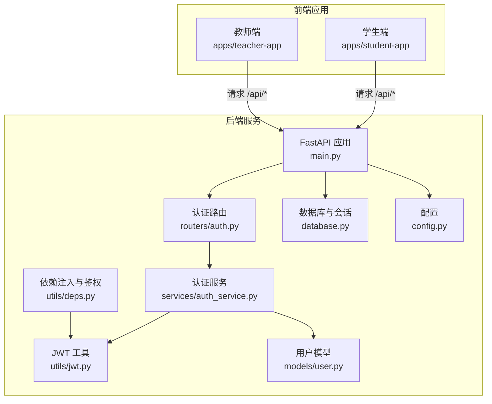
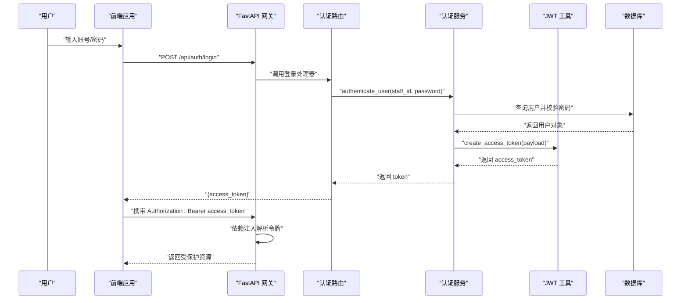
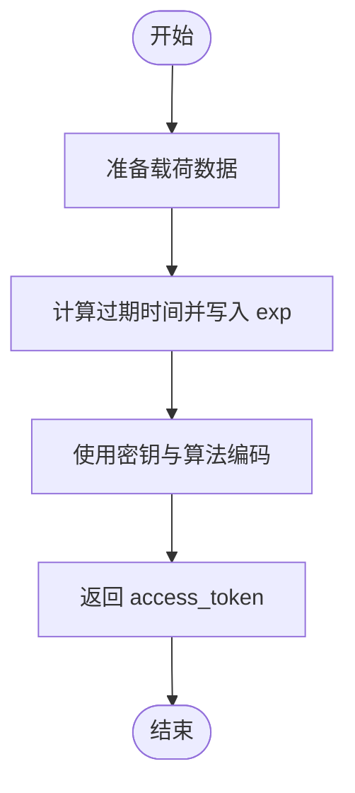
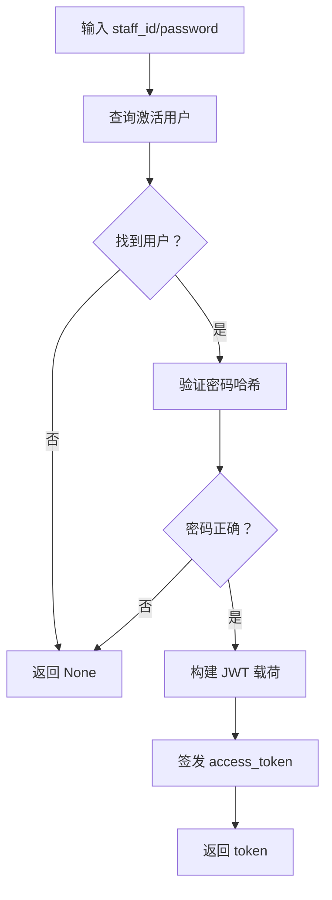
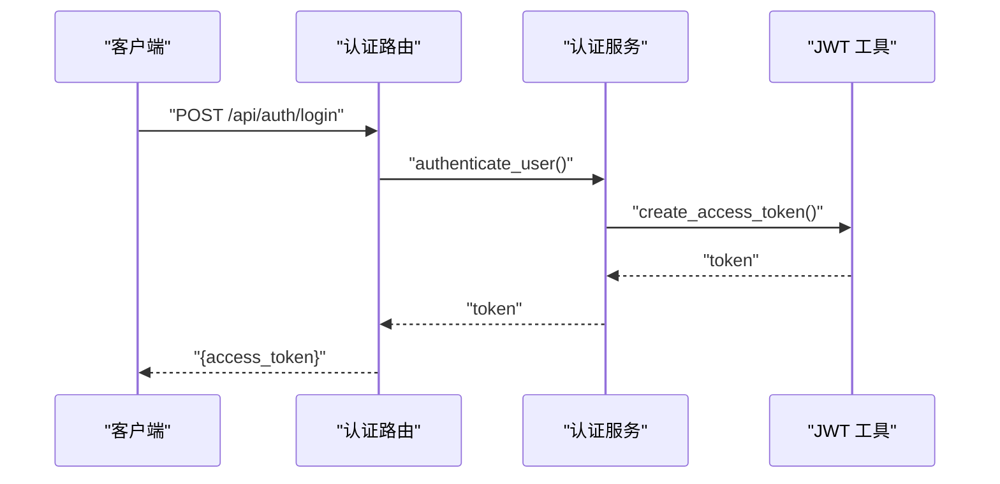
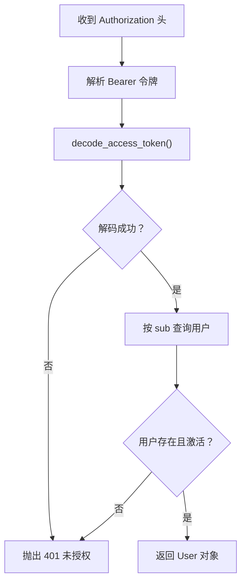
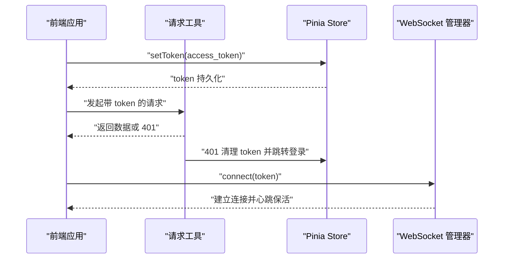
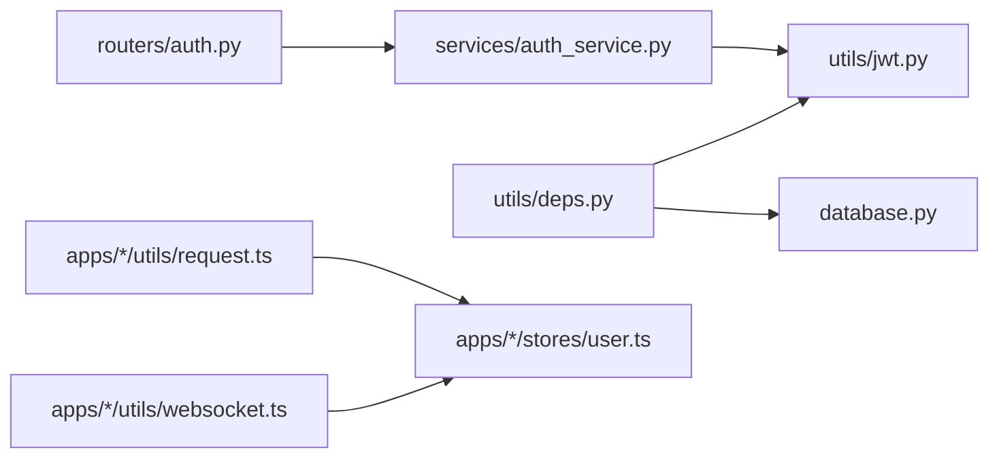

# JWT 令牌管理

<cite>
**本文引用的文件**
- [jwt.py](file://services/gateway/app/utils/jwt.py)
- [auth.py](file://services/gateway/app/routers/auth.py)
- [auth_service.py](file://services/gateway/app/services/auth_service.py)
- [auth.py](file://services/gateway/app/schemas/auth.py)
- [main.py](file://services/gateway/app/main.py)
- [config.py](file://services/gateway/app/config.py)
- [deps.py](file://services/gateway/app/utils/deps.py)
- [user.py](file://services/gateway/app/models/user.py)
- [database.py](file://services/gateway/app/database.py)
- [user.ts](file://apps/student-app/src/stores/user.ts)
- [auth.ts](file://apps/student-app/src/api/auth.ts)
- [request.ts](file://apps/student-app/src/utils/request.ts)
- [websocket.ts](file://apps/student-app/src/utils/websocket.ts)
- [user.ts](file://apps/teacher-app/src/stores/user.ts)
- [auth.ts](file://apps/teacher-app/src/api/auth.ts)
</cite>

## 目录
1. [简介](#简介)
2. [项目结构](#项目结构)
3. [核心组件](#核心组件)
4. [架构总览](#架构总览)
5. [详细组件分析](#详细组件分析)
6. [依赖分析](#依赖分析)
7. [性能考虑](#性能考虑)
8. [故障排查指南](#故障排查指南)
9. [结论](#结论)
10. [附录](#附录)

## 简介
本文件系统性梳理并说明本项目的 JWT 令牌管理方案，覆盖令牌生成、验证、刷新策略、令牌结构与签名算法、过期时间设置、认证流程（登录、携带令牌访问受保护资源、登出）、以及前后端协作方式（密钥管理、令牌存储、跨域与安全传输）。文档同时提供面向 FastAPI 的中间件与依赖注入实现思路，并给出前端在 uni-app 环境中存储与使用 JWT 的实践。

## 项目结构
本项目采用“网关服务 + 前端应用”的分层架构：
- 后端网关服务基于 FastAPI，提供认证路由、用户模型、数据库与 Redis 连接、JWT 工具与依赖注入。
- 前端应用（学生端与教师端）基于 uni-app，通过封装的请求工具统一携带 Authorization 头，使用 Pinia Store 持久化令牌与用户信息。

图表来源
- [main.py:1-78](file://services/gateway/app/main.py#L1-L78)
- [auth.py:1-35](file://services/gateway/app/routers/auth.py#L1-L35)
- [auth_service.py:1-35](file://services/gateway/app/services/auth_service.py#L1-L35)
- [jwt.py:1-17](file://services/gateway/app/utils/jwt.py#L1-L17)
- [deps.py:1-40](file://services/gateway/app/utils/deps.py#L1-L40)
- [database.py:1-15](file://services/gateway/app/database.py#L1-L15)
- [user.py:1-76](file://services/gateway/app/models/user.py#L1-L76)
- [config.py:1-31](file://services/gateway/app/config.py#L1-L31)

章节来源
- [main.py:1-78](file://services/gateway/app/main.py#L1-L78)
- [config.py:1-31](file://services/gateway/app/config.py#L1-L31)

## 核心组件
- JWT 工具模块：负责签发与解码访问令牌，设置过期时间与签名算法。
- 认证服务：完成用户身份校验与令牌签发。
- 认证路由：提供登录接口与“获取当前用户”接口。
- 依赖注入与鉴权中间件：从 Authorization 头解析 JWT，解析用户并校验有效性。
- 前端请求工具：统一为请求头添加 Authorization: Bearer <token>，并在 401 时触发登出与跳转。
- 前端 Pinia Store：持久化令牌与用户信息，初始化时恢复状态。

章节来源
- [jwt.py:1-17](file://services/gateway/app/utils/jwt.py#L1-L17)
- [auth_service.py:1-35](file://services/gateway/app/services/auth_service.py#L1-L35)
- [auth.py:1-35](file://services/gateway/app/routers/auth.py#L1-L35)
- [deps.py:1-40](file://services/gateway/app/utils/deps.py#L1-L40)
- [request.ts:1-44](file://apps/student-app/src/utils/request.ts#L1-L44)
- [user.ts:1-56](file://apps/student-app/src/stores/user.ts#L1-L56)

## 架构总览
下图展示了从登录到访问受保护资源的完整链路，以及前端如何在每次请求中携带令牌。

图表来源
- [auth.py:12-21](file://services/gateway/app/routers/auth.py#L12-L21)
- [auth_service.py:8-17](file://services/gateway/app/services/auth_service.py#L8-L17)
- [jwt.py:6-11](file://services/gateway/app/utils/jwt.py#L6-L11)
- [deps.py:14-35](file://services/gateway/app/utils/deps.py#L14-L35)
- [request.ts:17-21](file://apps/student-app/src/utils/request.ts#L17-L21)

## 详细组件分析

### JWT 工具模块（签发与解码）
- 功能要点
  - 签发访问令牌：复制传入数据，加入 exp（过期时间），使用配置的密钥与算法进行编码。
  - 解码访问令牌：使用配置的密钥与算法进行解码，失败抛出异常。
- 关键配置
  - 密钥：来自环境配置，生产环境必须替换默认值。
  - 算法：默认 HS256。
  - 过期时间：以小时为单位，配置项为过期小时数。
- 安全建议
  - 生产环境务必使用强随机密钥，避免硬编码。
  - 限制令牌有效期，结合刷新策略降低泄露风险。

图表来源
- [jwt.py:6-11](file://services/gateway/app/utils/jwt.py#L6-L11)
- [config.py:10-13](file://services/gateway/app/config.py#L10-L13)

章节来源
- [jwt.py:1-17](file://services/gateway/app/utils/jwt.py#L1-L17)
- [config.py:1-31](file://services/gateway/app/config.py#L1-L31)

### 认证服务（用户校验与令牌签发）
- 功能要点
  - 用户校验：按学号/工号查询激活用户，使用哈希算法验证密码。
  - 构建 JWT 载荷：包含 sub、staff_id、role、college_id、class_id、name 等字段。
  - 令牌签发：委托 JWT 工具模块生成访问令牌。
- 错误处理
  - 用户不存在或密码错误返回 None，上层路由返回 401。

图表来源
- [auth_service.py:8-17](file://services/gateway/app/services/auth_service.py#L8-L17)
- [auth_service.py:20-29](file://services/gateway/app/services/auth_service.py#L20-L29)
- [auth_service.py:32-34](file://services/gateway/app/services/auth_service.py#L32-L34)

章节来源
- [auth_service.py:1-35](file://services/gateway/app/services/auth_service.py#L1-L35)

### 认证路由（登录与获取当前用户）
- 登录接口
  - 输入：学号/工号与密码。
  - 输出：access_token 与 token_type。
  - 失败：401 未授权。
- 获取当前用户接口
  - 依赖注入解析当前用户，返回用户信息。

图表来源
- [auth.py:12-21](file://services/gateway/app/routers/auth.py#L12-L21)
- [auth_service.py:32-34](file://services/gateway/app/services/auth_service.py#L32-L34)
- [jwt.py:6-11](file://services/gateway/app/utils/jwt.py#L6-L11)

章节来源
- [auth.py:1-35](file://services/gateway/app/routers/auth.py#L1-L35)
- [schemas/auth.py:1-23](file://services/gateway/app/schemas/auth.py#L1-L23)

### 依赖注入与鉴权中间件（解析与校验令牌）
- 功能要点
  - 使用 HTTP Bearer 方案从 Authorization 头提取令牌。
  - 调用 JWT 工具解码，提取 sub（用户标识），查询数据库确认用户存在且激活。
  - 异常：JWT 解析失败、载荷缺失、用户不存在或未激活，均返回 401。
- 适用范围
  - 任何需要当前用户的受保护路由均可依赖该依赖注入函数。

图表来源
- [deps.py:14-35](file://services/gateway/app/utils/deps.py#L14-L35)
- [jwt.py:14-16](file://services/gateway/app/utils/jwt.py#L14-L16)
- [user.py:45-58](file://services/gateway/app/models/user.py#L45-L58)

章节来源
- [deps.py:1-40](file://services/gateway/app/utils/deps.py#L1-L40)
- [jwt.py:1-17](file://services/gateway/app/utils/jwt.py#L1-L17)
- [user.py:1-76](file://services/gateway/app/models/user.py#L1-L76)

### 前端请求与令牌存储（uni-app）
- 请求工具
  - 自动在请求头添加 Authorization: Bearer <token>。
  - 当响应为 401 时，清理本地存储并跳转至登录页。
- 学生端与教师端
  - 使用 Pinia Store 持久化 token 与用户信息。
  - 登录成功后保存 token；登出时清除 token 与用户信息。
- WebSocket
  - 连接时将 token 作为查询参数传递给后端 WebSocket 路由。

图表来源
- [request.ts:17-28](file://apps/student-app/src/utils/request.ts#L17-L28)
- [user.ts:36-52](file://apps/student-app/src/stores/user.ts#L36-L52)
- [websocket.ts:20-30](file://apps/student-app/src/utils/websocket.ts#L20-L30)

章节来源
- [request.ts:1-44](file://apps/student-app/src/utils/request.ts#L1-L44)
- [user.ts:1-56](file://apps/student-app/src/stores/user.ts#L1-L56)
- [auth.ts:1-20](file://apps/student-app/src/api/auth.ts#L1-L20)
- [websocket.ts:1-153](file://apps/student-app/src/utils/websocket.ts#L1-L153)
- [user.ts:1-63](file://apps/teacher-app/src/stores/user.ts#L1-L63)
- [auth.ts:1-43](file://apps/teacher-app/src/api/auth.ts#L1-L43)

## 依赖分析
- 组件耦合
  - 认证路由依赖认证服务与 JWT 工具。
  - 依赖注入模块依赖 JWT 工具与数据库会话。
  - 前端请求工具依赖 Pinia Store；WebSocket 管理器依赖全局 token。
- 外部依赖
  - jose（JWT 编解码）。
  - passlib.bcrypt（密码哈希验证）。
  - SQLAlchemy（异步 ORM）。
  - Redis（可选，用于会话或缓存）。

图表来源
- [auth.py:1-35](file://services/gateway/app/routers/auth.py#L1-L35)
- [auth_service.py:1-35](file://services/gateway/app/services/auth_service.py#L1-L35)
- [jwt.py:1-17](file://services/gateway/app/utils/jwt.py#L1-L17)
- [deps.py:1-40](file://services/gateway/app/utils/deps.py#L1-L40)
- [database.py:1-15](file://services/gateway/app/database.py#L1-L15)
- [request.ts:1-44](file://apps/student-app/src/utils/request.ts#L1-L44)
- [user.ts:1-56](file://apps/student-app/src/stores/user.ts#L1-L56)
- [websocket.ts:1-153](file://apps/student-app/src/utils/websocket.ts#L1-L153)

章节来源
- [auth.py:1-35](file://services/gateway/app/routers/auth.py#L1-L35)
- [auth_service.py:1-35](file://services/gateway/app/services/auth_service.py#L1-L35)
- [jwt.py:1-17](file://services/gateway/app/utils/jwt.py#L1-L17)
- [deps.py:1-40](file://services/gateway/app/utils/deps.py#L1-L40)
- [database.py:1-15](file://services/gateway/app/database.py#L1-L15)
- [request.ts:1-44](file://apps/student-app/src/utils/request.ts#L1-L44)
- [user.ts:1-56](file://apps/student-app/src/stores/user.ts#L1-L56)
- [websocket.ts:1-153](file://apps/student-app/src/utils/websocket.ts#L1-L153)

## 性能考虑
- 令牌有效期
  - 默认 72 小时，建议根据业务场景缩短，降低泄露窗口。
- 密钥轮换
  - 生产环境定期轮换密钥，旧密钥过渡期内允许双密钥解码。
- 数据库查询
  - 依赖注入解析用户时仅按主键查询，开销较小；可结合缓存提升高并发下的响应速度。
- 网络与连接
  - WebSocket 心跳与断线重连策略需平衡保活与资源消耗。

## 故障排查指南
- 401 未授权
  - 可能原因：令牌缺失、格式不正确、签名不匹配、过期、用户被禁用。
  - 建议排查：确认 Authorization 头格式、令牌是否过期、用户状态是否正常。
- 令牌无法解码
  - 可能原因：密钥不一致、算法不匹配、载荷被篡改。
  - 建议排查：核对配置中的密钥与算法，确保前后端一致。
- 前端 401 后未跳转
  - 可能原因：拦截逻辑未执行或异常被捕获。
  - 建议排查：检查请求工具的 401 分支与页面跳转逻辑。
- WebSocket 连接失败
  - 可能原因：URL 参数未携带 token 或 token 无效。
  - 建议排查：确认连接时 token 是否正确传入查询参数。

章节来源
- [deps.py:18-35](file://services/gateway/app/utils/deps.py#L18-L35)
- [request.ts:25-28](file://apps/student-app/src/utils/request.ts#L25-L28)
- [websocket.ts:20-30](file://apps/student-app/src/utils/websocket.ts#L20-L30)

## 结论
本项目提供了完整的 JWT 令牌管理闭环：登录签发、请求携带、后端解析与校验、登出清理。通过依赖注入与统一请求工具，实现了前后端一致的安全体验。建议在生产环境中强化密钥管理、缩短令牌有效期、完善刷新策略与审计日志，以进一步提升安全性与可观测性。

## 附录

### 令牌结构与字段说明
- 载荷字段
  - sub：用户唯一标识（整型 ID）。
  - staff_id：学号/工号。
  - role：角色（student/teacher/admin）。
  - college_id：学院 ID（可空）。
  - class_id：班级 ID（可空）。
  - name：姓名。
  - exp：过期时间（UTC 时间戳）。
- 签名算法
  - HS256（对称密钥）。
- 过期时间
  - 以小时为单位，默认 72 小时。

章节来源
- [auth_service.py:20-29](file://services/gateway/app/services/auth_service.py#L20-L29)
- [jwt.py:6-11](file://services/gateway/app/utils/jwt.py#L6-L11)
- [config.py:10-13](file://services/gateway/app/config.py#L10-L13)

### 刷新令牌策略（建议）
- 短期访问令牌：用于日常请求，有效期较短。
- 长期刷新令牌：单独签发，仅用于换取新的访问令牌。
- 安全措施
  - 刷新令牌独立存储（如 HttpOnly Cookie）。
  - 严格校验刷新令牌来源与绑定信息。
  - 一旦发现异常立即吊销刷新令牌并要求重新登录。

### 前端令牌存储与使用（uni-app）
- 存储位置
  - 使用本地存储（如 uni.get/setStorage）持久化 token 与用户信息。
- 使用方式
  - 请求工具自动附加 Authorization 头。
  - 登录成功后保存 token；登出时清理。
- WebSocket
  - 连接时将 token 作为查询参数传入。

章节来源
- [user.ts:15-52](file://apps/student-app/src/stores/user.ts#L15-L52)
- [request.ts:17-21](file://apps/student-app/src/utils/request.ts#L17-L21)
- [websocket.ts:20-30](file://apps/student-app/src/utils/websocket.ts#L20-L30)
- [user.ts:5-6](file://apps/teacher-app/src/stores/user.ts#L5-L6)

### 后端 FastAPI 中间件与依赖注入实现要点
- 中间件模式
  - 使用 HTTPBearer 提取 Authorization 头。
  - 通过自定义依赖函数解析 JWT 并注入当前用户。
- 依赖注入
  - 将 get_current_user 作为路由依赖，自动完成鉴权。
- 错误处理
  - 在依赖函数内捕获 JWT 异常与用户状态异常，返回 401。

章节来源
- [deps.py:11-35](file://services/gateway/app/utils/deps.py#L11-L35)
- [auth.py:24-34](file://services/gateway/app/routers/auth.py#L24-L34)