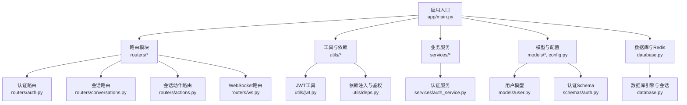
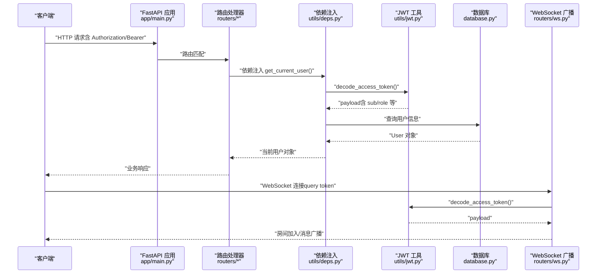
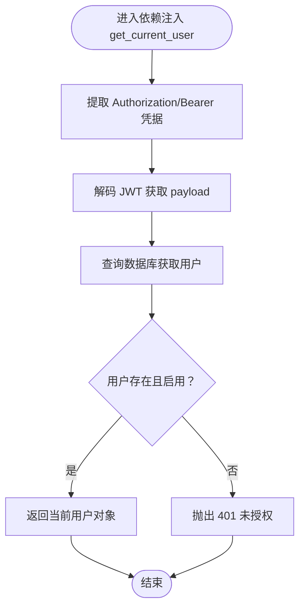
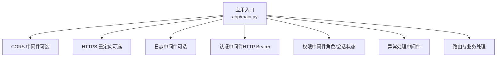
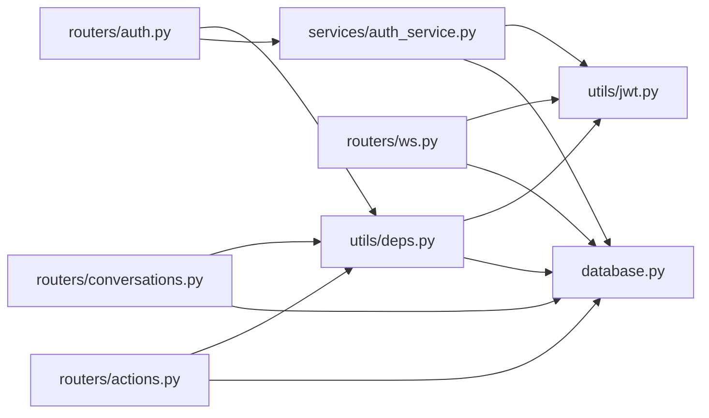

# 中间件与安全策略

<cite>
**本文引用的文件**
- [services/gateway/app/main.py](file://services/gateway/app/main.py)
- [services/gateway/app/config.py](file://services/gateway/app/config.py)
- [services/gateway/app/utils/jwt.py](file://services/gateway/app/utils/jwt.py)
- [services/gateway/app/utils/deps.py](file://services/gateway/app/utils/deps.py)
- [services/gateway/app/routers/auth.py](file://services/gateway/app/routers/auth.py)
- [services/gateway/app/routers/conversations.py](file://services/gateway/app/routers/conversations.py)
- [services/gateway/app/routers/actions.py](file://services/gateway/app/routers/actions.py)
- [services/gateway/app/routers/ws.py](file://services/gateway/app/routers/ws.py)
- [services/gateway/app/services/auth_service.py](file://services/gateway/app/services/auth_service.py)
- [services/gateway/app/models/user.py](file://services/gateway/app/models/user.py)
- [services/gateway/app/schemas/auth.py](file://services/gateway/app/schemas/auth.py)
- [services/gateway/app/database.py](file://services/gateway/app/database.py)
</cite>

## 目录
1. [简介](#简介)
2. [项目结构](#项目结构)
3. [核心组件](#核心组件)
4. [架构总览](#架构总览)
5. [详细组件分析](#详细组件分析)
6. [依赖分析](#依赖分析)
7. [性能考虑](#性能考虑)
8. [故障排查指南](#故障排查指南)
9. [结论](#结论)
10. [附录](#附录)

## 简介
本文件聚焦于网关服务中的“中间件与安全策略”。当前代码库未显式注册任何自定义中间件，但通过依赖注入与路由装饰器实现了强大的认证与授权控制，覆盖请求拦截、响应处理、异常捕获、令牌提取、用户身份解析、权限检查、WebSocket 认证与消息广播等。本文将系统梳理这些机制，并给出中间件链配置建议、自定义中间件开发指南与性能优化要点。

## 项目结构
网关服务采用 FastAPI 应用入口集中管理，路由按功能模块拆分，安全逻辑主要通过依赖函数与路由装饰器完成，数据库与 Redis 通过 lifespan 生命周期初始化与释放。

图表来源
- [services/gateway/app/main.py:1-78](file://services/gateway/app/main.py#L1-L78)
- [services/gateway/app/routers/auth.py:1-35](file://services/gateway/app/routers/auth.py#L1-L35)
- [services/gateway/app/routers/conversations.py:1-129](file://services/gateway/app/routers/conversations.py#L1-L129)
- [services/gateway/app/routers/actions.py:1-154](file://services/gateway/app/routers/actions.py#L1-L154)
- [services/gateway/app/routers/ws.py:1-119](file://services/gateway/app/routers/ws.py#L1-L119)
- [services/gateway/app/utils/jwt.py:1-17](file://services/gateway/app/utils/jwt.py#L1-L17)
- [services/gateway/app/utils/deps.py:1-40](file://services/gateway/app/utils/deps.py#L1-L40)
- [services/gateway/app/services/auth_service.py:1-35](file://services/gateway/app/services/auth_service.py#L1-L35)
- [services/gateway/app/models/user.py:1-76](file://services/gateway/app/models/user.py#L1-L76)
- [services/gateway/app/schemas/auth.py:1-23](file://services/gateway/app/schemas/auth.py#L1-L23)
- [services/gateway/app/database.py:1-15](file://services/gateway/app/database.py#L1-L15)

章节来源
- [services/gateway/app/main.py:1-78](file://services/gateway/app/main.py#L1-L78)

## 核心组件
- 应用入口与生命周期
  - 使用 lifespan 在启动时初始化 Redis 连接，在关闭时释放连接，确保资源管理。
  - 暴露健康检查端点，检查数据库、Redis 与下游 Dify 服务连通性。
- 认证与授权
  - 登录接口使用用户名+密码进行认证，成功后签发 JWT。
  - 通过 HTTP Bearer 依赖从 Authorization 头解析 JWT，解析失败或用户不存在/禁用时统一返回 401。
  - 路由层在需要时通过依赖注入强制执行认证与权限校验。
- WebSocket 认证
  - 通过查询参数携带 JWT，连接建立后进行认证，随后加入房间并支持广播。
- 数据库与缓存
  - 异步 SQLAlchemy 引擎与会话工厂，Redis 通过依赖注入提供全局连接池。

章节来源
- [services/gateway/app/main.py:16-68](file://services/gateway/app/main.py#L16-L68)
- [services/gateway/app/routers/auth.py:12-35](file://services/gateway/app/routers/auth.py#L12-L35)
- [services/gateway/app/utils/deps.py:14-35](file://services/gateway/app/utils/deps.py#L14-L35)
- [services/gateway/app/utils/jwt.py:6-16](file://services/gateway/app/utils/jwt.py#L6-L16)
- [services/gateway/app/routers/ws.py:11-119](file://services/gateway/app/routers/ws.py#L11-L119)
- [services/gateway/app/database.py:6-15](file://services/gateway/app/database.py#L6-L15)

## 架构总览
下图展示了请求从客户端到路由处理、认证与授权、数据库访问与 WebSocket 广播的整体流程。

图表来源
- [services/gateway/app/main.py:24-78](file://services/gateway/app/main.py#L24-L78)
- [services/gateway/app/routers/auth.py:12-35](file://services/gateway/app/routers/auth.py#L12-L35)
- [services/gateway/app/routers/conversations.py:21-129](file://services/gateway/app/routers/conversations.py#L21-L129)
- [services/gateway/app/routers/actions.py:68-154](file://services/gateway/app/routers/actions.py#L68-L154)
- [services/gateway/app/routers/ws.py:11-119](file://services/gateway/app/routers/ws.py#L11-L119)
- [services/gateway/app/utils/deps.py:14-35](file://services/gateway/app/utils/deps.py#L14-L35)
- [services/gateway/app/utils/jwt.py:6-16](file://services/gateway/app/utils/jwt.py#L6-L16)
- [services/gateway/app/database.py:12-15](file://services/gateway/app/database.py#L12-L15)

## 详细组件分析

### 认证中间件与依赖注入工作原理
- 令牌提取
  - HTTP 接口：通过 HTTP Bearer 依赖从 Authorization 头中提取凭据。
  - WebSocket 接口：通过查询参数提取 JWT。
- 用户身份解析
  - 使用 JWT 工具对令牌进行解码，读取 payload 中的用户标识与角色等字段。
  - 查询数据库获取用户对象，校验是否有效与启用状态。
- 权限检查
  - 在路由层通过依赖注入强制执行认证；部分路由进一步根据用户角色与会话状态进行细粒度权限判断。

图表来源
- [services/gateway/app/utils/deps.py:14-35](file://services/gateway/app/utils/deps.py#L14-L35)
- [services/gateway/app/utils/jwt.py:14-16](file://services/gateway/app/utils/jwt.py#L14-L16)
- [services/gateway/app/database.py:12-15](file://services/gateway/app/database.py#L12-L15)

章节来源
- [services/gateway/app/utils/deps.py:14-35](file://services/gateway/app/utils/deps.py#L14-L35)
- [services/gateway/app/utils/jwt.py:6-16](file://services/gateway/app/utils/jwt.py#L6-L16)
- [services/gateway/app/routers/auth.py:12-35](file://services/gateway/app/routers/auth.py#L12-L35)

### 安全策略实施
- CORS 配置
  - 当前代码库未显式注册 CORS 中间件。若前端跨域访问，需在应用初始化处添加 CORS 配置以允许特定源、方法与头。
- CSRF 防护
  - 未发现显式的 CSRF 中间件或令牌校验。对于基于 Cookie 的会话，建议引入 CSRF 中间件或在前端设置安全的 SameSite/Cross-Site 策略。
- XSS 防护
  - 未发现专门的 XSS 中间件。建议在模板渲染或静态文件服务中设置安全响应头（如 Content-Security-Policy），并对用户输入进行严格的转义与校验。
- 传输安全
  - 建议在生产环境启用 HTTPS，避免明文传输敏感数据。

章节来源
- [services/gateway/app/main.py:24-28](file://services/gateway/app/main.py#L24-L28)

### 中间件链配置示例（概念性）
以下为概念性中间件链配置思路，用于说明请求处理的完整流程。实际部署时请根据需要在应用初始化阶段注册相应中间件。

图表来源
- [services/gateway/app/main.py:24-28](file://services/gateway/app/main.py#L24-L28)

### 自定义中间件开发指南
- 设计原则
  - 保持单一职责：每个中间件负责一个明确的横切关注点（如日志、限流、审计）。
  - 最小侵入：尽量通过 ASGI/Starlette 中间件栈扩展能力，避免修改业务路由。
- 开发步骤
  - 定义中间件类，实现异步处理逻辑。
  - 在应用初始化时通过注册方式接入中间件栈。
  - 明确中间件顺序：通常认证/授权在前，日志/监控在后。
- 性能注意事项
  - 避免阻塞操作，优先使用异步实现。
  - 合理缓存与复用资源，减少重复计算。

### 异常处理机制
- 认证失败
  - 令牌无效、过期或用户不存在/禁用时，统一返回 401。
- 权限不足
  - 角色不符或无权访问目标资源时，返回 403。
- 资源不存在
  - 会话/消息等资源不存在时，返回 404。
- 冲突状态
  - 状态机转换冲突时，返回 409。
- 通用异常
  - 未捕获异常默认由框架处理，建议补充全局异常处理器以输出一致的错误格式。

章节来源
- [services/gateway/app/utils/deps.py:23-34](file://services/gateway/app/utils/deps.py#L23-L34)
- [services/gateway/app/routers/conversations.py:28-29](file://services/gateway/app/routers/conversations.py#L28-L29)
- [services/gateway/app/routers/actions.py:79-83](file://services/gateway/app/routers/actions.py#L79-L83)
- [services/gateway/app/routers/actions.py:125-129](file://services/gateway/app/routers/actions.py#L125-L129)

## 依赖分析
- 组件耦合
  - 路由层依赖依赖注入模块与服务模块，形成清晰的分层。
  - 依赖注入模块依赖 JWT 工具与数据库会话，承担认证与用户解析职责。
  - WebSocket 路由直接依赖 JWT 工具与广播管理器，独立于 HTTP 路由。
- 外部依赖
  - 使用 Pydantic 设置管理配置，使用 SQLAlchemy 异步 ORM 访问数据库，使用 Redis 异步客户端。
- 潜在循环依赖
  - 当前结构未见循环导入，依赖方向自上而下，符合 FastAPI 推荐模式。

图表来源
- [services/gateway/app/routers/auth.py:1-35](file://services/gateway/app/routers/auth.py#L1-L35)
- [services/gateway/app/routers/conversations.py:1-129](file://services/gateway/app/routers/conversations.py#L1-L129)
- [services/gateway/app/routers/actions.py:1-154](file://services/gateway/app/routers/actions.py#L1-L154)
- [services/gateway/app/routers/ws.py:1-119](file://services/gateway/app/routers/ws.py#L1-L119)
- [services/gateway/app/utils/deps.py:1-40](file://services/gateway/app/utils/deps.py#L1-L40)
- [services/gateway/app/utils/jwt.py:1-17](file://services/gateway/app/utils/jwt.py#L1-L17)
- [services/gateway/app/services/auth_service.py:1-35](file://services/gateway/app/services/auth_service.py#L1-L35)
- [services/gateway/app/database.py:1-15](file://services/gateway/app/database.py#L1-L15)

章节来源
- [services/gateway/app/routers/auth.py:1-35](file://services/gateway/app/routers/auth.py#L1-L35)
- [services/gateway/app/routers/conversations.py:1-129](file://services/gateway/app/routers/conversations.py#L1-L129)
- [services/gateway/app/routers/actions.py:1-154](file://services/gateway/app/routers/actions.py#L1-L154)
- [services/gateway/app/routers/ws.py:1-119](file://services/gateway/app/routers/ws.py#L1-L119)
- [services/gateway/app/utils/deps.py:1-40](file://services/gateway/app/utils/deps.py#L1-L40)
- [services/gateway/app/utils/jwt.py:1-17](file://services/gateway/app/utils/jwt.py#L1-L17)
- [services/gateway/app/services/auth_service.py:1-35](file://services/gateway/app/services/auth_service.py#L1-L35)
- [services/gateway/app/database.py:1-15](file://services/gateway/app/database.py#L1-L15)

## 性能考虑
- 连接池与资源管理
  - 数据库连接池大小与生命周期管理直接影响吞吐量与稳定性，建议结合压测结果调整。
- 缓存策略
  - 对热点用户信息与会话元数据使用 Redis 缓存，降低数据库压力。
- 异步化
  - 所有 I/O 操作均采用异步实现，避免阻塞事件循环。
- 中间件顺序
  - 将代价高的中间件（如日志、审计）放在靠后位置，减少对快速路径的影响。
- WebSocket 广播
  - 广播消息时注意批量与去重，避免重复推送造成带宽浪费。

## 故障排查指南
- 401 未授权
  - 检查 Authorization 头是否正确传递 Bearer 令牌，确认令牌未过期且签名有效。
  - 核对用户是否存在且处于启用状态。
- 403 权限不足
  - 检查用户角色与目标路由的权限要求是否匹配。
  - 对于会话相关操作，确认用户与会话的归属关系。
- 404 资源不存在
  - 确认资源 ID 是否正确，数据库中是否存在对应记录。
- 409 冲突
  - 状态机转换失败，检查当前状态与允许的转换条件。
- WebSocket 连接失败
  - 检查查询参数 token 是否正确，服务器日志是否有异常。

章节来源
- [services/gateway/app/utils/deps.py:23-34](file://services/gateway/app/utils/deps.py#L23-L34)
- [services/gateway/app/routers/conversations.py:59-61](file://services/gateway/app/routers/conversations.py#L59-L61)
- [services/gateway/app/routers/actions.py:79-83](file://services/gateway/app/routers/actions.py#L79-L83)
- [services/gateway/app/routers/actions.py:125-129](file://services/gateway/app/routers/actions.py#L125-L129)
- [services/gateway/app/routers/ws.py:40-42](file://services/gateway/app/routers/ws.py#L40-L42)

## 结论
本项目通过依赖注入与路由装饰器实现了完善的认证与授权控制，未显式注册自定义中间件，但具备良好的扩展性。建议在生产环境中补充 CORS、CSRF、XSS 等安全中间件，并结合缓存与连接池优化提升性能。异常处理策略统一、清晰，便于维护与排障。

## 附录
- 关键配置项
  - 数据库与 Redis 连接字符串、JWT 密钥与算法、过期时间、Dify 服务地址与密钥等。
- 常用路径
  - 登录接口：POST /api/auth/login
  - 获取当前用户信息：GET /api/auth/me
  - WebSocket 入口：GET /ws?token={JWT}

章节来源
- [services/gateway/app/config.py:3-31](file://services/gateway/app/config.py#L3-L31)
- [services/gateway/app/routers/auth.py:12-35](file://services/gateway/app/routers/auth.py#L12-L35)
- [services/gateway/app/routers/ws.py:11-35](file://services/gateway/app/routers/ws.py#L11-L35)