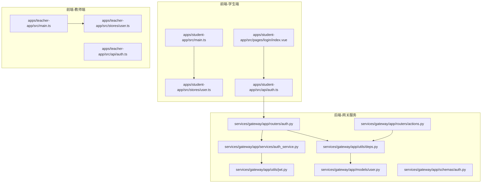
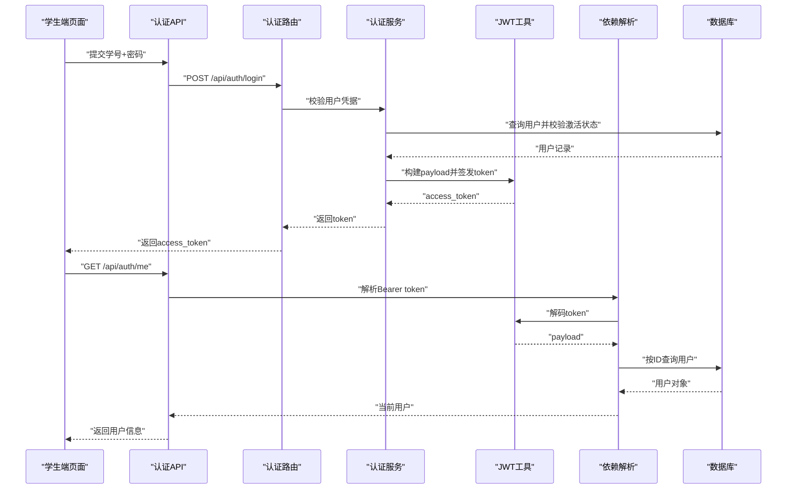
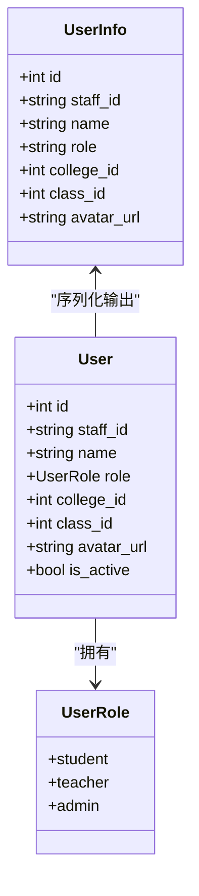
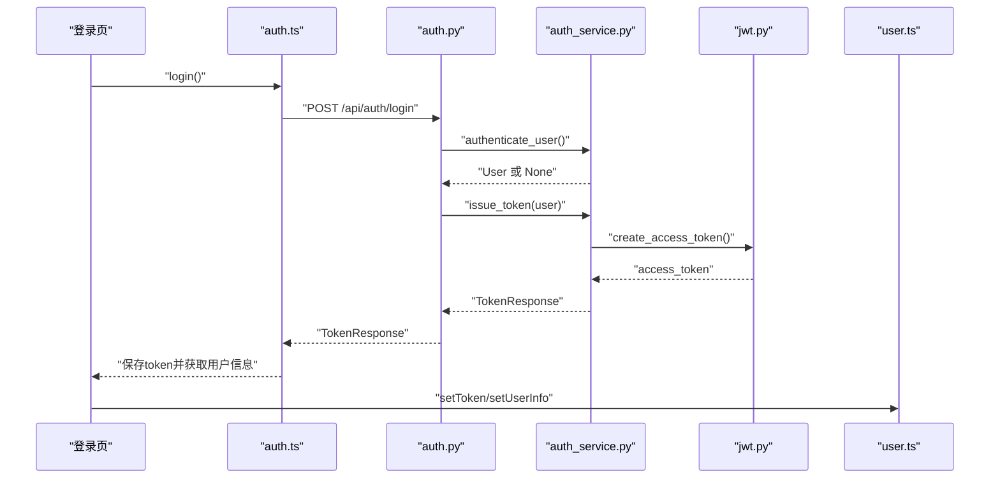
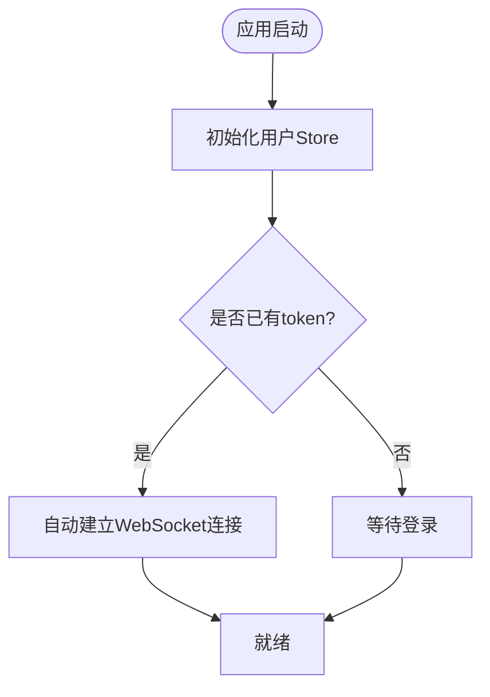
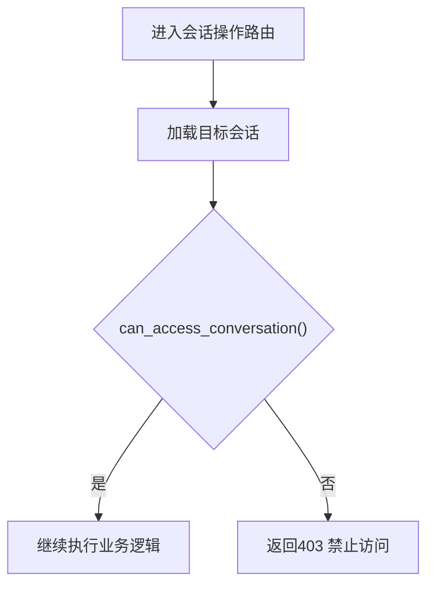
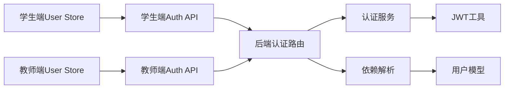
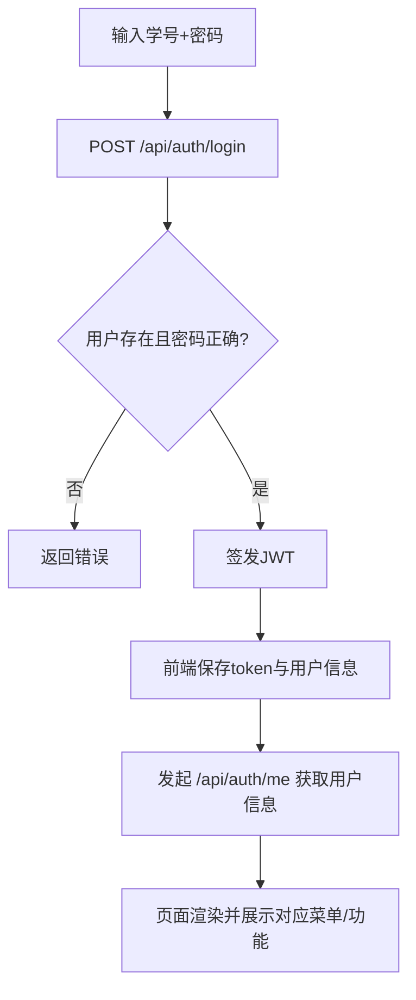

# 角色权限控制

<cite>
**本文引用的文件**
- [apps/student-app/src/stores/user.ts](file://apps/student-app/src/stores/user.ts)
- [apps/teacher-app/src/stores/user.ts](file://apps/teacher-app/src/stores/user.ts)
- [services/gateway/app/models/user.py](file://services/gateway/app/models/user.py)
- [services/gateway/app/schemas/auth.py](file://services/gateway/app/schemas/auth.py)
- [services/gateway/app/services/auth_service.py](file://services/gateway/app/services/auth_service.py)
- [services/gateway/app/utils/jwt.py](file://services/gateway/app/utils/jwt.py)
- [services/gateway/app/routers/auth.py](file://services/gateway/app/routers/auth.py)
- [services/gateway/app/utils/deps.py](file://services/gateway/app/utils/deps.py)
- [apps/student-app/src/api/auth.ts](file://apps/student-app/src/api/auth.ts)
- [apps/teacher-app/src/api/auth.ts](file://apps/teacher-app/src/api/auth.ts)
- [apps/student-app/src/pages/login/index.vue](file://apps/student-app/src/pages/login/index.vue)
- [apps/teacher-app/src/main.ts](file://apps/teacher-app/src/main.ts)
- [apps/student-app/src/main.ts](file://apps/student-app/src/main.ts)
- [apps/teacher-app/src/components/BottomNavBar.vue](file://apps/teacher-app/src/components/BottomNavBar.vue)
- [apps/teacher-app/src/pages/dashboard/index.vue](file://apps/teacher-app/src/pages/dashboard/index.vue)
- [apps/student-app/src/pages/home/index.vue](file://apps/student-app/src/pages/home/index.vue)
- [services/gateway/app/routers/actions.py](file://services/gateway/app/routers/actions.py)
</cite>

## 目录
1. [简介](#简介)
2. [项目结构](#项目结构)
3. [核心组件](#核心组件)
4. [架构总览](#架构总览)
5. [详细组件分析](#详细组件分析)
6. [依赖分析](#依赖分析)
7. [性能考虑](#性能考虑)
8. [故障排查指南](#故障排查指南)
9. [结论](#结论)
10. [附录](#附录)

## 简介
本文件系统性梳理“角色权限控制系统”的设计与实现，覆盖后端基于角色的访问控制（RBAC）模型、JWT 认证与授权、前端状态管理与界面权限呈现，以及从登录到页面访问的完整流程。文档同时给出权限继承、权限组合与动态权限的扩展建议，并提供新增角色与权限的维护与管理方法。

## 项目结构
该系统采用前后端分离架构：
- 前端：学生端与教师端分别独立应用，使用 Pinia 管理用户状态，通过统一的请求封装调用网关接口。
- 后端：FastAPI 网关服务，提供认证、用户信息查询、会话访问控制等能力；数据库模型定义用户角色与组织关系；JWT 用于鉴权。

图表来源
- [apps/student-app/src/main.ts:1-11](file://apps/student-app/src/main.ts#L1-L11)
- [apps/teacher-app/src/main.ts:1-25](file://apps/teacher-app/src/main.ts#L1-L25)
- [apps/student-app/src/stores/user.ts:1-56](file://apps/student-app/src/stores/user.ts#L1-L56)
- [apps/teacher-app/src/stores/user.ts:1-63](file://apps/teacher-app/src/stores/user.ts#L1-L63)
- [apps/student-app/src/pages/login/index.vue:1-148](file://apps/student-app/src/pages/login/index.vue#L1-L148)
- [apps/student-app/src/api/auth.ts:1-20](file://apps/student-app/src/api/auth.ts#L1-L20)
- [apps/teacher-app/src/api/auth.ts:1-43](file://apps/teacher-app/src/api/auth.ts#L1-L43)
- [services/gateway/app/routers/auth.py:1-35](file://services/gateway/app/routers/auth.py#L1-L35)
- [services/gateway/app/services/auth_service.py:1-35](file://services/gateway/app/services/auth_service.py#L1-L35)
- [services/gateway/app/utils/jwt.py:1-17](file://services/gateway/app/utils/jwt.py#L1-L17)
- [services/gateway/app/models/user.py:1-76](file://services/gateway/app/models/user.py#L1-L76)
- [services/gateway/app/schemas/auth.py:1-23](file://services/gateway/app/schemas/auth.py#L1-L23)
- [services/gateway/app/utils/deps.py:1-40](file://services/gateway/app/utils/deps.py#L1-L40)
- [services/gateway/app/routers/actions.py:1-32](file://services/gateway/app/routers/actions.py#L1-L32)

章节来源
- [apps/student-app/src/main.ts:1-11](file://apps/student-app/src/main.ts#L1-L11)
- [apps/teacher-app/src/main.ts:1-25](file://apps/teacher-app/src/main.ts#L1-L25)
- [apps/student-app/src/stores/user.ts:1-56](file://apps/student-app/src/stores/user.ts#L1-L56)
- [apps/teacher-app/src/stores/user.ts:1-63](file://apps/teacher-app/src/stores/user.ts#L1-L63)
- [apps/student-app/src/pages/login/index.vue:1-148](file://apps/student-app/src/pages/login/index.vue#L1-L148)
- [apps/student-app/src/api/auth.ts:1-20](file://apps/student-app/src/api/auth.ts#L1-L20)
- [apps/teacher-app/src/api/auth.ts:1-43](file://apps/teacher-app/src/api/auth.ts#L1-L43)
- [services/gateway/app/routers/auth.py:1-35](file://services/gateway/app/routers/auth.py#L1-L35)
- [services/gateway/app/services/auth_service.py:1-35](file://services/gateway/app/services/auth_service.py#L1-L35)
- [services/gateway/app/utils/jwt.py:1-17](file://services/gateway/app/utils/jwt.py#L1-L17)
- [services/gateway/app/models/user.py:1-76](file://services/gateway/app/models/user.py#L1-L76)
- [services/gateway/app/schemas/auth.py:1-23](file://services/gateway/app/schemas/auth.py#L1-L23)
- [services/gateway/app/utils/deps.py:1-40](file://services/gateway/app/utils/deps.py#L1-L40)
- [services/gateway/app/routers/actions.py:1-32](file://services/gateway/app/routers/actions.py#L1-L32)

## 核心组件
- 角色枚举与用户模型：后端定义学生、教师、管理员三类角色，用户实体包含角色、所属学院与班级等属性，支撑基于角色与组织维度的权限判定。
- 认证与令牌：登录校验学号+密码，成功后签发 JWT，payload 包含用户标识、角色、单位等信息；前端存储 token 并在后续请求中携带。
- 当前用户解析：依赖 HTTP Bearer 令牌，解码后按用户 ID 查询数据库，确保用户存在且有效。
- 前端用户状态：Pinia Store 统一管理 token 与用户信息，支持初始化、设置、登出等动作；教师端额外提供显示名等派生状态。
- 资源访问控制：部分业务路由在进入处理器前进行“可访问性”校验（如会话访问），未通过则返回禁止访问。

章节来源
- [services/gateway/app/models/user.py:10-14](file://services/gateway/app/models/user.py#L10-L14)
- [services/gateway/app/models/user.py:45-58](file://services/gateway/app/models/user.py#L45-L58)
- [services/gateway/app/schemas/auth.py:4-23](file://services/gateway/app/schemas/auth.py#L4-L23)
- [services/gateway/app/services/auth_service.py:8-35](file://services/gateway/app/services/auth_service.py#L8-L35)
- [services/gateway/app/utils/jwt.py:6-17](file://services/gateway/app/utils/jwt.py#L6-L17)
- [services/gateway/app/utils/deps.py:14-35](file://services/gateway/app/utils/deps.py#L14-L35)
- [apps/student-app/src/stores/user.ts:18-55](file://apps/student-app/src/stores/user.ts#L18-L55)
- [apps/teacher-app/src/stores/user.ts:8-62](file://apps/teacher-app/src/stores/user.ts#L8-L62)
- [services/gateway/app/routers/actions.py:24-32](file://services/gateway/app/routers/actions.py#L24-L32)

## 架构总览
下图展示从用户登录到页面访问的关键交互路径，包括认证、令牌发放、前端状态更新与后端资源访问控制。

图表来源
- [apps/student-app/src/pages/login/index.vue:70-97](file://apps/student-app/src/pages/login/index.vue#L70-L97)
- [apps/student-app/src/api/auth.ts:9-19](file://apps/student-app/src/api/auth.ts#L9-L19)
- [services/gateway/app/routers/auth.py:12-35](file://services/gateway/app/routers/auth.py#L12-L35)
- [services/gateway/app/services/auth_service.py:8-35](file://services/gateway/app/services/auth_service.py#L8-L35)
- [services/gateway/app/utils/jwt.py:6-17](file://services/gateway/app/utils/jwt.py#L6-L17)
- [services/gateway/app/utils/deps.py:14-35](file://services/gateway/app/utils/deps.py#L14-L35)
- [services/gateway/app/models/user.py:45-58](file://services/gateway/app/models/user.py#L45-L58)

## 详细组件分析

### 角色与权限模型
- 角色定义：后端以枚举形式定义学生、教师、管理员三种角色，作为权限判定的基础。
- 用户实体：包含角色、所属学院与班级等字段，便于实现基于组织层级的权限约束。
- 权限表达：当前系统以“角色”为最小权限单元，结合资源访问控制（如会话访问）实现细粒度保护。

图表来源
- [services/gateway/app/models/user.py:10-14](file://services/gateway/app/models/user.py#L10-L14)
- [services/gateway/app/models/user.py:45-58](file://services/gateway/app/models/user.py#L45-L58)
- [services/gateway/app/schemas/auth.py:14-23](file://services/gateway/app/schemas/auth.py#L14-L23)

章节来源
- [services/gateway/app/models/user.py:10-14](file://services/gateway/app/models/user.py#L10-L14)
- [services/gateway/app/models/user.py:45-58](file://services/gateway/app/models/user.py#L45-L58)
- [services/gateway/app/schemas/auth.py:14-23](file://services/gateway/app/schemas/auth.py#L14-L23)

### 认证与令牌发放
- 登录流程：接收学号与密码，校验用户是否存在且处于激活状态，再比对密码哈希，通过则签发 JWT。
- JWT 内容：包含用户标识、学号、角色、单位与姓名等，供后续鉴权使用。
- 前端处理：登录成功后保存 token 与用户信息，建立 WebSocket 连接，跳转首页。

图表来源
- [apps/student-app/src/pages/login/index.vue:70-97](file://apps/student-app/src/pages/login/index.vue#L70-L97)
- [apps/student-app/src/api/auth.ts:9-19](file://apps/student-app/src/api/auth.ts#L9-L19)
- [services/gateway/app/routers/auth.py:12-21](file://services/gateway/app/routers/auth.py#L12-L21)
- [services/gateway/app/services/auth_service.py:8-35](file://services/gateway/app/services/auth_service.py#L8-L35)
- [services/gateway/app/utils/jwt.py:6-11](file://services/gateway/app/utils/jwt.py#L6-L11)
- [apps/student-app/src/stores/user.ts:36-44](file://apps/student-app/src/stores/user.ts#L36-L44)

章节来源
- [apps/student-app/src/pages/login/index.vue:70-97](file://apps/student-app/src/pages/login/index.vue#L70-L97)
- [apps/student-app/src/api/auth.ts:9-19](file://apps/student-app/src/api/auth.ts#L9-L19)
- [services/gateway/app/routers/auth.py:12-21](file://services/gateway/app/routers/auth.py#L12-L21)
- [services/gateway/app/services/auth_service.py:8-35](file://services/gateway/app/services/auth_service.py#L8-L35)
- [services/gateway/app/utils/jwt.py:6-11](file://services/gateway/app/utils/jwt.py#L6-L11)
- [apps/student-app/src/stores/user.ts:36-44](file://apps/student-app/src/stores/user.ts#L36-L44)

### 前端状态管理与权限呈现
- 学生端：Pinia Store 维护 token 与用户信息，初始化时从本地缓存恢复；登录成功后写入缓存并连接 WebSocket。
- 教师端：Store 提供显示名等派生状态；应用启动时初始化用户状态，若已登录则自动建立 WebSocket 连接。
- 页面级权限：教师端仪表盘等页面通过用户信息渲染界面元素；底部导航与顶部工具栏根据角色与业务状态展示不同功能入口。

图表来源
- [apps/teacher-app/src/main.ts:9-19](file://apps/teacher-app/src/main.ts#L9-L19)
- [apps/student-app/src/stores/user.ts:24-34](file://apps/student-app/src/stores/user.ts#L24-L34)
- [apps/teacher-app/src/stores/user.ts:19-28](file://apps/teacher-app/src/stores/user.ts#L19-L28)

章节来源
- [apps/student-app/src/stores/user.ts:18-55](file://apps/student-app/src/stores/user.ts#L18-L55)
- [apps/teacher-app/src/stores/user.ts:8-62](file://apps/teacher-app/src/stores/user.ts#L8-L62)
- [apps/teacher-app/src/main.ts:9-19](file://apps/teacher-app/src/main.ts#L9-L19)
- [apps/student-app/src/main.ts:5-10](file://apps/student-app/src/main.ts#L5-L10)

### 资源权限验证（会话访问）
- 访问控制：在执行会话相关操作前，先校验当前用户是否具备访问目标会话的权限，不满足则拒绝。
- 实现要点：通过服务层的访问性判断函数完成校验，避免越权操作。

图表来源
- [services/gateway/app/routers/actions.py:16-32](file://services/gateway/app/routers/actions.py#L16-L32)

章节来源
- [services/gateway/app/routers/actions.py:16-32](file://services/gateway/app/routers/actions.py#L16-L32)

### 前端菜单与功能按钮权限
- 教师端底部导航：包含工作台、消息、知识库、个人中心等入口，具体可用性可结合用户角色与业务状态进一步细化。
- 顶部工具栏：根据页面需要展示搜索、设置、新增、编辑等操作按钮，按钮可见性可依据角色与上下文状态控制。
- 学生端首页：展示快捷提问与最近对话，界面元素根据用户信息动态呈现。

章节来源
- [apps/teacher-app/src/components/BottomNavBar.vue:50-51](file://apps/teacher-app/src/components/BottomNavBar.vue#L50-L51)
- [apps/teacher-app/src/pages/dashboard/index.vue:133-135](file://apps/teacher-app/src/pages/dashboard/index.vue#L133-L135)
- [apps/teacher-app/src/pages/dashboard/index.vue:138-252](file://apps/teacher-app/src/pages/dashboard/index.vue#L138-L252)
- [apps/student-app/src/pages/home/index.vue:1-129](file://apps/student-app/src/pages/home/index.vue#L1-L129)

## 依赖分析
- 前端依赖：学生端与教师端均使用 Pinia 管理状态，通过统一的请求封装调用后端接口；教师端在应用启动时初始化用户状态并建立 WebSocket 连接。
- 后端依赖：认证路由依赖认证服务与 JWT 工具；当前用户解析依赖 HTTP Bearer 与数据库查询；部分业务路由依赖访问性校验服务。

图表来源
- [apps/student-app/src/stores/user.ts:18-55](file://apps/student-app/src/stores/user.ts#L18-L55)
- [apps/teacher-app/src/stores/user.ts:8-62](file://apps/teacher-app/src/stores/user.ts#L8-L62)
- [apps/student-app/src/api/auth.ts:9-19](file://apps/student-app/src/api/auth.ts#L9-L19)
- [apps/teacher-app/src/api/auth.ts:30-42](file://apps/teacher-app/src/api/auth.ts#L30-L42)
- [services/gateway/app/routers/auth.py:12-35](file://services/gateway/app/routers/auth.py#L12-L35)
- [services/gateway/app/services/auth_service.py:8-35](file://services/gateway/app/services/auth_service.py#L8-L35)
- [services/gateway/app/utils/jwt.py:6-17](file://services/gateway/app/utils/jwt.py#L6-L17)
- [services/gateway/app/utils/deps.py:14-35](file://services/gateway/app/utils/deps.py#L14-L35)
- [services/gateway/app/models/user.py:45-58](file://services/gateway/app/models/user.py#L45-L58)

章节来源
- [apps/student-app/src/stores/user.ts:18-55](file://apps/student-app/src/stores/user.ts#L18-L55)
- [apps/teacher-app/src/stores/user.ts:8-62](file://apps/teacher-app/src/stores/user.ts#L8-L62)
- [apps/student-app/src/api/auth.ts:9-19](file://apps/student-app/src/api/auth.ts#L9-L19)
- [apps/teacher-app/src/api/auth.ts:30-42](file://apps/teacher-app/src/api/auth.ts#L30-L42)
- [services/gateway/app/routers/auth.py:12-35](file://services/gateway/app/routers/auth.py#L12-L35)
- [services/gateway/app/services/auth_service.py:8-35](file://services/gateway/app/services/auth_service.py#L8-L35)
- [services/gateway/app/utils/jwt.py:6-17](file://services/gateway/app/utils/jwt.py#L6-L17)
- [services/gateway/app/utils/deps.py:14-35](file://services/gateway/app/utils/deps.py#L14-L35)
- [services/gateway/app/models/user.py:45-58](file://services/gateway/app/models/user.py#L45-L58)

## 性能考虑
- 令牌有效期：JWT 设置了过期时间，减少长期持有令牌带来的风险；建议结合刷新策略与安全轮换。
- 数据库查询：当前用户解析仅按用户 ID 查询，索引与缓存策略需保证高并发下的响应时间。
- 前端状态持久化：Token 与用户信息本地缓存提升用户体验，注意清理时机与异常处理。
- WebSocket 连接：登录成功后建立连接，避免重复握手与不必要的网络开销。

## 故障排查指南
- 登录失败
  - 可能原因：学号不存在、密码错误、用户未激活。
  - 处理建议：检查后端登录接口返回的错误信息，确认用户状态与密码哈希匹配。
- 令牌无效或过期
  - 可能原因：令牌被篡改、签名算法不一致、过期时间已到。
  - 处理建议：重新登录获取新令牌；核对后端 JWT 配置与前端存储逻辑。
- 无法获取用户信息
  - 可能原因：令牌缺失或格式不正确、当前用户解析失败。
  - 处理建议：检查请求头 Authorization 是否为 Bearer 令牌；确认用户存在且启用。
- 会话访问被拒绝
  - 可能原因：当前用户不具备访问目标会话的权限。
  - 处理建议：检查访问性校验逻辑与用户角色/组织关系。

章节来源
- [services/gateway/app/routers/auth.py:16-21](file://services/gateway/app/routers/auth.py#L16-L21)
- [services/gateway/app/utils/deps.py:18-35](file://services/gateway/app/utils/deps.py#L18-L35)
- [services/gateway/app/routers/actions.py:30-32](file://services/gateway/app/routers/actions.py#L30-L32)

## 结论
本权限系统以角色为核心，结合 JWT 与资源访问控制，实现了从前端登录到后端资源访问的全链路权限保障。当前已覆盖学生、教师、管理员三类角色与基础的会话访问控制。为进一步增强系统能力，建议引入更细粒度的权限点、权限继承与组合、动态权限配置与审计日志，以满足复杂业务场景与合规要求。

## 附录

### 权限控制流程（从登录到页面访问）

图表来源
- [apps/student-app/src/pages/login/index.vue:70-97](file://apps/student-app/src/pages/login/index.vue#L70-L97)
- [apps/student-app/src/api/auth.ts:9-19](file://apps/student-app/src/api/auth.ts#L9-L19)
- [services/gateway/app/routers/auth.py:12-35](file://services/gateway/app/routers/auth.py#L12-L35)

### 扩展角色与权限的建议
- 新增角色
  - 在后端模型中扩展角色枚举，并在认证服务与依赖解析处同步更新。
  - 在前端 Store 中补充角色相关的派生状态与权限判断逻辑。
- 权限点与组合
  - 引入权限点表与角色-权限映射表，支持权限组合与继承。
  - 在后端路由与服务层增加权限点校验中间件。
- 动态权限
  - 将权限配置集中于配置中心或数据库，运行时拉取并缓存。
  - 前端根据用户最新权限动态渲染菜单与按钮。
- 审计与监控
  - 记录关键操作的权限决策日志，便于审计与问题追踪。