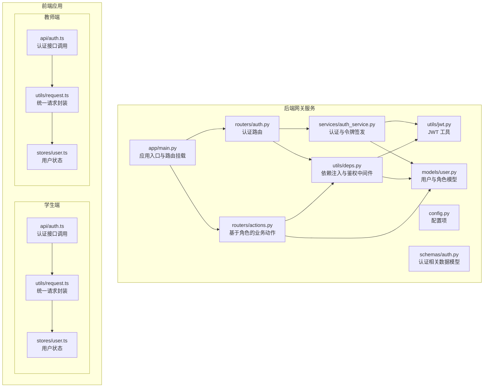
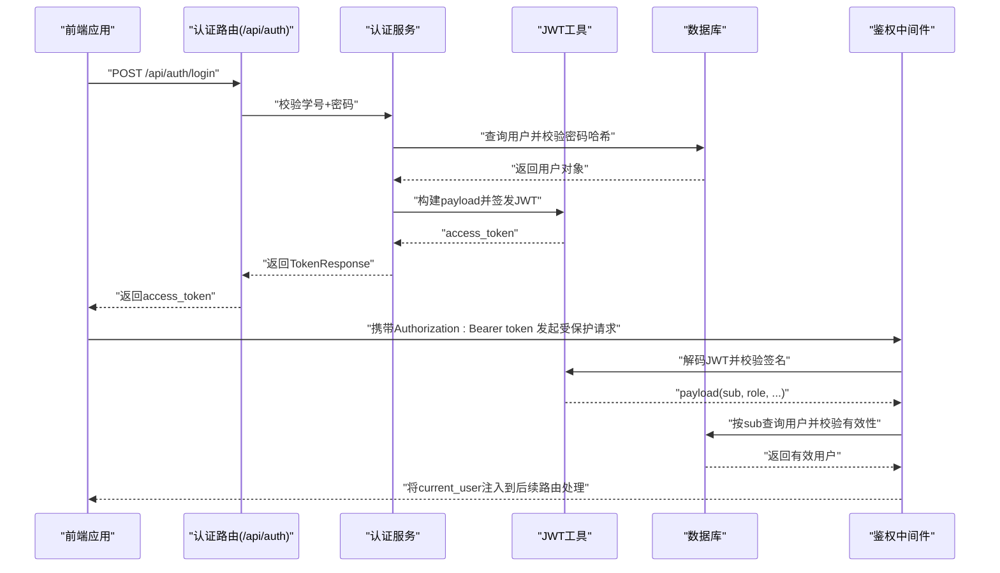
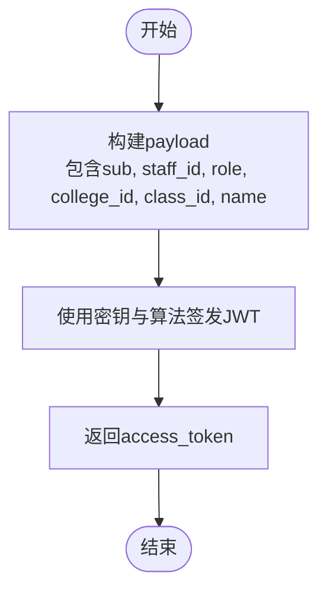
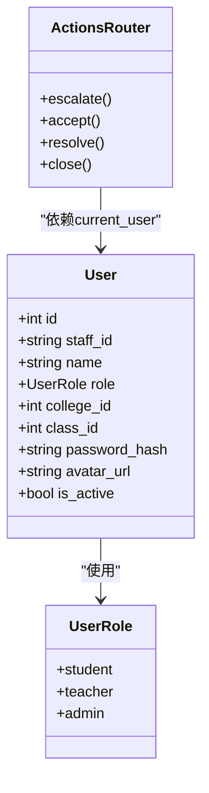
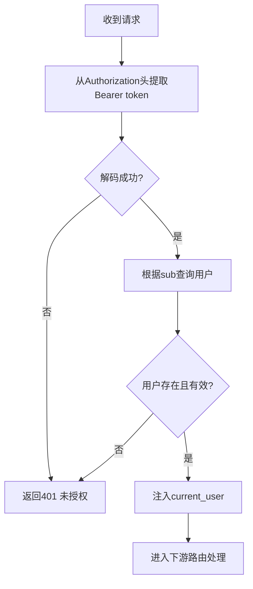
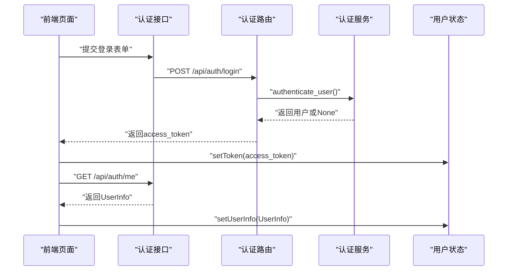
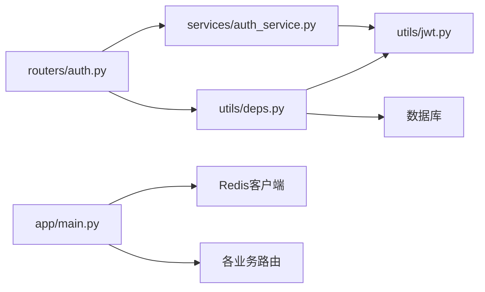

# 认证授权系统

<cite>
**本文引用的文件**
- [services/gateway/app/utils/jwt.py](file://services/gateway/app/utils/jwt.py)
- [services/gateway/app/services/auth_service.py](file://services/gateway/app/services/auth_service.py)
- [services/gateway/app/routers/auth.py](file://services/gateway/app/routers/auth.py)
- [services/gateway/app/schemas/auth.py](file://services/gateway/app/schemas/auth.py)
- [services/gateway/app/models/user.py](file://services/gateway/app/models/user.py)
- [services/gateway/app/utils/deps.py](file://services/gateway/app/utils/deps.py)
- [services/gateway/app/config.py](file://services/gateway/app/config.py)
- [services/gateway/app/main.py](file://services/gateway/app/main.py)
- [services/gateway/app/routers/actions.py](file://services/gateway/app/routers/actions.py)
- [apps/student-app/src/stores/user.ts](file://apps/student-app/src/stores/user.ts)
- [apps/teacher-app/src/stores/user.ts](file://apps/teacher-app/src/stores/user.ts)
- [apps/student-app/src/api/auth.ts](file://apps/student-app/src/api/auth.ts)
- [apps/teacher-app/src/api/auth.ts](file://apps/teacher-app/src/api/auth.ts)
- [apps/student-app/src/utils/request.ts](file://apps/student-app/src/utils/request.ts)
- [apps/teacher-app/src/utils/request.ts](file://apps/teacher-app/src/utils/request.ts)
</cite>

## 目录
1. [简介](#简介)
2. [项目结构](#项目结构)
3. [核心组件](#核心组件)
4. [架构总览](#架构总览)
5. [详细组件分析](#详细组件分析)
6. [依赖分析](#依赖分析)
7. [性能考虑](#性能考虑)
8. [故障排查指南](#故障排查指南)
9. [结论](#结论)
10. [附录](#附录)

## 简介
本文件系统性梳理“医小管 v2”认证授权体系，覆盖以下主题：
- JWT 令牌生命周期：签发、解析与校验
- 角色权限模型：用户角色、权限边界与访问控制
- 中间件与安全策略：请求拦截、权限检查、异常处理
- 完整认证流程：从登录到会话维护
- 安全最佳实践与常见攻击防护
- 前端状态管理与后端会话管理的协同机制

## 项目结构
认证授权相关代码主要分布在网关服务与两个前端应用中：
- 后端网关服务（FastAPI）：负责用户认证、JWT 签发与校验、权限检查、路由挂载
- 前端应用（学生端/教师端）：负责登录表单提交、令牌存储、请求头注入、登出清理

图表来源
- [services/gateway/app/main.py:1-78](file://services/gateway/app/main.py#L1-L78)
- [services/gateway/app/routers/auth.py:1-35](file://services/gateway/app/routers/auth.py#L1-L35)
- [services/gateway/app/utils/deps.py:1-40](file://services/gateway/app/utils/deps.py#L1-L40)
- [services/gateway/app/utils/jwt.py:1-17](file://services/gateway/app/utils/jwt.py#L1-L17)
- [services/gateway/app/services/auth_service.py:1-35](file://services/gateway/app/services/auth_service.py#L1-L35)
- [services/gateway/app/models/user.py:1-76](file://services/gateway/app/models/user.py#L1-L76)
- [services/gateway/app/schemas/auth.py:1-23](file://services/gateway/app/schemas/auth.py#L1-L23)
- [services/gateway/app/routers/actions.py:1-154](file://services/gateway/app/routers/actions.py#L1-L154)
- [apps/student-app/src/api/auth.ts:1-20](file://apps/student-app/src/api/auth.ts#L1-L20)
- [apps/teacher-app/src/api/auth.ts:1-43](file://apps/teacher-app/src/api/auth.ts#L1-L43)
- [apps/student-app/src/utils/request.ts:1-44](file://apps/student-app/src/utils/request.ts#L1-L44)
- [apps/teacher-app/src/utils/request.ts:1-108](file://apps/teacher-app/src/utils/request.ts#L1-L108)
- [apps/student-app/src/stores/user.ts:1-56](file://apps/student-app/src/stores/user.ts#L1-L56)
- [apps/teacher-app/src/stores/user.ts:1-63](file://apps/teacher-app/src/stores/user.ts#L1-L63)

章节来源
- [services/gateway/app/main.py:1-78](file://services/gateway/app/main.py#L1-L78)
- [services/gateway/app/routers/auth.py:1-35](file://services/gateway/app/routers/auth.py#L1-L35)
- [apps/student-app/src/api/auth.ts:1-20](file://apps/student-app/src/api/auth.ts#L1-L20)
- [apps/teacher-app/src/api/auth.ts:1-43](file://apps/teacher-app/src/api/auth.ts#L1-L43)

## 核心组件
- JWT 工具：提供令牌签发与解码能力
- 认证服务：完成凭证校验、用户查找与令牌签发
- 认证路由：对外暴露登录与“获取当前用户”接口
- 依赖注入与鉴权中间件：从请求头提取并校验 JWT，解析用户上下文
- 用户模型与角色枚举：定义用户角色与属性
- 前端用户状态与请求封装：负责令牌持久化、请求头注入与登出清理

章节来源
- [services/gateway/app/utils/jwt.py:1-17](file://services/gateway/app/utils/jwt.py#L1-L17)
- [services/gateway/app/services/auth_service.py:1-35](file://services/gateway/app/services/auth_service.py#L1-L35)
- [services/gateway/app/routers/auth.py:1-35](file://services/gateway/app/routers/auth.py#L1-L35)
- [services/gateway/app/utils/deps.py:1-40](file://services/gateway/app/utils/deps.py#L1-L40)
- [services/gateway/app/models/user.py:1-76](file://services/gateway/app/models/user.py#L1-L76)
- [apps/student-app/src/stores/user.ts:1-56](file://apps/student-app/src/stores/user.ts#L1-L56)
- [apps/teacher-app/src/stores/user.ts:1-63](file://apps/teacher-app/src/stores/user.ts#L1-L63)
- [apps/student-app/src/utils/request.ts:1-44](file://apps/student-app/src/utils/request.ts#L1-L44)
- [apps/teacher-app/src/utils/request.ts:1-108](file://apps/teacher-app/src/utils/request.ts#L1-L108)

## 架构总览
下图展示认证授权的整体交互：前端通过登录接口获取 JWT，随后在每次请求中携带该令牌；后端中间件解析令牌并注入当前用户上下文，再进入具体路由处理。

图表来源
- [services/gateway/app/routers/auth.py:12-21](file://services/gateway/app/routers/auth.py#L12-L21)
- [services/gateway/app/services/auth_service.py:8-17](file://services/gateway/app/services/auth_service.py#L8-L17)
- [services/gateway/app/utils/jwt.py:6-11](file://services/gateway/app/utils/jwt.py#L6-L11)
- [services/gateway/app/utils/deps.py:14-35](file://services/gateway/app/utils/deps.py#L14-L35)
- [services/gateway/app/models/user.py:45-58](file://services/gateway/app/models/user.py#L45-L58)

## 详细组件分析

### JWT 令牌管理
- 令牌签发
  - 使用配置中的密钥与算法生成 JWT，设置过期时间（小时）
  - payload 包含用户标识、角色、所属学院/班级等信息
- 令牌解码
  - 从请求头中读取 Bearer 令牌并进行签名与过期校验
  - 失败时抛出认证异常，触发 401

图表来源
- [services/gateway/app/services/auth_service.py:20-29](file://services/gateway/app/services/auth_service.py#L20-L29)
- [services/gateway/app/utils/jwt.py:6-11](file://services/gateway/app/utils/jwt.py#L6-L11)

章节来源
- [services/gateway/app/utils/jwt.py:1-17](file://services/gateway/app/utils/jwt.py#L1-L17)
- [services/gateway/app/services/auth_service.py:20-35](file://services/gateway/app/services/auth_service.py#L20-L35)
- [services/gateway/app/config.py:10-13](file://services/gateway/app/config.py#L10-L13)

### 角色权限控制
- 角色定义
  - 用户角色枚举包含 student、teacher、admin
  - 用户模型包含角色字段及所属学院/班级外键
- 权限边界
  - 不同业务动作对角色有严格限制（如仅学生可发起升级、仅教师可接单、仅接单教师可标记解决）
  - 会话访问控制：非本人或非本学院教师不可操作他人会话
- 访问控制实现
  - 通过依赖注入中间件解析 JWT 并注入 current_user
  - 在业务路由中再次校验角色与资源归属

图表来源
- [services/gateway/app/models/user.py:10-14](file://services/gateway/app/models/user.py#L10-L14)
- [services/gateway/app/models/user.py:45-58](file://services/gateway/app/models/user.py#L45-L58)
- [services/gateway/app/routers/actions.py:68-134](file://services/gateway/app/routers/actions.py#L68-L134)

章节来源
- [services/gateway/app/models/user.py:1-76](file://services/gateway/app/models/user.py#L1-L76)
- [services/gateway/app/routers/actions.py:1-154](file://services/gateway/app/routers/actions.py#L1-L154)

### 中间件与安全策略
- 请求拦截与权限检查
  - 通过 HTTP Bearer 方式携带 JWT
  - 中间件解码 JWT，解析用户标识并回查数据库确认用户存在且有效
  - 任何解码失败、payload 缺失或用户失效均返回 401
- 异常处理
  - 401 未授权：前端清除本地令牌并跳转登录页
  - 422 参数错误：前端提示参数校验失败
  - 其他 HTTP 错误：统一提示后端错误信息

图表来源
- [services/gateway/app/utils/deps.py:14-35](file://services/gateway/app/utils/deps.py#L14-L35)
- [apps/student-app/src/utils/request.ts:25-28](file://apps/student-app/src/utils/request.ts#L25-L28)
- [apps/teacher-app/src/utils/request.ts:42-48](file://apps/teacher-app/src/utils/request.ts#L42-L48)

章节来源
- [services/gateway/app/utils/deps.py:1-40](file://services/gateway/app/utils/deps.py#L1-L40)
- [apps/student-app/src/utils/request.ts:1-44](file://apps/student-app/src/utils/request.ts#L1-L44)
- [apps/teacher-app/src/utils/request.ts:1-108](file://apps/teacher-app/src/utils/request.ts#L1-L108)

### 完整认证流程
- 登录
  - 前端提交学号与密码至 /api/auth/login
  - 后端校验用户与密码哈希，成功则签发 JWT
  - 前端持久化令牌并在后续请求头中携带 Authorization: Bearer
- 获取当前用户
  - 前端调用 /api/auth/me，后端中间件解析 JWT 并返回用户信息
- 会话维护
  - 前端在初始化时读取本地存储的令牌并尝试建立 WebSocket 连接
  - 401 时自动清理本地状态并跳转登录页

图表来源
- [apps/student-app/src/api/auth.ts:9-15](file://apps/student-app/src/api/auth.ts#L9-L15)
- [apps/teacher-app/src/api/auth.ts:30-42](file://apps/teacher-app/src/api/auth.ts#L30-L42)
- [services/gateway/app/routers/auth.py:12-21](file://services/gateway/app/routers/auth.py#L12-L21)
- [services/gateway/app/routers/auth.py:24-34](file://services/gateway/app/routers/auth.py#L24-L34)
- [apps/student-app/src/stores/user.ts:36-44](file://apps/student-app/src/stores/user.ts#L36-L44)
- [apps/teacher-app/src/stores/user.ts:30-38](file://apps/teacher-app/src/stores/user.ts#L30-L38)

章节来源
- [services/gateway/app/routers/auth.py:1-35](file://services/gateway/app/routers/auth.py#L1-L35)
- [services/gateway/app/services/auth_service.py:8-17](file://services/gateway/app/services/auth_service.py#L8-L17)
- [apps/student-app/src/api/auth.ts:1-20](file://apps/student-app/src/api/auth.ts#L1-L20)
- [apps/teacher-app/src/api/auth.ts:1-43](file://apps/teacher-app/src/api/auth.ts#L1-L43)
- [apps/student-app/src/stores/user.ts:1-56](file://apps/student-app/src/stores/user.ts#L1-L56)
- [apps/teacher-app/src/stores/user.ts:1-63](file://apps/teacher-app/src/stores/user.ts#L1-L63)

### 前端状态管理与后端会话管理的协调
- 令牌持久化
  - 学生端与教师端分别使用独立的存储键名持久化 token 与用户信息
- 请求头注入
  - 统一请求封装在请求头中附加 Authorization: Bearer token
- 登出与清理
  - 登出时移除本地存储并断开 WebSocket 连接
- 401 自动跳转
  - 401 时前端自动清理状态并跳转登录页

章节来源
- [apps/student-app/src/stores/user.ts:15-56](file://apps/student-app/src/stores/user.ts#L15-L56)
- [apps/teacher-app/src/stores/user.ts:5-63](file://apps/teacher-app/src/stores/user.ts#L5-L63)
- [apps/student-app/src/utils/request.ts:17-21](file://apps/student-app/src/utils/request.ts#L17-L21)
- [apps/teacher-app/src/utils/request.ts:67-73](file://apps/teacher-app/src/utils/request.ts#L67-L73)
- [apps/student-app/src/utils/request.ts:25-28](file://apps/student-app/src/utils/request.ts#L25-L28)
- [apps/teacher-app/src/utils/request.ts:42-48](file://apps/teacher-app/src/utils/request.ts#L42-L48)

## 依赖分析
- 组件耦合
  - 认证路由依赖认证服务与 JWT 工具
  - 鉴权中间件依赖 JWT 工具与数据库查询
  - 业务路由依赖鉴权中间件与用户模型
- 外部依赖
  - Redis 用于会话/缓存（在生命周期中初始化与关闭）
  - 数据库驱动为异步 PostgreSQL
- 配置集中化
  - JWT 密钥、算法、过期时长集中于配置类

图表来源
- [services/gateway/app/routers/auth.py:1-35](file://services/gateway/app/routers/auth.py#L1-L35)
- [services/gateway/app/services/auth_service.py:1-35](file://services/gateway/app/services/auth_service.py#L1-L35)
- [services/gateway/app/utils/jwt.py:1-17](file://services/gateway/app/utils/jwt.py#L1-L17)
- [services/gateway/app/utils/deps.py:1-40](file://services/gateway/app/utils/deps.py#L1-L40)
- [services/gateway/app/main.py:16-22](file://services/gateway/app/main.py#L16-L22)

章节来源
- [services/gateway/app/main.py:1-78](file://services/gateway/app/main.py#L1-L78)
- [services/gateway/app/config.py:1-31](file://services/gateway/app/config.py#L1-L31)

## 性能考虑
- JWT 解码成本低，适合高并发场景
- 建议将用户信息缓存于 Redis，减少数据库查询次数
- 对频繁访问的公开接口可考虑短期缓存策略
- 令牌过期时间需平衡安全性与用户体验

## 故障排查指南
- 401 未授权
  - 检查前端是否正确注入 Authorization 头
  - 检查后端 JWT 密钥、算法与前端一致
  - 检查用户是否存在且 is_active 为真
- 403 禁止访问
  - 检查当前用户角色是否满足业务动作要求
  - 检查资源归属（如仅本人或本学院教师可操作）
- 422 参数错误
  - 检查请求体字段是否符合后端模型定义
- 健康检查失败
  - 检查数据库与 Redis 连通性
  - 检查外部 Dify 服务可用性

章节来源
- [services/gateway/app/utils/deps.py:18-35](file://services/gateway/app/utils/deps.py#L18-L35)
- [services/gateway/app/routers/actions.py:75-79](file://services/gateway/app/routers/actions.py#L75-L79)
- [services/gateway/app/main.py:30-68](file://services/gateway/app/main.py#L30-L68)

## 结论
本认证授权系统采用 JWT 无状态认证与 FastAPI 中间件结合的方式，实现了清晰的角色权限控制与统一的安全策略。前后端通过约定的请求头与状态管理实现无缝衔接，具备良好的可扩展性与可维护性。建议在生产环境中强化密钥管理、引入刷新令牌与黑名单机制，并持续监控健康状态与访问日志。

## 附录

### 安全最佳实践
- 强制 HTTPS 传输，避免令牌在传输中泄露
- 定期轮换 JWT 密钥，缩短令牌有效期
- 引入刷新令牌与黑名单，支持主动撤销
- 对敏感操作增加二次校验（如短信/邮箱验证码）
- 限制请求频率，防止暴力破解
- 审计登录与关键操作日志，定期巡检

### 常见攻击与防护
- XSS：前端对输入与输出进行严格转义与校验
- CSRF：后端启用 CORS 与 SameSite Cookie（若使用 Cookie）
- 重放攻击：使用一次性 nonce 与短时效令牌
- 权限提升：严格的角色与资源边界校验
- 暴力破解：账户锁定与验证码机制