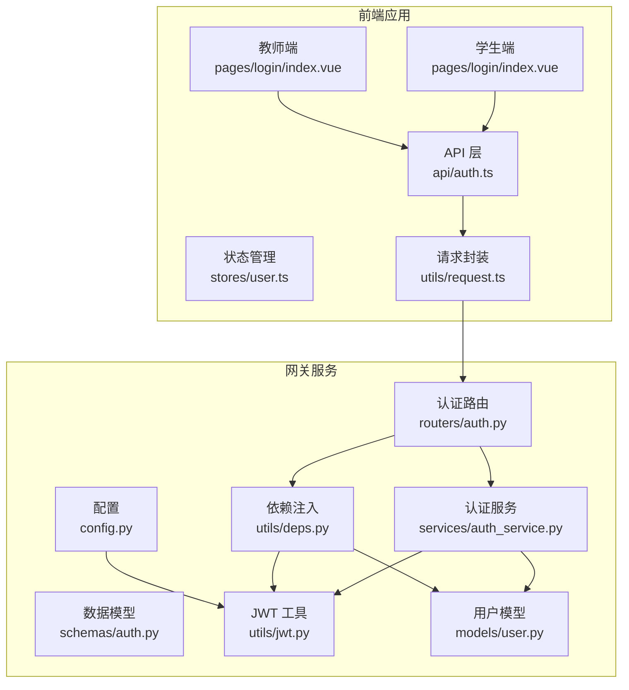
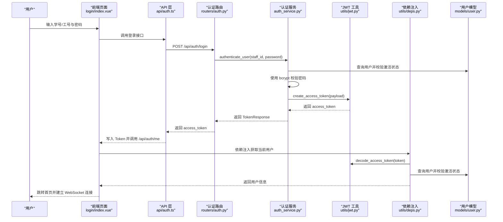
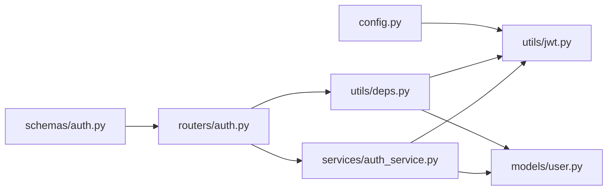

# 认证流程详解

<cite>
**本文档引用的文件**
- [apps/student-app/src/api/auth.ts](file://apps/student-app/src/api/auth.ts)
- [apps/teacher-app/src/api/auth.ts](file://apps/teacher-app/src/api/auth.ts)
- [services/gateway/app/routers/auth.py](file://services/gateway/app/routers/auth.py)
- [services/gateway/app/schemas/auth.py](file://services/gateway/app/schemas/auth.py)
- [services/gateway/app/services/auth_service.py](file://services/gateway/app/services/auth_service.py)
- [services/gateway/app/utils/jwt.py](file://services/gateway/app/utils/jwt.py)
- [services/gateway/app/utils/deps.py](file://services/gateway/app/utils/deps.py)
- [services/gateway/app/models/user.py](file://services/gateway/app/models/user.py)
- [apps/student-app/src/stores/user.ts](file://apps/student-app/src/stores/user.ts)
- [apps/teacher-app/src/stores/user.ts](file://apps/teacher-app/src/stores/user.ts)
- [apps/student-app/src/pages/login/index.vue](file://apps/student-app/src/pages/login/index.vue)
- [apps/teacher-app/src/pages/login/index.vue](file://apps/teacher-app/src/pages/login/index.vue)
- [apps/student-app/src/utils/request.ts](file://apps/student-app/src/utils/request.ts)
- [apps/teacher-app/src/utils/request.ts](file://apps/teacher-app/src/utils/request.ts)
- [services/gateway/app/config.py](file://services/gateway/app/config.py)
</cite>

## 目录
1. [简介](#简介)
2. [项目结构](#项目结构)
3. [核心组件](#核心组件)
4. [架构总览](#架构总览)
5. [详细组件分析](#详细组件分析)
6. [依赖关系分析](#依赖关系分析)
7. [性能考虑](#性能考虑)
8. [故障排除指南](#故障排除指南)
9. [结论](#结论)
10. [附录](#附录)

## 简介
本文件系统性梳理“医小管”平台的认证流程，覆盖从前端登录到后端鉴权、令牌签发与会话维护的完整链路。重点说明：
- 登录请求处理与参数校验
- 用户身份验证与密码校验策略
- JWT 令牌签发与有效期管理
- 会话建立、状态维护与错误恢复
- 不同用户角色（学生、教师）在认证流程中的差异与特殊处理
- 完整的流程图与时序图，帮助快速理解组件协作关系

## 项目结构
认证相关代码主要分布在以下位置：
- 前端应用（学生端与教师端）：页面组件负责表单收集与调用 API；store 负责本地存储与会话状态；工具层封装统一请求与拦截器。
- 网关服务（FastAPI）：路由定义登录与用户信息接口；服务层实现用户认证与令牌签发；工具层提供 JWT 编解码与依赖注入；模型层定义用户与角色枚举。

图表来源
- [apps/student-app/src/pages/login/index.vue:70-97](file://apps/student-app/src/pages/login/index.vue#L70-L97)
- [apps/teacher-app/src/pages/login/index.vue:165-191](file://apps/teacher-app/src/pages/login/index.vue#L165-L191)
- [apps/student-app/src/api/auth.ts:9-15](file://apps/student-app/src/api/auth.ts#L9-L15)
- [apps/teacher-app/src/api/auth.ts:30-35](file://apps/teacher-app/src/api/auth.ts#L30-L35)
- [apps/student-app/src/utils/request.ts:10-43](file://apps/student-app/src/utils/request.ts#L10-L43)
- [apps/teacher-app/src/utils/request.ts:10-77](file://apps/teacher-app/src/utils/request.ts#L10-L77)
- [services/gateway/app/routers/auth.py:12-34](file://services/gateway/app/routers/auth.py#L12-L34)
- [services/gateway/app/services/auth_service.py:8-35](file://services/gateway/app/services/auth_service.py#L8-L35)
- [services/gateway/app/utils/jwt.py:6-16](file://services/gateway/app/utils/jwt.py#L6-L16)
- [services/gateway/app/utils/deps.py:14-35](file://services/gateway/app/utils/deps.py#L14-L35)
- [services/gateway/app/models/user.py:45-58](file://services/gateway/app/models/user.py#L45-L58)
- [services/gateway/app/config.py:10-13](file://services/gateway/app/config.py#L10-L13)

章节来源
- [apps/student-app/src/pages/login/index.vue:1-148](file://apps/student-app/src/pages/login/index.vue#L1-L148)
- [apps/teacher-app/src/pages/login/index.vue:1-567](file://apps/teacher-app/src/pages/login/index.vue#L1-L567)
- [apps/student-app/src/api/auth.ts:1-20](file://apps/student-app/src/api/auth.ts#L1-L20)
- [apps/teacher-app/src/api/auth.ts:1-43](file://apps/teacher-app/src/api/auth.ts#L1-L43)
- [apps/student-app/src/utils/request.ts:1-44](file://apps/student-app/src/utils/request.ts#L1-L44)
- [apps/teacher-app/src/utils/request.ts:1-108](file://apps/teacher-app/src/utils/request.ts#L1-L108)
- [services/gateway/app/routers/auth.py:1-35](file://services/gateway/app/routers/auth.py#L1-L35)
- [services/gateway/app/schemas/auth.py:1-23](file://services/gateway/app/schemas/auth.py#L1-L23)
- [services/gateway/app/services/auth_service.py:1-35](file://services/gateway/app/services/auth_service.py#L1-L35)
- [services/gateway/app/utils/jwt.py:1-17](file://services/gateway/app/utils/jwt.py#L1-L17)
- [services/gateway/app/utils/deps.py:1-40](file://services/gateway/app/utils/deps.py#L1-L40)
- [services/gateway/app/models/user.py:1-76](file://services/gateway/app/models/user.py#L1-L76)
- [services/gateway/app/config.py:1-31](file://services/gateway/app/config.py#L1-L31)

## 核心组件
- 前端登录页面与表单校验：负责收集学号/工号与密码，触发登录流程，并在成功后拉取用户信息与建立 WebSocket 连接。
- 前端 API 层：封装登录与获取用户信息的接口，统一请求头携带 Bearer Token。
- 前端状态管理：持久化存储 Token 与用户信息，初始化时尝试恢复会话。
- 网关认证路由：提供 POST /api/auth/login 与 GET /api/auth/me，分别用于登录与获取当前用户信息。
- 认证服务：执行用户凭据校验与密码哈希验证，签发 JWT。
- JWT 工具：生成与解析 JWT，设置过期时间与算法。
- 依赖注入：从 Authorization 头解析 JWT，解析出用户 ID 并查询数据库确认用户有效性。
- 用户模型：定义用户角色枚举与字段，支撑认证与会话信息。

章节来源
- [apps/student-app/src/pages/login/index.vue:70-97](file://apps/student-app/src/pages/login/index.vue#L70-L97)
- [apps/teacher-app/src/pages/login/index.vue:165-191](file://apps/teacher-app/src/pages/login/index.vue#L165-L191)
- [apps/student-app/src/api/auth.ts:9-19](file://apps/student-app/src/api/auth.ts#L9-L19)
- [apps/teacher-app/src/api/auth.ts:30-42](file://apps/teacher-app/src/api/auth.ts#L30-L42)
- [apps/student-app/src/stores/user.ts:18-55](file://apps/student-app/src/stores/user.ts#L18-L55)
- [apps/teacher-app/src/stores/user.ts:8-62](file://apps/teacher-app/src/stores/user.ts#L8-L62)
- [services/gateway/app/routers/auth.py:12-34](file://services/gateway/app/routers/auth.py#L12-L34)
- [services/gateway/app/services/auth_service.py:8-35](file://services/gateway/app/services/auth_service.py#L8-L35)
- [services/gateway/app/utils/jwt.py:6-16](file://services/gateway/app/utils/jwt.py#L6-L16)
- [services/gateway/app/utils/deps.py:14-35](file://services/gateway/app/utils/deps.py#L14-L35)
- [services/gateway/app/models/user.py:45-58](file://services/gateway/app/models/user.py#L45-L58)

## 架构总览
下图展示从用户登录到会话建立的关键交互：

图表来源
- [apps/student-app/src/pages/login/index.vue:70-97](file://apps/student-app/src/pages/login/index.vue#L70-L97)
- [apps/teacher-app/src/pages/login/index.vue:165-191](file://apps/teacher-app/src/pages/login/index.vue#L165-L191)
- [apps/student-app/src/api/auth.ts:9-19](file://apps/student-app/src/api/auth.ts#L9-L19)
- [apps/teacher-app/src/api/auth.ts:30-42](file://apps/teacher-app/src/api/auth.ts#L30-L42)
- [services/gateway/app/routers/auth.py:12-34](file://services/gateway/app/routers/auth.py#L12-L34)
- [services/gateway/app/services/auth_service.py:8-35](file://services/gateway/app/services/auth_service.py#L8-L35)
- [services/gateway/app/utils/jwt.py:6-16](file://services/gateway/app/utils/jwt.py#L6-L16)
- [services/gateway/app/utils/deps.py:14-35](file://services/gateway/app/utils/deps.py#L14-L35)
- [services/gateway/app/models/user.py:45-58](file://services/gateway/app/models/user.py#L45-L58)

## 详细组件分析

### 登录请求处理与参数校验
- 学生端与教师端登录页均进行基础表单校验（用户名/工号与密码非空），防止空值请求。
- 登录成功后，前端调用获取用户信息接口，写入本地存储，并建立 WebSocket 连接以支持实时通信。

章节来源
- [apps/student-app/src/pages/login/index.vue:70-97](file://apps/student-app/src/pages/login/index.vue#L70-L97)
- [apps/teacher-app/src/pages/login/index.vue:165-191](file://apps/teacher-app/src/pages/login/index.vue#L165-L191)
- [apps/student-app/src/api/auth.ts:9-19](file://apps/student-app/src/api/auth.ts#L9-L19)
- [apps/teacher-app/src/api/auth.ts:30-42](file://apps/teacher-app/src/api/auth.ts#L30-L42)

### 用户身份验证与密码校验
- 后端通过认证服务查询用户并检查激活状态，随后使用哈希算法校验密码。
- 若凭据不匹配或用户未激活，返回未授权错误。

章节来源
- [services/gateway/app/services/auth_service.py:8-17](file://services/gateway/app/services/auth_service.py#L8-L17)
- [services/gateway/app/utils/deps.py:29-34](file://services/gateway/app/utils/deps.py#L29-L34)
- [services/gateway/app/models/user.py:45-58](file://services/gateway/app/models/user.py#L45-L58)

### 令牌发放与 JWT 生命周期
- 认证服务基于用户信息构建 JWT 载荷，设置过期时间后签发访问令牌。
- JWT 工具使用对称密钥与指定算法进行编码与解码，配置项可调整过期时长与算法。

章节来源
- [services/gateway/app/services/auth_service.py:20-35](file://services/gateway/app/services/auth_service.py#L20-L35)
- [services/gateway/app/utils/jwt.py:6-16](file://services/gateway/app/utils/jwt.py#L6-L16)
- [services/gateway/app/config.py:10-13](file://services/gateway/app/config.py#L10-L13)

### 会话建立与状态维护
- 前端 store 在初始化时读取本地存储的 Token 与用户信息，若存在则自动连接 WebSocket。
- 登录成功后，前端将 Token 写入本地存储，并在后续请求中通过请求头携带 Authorization: Bearer。

章节来源
- [apps/student-app/src/stores/user.ts:24-34](file://apps/student-app/src/stores/user.ts#L24-L34)
- [apps/teacher-app/src/stores/user.ts:19-28](file://apps/teacher-app/src/stores/user.ts#L19-L28)
- [apps/student-app/src/utils/request.ts:17-19](file://apps/student-app/src/utils/request.ts#L17-L19)
- [apps/teacher-app/src/utils/request.ts:67-73](file://apps/teacher-app/src/utils/request.ts#L67-L73)

### 前后端认证交互与错误处理
- 前端请求封装在收到 401 时主动清理本地 Token 并跳转登录页，确保会话一致性。
- 后端路由在登录失败时返回未授权错误，获取用户信息时依赖依赖注入解析 JWT 并校验用户有效性。

章节来源
- [apps/student-app/src/utils/request.ts:25-28](file://apps/student-app/src/utils/request.ts#L25-L28)
- [apps/teacher-app/src/utils/request.ts:42-48](file://apps/teacher-app/src/utils/request.ts#L42-L48)
- [services/gateway/app/routers/auth.py:16-19](file://services/gateway/app/routers/auth.py#L16-L19)
- [services/gateway/app/utils/deps.py:18-26](file://services/gateway/app/utils/deps.py#L18-L26)

### 不同用户角色的认证差异
- 用户模型定义了三种角色：学生、教师、管理员。JWT 载荷中包含角色信息，便于前端与后端进行差异化权限控制。
- 登录与获取用户信息接口对两类角色一致，但前端页面与 store 的键名不同（例如教师端使用不同的存储键），避免跨端混淆。

章节来源
- [services/gateway/app/models/user.py:10-13](file://services/gateway/app/models/user.py#L10-L13)
- [services/gateway/app/services/auth_service.py:20-29](file://services/gateway/app/services/auth_service.py#L20-L29)
- [apps/teacher-app/src/stores/user.ts:5-6](file://apps/teacher-app/src/stores/user.ts#L5-L6)
- [apps/student-app/src/stores/user.ts:15-16](file://apps/student-app/src/stores/user.ts#L15-L16)

### 会话管理机制与自动续期
- 当前实现采用固定过期时长的 JWT 策略，未见专门的“自动续期”机制。建议在前端增加过期检测与静默刷新策略，或在后端引入刷新令牌方案以提升用户体验。

章节来源
- [services/gateway/app/utils/jwt.py:9-11](file://services/gateway/app/utils/jwt.py#L9-L11)
- [services/gateway/app/config.py](file://services/gateway/app/config.py#L13)

## 依赖关系分析
认证模块内部依赖清晰，职责分离明确：
- 路由层仅负责接口定义与响应模型
- 服务层承担业务逻辑与密码校验
- 工具层提供 JWT 编解码能力
- 依赖注入层负责从请求头解析 JWT 并校验用户有效性
- 模型层提供用户与角色枚举

图表来源
- [services/gateway/app/routers/auth.py:1-35](file://services/gateway/app/routers/auth.py#L1-L35)
- [services/gateway/app/services/auth_service.py:1-35](file://services/gateway/app/services/auth_service.py#L1-L35)
- [services/gateway/app/utils/jwt.py:1-17](file://services/gateway/app/utils/jwt.py#L1-L17)
- [services/gateway/app/utils/deps.py:1-40](file://services/gateway/app/utils/deps.py#L1-L40)
- [services/gateway/app/models/user.py:1-76](file://services/gateway/app/models/user.py#L1-L76)
- [services/gateway/app/schemas/auth.py:1-23](file://services/gateway/app/schemas/auth.py#L1-L23)
- [services/gateway/app/config.py:1-31](file://services/gateway/app/config.py#L1-L31)

## 性能考虑
- 密码校验使用哈希比对，建议在高并发场景下优化数据库索引（如按学号/工号建立唯一索引）以减少查询延迟。
- JWT 过期时间较长（默认 72 小时），建议结合实际业务场景评估是否需要缩短以降低安全风险。
- 前端请求封装已内置超时与错误提示，建议在网络不佳时适当增大超时阈值并提供重试策略。

## 故障排除指南
常见问题与处理建议：
- 登录失败（学号或密码错误）
  - 现象：后端返回未授权错误
  - 处理：检查前端表单校验与后端认证服务的密码校验逻辑
  - 参考
    - [services/gateway/app/routers/auth.py:16-19](file://services/gateway/app/routers/auth.py#L16-L19)
    - [services/gateway/app/services/auth_service.py:13-17](file://services/gateway/app/services/auth_service.py#L13-L17)
- 401 未授权
  - 现象：前端请求返回 401，自动清理本地 Token 并跳转登录页
  - 处理：确认 Token 是否过期或被篡改；检查依赖注入层的 JWT 解码与用户校验
  - 参考
    - [apps/student-app/src/utils/request.ts:25-28](file://apps/student-app/src/utils/request.ts#L25-L28)
    - [apps/teacher-app/src/utils/request.ts:42-48](file://apps/teacher-app/src/utils/request.ts#L42-L48)
    - [services/gateway/app/utils/deps.py:18-26](file://services/gateway/app/utils/deps.py#L18-L26)
- 参数校验失败（422）
  - 现象：FastAPI 返回参数错误详情
  - 处理：根据返回的 detail 提示修正请求参数
  - 参考
    - [apps/student-app/src/utils/request.ts:29-32](file://apps/student-app/src/utils/request.ts#L29-L32)
    - [apps/teacher-app/src/utils/request.ts:50-55](file://apps/teacher-app/src/utils/request.ts#L50-L55)

章节来源
- [services/gateway/app/routers/auth.py:16-19](file://services/gateway/app/routers/auth.py#L16-L19)
- [services/gateway/app/services/auth_service.py:13-17](file://services/gateway/app/services/auth_service.py#L13-L17)
- [apps/student-app/src/utils/request.ts:25-32](file://apps/student-app/src/utils/request.ts#L25-L32)
- [apps/teacher-app/src/utils/request.ts:42-55](file://apps/teacher-app/src/utils/request.ts#L42-L55)
- [services/gateway/app/utils/deps.py:18-26](file://services/gateway/app/utils/deps.py#L18-L26)

## 结论
该认证体系采用 JWT 作为会话载体，前后端职责清晰：前端负责表单与状态管理，后端负责用户验证与令牌签发。流程简洁可靠，具备良好的扩展性。建议后续引入刷新令牌与会话自动续期机制，进一步提升安全性与用户体验。

## 附录

### API 定义与数据模型
- 登录接口
  - 方法与路径：POST /api/auth/login
  - 请求体：包含学号/工号与密码
  - 响应体：access_token 与 token_type（默认 bearer）
  - 参考
    - [services/gateway/app/routers/auth.py:12-21](file://services/gateway/app/routers/auth.py#L12-L21)
    - [services/gateway/app/schemas/auth.py:4-11](file://services/gateway/app/schemas/auth.py#L4-L11)
- 获取当前用户
  - 方法与路径：GET /api/auth/me
  - 请求头：Authorization: Bearer {access_token}
  - 响应体：用户信息（含角色、学院/班级等）
  - 参考
    - [services/gateway/app/routers/auth.py:24-34](file://services/gateway/app/routers/auth.py#L24-L34)
    - [services/gateway/app/schemas/auth.py:14-23](file://services/gateway/app/schemas/auth.py#L14-L23)

### JWT 载荷与配置
- 载荷字段：用户标识、学号/工号、角色、学院/班级、姓名等
- 配置项：密钥、算法、过期时长
- 参考
  - [services/gateway/app/services/auth_service.py:20-29](file://services/gateway/app/services/auth_service.py#L20-L29)
  - [services/gateway/app/utils/jwt.py:6-11](file://services/gateway/app/utils/jwt.py#L6-L11)
  - [services/gateway/app/config.py:10-13](file://services/gateway/app/config.py#L10-L13)