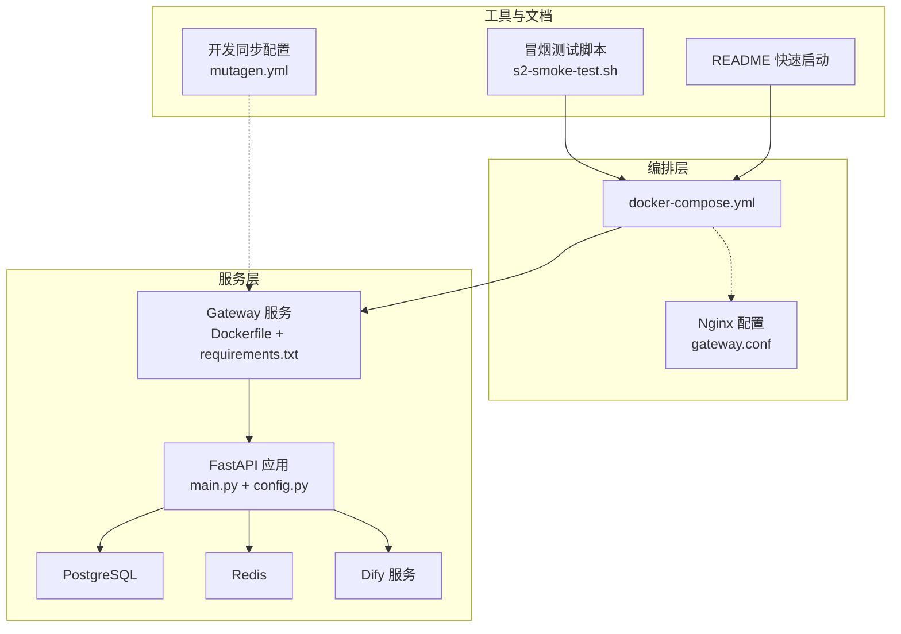
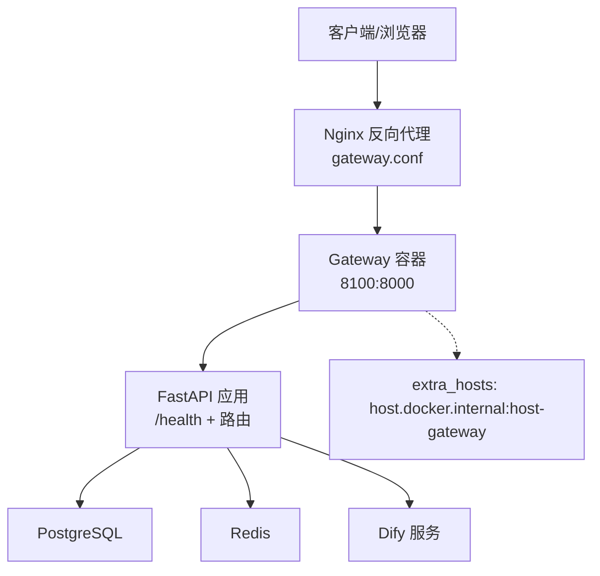
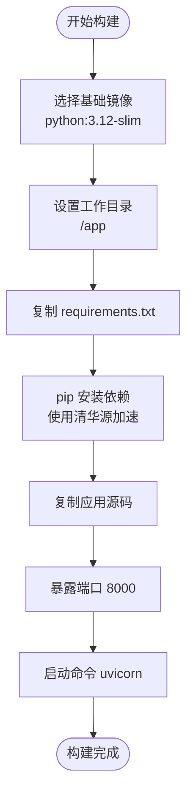
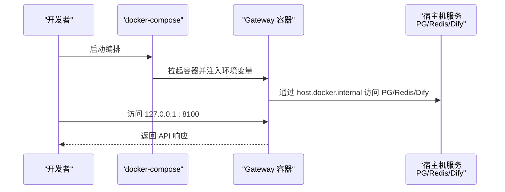
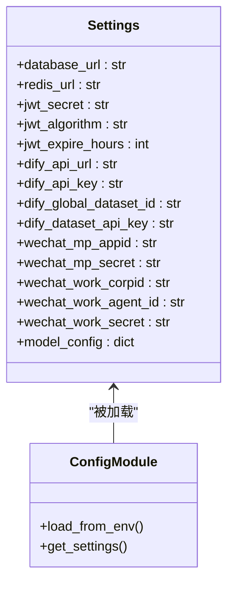
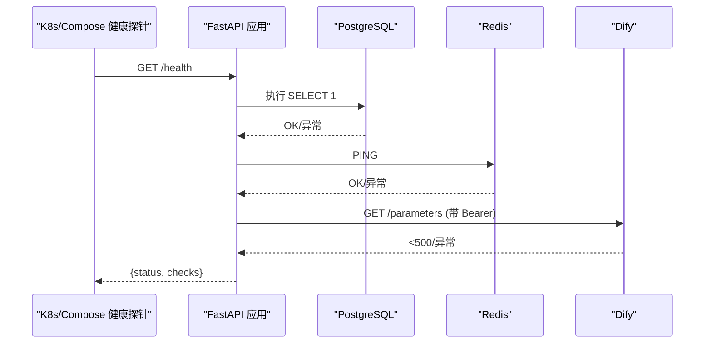
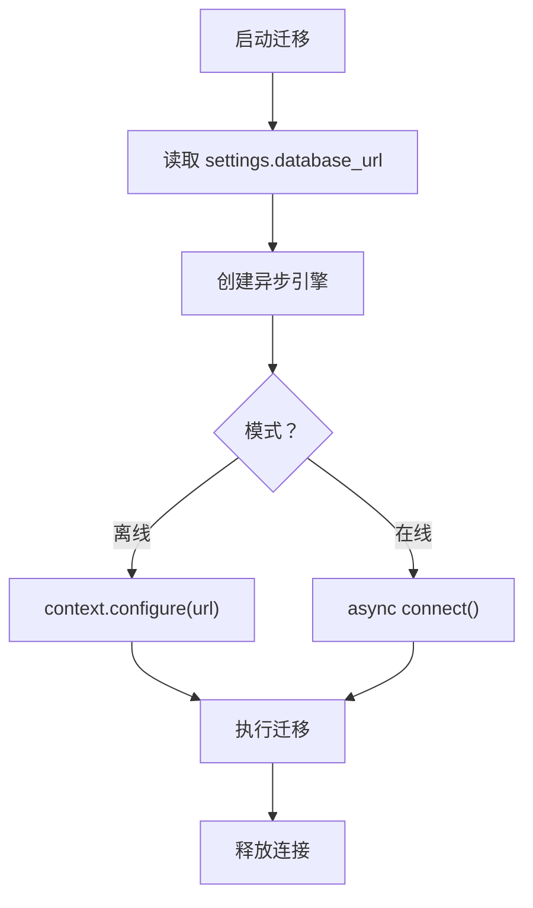
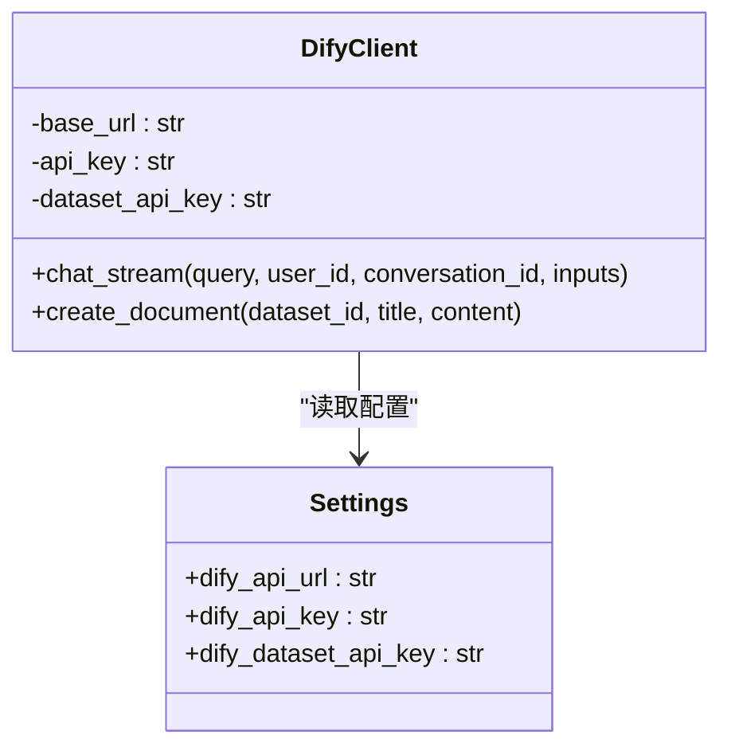
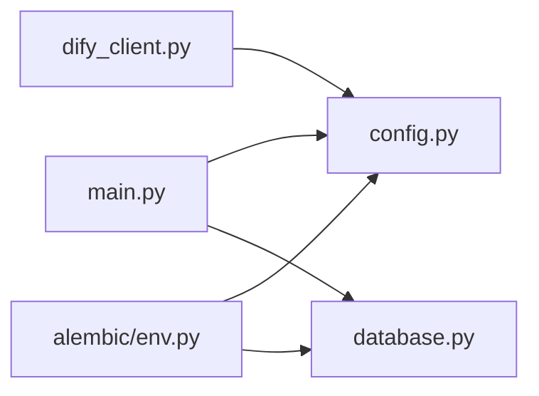

# Docker 容器化部署

<cite>
**本文引用的文件**
- [docker-compose.yml](file://deploy/docker-compose.yml)
- [Dockerfile](file://services/gateway/Dockerfile)
- [requirements.txt](file://services/gateway/requirements.txt)
- [gateway.conf](file://deploy/nginx/gateway.conf)
- [config.py](file://services/gateway/app/config.py)
- [main.py](file://services/gateway/app/main.py)
- [database.py](file://services/gateway/app/database.py)
- [dify_client.py](file://services/gateway/app/services/dify_client.py)
- [s2-smoke-test.sh](file://scripts/s2-smoke-test.sh)
- [README.md](file://README.md)
- [alembic.ini](file://services/gateway/alembic.ini)
- [env.py](file://services/gateway/alembic/env.py)
- [mutagen.yml](file://mutagen.yml)
</cite>

## 目录
1. [简介](#简介)
2. [项目结构](#项目结构)
3. [核心组件](#核心组件)
4. [架构总览](#架构总览)
5. [详细组件分析](#详细组件分析)
6. [依赖关系分析](#依赖关系分析)
7. [性能考虑](#性能考虑)
8. [故障排查指南](#故障排查指南)
9. [结论](#结论)
10. [附录](#附录)

## 简介
本指南面向“医小管 v2”项目的 Docker 容器化部署，覆盖以下内容：
- Dockerfile 构建流程：基础镜像、依赖安装、暴露端口与启动命令
- docker-compose.yml 服务编排：服务定义、端口映射、环境变量、网络与主机别名
- 本地开发与生产环境差异：环境变量管理、外部服务复用、Nginx 反向代理
- 健康检查、重启策略与资源限制建议
- 多环境配置切换：开发、测试、生产环境的变量管理策略

## 项目结构
与容器化部署直接相关的关键目录与文件如下：
- 服务侧：后端网关服务位于 services/gateway，包含 Dockerfile、requirements.txt、FastAPI 应用与数据库迁移配置
- 编排侧：根目录 deploy 下包含 docker-compose.yml 与 Nginx 配置 gateway.conf
- 工具脚本：scripts/s2-smoke-test.sh 提供端到端冒烟测试
- 文档与同步：README.md 提供快速启动说明；mutagen.yml 描述开发同步策略

图表来源
- [docker-compose.yml:1-22](file://deploy/docker-compose.yml#L1-L22)
- [Dockerfile:1-14](file://services/gateway/Dockerfile#L1-L14)
- [requirements.txt:1-29](file://services/gateway/requirements.txt#L1-L29)
- [gateway.conf:1-36](file://deploy/nginx/gateway.conf#L1-L36)
- [main.py:1-78](file://services/gateway/app/main.py#L1-L78)
- [config.py:1-31](file://services/gateway/app/config.py#L1-L31)
- [s2-smoke-test.sh:1-130](file://scripts/s2-smoke-test.sh#L1-L130)
- [README.md:1-18](file://README.md#L1-L18)
- [mutagen.yml:1-26](file://mutagen.yml#L1-L26)

章节来源
- [docker-compose.yml:1-22](file://deploy/docker-compose.yml#L1-L22)
- [Dockerfile:1-14](file://services/gateway/Dockerfile#L1-L14)
- [requirements.txt:1-29](file://services/gateway/requirements.txt#L1-L29)
- [gateway.conf:1-36](file://deploy/nginx/gateway.conf#L1-L36)
- [README.md:1-18](file://README.md#L1-L18)
- [mutagen.yml:1-26](file://mutagen.yml#L1-L26)

## 核心组件
- 网关服务（Gateway）：基于 Python 3.12 slim 镜像，使用 Uvicorn 启动 FastAPI 应用，监听 8000 端口
- 依赖管理：requirements.txt 明确列出 FastAPI、SQLAlchemy、Redis、JWT、HTTPX、Pydantic Settings 等
- 配置加载：通过 pydantic-settings 从 .env 文件读取环境变量，支持默认值与运行时覆盖
- 健康检查：/health 接口对数据库、Redis、Dify 服务进行连通性检查
- 数据库迁移：Alembic 使用异步引擎连接数据库，支持离线/在线迁移

章节来源
- [Dockerfile:1-14](file://services/gateway/Dockerfile#L1-L14)
- [requirements.txt:1-29](file://services/gateway/requirements.txt#L1-L29)
- [config.py:1-31](file://services/gateway/app/config.py#L1-L31)
- [main.py:30-68](file://services/gateway/app/main.py#L30-L68)
- [alembic.ini:1-150](file://services/gateway/alembic.ini#L1-L150)
- [env.py:67-96](file://services/gateway/alembic/env.py#L67-L96)

## 架构总览
下图展示容器化部署的整体交互：docker-compose 启动 Gateway 容器，容器通过 host.docker.internal 访问宿主机上的数据库与 Redis；Nginx 作为反向代理在上线阶段接管流量。

图表来源
- [docker-compose.yml:18-19](file://deploy/docker-compose.yml#L18-L19)
- [gateway.conf:1-36](file://deploy/nginx/gateway.conf#L1-L36)
- [main.py:30-68](file://services/gateway/app/main.py#L30-L68)

## 详细组件分析

### Dockerfile 构建流程
- 基础镜像：python:3.12-slim
- 工作目录：/app
- 依赖安装：复制 requirements.txt 并使用清华源加速安装
- 应用打包：复制全部源码
- 端口暴露：8000
- 启动命令：uvicorn 启动 FastAPI 应用，绑定 0.0.0.0:8000

图表来源
- [Dockerfile:1-14](file://services/gateway/Dockerfile#L1-L14)

章节来源
- [Dockerfile:1-14](file://services/gateway/Dockerfile#L1-L14)
- [requirements.txt:1-29](file://services/gateway/requirements.txt#L1-L29)

### docker-compose.yml 服务编排
- 服务名称：gateway
- 构建上下文：../services/gateway
- 容器名：v2_gateway
- 端口映射：8100:8000（避免与 v1 的 8000 冲突）
- 环境变量：
  - DATABASE_URL：指向宿主机 PostgreSQL
  - REDIS_URL：指向宿主机 Redis
  - DIFY_API_URL、DIFY_API_KEY：指向本地 Dify
  - JWT_SECRET：用于生产环境需替换
- 重启策略：unless-stopped
- 网络：extra_hosts 将 host.docker.internal 解析为宿主网关，便于容器内访问宿主机服务

图表来源
- [docker-compose.yml:3-21](file://deploy/docker-compose.yml#L3-L21)

章节来源
- [docker-compose.yml:1-22](file://deploy/docker-compose.yml#L1-L22)

### 环境变量与配置加载
- 配置类 Settings：集中定义数据库、Redis、JWT、Dify 等参数，并通过 pydantic-settings 从 .env 加载
- 默认值：提供开发可用的默认值，生产环境务必覆盖
- 运行时覆盖：compose 中的 environment 可覆盖默认值

图表来源
- [config.py:1-31](file://services/gateway/app/config.py#L1-L31)

章节来源
- [config.py:1-31](file://services/gateway/app/config.py#L1-L31)

### 健康检查与运行生命周期
- /health 接口：检查 PostgreSQL、Redis、Dify 三类依赖连通性，返回整体状态与各子项检查结果
- 生命周期：应用启动时建立 Redis 连接，退出时释放连接
- 超时与错误处理：对 Dify 请求设置超时，异常时记录错误

图表来源
- [main.py:30-68](file://services/gateway/app/main.py#L30-L68)

章节来源
- [main.py:30-68](file://services/gateway/app/main.py#L30-L68)

### 数据库与迁移
- 异步引擎：使用 SQLAlchemy 异步引擎连接数据库，池大小配置为 10
- 迁移配置：Alembic 通过 env.py 读取 settings.database_url，支持离线/在线迁移
- 迁移配置文件：alembic.ini 提供日志、路径等通用配置

图表来源
- [database.py:1-15](file://services/gateway/app/database.py#L1-L15)
- [env.py:67-96](file://services/gateway/alembic/env.py#L67-L96)
- [alembic.ini:1-150](file://services/gateway/alembic.ini#L1-L150)

章节来源
- [database.py:1-15](file://services/gateway/app/database.py#L1-L15)
- [env.py:67-96](file://services/gateway/alembic/env.py#L67-L96)
- [alembic.ini:1-150](file://services/gateway/alembic.ini#L1-L150)

### Dify 客户端集成
- 封装 Dify API：提供流式对话与知识库文档创建接口
- 超时与错误处理：统一使用 httpx.AsyncClient，设置合理超时
- 单例模式：dify_client 供业务模块复用

图表来源
- [dify_client.py:1-105](file://services/gateway/app/services/dify_client.py#L1-L105)
- [config.py:15-19](file://services/gateway/app/config.py#L15-L19)

章节来源
- [dify_client.py:1-105](file://services/gateway/app/services/dify_client.py#L1-L105)
- [config.py:15-19](file://services/gateway/app/config.py#L15-L19)

### 开发与生产环境策略
- 本地开发
  - 使用 host.docker.internal 访问宿主机服务
  - 端口映射 8100:8000，避免与 v1 冲突
  - 环境变量通过 compose 的 environment 注入
- 生产环境
  - 将数据库、Redis、Dify 等服务迁移到独立容器或云服务
  - 使用更严格的重启策略与资源限制
  - Nginx 作为统一入口，按需启用 gateway.conf 中的代理规则

章节来源
- [docker-compose.yml:11-19](file://deploy/docker-compose.yml#L11-L19)
- [gateway.conf:1-36](file://deploy/nginx/gateway.conf#L1-L36)

### 端到端冒烟测试
- 脚本覆盖登录、创建会话、发送消息、升级/受理/解决等关键流程
- 通过 curl 调用 8100 端口验证服务可用性

章节来源
- [s2-smoke-test.sh:1-130](file://scripts/s2-smoke-test.sh#L1-L130)

## 依赖关系分析
- 组件耦合
  - main.py 依赖 config.py 读取配置，依赖 database.py 获取会话
  - dify_client.py 依赖 config.py 读取 Dify 地址与密钥
  - alembic/env.py 依赖 config.py 与 database.Base
- 外部依赖
  - PostgreSQL、Redis、Dify 通过环境变量与 extra_hosts 配置接入
- 可能的循环依赖
  - 当前模块间为单向依赖，无明显循环

图表来源
- [main.py:1-14](file://services/gateway/app/main.py#L1-L14)
- [config.py:1-31](file://services/gateway/app/config.py#L1-L31)
- [database.py:1-15](file://services/gateway/app/database.py#L1-L15)
- [dify_client.py:1-105](file://services/gateway/app/services/dify_client.py#L1-L105)
- [env.py:14-16](file://services/gateway/alembic/env.py#L14-L16)

章节来源
- [main.py:1-14](file://services/gateway/app/main.py#L1-L14)
- [config.py:1-31](file://services/gateway/app/config.py#L1-L31)
- [database.py:1-15](file://services/gateway/app/database.py#L1-L15)
- [dify_client.py:1-105](file://services/gateway/app/services/dify_client.py#L1-L105)
- [env.py:14-16](file://services/gateway/alembic/env.py#L14-L16)

## 性能考虑
- 数据库连接池：当前池大小为 10，可根据并发请求调整
- 异步 I/O：使用 httpx 与 SQLAlchemy 异步，减少阻塞
- 超时控制：Dify 请求设置合理超时，避免长时间占用连接
- 镜像优化：使用 slim 基础镜像，pip 使用国内源提升安装速度
- Nginx 缓存与压缩：上线阶段可启用 gzip/缓存以降低后端压力（按需）

## 故障排查指南
- 健康检查失败
  - 检查 /health 返回的子项错误，定位数据库、Redis 或 Dify 的具体问题
  - 确认 Dify 接口可达且 API Key 正确
- 端口冲突
  - 确认宿主机 8100 未被占用；如冲突，修改 compose 的 host 端口映射
- 环境变量缺失
  - 确认 DATABASE_URL、REDIS_URL、DIFY_API_URL、DIFY_API_KEY、JWT_SECRET 已正确注入
- 容器无法解析 host.docker.internal
  - 检查 extra_hosts 配置是否生效
- 开发同步问题
  - mutagen.yml 忽略了 .env、deploy/.env 等路径，避免误同步敏感配置

章节来源
- [main.py:30-68](file://services/gateway/app/main.py#L30-L68)
- [docker-compose.yml:11-19](file://deploy/docker-compose.yml#L11-L19)
- [mutagen.yml:20-21](file://mutagen.yml#L20-L21)

## 结论
本指南提供了从 Dockerfile 到 docker-compose 的完整容器化部署路径，明确了环境变量管理、健康检查与迁移配置等关键环节。结合 Nginx 反向代理与多环境变量策略，可在本地与生产环境实现稳定、可扩展的部署方案。

## 附录

### 环境变量清单与用途
- DATABASE_URL：PostgreSQL 连接串
- REDIS_URL：Redis 连接串
- DIFY_API_URL：Dify 服务地址
- DIFY_API_KEY：Dify 接口鉴权
- JWT_SECRET：JWT 密钥（生产必须替换）
- 其他可选：Dify 全局数据集 ID、数据集 API Key、微信相关配置

章节来源
- [docker-compose.yml:11-16](file://deploy/docker-compose.yml#L11-L16)
- [config.py:6-26](file://services/gateway/app/config.py#L6-L26)

### 快速启动
- 在 deploy 目录下执行编排启动，容器将拉起 Gateway 服务并映射 8100:8000

章节来源
- [README.md:12-15](file://README.md#L12-L15)