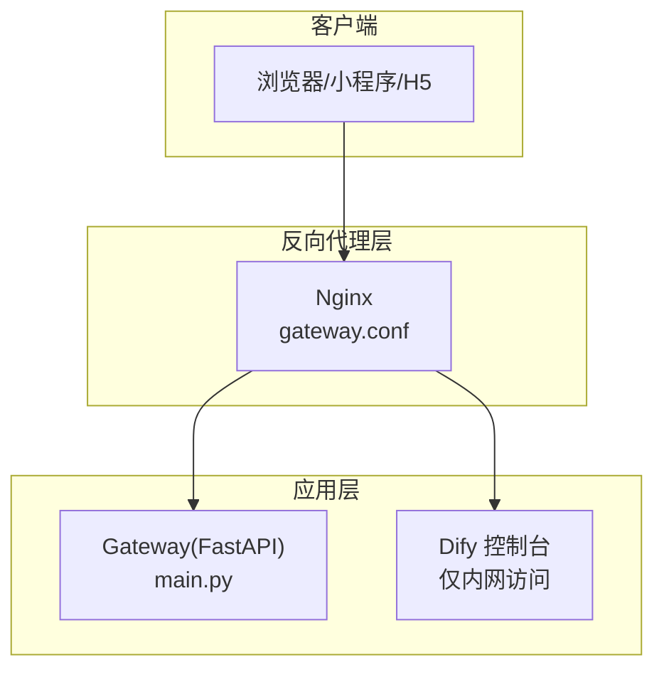
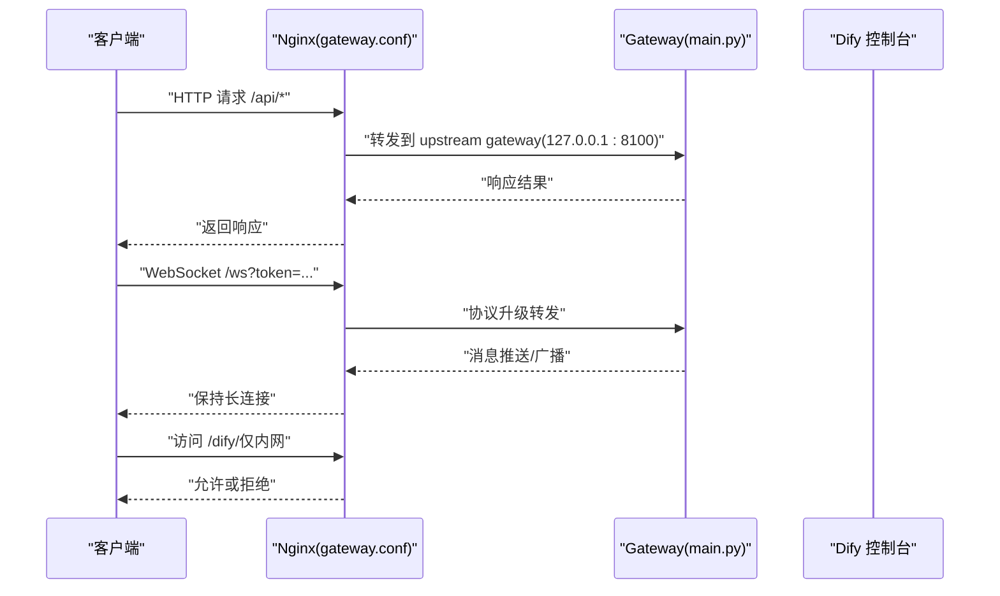
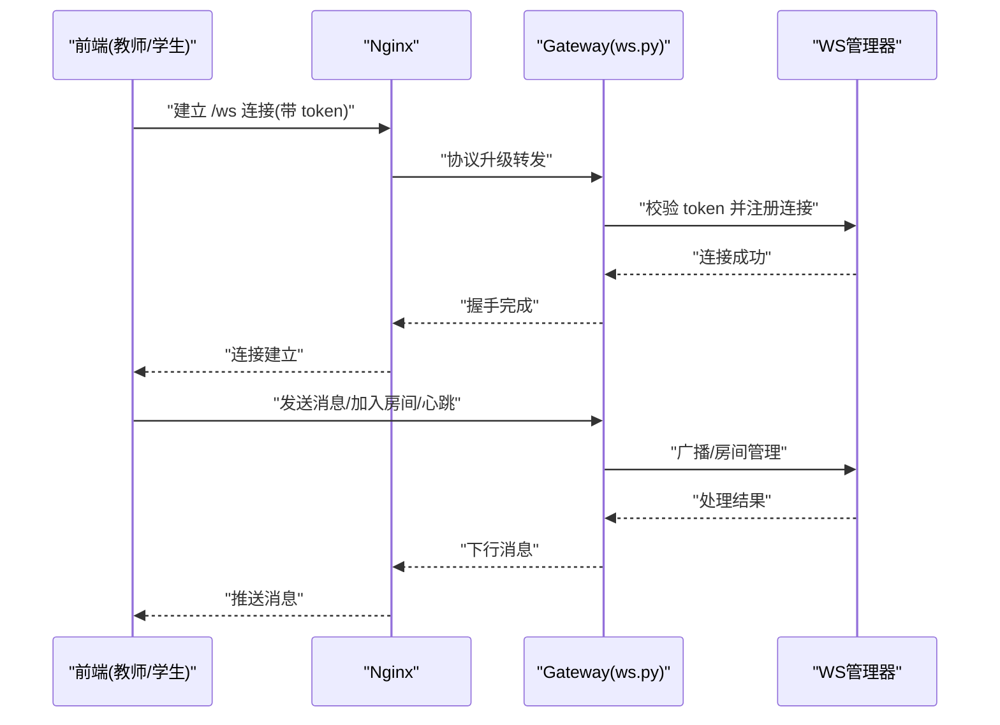
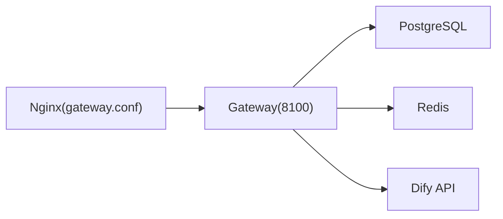

# Nginx 反向代理配置

<cite>
**本文引用的文件**
- [gateway.conf](file://deploy/nginx/gateway.conf)
- [docker-compose.yml](file://deploy/docker-compose.yml)
- [main.py](file://services/gateway/app/main.py)
- [config.py](file://services/gateway/app/config.py)
- [ws.py](file://services/gateway/app/routers/ws.py)
- [dify_client.py](file://services/gateway/app/services/dify_client.py)
- [websocket.ts](file://apps/teacher-app/src/utils/websocket.ts)
- [s2-ws-test.py](file://scripts/s2-ws-test.py)
</cite>

## 目录
1. [简介](#简介)
2. [项目结构](#项目结构)
3. [核心组件](#核心组件)
4. [架构总览](#架构总览)
5. [详细组件分析](#详细组件分析)
6. [依赖关系分析](#依赖关系分析)
7. [性能考虑](#性能考虑)
8. [故障排查指南](#故障排查指南)
9. [结论](#结论)
10. [附录](#附录)

## 简介
本指南围绕 Nginx 反向代理在本项目的部署与配置展开，重点覆盖 gateway.conf 中的上游服务器配置、负载均衡策略、WebSocket 代理、静态资源处理、缓存与压缩策略、安全配置（HTTPS 强制跳转、安全头、访问控制）以及不同部署场景（单实例、多实例、集群）的实践建议。文中所有技术细节均以仓库中的实际配置与代码为依据，并提供对应的来源定位。

## 项目结构
本项目采用“服务容器 + Nginx 反向代理”的部署架构：
- 服务侧：Gateway（FastAPI 应用）运行于 8100 端口，提供 API、WebSocket、健康检查等能力。
- 反代侧：Nginx 作为统一入口，负责请求转发、协议升级、访问控制等。
- 外部系统：Dify 控制台（仅内网访问）与数据库/缓存等基础设施通过环境变量或网络拓扑暴露。

图表来源
- [gateway.conf:1-36](file://deploy/nginx/gateway.conf#L1-L36)
- [main.py:1-78](file://services/gateway/app/main.py#L1-L78)

章节来源
- [gateway.conf:1-36](file://deploy/nginx/gateway.conf#L1-L36)
- [docker-compose.yml:1-22](file://deploy/docker-compose.yml#L1-L22)

## 核心组件
- Nginx 反向代理配置（gateway.conf）
  - 定义上游服务 gateway（指向本地 8100 端口）
  - 提供 /api/ 路径的 HTTP 代理
  - 提供 /ws 的 WebSocket 代理（含协议升级与长连接超时）
  - 提供 /dify/ 路径的内网访问控制
- Gateway 应用（FastAPI）
  - 暴露 /api/* 路由（认证、会话、聊天等）
  - 暴露 /ws WebSocket 接入点
  - 提供 /health 健康检查
- Dify 集成
  - 通过 DifyClient 封装流式对话与知识库接口
  - 通过环境变量配置 Dify API 地址与密钥

章节来源
- [gateway.conf:4-35](file://deploy/nginx/gateway.conf#L4-L35)
- [main.py:30-78](file://services/gateway/app/main.py#L30-L78)
- [dify_client.py:11-105](file://services/gateway/app/services/dify_client.py#L11-L105)

## 架构总览
下图展示从客户端到应用与外部系统的整体交互路径，以及 Nginx 在其中承担的职责。

图表来源
- [gateway.conf:8-35](file://deploy/nginx/gateway.conf#L8-L35)
- [main.py:70-78](file://services/gateway/app/main.py#L70-L78)
- [ws.py:11-42](file://services/gateway/app/routers/ws.py#L11-L42)

## 详细组件分析

### 上游服务器与负载均衡配置
- 当前配置
  - 使用 upstream gateway 指向本地 8100 端口
  - 未启用多后端节点，因此当前为单实例模式
- 扩展建议（多实例/集群）
  - 在 upstream 中添加多个 server 节点
  - 结合轮询、最少连接、IP 哈希等策略提升可用性
  - 配合健康检查与故障转移机制

章节来源
- [gateway.conf:4-6](file://deploy/nginx/gateway.conf#L4-L6)

### API 代理与头部传递
- /api/ 路由
  - 通过 proxy_pass 转发至 upstream gateway
  - 保留 Host 与真实客户端 IP（X-Real-IP）
- 适用场景
  - 前端通过统一域名访问后端 API
  - 便于日志追踪与后端鉴权

章节来源
- [gateway.conf:13-17](file://deploy/nginx/gateway.conf#L13-L17)
- [main.py:70-78](file://services/gateway/app/main.py#L70-L78)

### WebSocket 代理与长连接
- /ws 路由
  - 启用 HTTP/1.1 并进行协议升级（Upgrade/Connection）
  - 透传 Host 头
  - 设置较长读取超时（proxy_read_timeout），满足长连接场景
- 应用侧配合
  - Gateway 的 WebSocket 路由接收 token 参数进行认证
  - 客户端侧实现心跳与重连逻辑

图表来源
- [gateway.conf:20-27](file://deploy/nginx/gateway.conf#L20-L27)
- [ws.py:11-119](file://services/gateway/app/routers/ws.py#L11-L119)
- [websocket.ts:26-165](file://apps/teacher-app/src/utils/websocket.ts#L26-L165)

章节来源
- [gateway.conf:20-27](file://deploy/nginx/gateway.conf#L20-L27)
- [ws.py:11-119](file://services/gateway/app/routers/ws.py#L11-L119)
- [websocket.ts:1-168](file://apps/teacher-app/src/utils/websocket.ts#L1-L168)
- [s2-ws-test.py:31-50](file://scripts/s2-ws-test.py#L31-L50)

### Dify 控制台内网访问控制
- /dify/ 路由
  - 直接代理到本地 3000 端口
  - 仅允许指定内网网段访问，其他全部拒绝
- 安全建议
  - 限制访问源网段
  - 结合防火墙策略进一步加固

章节来源
- [gateway.conf:29-34](file://deploy/nginx/gateway.conf#L29-L34)

### 静态资源处理、缓存与压缩（建议）
- 当前未配置静态资源处理、缓存与压缩策略
- 建议
  - 对前端构建产物（dist）提供静态服务与缓存头
  - 开启 gzip/deflate 压缩，合理设置缓存时间
  - 对 JS/CSS/HTML 等资源设置较长缓存，对动态接口禁用缓存

[本节为通用实践建议，不直接分析具体文件，故无章节来源]

### 安全配置（HTTPS 强制跳转、安全头、访问控制）
- HTTPS 强制跳转
  - 当前仅监听 80 端口；建议新增 443 端口监听并配置 TLS
  - 将 80 请求重定向至 443
- 安全头
  - 建议添加 HSTS、X-Frame-Options、X-Content-Type-Options、Referrer-Policy 等
- 访问控制
  - /dify/ 已通过 allow/deny 实现内网访问控制
  - 可结合 GeoIP、速率限制、WAF 等进一步强化

[本节为通用实践建议，不直接分析具体文件，故无章节来源]

## 依赖关系分析
- Nginx 依赖 Gateway 的 8100 端口提供服务
- Gateway 依赖数据库与 Redis（通过环境变量配置）
- Gateway 依赖 Dify API（通过环境变量配置）

图表来源
- [gateway.conf:4-6](file://deploy/nginx/gateway.conf#L4-L6)
- [docker-compose.yml:9-17](file://deploy/docker-compose.yml#L9-L17)
- [config.py:6-8](file://services/gateway/app/config.py#L6-L8)
- [dify_client.py:14-17](file://services/gateway/app/services/dify_client.py#L14-L17)

章节来源
- [docker-compose.yml:1-22](file://deploy/docker-compose.yml#L1-L22)
- [config.py:1-31](file://services/gateway/app/config.py#L1-L31)
- [dify_client.py:1-105](file://services/gateway/app/services/dify_client.py#L1-L105)

## 性能考虑
- 连接与超时
  - WebSocket 使用较长读取超时，适合长连接场景
  - 建议根据业务峰值调整 worker_processes/worker_connections
- 压缩与缓存
  - 建议开启 gzip/deflate，减少传输体积
  - 对静态资源设置强缓存，对动态接口设置协商缓存
- 负载均衡
  - 多实例部署时，建议使用最少连接或哈希策略，避免热点
- 日志与监控
  - 记录访问日志与错误日志，结合指标监控（如 QPS、延迟、错误率）

[本节为通用实践建议，不直接分析具体文件，故无章节来源]

## 故障排查指南
- WebSocket 连接失败
  - 检查 /ws 是否正确进行协议升级（Upgrade/Connection）
  - 确认 token 有效且未过期
  - 观察 Nginx 与 Gateway 的日志，定位认证失败或连接断开原因
- API 无法访问
  - 确认 Nginx upstream 指向的 8100 端口可达
  - 检查 Gateway 的 /health 是否正常
- Dify 控制台不可访问
  - 确认访问源网段在允许列表中
  - 检查本地 3000 端口是否可用

章节来源
- [gateway.conf:20-27](file://deploy/nginx/gateway.conf#L20-L27)
- [ws.py:35-42](file://services/gateway/app/routers/ws.py#L35-L42)
- [main.py:30-68](file://services/gateway/app/main.py#L30-L68)
- [s2-ws-test.py:31-50](file://scripts/s2-ws-test.py#L31-L50)

## 结论
本指南基于仓库现有配置与代码，梳理了 Nginx 反向代理在本项目中的角色与最佳实践要点。当前为单实例部署，具备基础的 API 与 WebSocket 代理能力，并对 Dify 控制台实施了内网访问控制。建议在生产环境中补充 HTTPS、安全头、静态资源缓存与压缩、多实例负载均衡与健康检查等能力，以满足更高的可用性与安全性要求。

## 附录

### 不同部署场景下的配置示例思路
- 单实例
  - upstream 仅配置一个 server，Nginx 作为单一入口
- 多实例
  - upstream 添加多个 server，结合轮询/最少连接策略
  - 配置健康检查与故障转移
- 集群
  - 使用共享会话或状态同步方案
  - 在 Nginx 层面启用粘性会话或无状态设计

[本节为通用实践建议，不直接分析具体文件，故无章节来源]