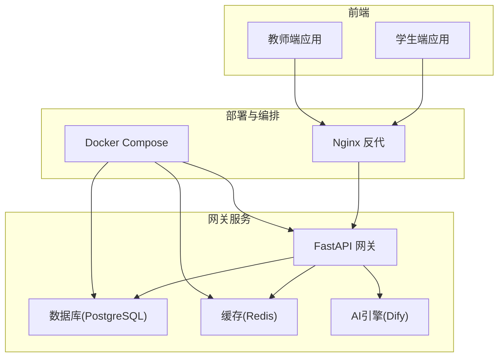
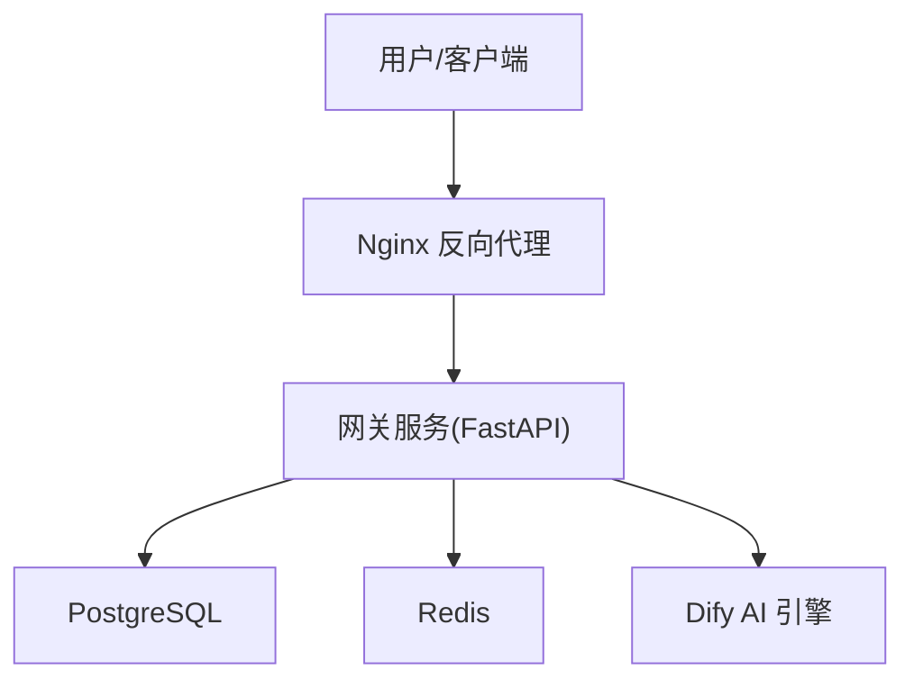
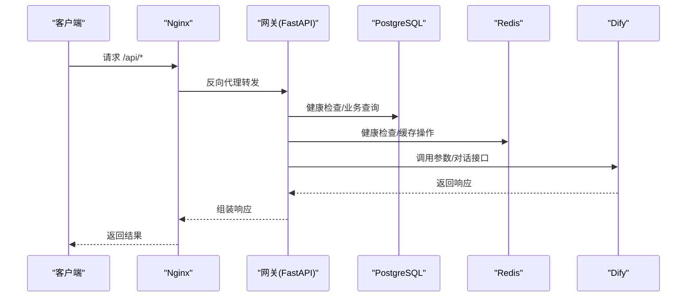
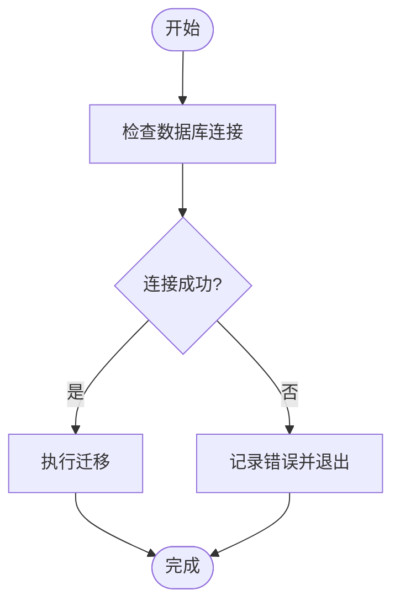
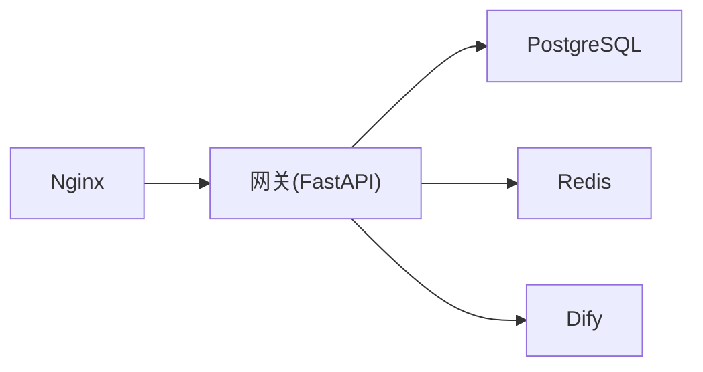

# 生产环境部署

<cite>
**本文引用的文件**
- [docker-compose.yml](file://deploy/docker-compose.yml)
- [Dockerfile](file://services/gateway/Dockerfile)
- [gateway.conf](file://deploy/nginx/gateway.conf)
- [main.py](file://services/gateway/app/main.py)
- [config.py](file://services/gateway/app/config.py)
- [database.py](file://services/gateway/app/database.py)
- [requirements.txt](file://services/gateway/requirements.txt)
- [alembic.ini](file://services/gateway/alembic.ini)
- [e11bb6c9d4b8_v2_initial_schema.py](file://services/gateway/alembic/versions/e11bb6c9d4b8_v2_initial_schema.py)
- [migrate_kb.py](file://scripts/migrate_kb.py)
- [yixiaoguan-chatflow.yml](file://deploy/dify/yixiaoguan-chatflow.yml)
- [mutagen.yml](file://mutagen.yml)
- [auth.py](file://services/gateway/app/routers/auth.py)
- [README.md](file://README.md)
</cite>

## 目录
1. [简介](#简介)
2. [项目结构](#项目结构)
3. [核心组件](#核心组件)
4. [架构总览](#架构总览)
5. [详细组件分析](#详细组件分析)
6. [依赖关系分析](#依赖关系分析)
7. [性能考虑](#性能考虑)
8. [故障排查指南](#故障排查指南)
9. [结论](#结论)
10. [附录](#附录)

## 简介
本指南面向生产环境部署，覆盖基础设施要求、网络规划、安全策略、部署流程（含预部署检查、零停机部署、回滚策略）、环境变量与密钥管理、证书管理、监控与日志、备份与恢复、性能调优等。目标是帮助团队在生产环境中稳定、安全地交付与运维“医小管 v2”系统。

## 项目结构
项目采用多模块分层组织：
- 应用层：学生端与教师端前端应用（UniApp/Vue 3）
- 网关服务：基于 FastAPI 的后端网关，负责认证、会话、WebSocket、与 Dify 对接
- 部署与编排：Docker Compose 编排网关服务；Nginx 作为反向代理（计划上线）
- 运维与迁移：Alembic 数据库迁移、知识库迁移脚本、同步配置

图表来源
- [docker-compose.yml:1-22](file://deploy/docker-compose.yml#L1-L22)
- [gateway.conf:1-36](file://deploy/nginx/gateway.conf#L1-L36)
- [main.py:1-78](file://services/gateway/app/main.py#L1-L78)

章节来源
- [README.md:1-18](file://README.md#L1-L18)
- [docker-compose.yml:1-22](file://deploy/docker-compose.yml#L1-L22)
- [gateway.conf:1-36](file://deploy/nginx/gateway.conf#L1-L36)

## 核心组件
- 网关服务（FastAPI）
  - 提供健康检查、认证、会话、WebSocket、聊天接口
  - 使用异步数据库连接与 Redis 缓存
- 数据库（PostgreSQL）
  - 使用 SQLAlchemy ORM 与 Alembic 进行迁移
- 缓存（Redis）
  - 用于会话状态、限流、临时数据
- AI 引擎（Dify）
  - 通过 API 与知识库对接，支持意图分类、RAG、流式回答
- 反向代理（Nginx）
  - 计划用于 API 与 WebSocket 的统一入口与安全加固
- 部署编排（Docker Compose）
  - 单机/容器化快速部署与服务编排

章节来源
- [main.py:1-78](file://services/gateway/app/main.py#L1-L78)
- [config.py:1-31](file://services/gateway/app/config.py#L1-L31)
- [database.py:1-15](file://services/gateway/app/database.py#L1-L15)
- [requirements.txt:1-29](file://services/gateway/requirements.txt#L1-L29)
- [alembic.ini:1-150](file://services/gateway/alembic.ini#L1-L150)
- [e11bb6c9d4b8_v2_initial_schema.py:1-160](file://services/gateway/alembic/versions/e11bb6c9d4b8_v2_initial_schema.py#L1-L160)
- [yixiaoguan-chatflow.yml:1-387](file://deploy/dify/yixiaoguan-chatflow.yml#L1-L387)

## 架构总览
生产环境建议采用“容器化 + 反向代理 + 外部数据库/缓存”的架构。网关服务通过 Nginx 接收外部流量，内部通过 Docker Compose 组织服务，数据库与缓存由独立实例提供。

图表来源
- [gateway.conf:1-36](file://deploy/nginx/gateway.conf#L1-L36)
- [docker-compose.yml:1-22](file://deploy/docker-compose.yml#L1-L22)
- [main.py:1-78](file://services/gateway/app/main.py#L1-L78)

## 详细组件分析

### 网关服务（FastAPI）
- 启动与生命周期
  - 使用 lifespan 管理 Redis 连接的创建与关闭
- 健康检查
  - 支持数据库、Redis、Dify 三类健康检查，返回聚合状态
- 路由与功能
  - 认证、会话、动作、WebSocket、聊天等路由挂载
- 安全与配置
  - JWT 密钥、算法、过期时间可配置
  - Dify API 地址与密钥可配置
- 数据库与缓存
  - 异步连接池默认大小为 10
  - Redis 使用连接池与 ping 检测

图表来源
- [main.py:16-68](file://services/gateway/app/main.py#L16-L68)
- [gateway.conf:12-27](file://deploy/nginx/gateway.conf#L12-L27)
- [docker-compose.yml:11-16](file://deploy/docker-compose.yml#L11-L16)

章节来源
- [main.py:1-78](file://services/gateway/app/main.py#L1-L78)
- [config.py:1-31](file://services/gateway/app/config.py#L1-L31)
- [database.py:1-15](file://services/gateway/app/database.py#L1-L15)
- [auth.py:1-35](file://services/gateway/app/routers/auth.py#L1-L35)

### 数据库与迁移（PostgreSQL + Alembic）
- 连接与池化
  - 默认连接池大小为 10，可按生产负载调整
- 迁移配置
  - Alembic 配置文件与日志级别已设定
  - 初始 Schema 包含高校相关实体与索引
- 版本迁移
  - 初始版本包含高校、班级、用户、会话、消息、未解答问题等表

图表来源
- [database.py:6-7](file://services/gateway/app/database.py#L6-L7)
- [alembic.ini:115-150](file://services/gateway/alembic.ini#L115-L150)
- [e11bb6c9d4b8_v2_initial_schema.py:21-140](file://services/gateway/alembic/versions/e11bb6c9d4b8_v2_initial_schema.py#L21-L140)

章节来源
- [database.py:1-15](file://services/gateway/app/database.py#L1-L15)
- [alembic.ini:1-150](file://services/gateway/alembic.ini#L1-L150)
- [e11bb6c9d4b8_v2_initial_schema.py:1-160](file://services/gateway/alembic/versions/e11bb6c9d4b8_v2_initial_schema.py#L1-L160)

### 缓存（Redis）
- 连接与健康检查
  - 网关启动时建立 Redis 连接，健康检查中进行 ping
- 使用场景
  - 会话状态、限流、临时数据缓存

章节来源
- [main.py:18-22](file://services/gateway/app/main.py#L18-L22)
- [config.py:7-8](file://services/gateway/app/config.py#L7-L8)

### AI 引擎（Dify）
- 配置项
  - Dify API 地址、全局数据集 ID、数据集 API Key
- 工作流
  - 包含意图分类、闲聊、知识检索、RAG 回答、转人工等节点

章节来源
- [config.py:15-19](file://services/gateway/app/config.py#L15-L19)
- [yixiaoguan-chatflow.yml:1-387](file://deploy/dify/yixiaoguan-chatflow.yml#L1-L387)

### 反向代理（Nginx）
- 功能
  - API 与 WebSocket 转发、内网 Dify 控制台访问控制
- 建议
  - 生产环境启用 HTTPS、限流、WAF、访问审计

章节来源
- [gateway.conf:1-36](file://deploy/nginx/gateway.conf#L1-L36)

### 部署编排（Docker Compose）
- 服务
  - 网关服务构建与端口映射
  - 环境变量注入（数据库、Redis、Dify、JWT）
- 建议
  - 将数据库与缓存置于独立容器或外部实例

章节来源
- [docker-compose.yml:1-22](file://deploy/docker-compose.yml#L1-L22)
- [Dockerfile:1-14](file://services/gateway/Dockerfile#L1-L14)

## 依赖关系分析
- 组件耦合
  - 网关服务依赖数据库、Redis、Dify
  - Nginx 作为外部入口，不直接耦合业务逻辑
- 外部依赖
  - PostgreSQL 15+、Redis 7+、Python 3.12、Dify 自托管

图表来源
- [gateway.conf:4-6](file://deploy/nginx/gateway.conf#L4-L6)
- [docker-compose.yml:4-17](file://deploy/docker-compose.yml#L4-L17)
- [main.py:1-14](file://services/gateway/app/main.py#L1-L14)

章节来源
- [requirements.txt:1-29](file://services/gateway/requirements.txt#L1-L29)
- [Dockerfile:1-14](file://services/gateway/Dockerfile#L1-L14)

## 性能考虑
- 数据库连接池
  - 当前默认池大小为 10，建议根据并发与硬件资源评估后调整
- Redis
  - 合理设置连接池与超时，避免阻塞
- Dify
  - 控制并发与超时，必要时引入队列与重试
- Nginx
  - 启用 gzip、连接复用、合理超时与限流
- 网关
  - 优化路由与中间件，减少不必要的序列化/反序列化

章节来源
- [database.py:6-7](file://services/gateway/app/database.py#L6-L7)
- [gateway.conf:12-27](file://deploy/nginx/gateway.conf#L12-L27)

## 故障排查指南
- 健康检查
  - 通过 /health 接口查看数据库、Redis、Dify 的连通性与状态
- 日志
  - 启用服务日志与访问日志，结合 Nginx 与应用日志定位问题
- 数据库
  - 检查连接字符串、权限、网络连通性
- 缓存
  - 检查 Redis 服务状态与键空间
- Dify
  - 校验 API 地址与密钥，确认数据集可用
- 回滚
  - 使用 Alembic 回退到上一版本

章节来源
- [main.py:30-68](file://services/gateway/app/main.py#L30-L68)
- [alembic.ini:115-150](file://services/gateway/alembic.ini#L115-L150)

## 结论
本指南提供了从基础设施到部署流程、从安全配置到监控日志、从备份恢复到性能调优的完整生产环境落地路径。建议在上线前完成预部署检查与演练，并制定标准化的零停机发布与回滚流程。

## 附录

### 基础设施要求
- 服务器配置
  - CPU/内存：根据并发与 Dify 推理负载评估
  - 存储：系统盘 + 数据库/缓存持久化存储
- 网络规划
  - 开放端口：Nginx 80/443、网关 8100、数据库 5432、Redis 6379
  - 内网访问：Dify 控制台仅允许特定网段
- 安全策略
  - TLS/HTTPS、WAF、访问控制、最小权限原则

章节来源
- [gateway.conf:8-34](file://deploy/nginx/gateway.conf#L8-L34)

### 部署流程
- 预部署检查
  - 环境变量与密钥校验、网络连通性测试、数据库与缓存可用性验证
- 零停机部署
  - 使用 Docker Compose 编排，滚动更新或蓝绿发布
- 回滚策略
  - 通过版本标签与镜像回滚，必要时回退数据库迁移

章节来源
- [docker-compose.yml:1-22](file://deploy/docker-compose.yml#L1-L22)
- [alembic.ini:1-150](file://services/gateway/alembic.ini#L1-L150)

### 环境变量与密钥管理
- 关键变量
  - 数据库连接串、Redis 连接串、Dify API 地址与密钥、JWT 密钥与算法
- 管理建议
  - 使用密钥管理服务（如 KMS），避免硬编码于配置文件

章节来源
- [docker-compose.yml:11-16](file://deploy/docker-compose.yml#L11-L16)
- [config.py:6-28](file://services/gateway/app/config.py#L6-L28)

### 证书管理
- 建议
  - 使用自动化证书签发与续期（如 ACME），确保 Nginx 与 Dify 的 TLS 安全

章节来源
- [gateway.conf:8-17](file://deploy/nginx/gateway.conf#L8-L17)

### 监控与日志
- 建议方案
  - 应用日志：结构化输出，集中采集（ELK/EFK）
  - 指标监控：Prometheus + Grafana
  - 链路追踪：OpenTelemetry（可选）
- 网关指标
  - QPS、延迟、错误率、数据库/Redis/Dify 调用指标

章节来源
- [main.py:30-68](file://services/gateway/app/main.py#L30-L68)

### 备份与恢复
- 数据库备份
  - 使用数据库自带工具进行定时全量与增量备份
- 配置备份
  - 备份 .env、Docker Compose、Nginx 配置、Dify 工作流
- 灾难恢复
  - 制定 RTO/RPO，定期演练恢复流程

章节来源
- [migrate_kb.py:1-201](file://scripts/migrate_kb.py#L1-L201)

### 性能调优
- JVM 参数
  - 若使用 Java 组件，需根据 GC 与内存模型调优
- 数据库连接池
  - 根据并发与延迟目标调整池大小与超时
- 缓存配置
  - 设置合理的过期策略与淘汰机制

章节来源
- [database.py:6-7](file://services/gateway/app/database.py#L6-L7)