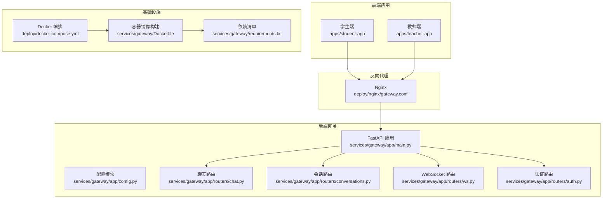
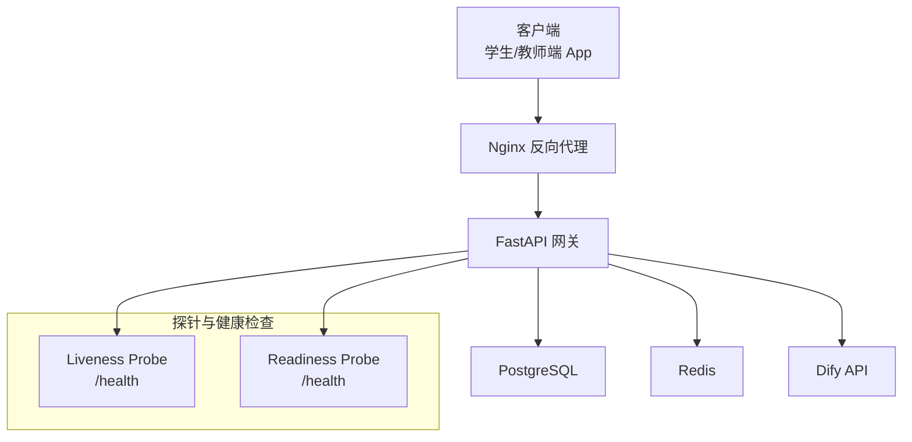
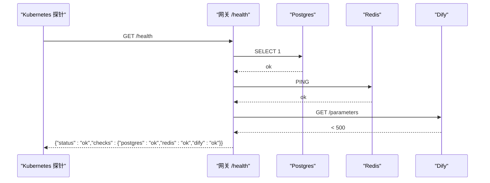
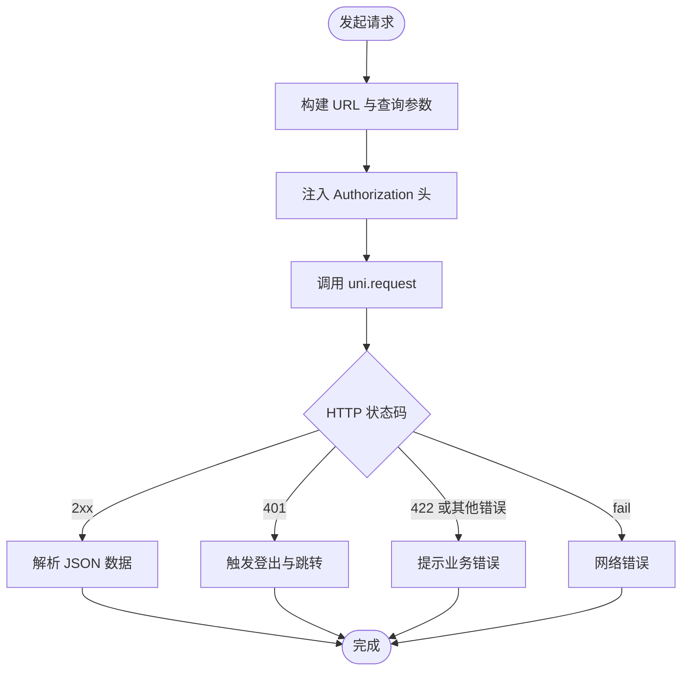
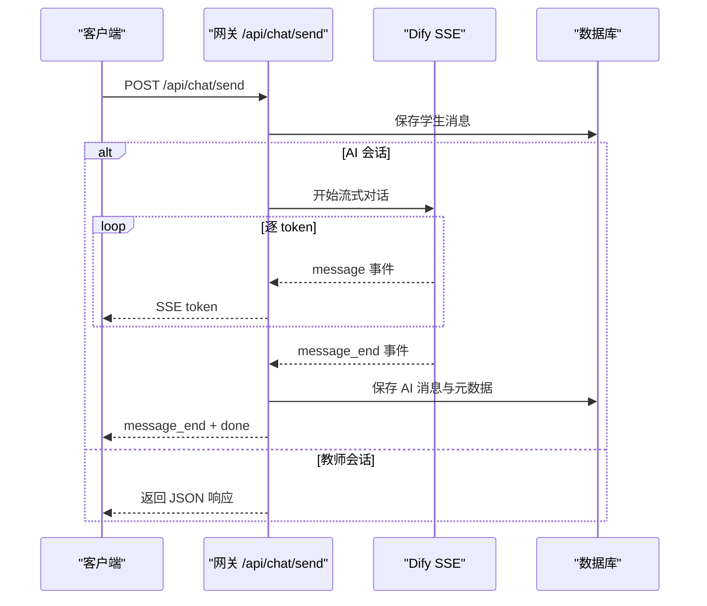
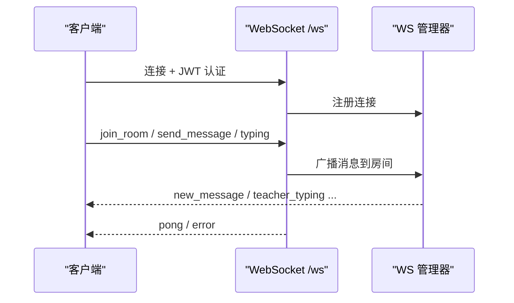
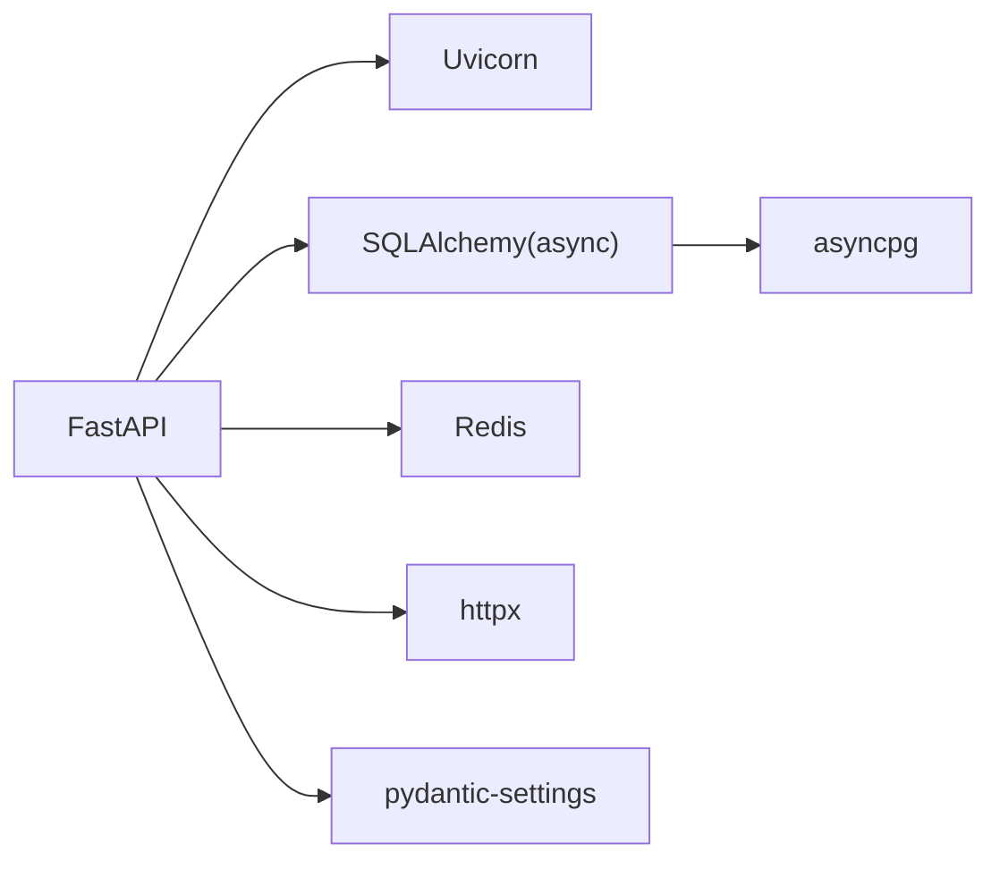

# 监控告警系统

<cite>
**本文引用的文件**
- [docker-compose.yml](file://deploy/docker-compose.yml)
- [gateway.conf](file://deploy/nginx/gateway.conf)
- [Dockerfile](file://services/gateway/Dockerfile)
- [requirements.txt](file://services/gateway/requirements.txt)
- [main.py](file://services/gateway/app/main.py)
- [config.py](file://services/gateway/app/config.py)
- [chat.py](file://services/gateway/app/routers/chat.py)
- [conversations.py](file://services/gateway/app/routers/conversations.py)
- [ws.py](file://services/gateway/app/routers/ws.py)
- [auth.py](file://services/gateway/app/routers/auth.py)
- [request.ts（学生端）](file://apps/student-app/src/utils/request.ts)
- [request.ts（教师端）](file://apps/teacher-app/src/utils/request.ts)
</cite>

## 目录
1. [简介](#简介)
2. [项目结构](#项目结构)
3. [核心组件](#核心组件)
4. [架构总览](#架构总览)
5. [详细组件分析](#详细组件分析)
6. [依赖分析](#依赖分析)
7. [性能考虑](#性能考虑)
8. [故障排查指南](#故障排查指南)
9. [结论](#结论)
10. [附录](#附录)

## 简介
本指南面向运维与开发团队，提供“医小管 v2”监控告警系统的完整配置与实践建议。内容覆盖应用级指标采集（请求量、响应时间、错误率、内存使用等）、健康检查端点配置（Liveness/Readiness）、日志收集与分析（结构化日志、日志轮转、日志聚合）、告警规则与通知渠道、APM 与分布式追踪集成建议，以及监控仪表板的配置与自定义，帮助快速定位问题并保障系统稳定运行。

## 项目结构
- 后端网关服务采用 FastAPI + Uvicorn，容器化部署，通过 Nginx 反向代理对外提供 API 与 WebSocket 服务。
- 前端应用（学生端/教师端）通过统一请求封装与后端交互，并在本地开发时通过 Vite 代理转发至后端。
- 部署层包含 docker-compose 编排与 Nginx 配置，便于本地与生产环境快速上线。

图表来源
- [main.py:1-78](file://services/gateway/app/main.py#L1-L78)
- [config.py:1-31](file://services/gateway/app/config.py#L1-L31)
- [chat.py:1-191](file://services/gateway/app/routers/chat.py#L1-L191)
- [conversations.py:1-129](file://services/gateway/app/routers/conversations.py#L1-L129)
- [ws.py:1-119](file://services/gateway/app/routers/ws.py#L1-L119)
- [auth.py:1-35](file://services/gateway/app/routers/auth.py#L1-L35)
- [gateway.conf:1-36](file://deploy/nginx/gateway.conf#L1-L36)
- [docker-compose.yml:1-22](file://deploy/docker-compose.yml#L1-L22)
- [Dockerfile:1-14](file://services/gateway/Dockerfile#L1-L14)
- [requirements.txt:1-29](file://services/gateway/requirements.txt#L1-L29)

章节来源
- [docker-compose.yml:1-22](file://deploy/docker-compose.yml#L1-L22)
- [gateway.conf:1-36](file://deploy/nginx/gateway.conf#L1-L36)
- [Dockerfile:1-14](file://services/gateway/Dockerfile#L1-L14)
- [requirements.txt:1-29](file://services/gateway/requirements.txt#L1-L29)

## 核心组件
- 健康检查端点：/health，用于 Kubernetes Liveness/Readiness 探针。
- 路由与业务：认证、会话管理、聊天（含 SSE 流式输出）、WebSocket。
- 配置中心：基于 pydantic-settings 的环境变量配置。
- 日志与监控：默认使用 Python logging；建议结合外部 APM/日志平台实现结构化与聚合。

章节来源
- [main.py:30-68](file://services/gateway/app/main.py#L30-L68)
- [config.py:1-31](file://services/gateway/app/config.py#L1-L31)
- [chat.py:1-191](file://services/gateway/app/routers/chat.py#L1-L191)
- [conversations.py:1-129](file://services/gateway/app/routers/conversations.py#L1-L129)
- [ws.py:1-119](file://services/gateway/app/routers/ws.py#L1-L119)
- [auth.py:1-35](file://services/gateway/app/routers/auth.py#L1-L35)

## 架构总览
下图展示从客户端到后端网关、数据库与外部服务的整体链路，以及健康检查与探针的接入位置。

图表来源
- [main.py:30-68](file://services/gateway/app/main.py#L30-L68)
- [gateway.conf:1-36](file://deploy/nginx/gateway.conf#L1-L36)
- [docker-compose.yml:1-22](file://deploy/docker-compose.yml#L1-L22)

## 详细组件分析

### 健康检查端点与探针配置
- 端点：/health，返回整体状态与子系统检查结果（Postgres、Redis、Dify）。
- 建议：
  - Liveness Probe：探测失败时重启容器，确保异常快速恢复。
  - Readiness Probe：探测失败时从负载均衡摘除，避免流量进入不健康实例。
  - 探针间隔与超时需结合实例规模与外部依赖延迟调整。

图表来源
- [main.py:30-68](file://services/gateway/app/main.py#L30-L68)

章节来源
- [main.py:30-68](file://services/gateway/app/main.py#L30-L68)

### 请求封装与指标采集
- 前端请求封装统一处理鉴权头、错误码映射与超时控制，便于在 APM 中识别接口与错误类型。
- 建议：
  - 在 APM 中为每个 API 路由建立独立指标（请求量、P95/P99 响应时间、错误率）。
  - 对 SSE/WS 场景单独统计连接数、事件速率与断连次数。

图表来源
- [request.ts（学生端）:1-44](file://apps/student-app/src/utils/request.ts#L1-L44)
- [request.ts（教师端）:1-108](file://apps/teacher-app/src/utils/request.ts#L1-L108)

章节来源
- [request.ts（学生端）:1-44](file://apps/student-app/src/utils/request.ts#L1-L44)
- [request.ts（教师端）:1-108](file://apps/teacher-app/src/utils/request.ts#L1-L108)

### 聊天与 SSE 流式响应
- 路由：/api/chat/send，支持 AI 与教师两种会话模式。
- SSE 流式输出：按 token 事件推送，最后发送 message_end/done 结束事件。
- 建议：
  - 在 APM 中对 SSE 事件进行分类统计（message/token、message_end、error）。
  - 监控 Dify 调用耗时与成功率，作为上游依赖健康度指标。

图表来源
- [chat.py:22-102](file://services/gateway/app/routers/chat.py#L22-L102)
- [chat.py:105-191](file://services/gateway/app/routers/chat.py#L105-L191)

章节来源
- [chat.py:1-191](file://services/gateway/app/routers/chat.py#L1-L191)

### WebSocket 与消息广播
- 路由：/ws，基于 JWT 认证，支持加入/离开房间、打字提示、消息广播等。
- 建议：
  - 统计活跃连接数、房间人数、消息广播速率。
  - 对异常断开与无效 JSON 做告警。

图表来源
- [ws.py:11-119](file://services/gateway/app/routers/ws.py#L11-L119)

章节来源
- [ws.py:1-119](file://services/gateway/app/routers/ws.py#L1-L119)

### 认证与用户信息
- 路由：/api/auth/login、/api/auth/me。
- 建议：
  - 监控登录成功率与失败原因分布（账号密码错误、令牌签发失败）。
  - 对 401 高频场景进行告警。

章节来源
- [auth.py:1-35](file://services/gateway/app/routers/auth.py#L1-L35)

### 会话与消息管理
- 路由：/api/conversations、/api/conversations/{conv_id}/messages。
- 建议：
  - 统计会话创建/查询/消息发送的 QPS、P95 延迟与错误率。
  - 对会话状态变更（如从 resolved 重激活）做审计与告警。

章节来源
- [conversations.py:1-129](file://services/gateway/app/routers/conversations.py#L1-L129)

### 配置与环境变量
- 使用 pydantic-settings 从 .env 文件加载配置，包含数据库、Redis、JWT、Dify 等。
- 建议：
  - 生产环境务必设置敏感项（JWT 密钥、Dify API Key）。
  - 将配置项纳入版本控制外，使用密钥管理服务。

章节来源
- [config.py:1-31](file://services/gateway/app/config.py#L1-L31)

## 依赖分析
- 运行时依赖：FastAPI、Uvicorn、SQLAlchemy 异步、asyncpg、Redis、httpx、pydantic-settings 等。
- 建议：
  - 使用容器镜像固定依赖版本，避免漂移。
  - 在 CI 中执行依赖扫描与漏洞检测。

图表来源
- [requirements.txt:1-29](file://services/gateway/requirements.txt#L1-L29)

章节来源
- [requirements.txt:1-29](file://services/gateway/requirements.txt#L1-L29)

## 性能考虑
- 端口与代理：
  - 容器暴露 8000，宿主机映射 8100，避免与历史服务冲突。
  - Nginx 作为反向代理，WebSocket 需要升级头与长连接超时配置。
- 健康检查：
  - /health 对数据库、缓存、外部服务进行探活，建议缩短超时以快速发现异常。
- 日志与资源：
  - 默认 Python logging 输出到 stdout/stderr，便于容器日志采集。
  - 建议限制日志体积与滚动策略，避免磁盘占满。

章节来源
- [docker-compose.yml:1-22](file://deploy/docker-compose.yml#L1-L22)
- [gateway.conf:1-36](file://deploy/nginx/gateway.conf#L1-L36)
- [Dockerfile:1-14](file://services/gateway/Dockerfile#L1-L14)

## 故障排查指南
- 健康检查失败
  - 检查 Postgres/Redis 连接字符串与可达性。
  - 检查 Dify API 地址与密钥是否正确。
- 登录失败
  - 核对用户名/密码与 JWT 密钥配置。
  - 关注 401 未授权与 422 参数错误的分布。
- SSE/WS 异常
  - 观察 Dify 流式事件是否正常到达，记录 error 事件。
  - 检查 WS 房间广播与 ping/pong 是否正常。
- 日志与告警
  - 使用结构化日志（JSON）便于日志平台解析。
  - 对高频错误与延迟尖峰设置阈值告警。

章节来源
- [main.py:30-68](file://services/gateway/app/main.py#L30-L68)
- [auth.py:1-35](file://services/gateway/app/routers/auth.py#L1-L35)
- [chat.py:105-191](file://services/gateway/app/routers/chat.py#L105-L191)
- [ws.py:11-119](file://services/gateway/app/routers/ws.py#L11-L119)
- [request.ts（学生端）:1-44](file://apps/student-app/src/utils/request.ts#L1-L44)
- [request.ts（教师端）:1-108](file://apps/teacher-app/src/utils/request.ts#L1-L108)

## 结论
通过统一的健康检查端点、完善的路由与日志体系、以及可扩展的 APM/日志平台对接，本项目具备了构建高可用监控告警体系的基础。建议尽快落地以下动作：启用 Liveness/Readiness 探针、接入结构化日志与日志聚合、建立关键指标看板与阈值告警，并在生产环境完善密钥与网络访问控制。

## 附录

### 健康检查端点定义
- 路径：/health
- 返回字段：
  - status：ok/degraded
  - version：版本号
  - checks：各子系统检查结果（postgres、redis、dify）

章节来源
- [main.py:30-68](file://services/gateway/app/main.py#L30-L68)

### 探针配置建议（示例）
- Liveness Probe
  - HTTP GET /health
  - 周期：10s
  - 超时：5s
  - 重试：3
- Readiness Probe
  - HTTP GET /health
  - 周期：10s
  - 超时：5s
  - 重试：3

章节来源
- [main.py:30-68](file://services/gateway/app/main.py#L30-L68)

### 日志与日志平台对接建议
- 输出格式：JSON（结构化日志）
- 轮转策略：按大小/时间轮转，保留 7–14 天
- 聚合平台：ELK/ECS/Cloud Logging
- 关键字段：timestamp、level、service、trace_id/span_id、endpoint、status_code、error

[本节为通用实践建议，无需特定文件引用]

### 告警规则与通知渠道建议
- 指标阈值
  - 错误率：API 错误率 > 1%（5 分钟窗口）
  - 延迟：P95 响应时间 > 2s（5 分钟窗口）
  - SSE/WS：断连率 > 0.5%
- 告警级别
  - Warning：临时异常或偶发峰值
  - Critical：持续异常或 SLA 失效
- 通知渠道
  - 钉钉/飞书机器人、邮件、PagerDuty

[本节为通用实践建议，无需特定文件引用]

### APM 与分布式追踪集成建议
- APM：OpenTelemetry、DataDog、NewRelic、Sentry
- 追踪：Trace ID 注入、跨服务传递、关键 Span 标注
- 指标：QPS、错误率、P95/P99、上游依赖耗时

[本节为通用实践建议，无需特定文件引用]

### 监控仪表板配置与自定义
- 关键看板
  - 实时概览：QPS、错误率、P95 延迟、活跃连接数
  - 业务看板：会话创建/消息发送趋势、SSE 事件分布
  - 健康看板：/health 各子系统状态、外部依赖可用性
- 自定义建议
  - 为不同角色（学生/教师）与不同会话状态（ai_serving/teacher_serving/resolved）分别统计
  - 添加异常热力图与告警事件面板

[本节为通用实践建议，无需特定文件引用]