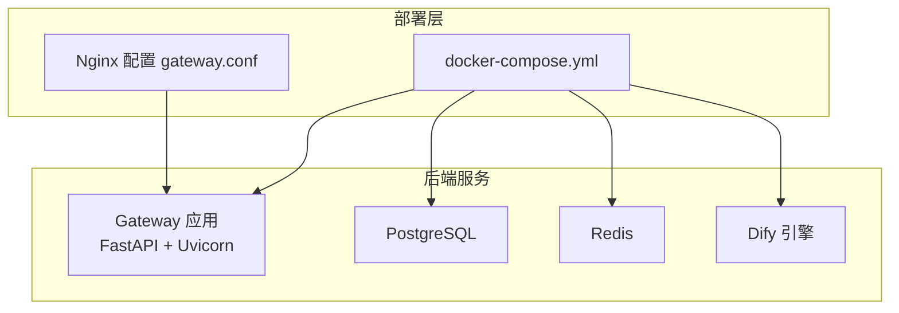
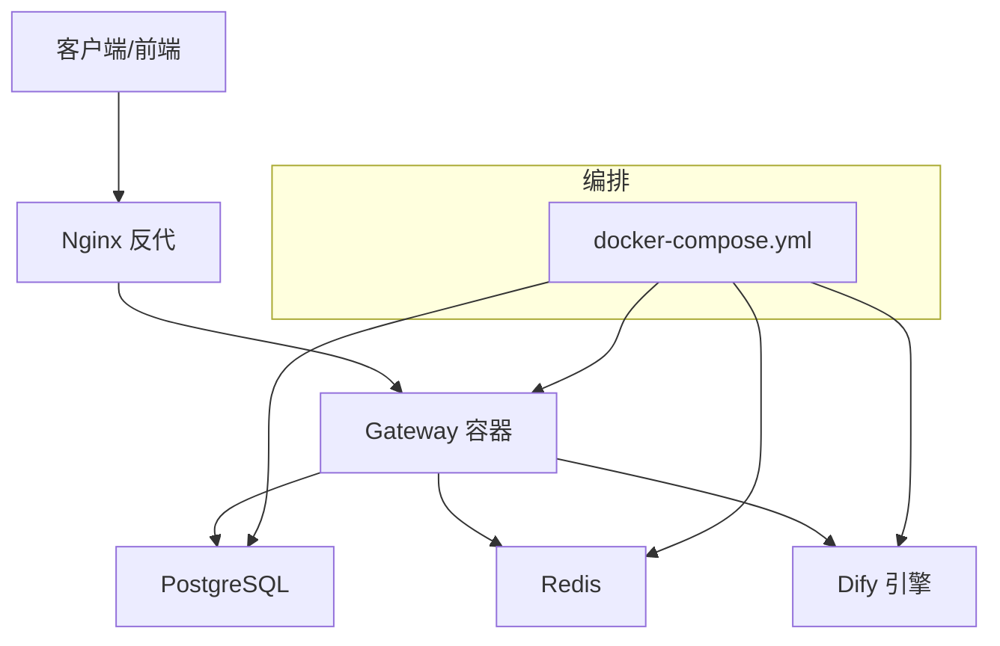
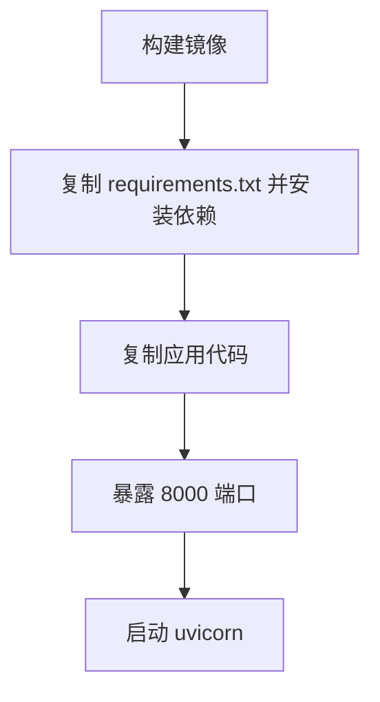
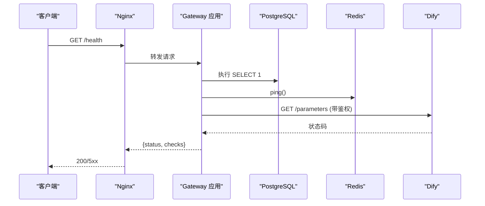
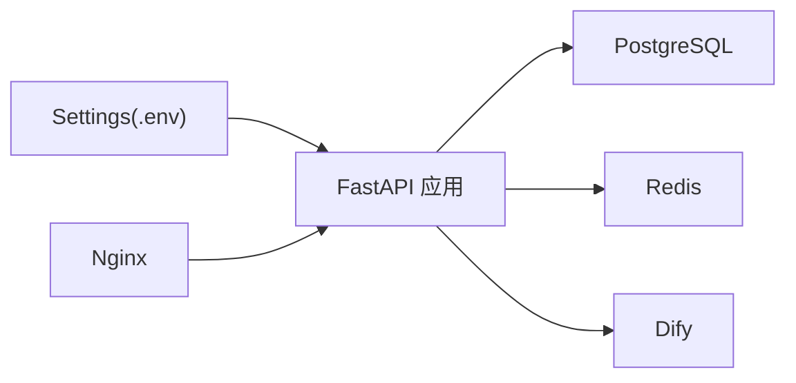

# 部署运维

<cite>
**本文引用的文件**
- [README.md](file://README.md)
- [docker-compose.yml](file://deploy/docker-compose.yml)
- [gateway.conf](file://deploy/nginx/gateway.conf)
- [Dockerfile](file://services/gateway/Dockerfile)
- [main.py](file://services/gateway/app/main.py)
- [config.py](file://services/gateway/app/config.py)
- [database.py](file://services/gateway/app/database.py)
- [deps.py](file://services/gateway/app/utils/deps.py)
- [requirements.txt](file://services/gateway/requirements.txt)
- [yixiaoguan-chatflow.yml](file://deploy/dify/yixiaoguan-chatflow.yml)
- [mutagen.yml](file://mutagen.yml)
</cite>

## 目录
1. [简介](#简介)
2. [项目结构](#项目结构)
3. [核心组件](#核心组件)
4. [架构总览](#架构总览)
5. [详细组件分析](#详细组件分析)
6. [依赖关系分析](#依赖关系分析)
7. [性能考虑](#性能考虑)
8. [故障排查指南](#故障排查指南)
9. [结论](#结论)
10. [附录](#附录)

## 简介
本指南面向医小管 v2 的部署与运维团队，覆盖以下主题：
- Docker 容器化部署：镜像构建、容器编排、环境变量配置与健康检查
- Nginx 反向代理：端口映射、WebSocket 支持、内网 Dify 控制台访问控制
- 生产最佳实践：监控告警、日志管理、备份恢复、容量规划
- 性能调优：数据库连接池、Redis 连接、并发与超时参数
- CI/CD 自动化：基于 Compose 的一键启动与 Mutagen 同步策略
- 常见问题排查：健康检查失败、鉴权错误、Dify 连接异常

## 项目结构
- 应用后端位于 services/gateway，采用 FastAPI + SQLAlchemy 异步 ORM + Redis 缓存
- 部署编排位于 deploy，包含 docker-compose.yml 和 Nginx 配置 gateway.conf
- Dify 工作流配置位于 deploy/dify/yixiaoguan-chatflow.yml
- 开发同步工具配置位于 mutagen.yml

图表来源
- [docker-compose.yml:1-22](file://deploy/docker-compose.yml#L1-L22)
- [gateway.conf:1-36](file://deploy/nginx/gateway.conf#L1-L36)
- [main.py:1-78](file://services/gateway/app/main.py#L1-L78)

章节来源
- [README.md:1-18](file://README.md#L1-L18)
- [docker-compose.yml:1-22](file://deploy/docker-compose.yml#L1-L22)
- [gateway.conf:1-36](file://deploy/nginx/gateway.conf#L1-L36)

## 核心组件
- 网关应用（Gateway）
  - 提供 /api/* REST 接口与 /ws WebSocket 接入
  - 健康检查接口会探测数据库、Redis 与 Dify 服务连通性
  - 使用 Pydantic Settings 从 .env 文件加载运行时配置
- 数据库与缓存
  - 异步 SQLAlchemy 连接池，默认池大小为 10
  - Redis 异步客户端，通过 lifespan 生命周期注入
- 反向代理（Nginx）
  - 将 /api/ 与 /ws 映射至本地网关服务
  - 对 /dify/ 限制内网访问（示例：192.168.100.0/24）

章节来源
- [main.py:1-78](file://services/gateway/app/main.py#L1-L78)
- [config.py:1-31](file://services/gateway/app/config.py#L1-L31)
- [database.py:1-15](file://services/gateway/app/database.py#L1-L15)
- [deps.py:1-40](file://services/gateway/app/utils/deps.py#L1-L40)
- [gateway.conf:1-36](file://deploy/nginx/gateway.conf#L1-L36)

## 架构总览
下图展示容器编排、反向代理与后端服务之间的交互。

图表来源
- [docker-compose.yml:1-22](file://deploy/docker-compose.yml#L1-L22)
- [gateway.conf:1-36](file://deploy/nginx/gateway.conf#L1-L36)
- [main.py:1-78](file://services/gateway/app/main.py#L1-L78)

## 详细组件分析

### 容器编排与镜像构建
- Compose 服务
  - 服务名：gateway
  - 构建上下文：../services/gateway，Dockerfile
  - 容器名：v2_gateway
  - 端口映射：外部 8100 -> 内部 8000，避免与 v1 冲突
  - 环境变量
    - DATABASE_URL：PostgreSQL 连接串
    - REDIS_URL：Redis 连接串
    - DIFY_API_URL、DIFY_API_KEY：Dify 引擎对接参数
    - JWT_SECRET：用于签发与校验令牌
  - 重启策略：unless-stopped
  - extra_hosts：将 host.docker.internal 指向 host-gateway，便于容器内访问宿主机服务
- 镜像构建
  - 基于 python:3.12-slim
  - 安装 requirements.txt 中依赖（使用清华源加速）
  - 暴露 8000 端口
  - 入口命令：uvicorn 启动 FastAPI 应用

图表来源
- [Dockerfile:1-14](file://services/gateway/Dockerfile#L1-L14)
- [requirements.txt:1-29](file://services/gateway/requirements.txt#L1-L29)

章节来源
- [docker-compose.yml:1-22](file://deploy/docker-compose.yml#L1-L22)
- [Dockerfile:1-14](file://services/gateway/Dockerfile#L1-L14)
- [requirements.txt:1-29](file://services/gateway/requirements.txt#L1-L29)

### 网关应用与健康检查
- 应用生命周期
  - lifespan 中初始化 Redis 客户端并注入到 app.state
  - 应用关闭时释放 Redis 连接
- 健康检查
  - /health 探测 PostgreSQL、Redis、Dify 三个组件
  - 返回状态 ok 或 degraded，并附带各组件检查结果
- 路由挂载
  - /api/auth、/api/conversations、/api/conversations/actions、/api/chat
  - /ws 为 WebSocket 入口

图表来源
- [main.py:16-68](file://services/gateway/app/main.py#L16-L68)
- [gateway.conf:1-36](file://deploy/nginx/gateway.conf#L1-L36)

章节来源
- [main.py:1-78](file://services/gateway/app/main.py#L1-L78)
- [config.py:1-31](file://services/gateway/app/config.py#L1-L31)
- [database.py:1-15](file://services/gateway/app/database.py#L1-L15)
- [deps.py:1-40](file://services/gateway/app/utils/deps.py#L1-L40)

### Nginx 反向代理与优化建议
- upstream 与 server
  - upstream 指向 127.0.0.1:8100
  - 监听 80 端口，server_name 为占位符
- API 与 WebSocket
  - /api/ 转发至 upstream
  - /ws 升级协议为 WebSocket，设置 Connection 与 Upgrade 头，读超时 86400 秒
- Dify 控制台
  - /dify/ 仅允许特定内网网段访问（示例：192.168.100.0/24）
- 优化方向（概念性建议）
  - SSL 终止：启用 HTTPS，配置证书与安全套件
  - 负载均衡：多实例部署时使用 upstream 多节点与健康检查
  - 缓存策略：静态资源与 API 结果缓存（需结合业务与版本号）
  - 超时与限流：合理设置 proxy_read_timeout、proxy_connect_timeout 与 Nginx 限流

章节来源
- [gateway.conf:1-36](file://deploy/nginx/gateway.conf#L1-L36)

### Dify 工作流与对接
- 工作流描述
  - 应用名称、模式、图标、开场白、建议问题等
  - 图谱包含开始节点、意图分类、闲聊/知识检索/RAG 回答、转人工等节点
- 对接要点
  - 确保 DIFY_API_URL 与 DIFY_API_KEY 正确配置
  - 知识库 ID 与数据集密钥按实际部署配置

章节来源
- [yixiaoguan-chatflow.yml:1-387](file://deploy/dify/yixiaoguan-chatflow.yml#L1-L387)

### 开发同步与本地联调
- Mutagen 同步
  - 两向同步，忽略常见目录与产物
  - Alpha/Beta 指向本地与远端路径
- 建议
  - 本地开发时保持 .env 与 .env 文件隔离
  - 同步前先停止容器，避免文件锁冲突

章节来源
- [mutagen.yml:1-27](file://mutagen.yml#L1-L27)

## 依赖关系分析
- 运行时依赖
  - FastAPI、Uvicorn、SQLAlchemy 异步、Redis、JWT、HTTPX、Pydantic Settings
- 组件耦合
  - Gateway 依赖数据库、Redis、Dify；Nginx 作为统一入口
  - 配置集中于 Settings，通过 .env 注入

图表来源
- [requirements.txt:1-29](file://services/gateway/requirements.txt#L1-L29)
- [config.py:1-31](file://services/gateway/app/config.py#L1-L31)
- [main.py:1-78](file://services/gateway/app/main.py#L1-L78)

章节来源
- [requirements.txt:1-29](file://services/gateway/requirements.txt#L1-L29)
- [config.py:1-31](file://services/gateway/app/config.py#L1-L31)

## 性能考虑
- 数据库连接池
  - 默认池大小 10，可根据并发与数据库性能调优
  - 建议开启连接池回收与空闲检测
- Redis 连接
  - 使用异步客户端，注意连接数与超时设置
- Uvicorn 并发
  - 根据 CPU 核数与内存设置 workers 与 threads
- Nginx 超时
  - WebSocket 读超时 86400s，确保长连接稳定
- Dify 调用
  - 设置合理的 httpx 超时与重试策略，避免阻塞

## 故障排查指南
- 健康检查失败
  - 检查 /health 返回的 postgres、redis、dify 字段
  - 确认数据库与 Redis 可达性、Dify 地址与密钥正确
- 鉴权错误（401）
  - 检查 JWT_SECRET 是否与前端一致
  - 确认 Authorization 头格式与令牌有效
- Dify 连接异常
  - 校验 DIFY_API_URL 与 DIFY_API_KEY
  - 关注网络连通性与超时设置
- Nginx 无法访问 /ws
  - 确认升级头与 proxy_http_version
  - 检查上游地址与端口映射
- 端口冲突
  - Compose 将 8100 映射到 8000，避免与 v1 冲突

章节来源
- [main.py:30-68](file://services/gateway/app/main.py#L30-L68)
- [deps.py:14-35](file://services/gateway/app/utils/deps.py#L14-L35)
- [gateway.conf:19-27](file://deploy/nginx/gateway.conf#L19-L27)
- [docker-compose.yml:9-17](file://deploy/docker-compose.yml#L9-L17)

## 结论
本指南提供了从容器编排、反向代理到健康检查与性能优化的完整运维蓝图。建议在生产环境中补充：
- 监控告警：Prometheus/Grafana + 日志聚合
- 备份恢复：数据库与 Redis 快照策略
- 安全加固：TLS、访问控制、最小权限原则
- CI/CD：自动化构建、测试与发布流水线

## 附录

### 环境变量清单
- DATABASE_URL：PostgreSQL 连接串
- REDIS_URL：Redis 连接串
- DIFY_API_URL：Dify API 基础地址
- DIFY_API_KEY：Dify API 密钥
- JWT_SECRET：JWT 密钥
- WECHAT_*：微信相关配置（按需启用）

章节来源
- [docker-compose.yml:11-16](file://deploy/docker-compose.yml#L11-L16)
- [config.py:6-26](file://services/gateway/app/config.py#L6-L26)

### 健康检查字段说明
- postgres：数据库连通性
- redis：Redis ping 成功与否
- dify：Dify 参数接口可用性

章节来源
- [main.py:30-68](file://services/gateway/app/main.py#L30-L68)