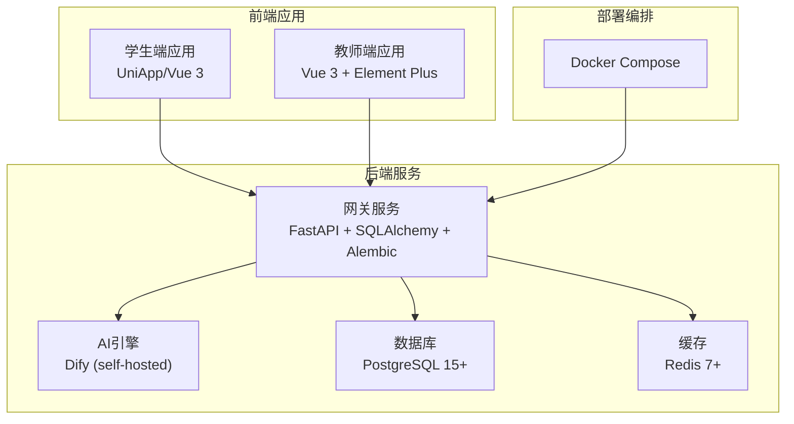
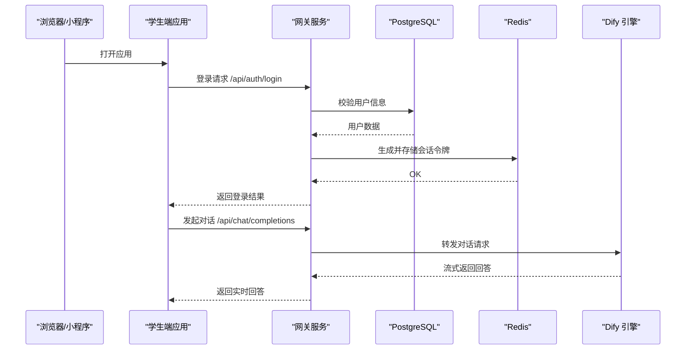
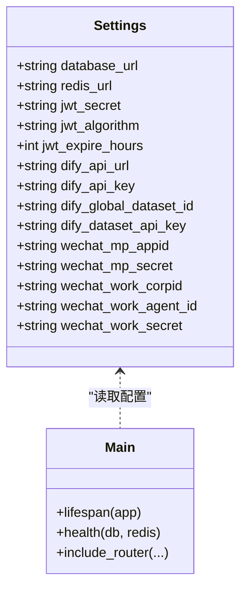
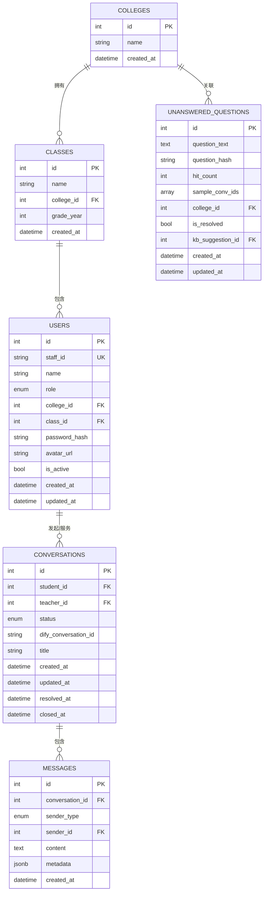
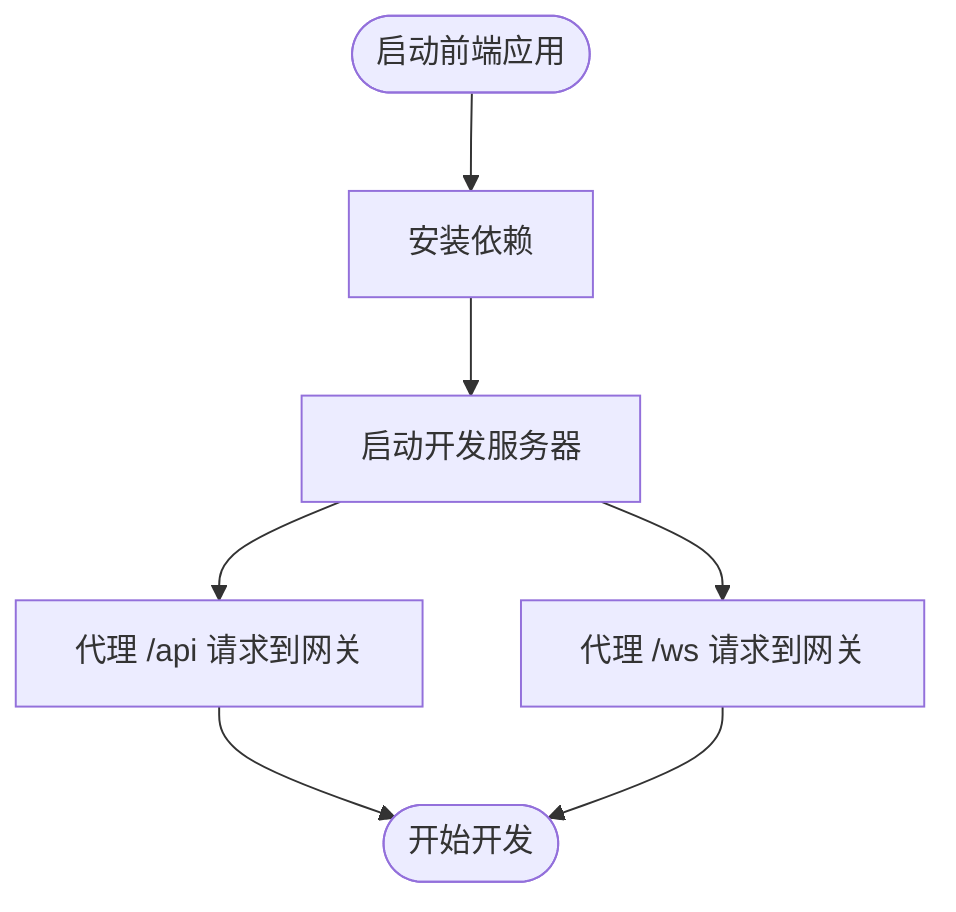
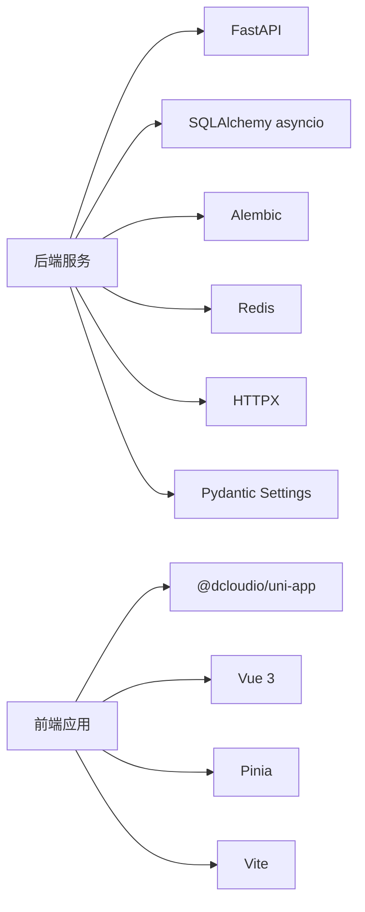

# 快速启动指南

<cite>
**本文档引用的文件**
- [README.md](file://README.md)
- [docker-compose.yml](file://deploy/docker-compose.yml)
- [Dockerfile](file://services/gateway/Dockerfile)
- [requirements.txt](file://services/gateway/requirements.txt)
- [config.py](file://services/gateway/app/config.py)
- [main.py](file://services/gateway/app/main.py)
- [e11bb6c9d4b8_v2_initial_schema.py](file://services/gateway/alembic/versions/e11bb6c9d4b8_v2_initial_schema.py)
- [vite.config.ts (学生端)](file://apps/student-app/vite.config.ts)
- [vite.config.ts (教师端)](file://apps/teacher-app/vite.config.ts)
- [package.json (学生端)](file://apps/student-app/package.json)
- [package.json (教师端)](file://apps/teacher-app/package.json)
</cite>

## 目录
1. [简介](#简介)
2. [项目结构](#项目结构)
3. [核心组件](#核心组件)
4. [架构总览](#架构总览)
5. [详细组件分析](#详细组件分析)
6. [依赖关系分析](#依赖关系分析)
7. [性能考虑](#性能考虑)
8. [故障排除指南](#故障排除指南)
9. [结论](#结论)
10. [附录](#附录)

## 简介
本指南面向新加入的开发者，帮助你在最短时间内成功运行医小管 v2 项目。内容涵盖环境准备、Docker 开发环境搭建、本地开发配置、数据库初始化、常见问题排查以及基础使用示例。

## 项目结构
项目采用多模块组织方式：
- 后端网关服务：基于 FastAPI，负责认证、会话管理、WebSocket、与 AI 引擎交互等
- 学生端应用：UniApp/Vue 3 应用，提供移动端与 H5 访问
- 教师端应用：Vue 3 + Element Plus 应用，提供 Web 管理界面
- 部署与编排：使用 Docker Compose 编排后端网关服务
- 文档与设计：包含开发计划、架构设计与远程开发方案

**图表来源**
- [docker-compose.yml:1-22](file://deploy/docker-compose.yml#L1-L22)
- [Dockerfile:1-14](file://services/gateway/Dockerfile#L1-L14)
- [requirements.txt:1-29](file://services/gateway/requirements.txt#L1-L29)

**章节来源**
- [README.md:1-18](file://README.md#L1-L18)
- [docker-compose.yml:1-22](file://deploy/docker-compose.yml#L1-L22)

## 核心组件
- 网关服务（Gateway）
  - 使用 FastAPI 提供 REST API 与 WebSocket 接口
  - 通过 SQLAlchemy 进行异步数据库访问
  - 通过 Alembic 管理数据库迁移
  - 通过 Redis 实现缓存与状态管理
  - 通过 HTTP 客户端与 Dify 引擎通信
- 学生端与教师端应用
  - 基于 UniApp/Vue 3 构建，支持 H5 与小程序
  - 通过 Vite 开发服务器代理请求到网关服务
- Docker 编排
  - 使用 docker-compose 启动网关服务，并通过环境变量配置数据库、缓存与 AI 引擎地址

**章节来源**
- [main.py:1-78](file://services/gateway/app/main.py#L1-L78)
- [config.py:1-31](file://services/gateway/app/config.py#L1-L31)
- [requirements.txt:1-29](file://services/gateway/requirements.txt#L1-L29)
- [vite.config.ts (学生端):1-22](file://apps/student-app/vite.config.ts#L1-L22)
- [vite.config.ts (教师端):1-22](file://apps/teacher-app/vite.config.ts#L1-L22)

## 架构总览
下图展示了从浏览器到后端服务的典型调用链路，包括认证、会话管理与 AI 对话流程。

**图表来源**
- [main.py:70-78](file://services/gateway/app/main.py#L70-L78)
- [config.py:6-26](file://services/gateway/app/config.py#L6-L26)

## 详细组件分析

### 网关服务（Gateway）
- 配置管理
  - 通过 pydantic-settings 读取 .env 文件中的配置项，包括数据库连接、Redis 连接、JWT 密钥、Dify 地址与密钥等
- 健康检查
  - 提供 /health 接口，检查 PostgreSQL、Redis 与 Dify 的连通性
- 路由组织
  - 挂载认证、会话、动作、WebSocket 与聊天相关路由

**图表来源**
- [config.py:3-30](file://services/gateway/app/config.py#L3-L30)
- [main.py:16-78](file://services/gateway/app/main.py#L16-L78)

**章节来源**
- [config.py:1-31](file://services/gateway/app/config.py#L1-L31)
- [main.py:1-78](file://services/gateway/app/main.py#L1-L78)

### 数据库迁移与模式
- 初始模式包含学院、班级、用户、会话、消息、未解答问题等表
- 使用 Alembic 管理版本迁移，支持升级与降级

**图表来源**
- [e11bb6c9d4b8_v2_initial_schema.py:21-140](file://services/gateway/alembic/versions/e11bb6c9d4b8_v2_initial_schema.py#L21-L140)

**章节来源**
- [e11bb6c9d4b8_v2_initial_schema.py:1-160](file://services/gateway/alembic/versions/e11bb6c9d4b8_v2_initial_schema.py#L1-L160)

### 前端应用（学生端与教师端）
- 开发服务器
  - 通过 Vite 开发服务器启动，分别监听不同端口
  - 配置了 /api 与 /ws 代理，转发到网关服务
- 依赖与构建
  - 使用 UniApp 生态，支持 H5 与多平台小程序
  - 通过 npm scripts 进行开发与构建

**图表来源**
- [vite.config.ts (学生端):4-21](file://apps/student-app/vite.config.ts#L4-L21)
- [vite.config.ts (教师端):4-21](file://apps/teacher-app/vite.config.ts#L4-L21)
- [package.json (学生端):4-10](file://apps/student-app/package.json#L4-L10)
- [package.json (教师端):4-10](file://apps/teacher-app/package.json#L4-L10)

**章节来源**
- [vite.config.ts (学生端):1-22](file://apps/student-app/vite.config.ts#L1-L22)
- [vite.config.ts (教师端):1-22](file://apps/teacher-app/vite.config.ts#L1-L22)
- [package.json (学生端):1-37](file://apps/student-app/package.json#L1-L37)
- [package.json (教师端):1-46](file://apps/teacher-app/package.json#L1-L46)

## 依赖关系分析
- 后端依赖
  - FastAPI、Uvicorn、SQLAlchemy asyncio、asyncpg、Alembic、Redis、HTTPX、Pydantic Settings、Passlib、bcrypt 等
- 前端依赖
  - @dcloudio/uni-app、vue、pinia、sass、typescript、vite 等

**图表来源**
- [requirements.txt:1-29](file://services/gateway/requirements.txt#L1-L29)
- [package.json (学生端):11-35](file://apps/student-app/package.json#L11-L35)
- [package.json (教师端):11-44](file://apps/teacher-app/package.json#L11-L44)

**章节来源**
- [requirements.txt:1-29](file://services/gateway/requirements.txt#L1-L29)
- [package.json (学生端):1-37](file://apps/student-app/package.json#L1-L37)
- [package.json (教师端):1-46](file://apps/teacher-app/package.json#L1-L46)

## 性能考虑
- 异步数据库访问：使用 SQLAlchemy asyncio 降低阻塞，提升并发处理能力
- 缓存策略：利用 Redis 缓存会话与热点数据，减少数据库压力
- 流式响应：与 Dify 引擎交互时采用流式传输，改善用户体验
- 代理优化：前端开发服务器代理配置避免跨域问题，提高调试效率

## 故障排除指南
- 网关服务无法启动
  - 检查数据库连接字符串是否正确，确认 PostgreSQL 已运行且可访问
  - 检查 Redis 连接字符串是否正确，确认 Redis 已运行且可访问
  - 检查 Dify 地址与密钥配置，确认 Dify 可访问且密钥有效
- 健康检查失败
  - 访问 /health 接口查看具体错误项（postgres、redis、dify），逐一排查
- 前端无法连接后端
  - 确认前端代理目标地址与端口与网关服务一致
  - 确认网关服务已启动并监听指定端口
- 数据库迁移失败
  - 确认数据库用户权限足够执行迁移脚本
  - 检查 Alembic 配置文件路径与版本控制状态

**章节来源**
- [main.py:30-68](file://services/gateway/app/main.py#L30-L68)
- [config.py:6-26](file://services/gateway/app/config.py#L6-L26)
- [vite.config.ts (学生端):9-18](file://apps/student-app/vite.config.ts#L9-L18)
- [vite.config.ts (教师端):9-18](file://apps/teacher-app/vite.config.ts#L9-L18)

## 结论
通过本指南，你可以完成环境准备、Docker 开发环境搭建、数据库初始化与配置，并成功运行前后端应用。遇到问题时，可依据故障排除指南进行定位与修复。建议在开发过程中遵循统一的配置规范与接口约定，确保系统稳定运行。

## 附录

### 环境准备步骤
- 安装必要软件
  - Docker Desktop（用于容器化部署）
  - Python 3.12（用于后端开发与测试）
  - Node.js 18+（用于前端开发）
  - PostgreSQL 15+ 与 Redis 7+（可复用现有实例或使用 Docker）
- 克隆仓库并进入根目录

**章节来源**
- [README.md:5-10](file://README.md#L5-L10)

### Docker 开发环境搭建
- 启动命令
  - 在根目录执行 docker compose 启动网关服务
- 端口映射
  - 网关服务映射到宿主机 8100 端口，避免与旧版服务冲突
- 环境变量
  - 数据库连接字符串、Redis 连接字符串、Dify 地址与密钥、JWT 密钥等
- 依赖服务
  - PostgreSQL 与 Redis 由外部提供，网关服务通过 host.docker.internal 访问

**章节来源**
- [README.md:12-15](file://README.md#L12-L15)
- [docker-compose.yml:8-19](file://deploy/docker-compose.yml#L8-L19)

### 本地开发环境配置
- 后端配置
  - 在网关服务目录创建 .env 文件，填入数据库、Redis、Dify 与 JWT 相关配置
  - 使用 requirements.txt 安装依赖
- 前端配置
  - 在学生端与教师端分别安装依赖并启动开发服务器
  - 确保代理目标地址指向网关服务

**章节来源**
- [config.py:28-30](file://services/gateway/app/config.py#L28-L30)
- [requirements.txt:1-29](file://services/gateway/requirements.txt#L1-L29)
- [vite.config.ts (学生端):6-21](file://apps/student-app/vite.config.ts#L6-L21)
- [vite.config.ts (教师端):6-21](file://apps/teacher-app/vite.config.ts#L6-L21)

### 数据库初始化
- 执行迁移
  - 使用 Alembic 将数据库升级到最新版本
- 初始模式
  - 升级后将创建初始表结构，包含用户、会话、消息等核心实体

**章节来源**
- [e11bb6c9d4b8_v2_initial_schema.py:21-140](file://services/gateway/alembic/versions/e11bb6c9d4b8_v2_initial_schema.py#L21-L140)

### 基本使用示例
- 注册与登录
  - 通过前端应用访问登录页面，输入账号密码进行登录
- 发起对话
  - 在聊天页面输入问题，点击发送，观察实时回答
- 查看历史
  - 在历史记录中查看过往对话

**章节来源**
- [main.py:70-78](file://services/gateway/app/main.py#L70-L78)