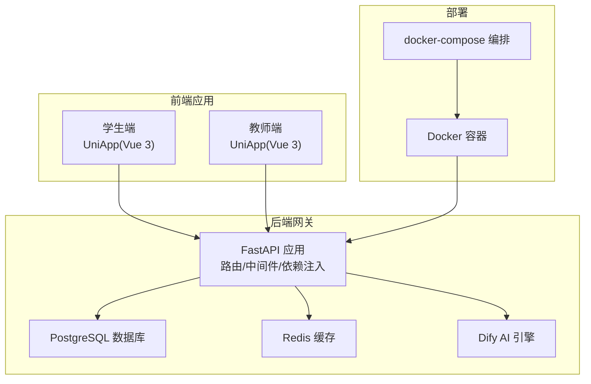
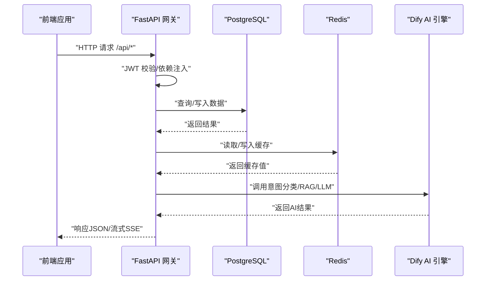
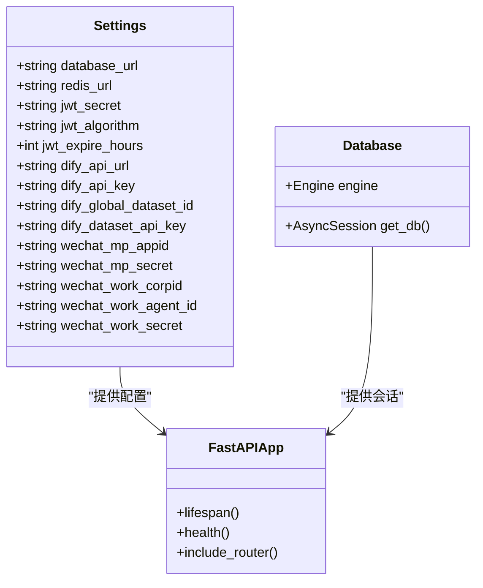
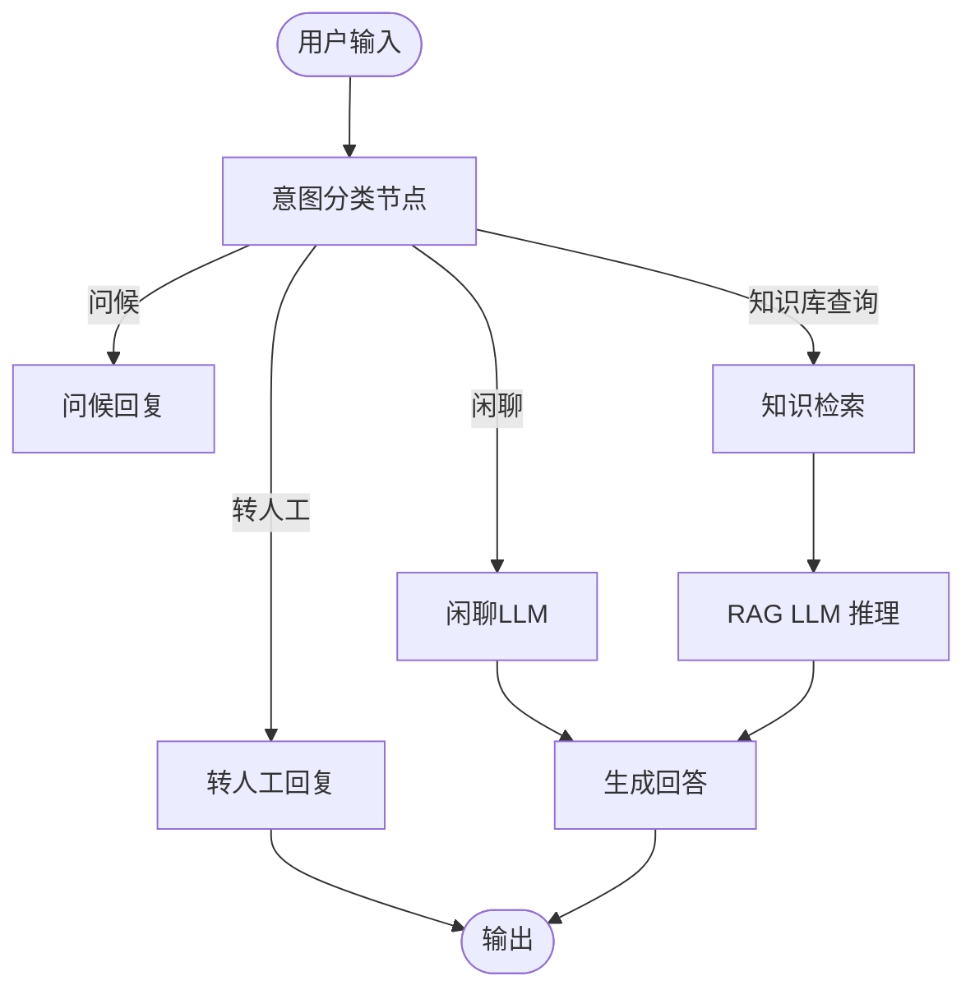
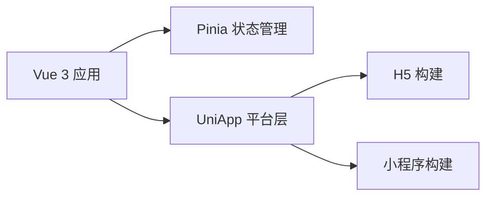
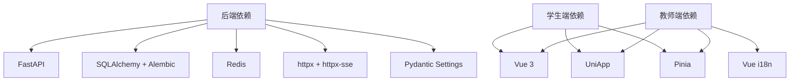

# 技术栈概览

<cite>
**本文档引用的文件**
- [README.md](file://README.md)
- [services/gateway/requirements.txt](file://services/gateway/requirements.txt)
- [services/gateway/app/main.py](file://services/gateway/app/main.py)
- [services/gateway/app/config.py](file://services/gateway/app/config.py)
- [services/gateway/app/database.py](file://services/gateway/app/database.py)
- [services/gateway/alembic/env.py](file://services/gateway/alembic/env.py)
- [services/gateway/Dockerfile](file://services/gateway/Dockerfile)
- [apps/student-app/package.json](file://apps/student-app/package.json)
- [apps/teacher-app/package.json](file://apps/teacher-app/package.json)
- [apps/student-app/src/main.ts](file://apps/student-app/src/main.ts)
- [apps/teacher-app/src/main.ts](file://apps/teacher-app/src/main.ts)
- [deploy/dify/yixiaoguan-chatflow.yml](file://deploy/dify/yixiaoguan-chatflow.yml)
</cite>

## 目录
1. [简介](#简介)
2. [项目结构](#项目结构)
3. [核心组件](#核心组件)
4. [架构总览](#架构总览)
5. [详细组件分析](#详细组件分析)
6. [依赖分析](#依赖分析)
7. [性能考虑](#性能考虑)
8. [故障排除指南](#故障排除指南)
9. [结论](#结论)
10. [附录](#附录)

## 简介
本项目为“医小管 v2”AI校园智能服务系统的第二代架构，采用前后端分离与AI集成的现代化技术栈。后端基于异步Web框架与ORM，结合数据库迁移工具；前端分别针对学生端与教师端提供不同体验；AI引擎采用自托管Dify，支持意图分类、RAG检索与流式对话。项目通过容器化部署，具备良好的可扩展性与可维护性。

## 项目结构
项目采用多模块组织方式：
- 后端网关服务：位于 services/gateway，提供REST API、WebSocket、认证与AI集成能力
- 学生端应用：apps/student-app 基于UniApp/Vue 3，适配H5与小程序
- 教师端应用：apps/teacher-app 基于UniApp/Vue 3，提供更丰富的管理功能
- AI工作流：deploy/dify 提供Dify聊天流程定义
- 部署与配置：docker-compose与Dify配置文件

图表来源
- [services/gateway/app/main.py:1-78](file://services/gateway/app/main.py#L1-L78)
- [services/gateway/app/config.py:1-31](file://services/gateway/app/config.py#L1-L31)
- [apps/student-app/package.json:1-37](file://apps/student-app/package.json#L1-L37)
- [apps/teacher-app/package.json:1-46](file://apps/teacher-app/package.json#L1-L46)
- [deploy/docker-compose.yml](file://deploy/docker-compose.yml)

章节来源
- [README.md:1-18](file://README.md#L1-L18)
- [services/gateway/app/main.py:1-78](file://services/gateway/app/main.py#L1-L78)
- [apps/student-app/package.json:1-37](file://apps/student-app/package.json#L1-L37)
- [apps/teacher-app/package.json:1-46](file://apps/teacher-app/package.json#L1-L46)

## 核心组件
- 后端技术栈
  - Web框架：FastAPI（异步、类型安全、自动生成OpenAPI文档）
  - ORM与数据库：SQLAlchemy 2.x（异步模式）+ Alembic（数据库迁移）
  - 缓存：Redis（异步客户端）
  - 认证与安全：JWT、bcrypt、httpx（调用Dify API）
- AI集成方案：Dify（self-hosted），提供意图分类、RAG检索与LLM推理
- 数据库与缓存：PostgreSQL 15+、Redis 7+
- 前端技术栈
  - 学生端：UniApp + Vue 3 + Pinia
  - 教师端：UniApp + Vue 3 + Pinia + i18n

章节来源
- [README.md:5-10](file://README.md#L5-L10)
- [services/gateway/requirements.txt:1-29](file://services/gateway/requirements.txt#L1-L29)
- [services/gateway/app/config.py:1-31](file://services/gateway/app/config.py#L1-L31)

## 架构总览
下图展示从浏览器到后端服务、数据库与AI引擎的整体交互流程：

图表来源
- [services/gateway/app/main.py:1-78](file://services/gateway/app/main.py#L1-L78)
- [services/gateway/app/config.py:1-31](file://services/gateway/app/config.py#L1-L31)
- [services/gateway/app/database.py:1-15](file://services/gateway/app/database.py#L1-L15)

## 详细组件分析

### 后端服务（FastAPI + SQLAlchemy + Alembic）
- 应用入口与生命周期
  - 使用 lifespan 管理Redis连接的创建与关闭
  - 提供健康检查接口，验证PostgreSQL、Redis与Dify连通性
- 路由组织
  - 认证、会话、动作、WebSocket、聊天等模块化路由
- 数据层
  - 异步SQLAlchemy引擎与会话工厂
  - Alembic环境配置，支持离线与在线迁移
- 配置管理
  - Pydantic Settings加载环境变量，集中管理数据库、Redis、JWT与Dify参数

图表来源
- [services/gateway/app/config.py:1-31](file://services/gateway/app/config.py#L1-L31)
- [services/gateway/app/database.py:1-15](file://services/gateway/app/database.py#L1-L15)
- [services/gateway/app/main.py:1-78](file://services/gateway/app/main.py#L1-L78)

章节来源
- [services/gateway/app/main.py:1-78](file://services/gateway/app/main.py#L1-L78)
- [services/gateway/app/config.py:1-31](file://services/gateway/app/config.py#L1-L31)
- [services/gateway/app/database.py:1-15](file://services/gateway/app/database.py#L1-L15)
- [services/gateway/alembic/env.py:1-97](file://services/gateway/alembic/env.py#L1-L97)

### AI集成（Dify）
- 工作流设计
  - 意图分类：问候、闲聊、知识库查询、转人工
  - RAG检索：基于知识库上下文生成回答
  - LLM推理：qwen-plus模型，支持记忆窗口与温度控制
- 集成方式
  - 后端通过httpx调用Dify API，使用API Key鉴权
  - 健康检查中对Dify接口进行连通性验证

图表来源
- [deploy/dify/yixiaoguan-chatflow.yml:1-387](file://deploy/dify/yixiaoguan-chatflow.yml#L1-L387)
- [services/gateway/app/main.py:51-61](file://services/gateway/app/main.py#L51-L61)

章节来源
- [deploy/dify/yixiaoguan-chatflow.yml:1-387](file://deploy/dify/yixiaoguan-chatflow.yml#L1-L387)
- [services/gateway/app/main.py:51-61](file://services/gateway/app/main.py#L51-L61)

### 前端技术栈（UniApp + Vue 3 + Element Plus）
- 学生端
  - 基于Vue 3 + Pinia的状态管理
  - 支持H5与微信小程序构建
- 教师端
  - 在学生端基础上增加国际化支持与更多业务页面
  - 初始化用户状态与WebSocket连接（若已登录）

图表来源
- [apps/student-app/src/main.ts:1-11](file://apps/student-app/src/main.ts#L1-L11)
- [apps/teacher-app/src/main.ts:1-25](file://apps/teacher-app/src/main.ts#L1-L25)
- [apps/student-app/package.json:1-37](file://apps/student-app/package.json#L1-L37)
- [apps/teacher-app/package.json:1-46](file://apps/teacher-app/package.json#L1-L46)

章节来源
- [apps/student-app/src/main.ts:1-11](file://apps/student-app/src/main.ts#L1-L11)
- [apps/teacher-app/src/main.ts:1-25](file://apps/teacher-app/src/main.ts#L1-L25)
- [apps/student-app/package.json:1-37](file://apps/student-app/package.json#L1-L37)
- [apps/teacher-app/package.json:1-46](file://apps/teacher-app/package.json#L1-L46)

### 数据库与缓存（PostgreSQL + Redis）
- PostgreSQL
  - 异步驱动asyncpg，连接池配置，会话生命周期管理
  - Alembic迁移脚本与环境配置
- Redis
  - 异步客户端aioredis，统一通过依赖注入提供
  - 健康检查中执行ping验证连通性

章节来源
- [services/gateway/app/database.py:1-15](file://services/gateway/app/database.py#L1-L15)
- [services/gateway/alembic/env.py:1-97](file://services/gateway/alembic/env.py#L1-L97)
- [services/gateway/app/main.py:30-68](file://services/gateway/app/main.py#L30-L68)

## 依赖分析
- 版本与兼容性
  - Python 3.12（容器基础镜像）
  - FastAPI >= 0.115.0，uvicorn >= 0.30.0
  - SQLAlchemy[asyncio] >= 2.0.30，asyncpg >= 0.30.0，Alembic >= 1.14.0
  - Redis[hiredis] >= 5.0.0
  - httpx/httpx-sse >= 0.27.0
  - Pydantic Settings >= 2.3.0
  - Vue 3 + UniApp 3.0.0-4080420251103001
- 外部依赖
  - Dify API（通过httpx调用）
  - 微信相关配置（P阶段参数）

图表来源
- [services/gateway/requirements.txt:1-29](file://services/gateway/requirements.txt#L1-L29)
- [apps/student-app/package.json:1-37](file://apps/student-app/package.json#L1-L37)
- [apps/teacher-app/package.json:1-46](file://apps/teacher-app/package.json#L1-L46)

章节来源
- [services/gateway/requirements.txt:1-29](file://services/gateway/requirements.txt#L1-L29)
- [apps/student-app/package.json:1-37](file://apps/student-app/package.json#L1-L37)
- [apps/teacher-app/package.json:1-46](file://apps/teacher-app/package.json#L1-L46)

## 性能考虑
- 异步I/O
  - 后端使用异步SQLAlchemy与Redis，减少阻塞，提升并发处理能力
- 连接池
  - 数据库连接池大小合理设置，避免过度占用资源
- 缓存策略
  - 利用Redis缓存热点数据，降低数据库压力
- 健康检查
  - 统一的健康检查接口，便于容器编排与监控

## 故障排除指南
- 健康检查失败
  - 检查PostgreSQL与Redis连通性与密码配置
  - 确认Dify服务地址与API Key正确
- 数据库迁移问题
  - 使用Alembic离线/在线迁移命令，核对目标元数据
- 前端构建异常
  - 确认Node.js与Vite版本兼容，依赖安装完整

章节来源
- [services/gateway/app/main.py:30-68](file://services/gateway/app/main.py#L30-L68)
- [services/gateway/alembic/env.py:67-97](file://services/gateway/alembic/env.py#L67-L97)

## 结论
本项目以现代技术栈构建了高可用、可扩展的AI校园服务平台。后端通过异步架构与完善的依赖注入体系保证性能与可维护性；前端以UniApp统一多端开发；AI引擎采用Dify实现意图识别与RAG检索。整体架构清晰、职责分明，适合团队协作与持续演进。

## 附录
- 快速启动
  - 通过docker-compose一键启动所有服务
- 开发规范
  - 参考项目内设计文档与需求说明

章节来源
- [README.md:12-18](file://README.md#L12-L18)
- [services/gateway/Dockerfile:1-14](file://services/gateway/Dockerfile#L1-L14)