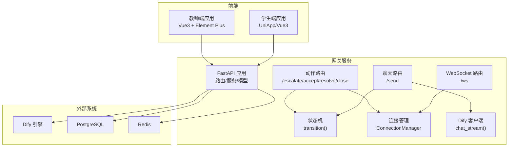
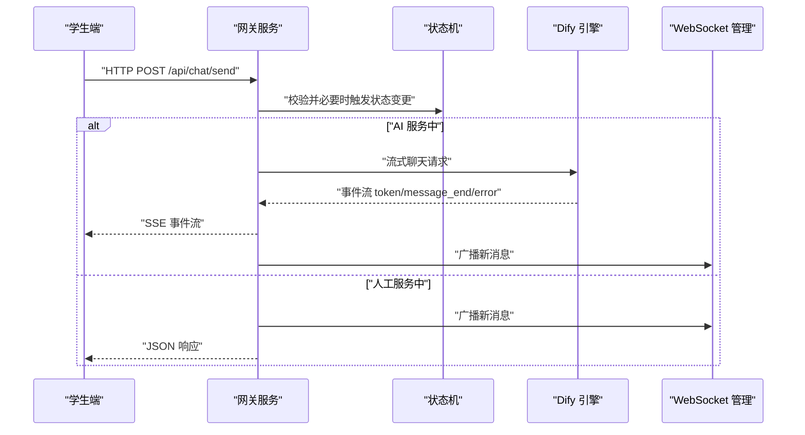
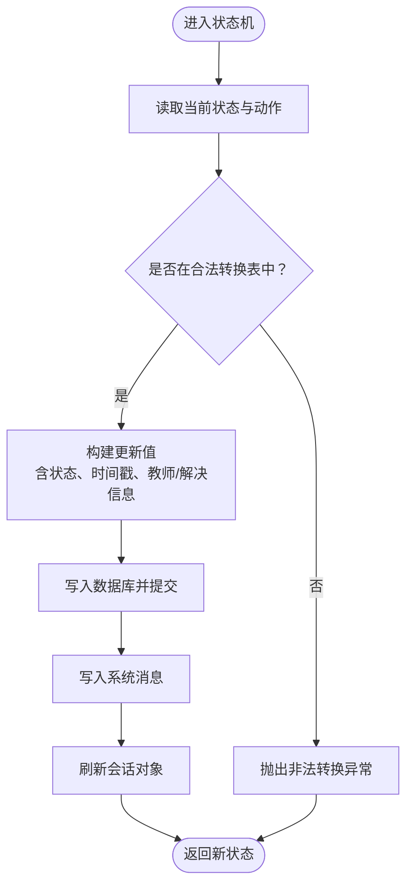
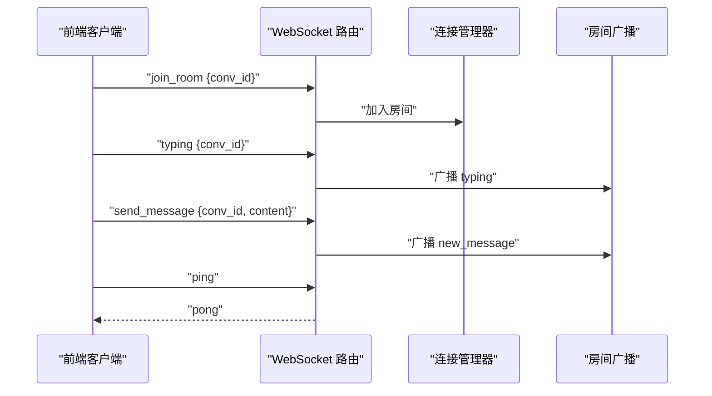
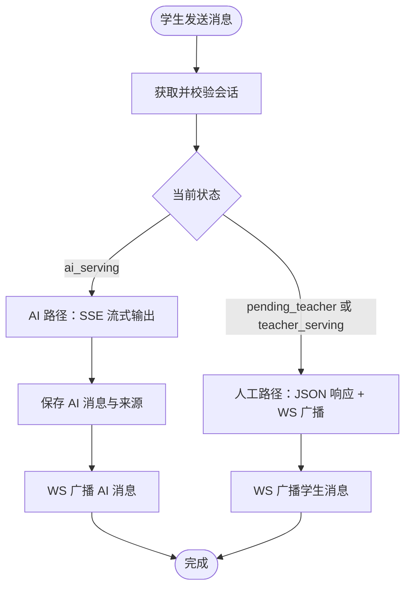
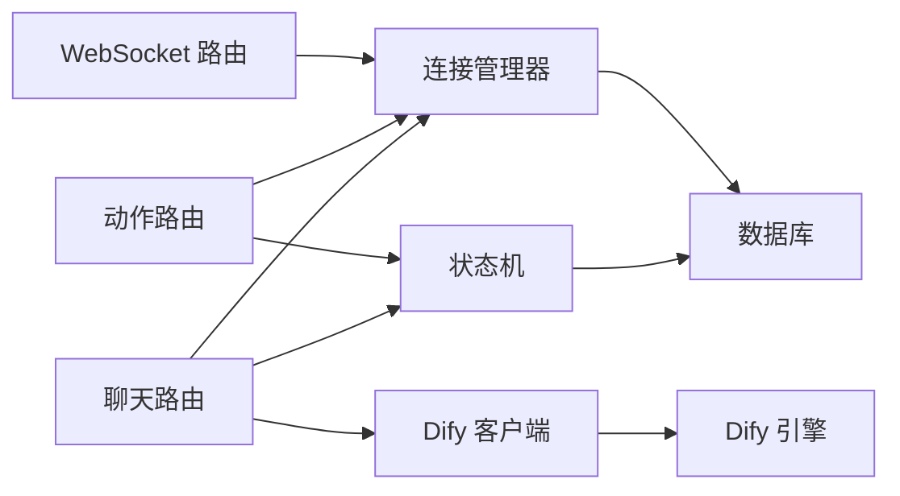

# 架构设计理念

<cite>
**本文引用的文件**
- [README.md](file://README.md)
- [docker-compose.yml](file://deploy/docker-compose.yml)
- [main.py](file://services/gateway/app/main.py)
- [config.py](file://services/gateway/app/config.py)
- [ws.py](file://services/gateway/app/routers/ws.py)
- [chat.py](file://services/gateway/app/routers/chat.py)
- [actions.py](file://services/gateway/app/routers/actions.py)
- [state_machine.py](file://services/gateway/app/services/state_machine.py)
- [ws_manager.py](file://services/gateway/app/services/ws_manager.py)
- [dify_client.py](file://services/gateway/app/services/dify_client.py)
- [conversation.py](file://services/gateway/app/models/conversation.py)
- [conversation.py（schema）](file://services/gateway/app/schemas/conversation.py)
- [websocket.ts（学生端）](file://apps/student-app/src/utils/websocket.ts)
- [websocket.ts（教师端）](file://apps/teacher-app/src/utils/websocket.ts)
- [main.ts（教师端）](file://apps/teacher-app/src/main.ts)
- [main.ts（学生端）](file://apps/student-app/src/main.ts)
</cite>

## 目录
1. [引言](#引言)
2. [项目结构](#项目结构)
3. [核心组件](#核心组件)
4. [架构总览](#架构总览)
5. [详细组件分析](#详细组件分析)
6. [依赖分析](#依赖分析)
7. [性能考虑](#性能考虑)
8. [故障排查指南](#故障排查指南)
9. [结论](#结论)
10. [附录](#附录)

## 引言
本文件面向架构师与高级开发者，系统化阐述“医小管 v2”项目的架构设计理念与实现要点。项目采用前后端分离与微服务化思想，以网关服务为核心枢纽，结合事件驱动与状态机模型，实现“AI 助手 + 人工教师”的双通道服务模式，并通过 WebSocket 实现实时通信与房间广播机制。本文将从系统架构、组件职责、数据流与控制流、状态机设计、实时通信优势与技术权衡等方面进行深入解析。

## 项目结构
项目采用多模块分层组织：
- 网关服务（Gateway Service）：基于 FastAPI，负责认证鉴权、聊天与动作路由、状态机与 WebSocket 管理、与 Dify AI 引擎集成。
- 学生端应用（Student App）：UniApp/Vue3，移动端/小程序适配，通过 WebSocket 与网关交互。
- 教师端应用（Teacher App）：Vue3 + Element Plus，Web/H5 适配，通过 WebSocket 与网关交互。
- 部署与配置：Docker Compose 编排，统一暴露网关端口，外部依赖 PostgreSQL 与 Redis。

图表来源
- [docker-compose.yml:1-22](file://deploy/docker-compose.yml#L1-L22)
- [ws.py:1-119](file://services/gateway/app/routers/ws.py#L1-L119)
- [chat.py:1-191](file://services/gateway/app/routers/chat.py#L1-L191)
- [actions.py:1-154](file://services/gateway/app/routers/actions.py#L1-L154)
- [state_machine.py:1-96](file://services/gateway/app/services/state_machine.py#L1-L96)
- [ws_manager.py:1-100](file://services/gateway/app/services/ws_manager.py#L1-L100)
- [dify_client.py:1-105](file://services/gateway/app/services/dify_client.py#L1-L105)

章节来源
- [README.md:1-18](file://README.md#L1-L18)
- [docker-compose.yml:1-22](file://deploy/docker-compose.yml#L1-L22)

## 核心组件
- 网关主入口与配置
  - 主入口文件负责应用初始化与路由挂载；配置文件集中管理数据库、缓存、AI 引擎与密钥等参数。
- WebSocket 路由与连接管理
  - 提供统一的 /ws 端点，支持房间加入/离开、打字提示、消息广播与心跳保活；连接管理器维护用户与房间映射，处理断线清理与广播。
- 聊天与动作路由
  - /send 负责学生消息发送与 AI 流式响应；动作路由提供转接、接单、标记解决、关闭等会话状态变更。
- 状态机与会话模型
  - 以状态机约束合法的状态转换，确保会话生命周期的正确性；模型定义会话与消息的数据结构及索引。
- Dify 客户端
  - 封装 Dify 的流式聊天接口，按事件类型透传 token、结束与错误信息，并在结束后持久化 AI 回答与来源引用。
- 前端 WebSocket 管理
  - 学生端与教师端均实现统一的 WS 管理器，支持重连、心跳、房间重加入、发送队列与消息分发。

章节来源
- [main.py](file://services/gateway/app/main.py)
- [config.py](file://services/gateway/app/config.py)
- [ws.py:1-119](file://services/gateway/app/routers/ws.py#L1-L119)
- [chat.py:1-191](file://services/gateway/app/routers/chat.py#L1-L191)
- [actions.py:1-154](file://services/gateway/app/routers/actions.py#L1-L154)
- [state_machine.py:1-96](file://services/gateway/app/services/state_machine.py#L1-L96)
- [conversation.py:1-63](file://services/gateway/app/models/conversation.py#L1-L63)
- [dify_client.py:1-105](file://services/gateway/app/services/dify_client.py#L1-L105)
- [websocket.ts（学生端）:1-153](file://apps/student-app/src/utils/websocket.ts#L1-L153)
- [websocket.ts（教师端）:1-169](file://apps/teacher-app/src/utils/websocket.ts#L1-L169)

## 架构总览
系统采用“网关 + 微服务化路由 + 事件驱动 + 状态机”的设计：
- 前后端分离：前端通过 HTTP 与 WebSocket 与网关交互；后端通过路由层解耦业务逻辑。
- 事件驱动：WebSocket 作为事件总线，承载消息广播、状态变更通知与打字提示。
- 状态机：统一约束会话状态流转，避免并发与竞态导致的非法状态。
- AI 与人工双通道：AI 路径通过 SSE 流式输出，人工路径通过 WebSocket 广播与教师接单。

图表来源
- [chat.py:22-102](file://services/gateway/app/routers/chat.py#L22-L102)
- [state_machine.py:34-96](file://services/gateway/app/services/state_machine.py#L34-L96)
- [dify_client.py:22-69](file://services/gateway/app/services/dify_client.py#L22-L69)
- [ws_manager.py:71-81](file://services/gateway/app/services/ws_manager.py#L71-L81)

## 详细组件分析

### 状态机与会话管理
- 设计思路
  - 使用显式状态表与转换函数，将会话生命周期（AI 服务、等待教师、教师服务、已解决、已关闭）规范化，避免状态漂移。
  - 在每次状态转换时写入系统消息，记录关键动作与元数据，便于审计与回溯。
- 关键点
  - 合法转换表定义了允许的动作与目标状态，非法转换抛出异常，保证一致性。
  - 转换过程中更新教师接入时间、解决时间、关闭时间等字段，并刷新对象状态。
- 与路由的协作
  - /send 在会话处于已解决时触发“重新激活”，回到 AI 服务；动作路由提供 escalate/accept/resolve/close 等操作，均通过状态机执行。

图表来源
- [state_machine.py:19-31](file://services/gateway/app/services/state_machine.py#L19-L31)
- [state_machine.py:40-96](file://services/gateway/app/services/state_machine.py#L40-L96)

章节来源
- [state_machine.py:1-96](file://services/gateway/app/services/state_machine.py#L1-L96)
- [actions.py:68-154](file://services/gateway/app/routers/actions.py#L68-L154)
- [chat.py:43-51](file://services/gateway/app/routers/chat.py#L43-L51)

### WebSocket 实时通信与房间广播
- 设计思路
  - 单连接 + 房间模式：每个用户仅维持一个 WebSocket 连接，通过房间 ID（conv:{id}）实现会话级广播。
  - 连接管理器维护用户到连接集合、房间到连接集合的双向映射，并提供按用户推送与房间广播能力。
  - 前端实现心跳保活、指数退避重连、发送队列与房间重加入，提升鲁棒性。
- 关键点
  - /ws 端点支持 join_room/leave_room/send_message/typing/ping 等消息类型，下行消息统一为标准化事件类型。
  - 教师端与学生端的消息类型区分（如 teacher_typing/student_typing），增强交互体验。
- 与状态机/动作路由的联动
  - 状态变更与转接通知通过房间广播下发，确保多方客户端同步。

图表来源
- [ws.py:11-119](file://services/gateway/app/routers/ws.py#L11-L119)
- [ws_manager.py:8-100](file://services/gateway/app/services/ws_manager.py#L8-L100)
- [websocket.ts（教师端）:26-114](file://apps/teacher-app/src/utils/websocket.ts#L26-L114)
- [websocket.ts（学生端）:20-64](file://apps/student-app/src/utils/websocket.ts#L20-L64)

章节来源
- [ws.py:1-119](file://services/gateway/app/routers/ws.py#L1-L119)
- [ws_manager.py:1-100](file://services/gateway/app/services/ws_manager.py#L1-L100)
- [websocket.ts（教师端）:1-169](file://apps/teacher-app/src/utils/websocket.ts#L1-L169)
- [websocket.ts（学生端）:1-153](file://apps/student-app/src/utils/websocket.ts#L1-L153)

### AI 助手与人工教师的双重服务模式
- 设计思路
  - 学生消息到达后，根据当前会话状态决定路径：AI 服务路径返回 SSE 流，人工服务路径返回 JSON 并通过 WebSocket 广播。
  - Dify 客户端以事件流方式透传 token、message_end 与 error，最终保存 AI 回答与来源引用。
  - 当会话处于已解决状态时，学生再次提问将触发“重新激活”，回到 AI 服务。
- 关键点
  - 会话状态与动作路由共同决定服务路径，确保用户体验与业务规则一致。
  - WebSocket 广播保证教师端能及时收到新消息与状态变更通知。

图表来源
- [chat.py:22-102](file://services/gateway/app/routers/chat.py#L22-L102)
- [dify_client.py:22-69](file://services/gateway/app/services/dify_client.py#L22-L69)
- [ws_manager.py:68-81](file://services/gateway/app/services/ws_manager.py#L68-L81)

章节来源
- [chat.py:1-191](file://services/gateway/app/routers/chat.py#L1-L191)
- [dify_client.py:1-105](file://services/gateway/app/services/dify_client.py#L1-L105)

### 数据模型与索引设计
- 会话与消息模型
  - 会话包含状态、标题、创建/更新/解决/关闭时间、关联学生与教师等字段；消息包含发送者类型与内容、元数据与时间戳。
  - 为查询效率设置学生、状态、会话等索引，支撑高频查询与聚合。
- Schema 响应模型
  - 统一的响应模型用于 API 输出，确保前后端契约一致。

章节来源
- [conversation.py:1-63](file://services/gateway/app/models/conversation.py#L1-L63)
- [conversation.py（schema）:1-50](file://services/gateway/app/schemas/conversation.py#L1-L50)

### 前端初始化与自动 WS 连接
- 教师端在应用初始化时尝试加载用户状态并建立 WebSocket 连接，若已登录则自动连接，提升交互即时性。
- 学生端同样在应用初始化阶段建立 WS 连接，保障消息与状态变更的实时接收。

章节来源
- [main.ts（教师端）:1-25](file://apps/teacher-app/src/main.ts#L1-L25)
- [main.ts（学生端）:1-11](file://apps/student-app/src/main.ts#L1-L11)

## 依赖分析
- 组件耦合与内聚
  - 路由层对服务层与模型层低耦合，通过依赖注入与工具函数解耦。
  - 状态机与连接管理器作为共享服务，被多个路由复用，提升内聚性与可测试性。
- 外部依赖
  - Dify 引擎：提供流式聊天能力；数据库与缓存：支撑会话与消息持久化。
- 集成点
  - WebSocket 作为跨端统一的事件通道；HTTP API 作为主要交互面，SSE 用于 AI 流式输出。

图表来源
- [chat.py:11-16](file://services/gateway/app/routers/chat.py#L11-L16)
- [actions.py:7-9](file://services/gateway/app/routers/actions.py#L7-L9)
- [ws.py:1-8](file://services/gateway/app/routers/ws.py#L1-L8)
- [state_machine.py:1-6](file://services/gateway/app/services/state_machine.py#L1-L6)
- [ws_manager.py:1-5](file://services/gateway/app/services/ws_manager.py#L1-L5)
- [dify_client.py:14-18](file://services/gateway/app/services/dify_client.py#L14-L18)

章节来源
- [chat.py:1-191](file://services/gateway/app/routers/chat.py#L1-L191)
- [actions.py:1-154](file://services/gateway/app/routers/actions.py#L1-L154)
- [ws.py:1-119](file://services/gateway/app/routers/ws.py#L1-L119)
- [state_machine.py:1-96](file://services/gateway/app/services/state_machine.py#L1-L96)
- [ws_manager.py:1-100](file://services/gateway/app/services/ws_manager.py#L1-L100)
- [dify_client.py:1-105](file://services/gateway/app/services/dify_client.py#L1-L105)

## 性能考虑
- SSE 流式输出
  - AI 响应通过事件流逐步返回，降低首字节延迟，改善感知性能；同时在 message_end 时批量落库，减少多次事务开销。
- WebSocket 广播
  - 房间广播避免逐用户推送，降低网络与 CPU 开销；连接管理器在异常时清理死连接，防止广播风暴。
- 状态机与索引
  - 显式状态转换与数据库索引配合，优化状态查询与统计报表场景的性能表现。
- 前端重连与心跳
  - 指数退避与心跳保活减少断线影响，提升长连接稳定性。

## 故障排查指南
- WebSocket 连接失败
  - 检查 JWT 令牌有效性与过期时间；确认 /ws 端点与主机/端口配置；查看连接管理器日志与断线清理流程。
- 状态转换异常
  - 若收到“非法状态转换”错误，检查当前会话状态与允许的动作组合；确认状态机转换表与业务前置条件。
- AI 流式响应中断
  - 观察 Dify 客户端事件流是否正常；检查 message_end 是否触发与消息保存逻辑；关注网络超时与重试策略。
- 教师端未收到通知
  - 确认房间加入与广播逻辑；检查连接管理器的用户映射与房间映射；验证心跳与重连机制。

章节来源
- [ws.py:35-42](file://services/gateway/app/routers/ws.py#L35-L42)
- [state_machine.py:8-14](file://services/gateway/app/services/state_machine.py#L8-L14)
- [dify_client.py:68-69](file://services/gateway/app/services/dify_client.py#L68-L69)
- [ws_manager.py:34-46](file://services/gateway/app/services/ws_manager.py#L34-L46)

## 结论
本项目通过“网关 + 状态机 + 事件驱动 + 前后端分离”的架构，实现了稳定、可扩展且易维护的智能校园服务系统。AI 与人工双通道设计兼顾效率与人性化，WebSocket 房间广播机制确保多方实时协同。状态机与严格的路由约束有效降低了业务复杂度与状态风险。部署层面采用容器编排与外部依赖分离，便于运维与演进。

## 附录
- 部署与运行
  - 使用 Docker Compose 启动网关服务，映射端口并配置数据库、缓存与 Dify 引擎地址；生产环境建议分离数据库与缓存实例。
- 前后端初始化
  - 教师端与学生端在应用初始化阶段自动建立 WebSocket 连接，确保即时通信体验。

章节来源
- [docker-compose.yml:1-22](file://deploy/docker-compose.yml#L1-L22)
- [main.ts（教师端）:9-19](file://apps/teacher-app/src/main.ts#L9-L19)
- [main.ts（学生端）:5-10](file://apps/student-app/src/main.ts#L5-L10)