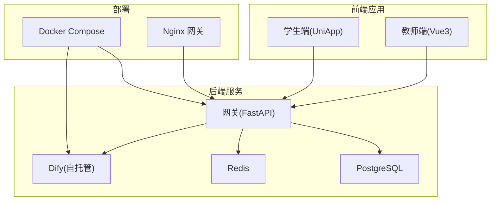
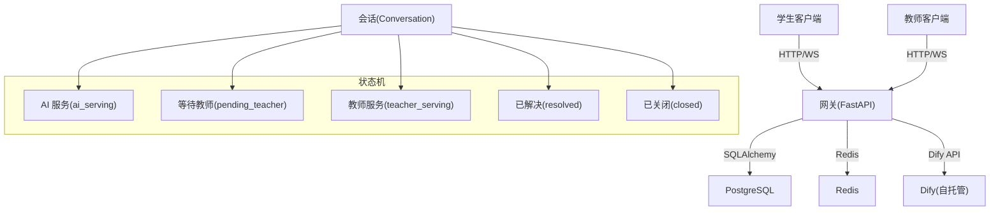
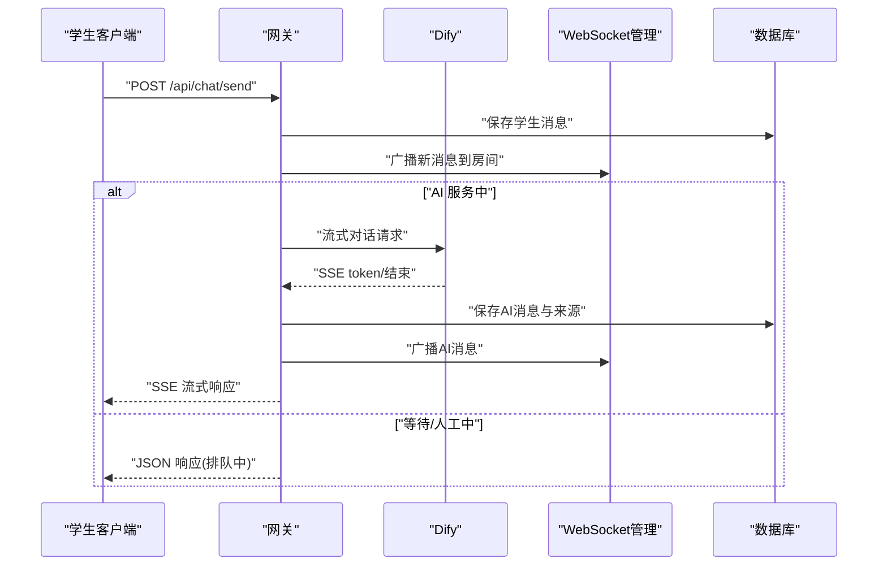
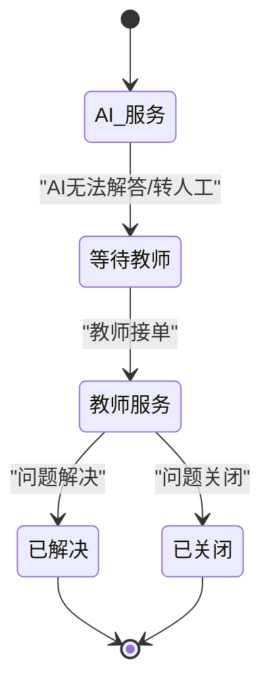
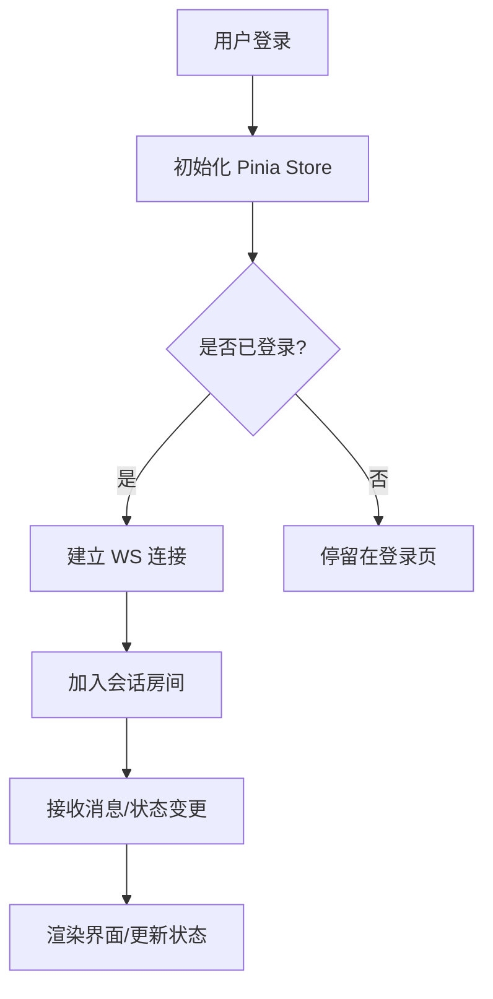
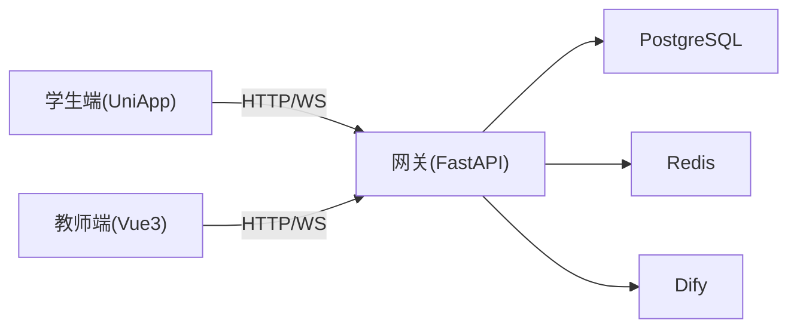

# 项目介绍

<cite>
**本文档引用的文件**
- [README.md](file://README.md)
- [main.py](file://services/gateway/app/main.py)
- [config.py](file://services/gateway/app/config.py)
- [chat.py](file://services/gateway/app/routers/chat.py)
- [conversations.py](file://services/gateway/app/routers/conversations.py)
- [ws_manager.py](file://services/gateway/app/services/ws_manager.py)
- [conversation.py](file://services/gateway/app/models/conversation.py)
- [main.ts（学生端）](file://apps/student-app/src/main.ts)
- [main.ts（教师端）](file://apps/teacher-app/src/main.ts)
- [pages.json（学生端）](file://apps/student-app/src/pages.json)
- [pages.json（教师端）](file://apps/teacher-app/src/pages.json)
- [user.ts（学生端）](file://apps/student-app/src/stores/user.ts)
- [TopAppBar.vue（教师端）](file://apps/teacher-app/src/components/TopAppBar.vue)
- [CustomTabBar.vue（学生端）](file://apps/student-app/src/components/CustomTabBar.vue)
- [docker-compose.yml](file://deploy/docker-compose.yml)
- [gateway.conf](file://deploy/nginx/gateway.conf)
- [yixiaoguan-chatflow.yml](file://deploy/dify/yixiaoguan-chatflow.yml)
</cite>

## 目录
1. [引言](#引言)
2. [项目结构](#项目结构)
3. [核心组件](#核心组件)
4. [架构总览](#架构总览)
5. [详细组件分析](#详细组件分析)
6. [依赖关系分析](#依赖关系分析)
7. [性能考量](#性能考量)
8. [故障排查指南](#故障排查指南)
9. [结论](#结论)
10. [附录](#附录)

## 引言
医小管 v2 是一个面向智能校园场景的第二代服务系统，旨在通过“AI 助手 + 人工教师”的混合服务模式，为学生、教师与管理员提供高效、稳定、可扩展的校园问答与工单流转服务。系统采用前后端分离架构：后端基于 FastAPI + SQLAlchemy + Alembic，AI 引擎采用自托管 Dify，数据库为 PostgreSQL 与 Redis；前端分别提供 UniApp 学生端与 Vue 3 教师端，支持多平台部署与实时通信。

本项目的核心价值在于：
- 以 AI 首呼降低人工压力，实现 7×24 小时智能问答；
- 在需要人工介入时，无缝转人工并保持会话连续性；
- 借助 WebSocket 实现实时消息与状态同步，提升交互体验；
- 通过统一网关与状态机管理，保障复杂业务流程的稳定性与可观测性。

## 项目结构
项目采用多模块组织方式，分为前端应用与后端服务两大块，并辅以部署与文档资源：
- 后端网关服务（FastAPI）：负责认证、会话与消息管理、Dify 集成、WebSocket 管理与健康检查；
- 前端应用（学生端/教师端）：分别提供问答、历史记录、个人中心、工作台、知识库等功能页面；
- 部署与配置：Docker Compose 编排、Nginx 网关、Dify 自托管编排；
- 文档与设计：需求与设计文档、开发计划与迁移脚本。

图表来源
- [main.py:1-78](file://services/gateway/app/main.py#L1-L78)
- [docker-compose.yml](file://deploy/docker-compose.yml)
- [gateway.conf](file://deploy/nginx/gateway.conf)

章节来源
- [README.md:1-18](file://README.md#L1-L18)
- [main.py:1-78](file://services/gateway/app/main.py#L1-L78)
- [docker-compose.yml](file://deploy/docker-compose.yml)

## 核心组件
- 网关服务（Gateway）
  - 提供认证、会话与消息管理、AI 对话流式响应、WebSocket 管理与健康检查；
  - 通过状态机驱动会话状态流转（AI 服务、等待教师、教师服务、已解决、已关闭）；
  - 与 Dify 集成，支持流式输出与引用来源回传。
- 学生端应用（UniApp）
  - 登录、首页、智能问答、历史对话、个人中心；
  - 使用 Pinia 管理用户态与本地存储，自动建立 WebSocket 连接。
- 教师端应用（Vue 3）
  - 工作台、学生提问、知识库、个人中心；
  - 顶部导航栏组件化，支持搜索、设置、新增、编辑等操作入口。
- 部署与配置
  - Docker Compose 统一编排后端与 AI 引擎；
  - Nginx 作为反向代理与网关；
  - Dify Chatflow YAML 定义对话流程。

章节来源
- [main.py:1-78](file://services/gateway/app/main.py#L1-L78)
- [chat.py:1-191](file://services/gateway/app/routers/chat.py#L1-L191)
- [conversations.py:1-129](file://services/gateway/app/routers/conversations.py#L1-L129)
- [ws_manager.py:1-100](file://services/gateway/app/services/ws_manager.py#L1-L100)
- [pages.json（学生端）:1-65](file://apps/student-app/src/pages.json#L1-L65)
- [pages.json（教师端）:1-84](file://apps/teacher-app/src/pages.json#L1-L84)
- [user.ts（学生端）:1-56](file://apps/student-app/src/stores/user.ts#L1-L56)
- [TopAppBar.vue（教师端）:1-160](file://apps/teacher-app/src/components/TopAppBar.vue#L1-L160)
- [CustomTabBar.vue（学生端）:1-75](file://apps/student-app/src/components/CustomTabBar.vue#L1-L75)
- [yixiaoguan-chatflow.yml](file://deploy/dify/yixiaoguan-chatflow.yml)

## 架构总览
系统采用“网关 + 会话状态机 + AI 引擎 + 实时通信”的整体架构。学生发起问题后，系统根据会话状态决定是直接返回 AI 流式回答，还是转交人工教师处理；教师端通过 WebSocket 实时接收新消息与状态变更，完成闭环服务。

图表来源
- [main.py:1-78](file://services/gateway/app/main.py#L1-L78)
- [conversation.py:1-63](file://services/gateway/app/models/conversation.py#L1-L63)
- [ws_manager.py:1-100](file://services/gateway/app/services/ws_manager.py#L1-L100)

## 详细组件分析

### 网关服务（Gateway）
- 职责
  - 认证与鉴权：基于 JWT 的用户身份校验；
  - 会话与消息：创建、查询、分页列出、追加消息；
  - AI 对话：对接 Dify，返回 SSE 流式数据，聚合引用来源；
  - 实时通信：WebSocket 管理器，按会话房间广播消息与状态变更；
  - 健康检查：数据库、缓存、AI 引擎连通性检测。
- 关键流程
  - 学生发送消息：保存消息 → 判断状态 → AI 流式返回或转人工 → 广播消息 → 保存 AI 回答与来源 → 再次广播；
  - 教师端接入：登录后自动建立 WS 连接，加入对应会话房间，接收消息与状态变更。

图表来源
- [chat.py:22-191](file://services/gateway/app/routers/chat.py#L22-L191)
- [ws_manager.py:71-82](file://services/gateway/app/services/ws_manager.py#L71-L82)
- [conversation.py:11-24](file://services/gateway/app/models/conversation.py#L11-L24)

章节来源
- [main.py:1-78](file://services/gateway/app/main.py#L1-L78)
- [chat.py:1-191](file://services/gateway/app/routers/chat.py#L1-L191)
- [conversations.py:1-129](file://services/gateway/app/routers/conversations.py#L1-L129)
- [ws_manager.py:1-100](file://services/gateway/app/services/ws_manager.py#L1-L100)
- [config.py:1-31](file://services/gateway/app/config.py#L1-L31)

### 会话状态管理
- 状态枚举
  - ai_serving：AI 正在服务；
  - pending_teacher：等待教师接单；
  - teacher_serving：教师正在服务；
  - resolved：已解决；
  - closed：已关闭。
- 状态流转
  - 学生发起新会话默认进入 AI 服务；
  - 当 AI 无法解答或触发转人工条件时，进入等待教师；
  - 教师接单后进入教师服务；
  - 结束后可标记为已解决或关闭。

图表来源
- [conversation.py:11-16](file://services/gateway/app/models/conversation.py#L11-L16)
- [chat.py:43-59](file://services/gateway/app/routers/chat.py#L43-L59)

章节来源
- [conversation.py:1-63](file://services/gateway/app/models/conversation.py#L1-L63)
- [chat.py:1-191](file://services/gateway/app/routers/chat.py#L1-L191)

### 实时聊天通信（WebSocket）
- 连接管理
  - 用户级连接集合与房间级广播；
  - 断线清理与死连接探测；
  - 支持按用户推送与按会话房间广播。
- 应用场景
  - 学生端：自动登录后建立 WS 连接，加入会话房间；
  - 教师端：登录后自动建立 WS 连接，加入相关房间，接收新消息与状态变更。

图表来源
- [user.ts（学生端）:24-34](file://apps/student-app/src/stores/user.ts#L24-L34)
- [main.ts（教师端）:9-19](file://apps/teacher-app/src/main.ts#L9-L19)
- [ws_manager.py:25-46](file://services/gateway/app/services/ws_manager.py#L25-L46)

章节来源
- [ws_manager.py:1-100](file://services/gateway/app/services/ws_manager.py#L1-L100)
- [user.ts（学生端）:1-56](file://apps/student-app/src/stores/user.ts#L1-L56)
- [main.ts（教师端）:1-25](file://apps/teacher-app/src/main.ts#L1-L25)

### 前端应用（学生端/教师端）
- 学生端
  - 页面：登录、首页、智能问答、历史对话、个人中心；
  - 导航：自定义 TabBar，支持首页、智能问答、我的；
  - 状态：Pinia 管理 token 与用户信息，本地持久化，自动 WS 连接。
- 教师端
  - 页面：登录、工作台、学生提问、知识库、个人中心、提问详情、知识详情；
  - 导航：顶部 TopAppBar，支持返回、搜索、设置、新增、编辑等动作；
  - 状态：登录后初始化用户与 WS 连接。

章节来源
- [pages.json（学生端）:1-65](file://apps/student-app/src/pages.json#L1-L65)
- [CustomTabBar.vue（学生端）:1-75](file://apps/student-app/src/components/CustomTabBar.vue#L1-L75)
- [pages.json（教师端）:1-84](file://apps/teacher-app/src/pages.json#L1-L84)
- [TopAppBar.vue（教师端）:1-160](file://apps/teacher-app/src/components/TopAppBar.vue#L1-L160)
- [main.ts（学生端）:1-11](file://apps/student-app/src/main.ts#L1-L11)
- [main.ts（教师端）:1-25](file://apps/teacher-app/src/main.ts#L1-L25)
- [user.ts（学生端）:1-56](file://apps/student-app/src/stores/user.ts#L1-L56)

## 依赖关系分析
- 后端依赖
  - FastAPI：提供路由与生命周期管理；
  - SQLAlchemy：ORM 映射与数据库访问；
  - Alembic：数据库迁移；
  - Redis：异步缓存与会话元数据；
  - Dify：自托管 AI 引擎；
  - WebSockets：实时通信。
- 前端依赖
  - UniApp/Vue 3：跨平台前端框架；
  - Pinia：状态管理；
  - Element Plus（教师端）：UI 组件库。

图表来源
- [main.py:1-78](file://services/gateway/app/main.py#L1-L78)
- [config.py:1-31](file://services/gateway/app/config.py#L1-L31)

章节来源
- [main.py:1-78](file://services/gateway/app/main.py#L1-L78)
- [config.py:1-31](file://services/gateway/app/config.py#L1-L31)

## 性能考量
- 数据库
  - 为会话与消息表建立复合索引，优化分页与查询性能；
  - 使用异步 SQLAlchemy 与连接池，提升并发吞吐。
- 缓存
  - Redis 用于会话元数据与临时状态，降低数据库压力；
  - 建议对热点查询结果进行缓存。
- AI 引擎
  - SSE 流式输出减少首字节延迟；
  - 控制 Dify 请求超时与重试策略，避免阻塞主流程。
- 实时通信
  - WebSocket 连接按用户与房间管理，避免广播风暴；
  - 断线清理与死连接探测，维持连接池健康。
- 前端
  - 使用 Pinia 管理轻量状态，避免重复渲染；
  - 页面懒加载与按需引入组件，降低首屏体积。

## 故障排查指南
- 健康检查
  - 网关提供统一健康检查端点，包含数据库、缓存与 AI 引擎连通性；
  - 若返回降级状态，优先检查对应依赖服务日志。
- WebSocket 连接
  - 若教师端无法接收消息，检查用户登录态与房间加入逻辑；
  - 观察连接管理器的断线清理日志，定位死连接。
- AI 对话
  - 若 SSE 流中断，检查 Dify 服务可用性与网络策略；
  - 查看消息保存与来源回传是否成功。
- 数据一致性
  - 核对会话状态与消息发送权限，确保状态机正确流转；
  - 关注数据库事务提交与异常回滚。

章节来源
- [main.py:30-68](file://services/gateway/app/main.py#L30-L68)
- [ws_manager.py:34-46](file://services/gateway/app/services/ws_manager.py#L34-L46)
- [chat.py:105-153](file://services/gateway/app/routers/chat.py#L105-L153)

## 结论
医小管 v2 通过“AI 首呼 + 人工兜底 + 实时通信 + 状态机治理”的组合拳，构建了面向校园的服务闭环。它不仅提升了服务效率与用户体验，也为后续扩展知识库、多模态问答与更复杂的业务流程打下坚实基础。对于学生、教师与管理员而言，系统分别提供了“即时解答”“高效处置”“可视化运营”的价值支撑。

## 附录
- 快速启动
  - 通过 Docker Compose 启动后端与 AI 引擎；
  - Nginx 作为网关反向代理；
  - Dify Chatflow YAML 定义对话流程。
- 开发与运维
  - 使用 Alembic 管理数据库迁移；
  - 前端支持多平台构建与微信小程序等多端发布。

章节来源
- [README.md:12-15](file://README.md#L12-L15)
- [docker-compose.yml](file://deploy/docker-compose.yml)
- [gateway.conf](file://deploy/nginx/gateway.conf)
- [yixiaoguan-chatflow.yml](file://deploy/dify/yixiaoguan-chatflow.yml)