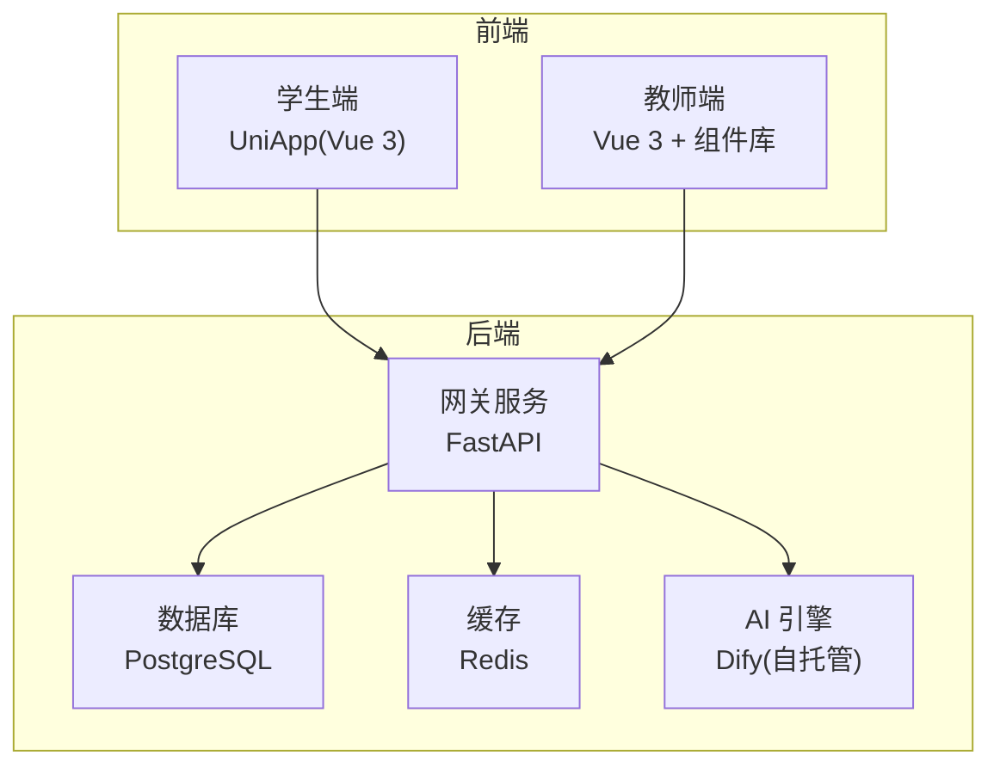
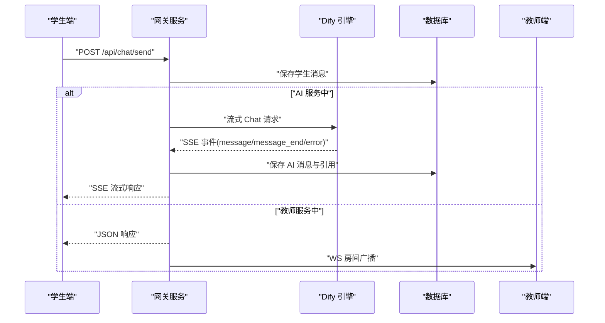
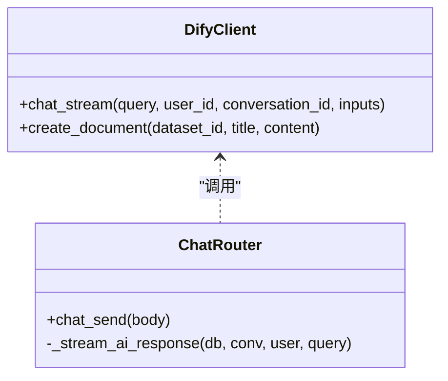
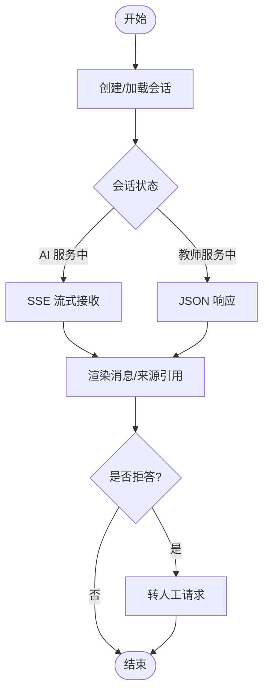
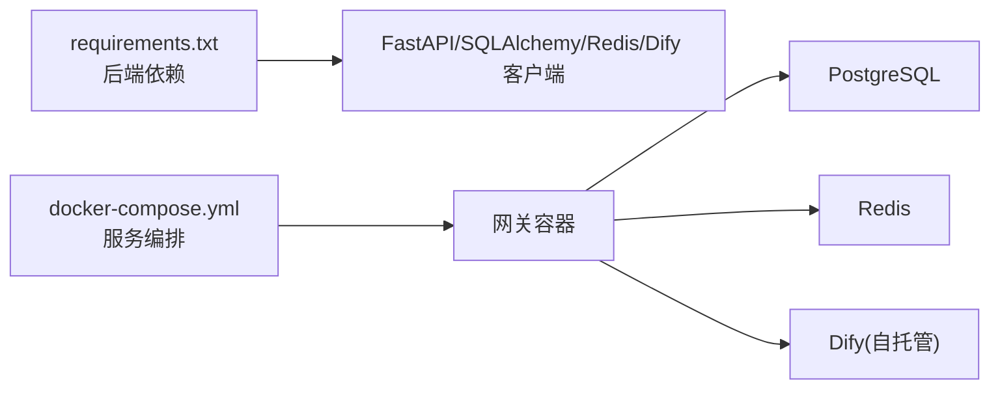

# 项目概述

<cite>
**本文引用的文件**
- [README.md](file://README.md)
- [docker-compose.yml](file://deploy/docker-compose.yml)
- [requirements.txt](file://services/gateway/requirements.txt)
- [main.py](file://services/gateway/app/main.py)
- [chat.py](file://services/gateway/app/routers/chat.py)
- [dify_client.py](file://services/gateway/app/services/dify_client.py)
- [conversation.py](file://services/gateway/app/models/conversation.py)
- [chat.ts](file://services/gateway/app/schemas/chat.py)
- [index.vue（学生端聊天页）](file://apps/student-app/src/pages/chat/index.vue)
- [chat.ts（学生端 API）](file://apps/student-app/src/api/chat.ts)
- [index.vue（教师端仪表盘）](file://apps/teacher-app/src/pages/dashboard/index.vue)
- [package.json（学生端）](file://apps/student-app/package.json)
- [package.json（教师端）](file://apps/teacher-app/package.json)
</cite>

## 目录
1. [引言](#引言)
2. [项目结构](#项目结构)
3. [核心组件](#核心组件)
4. [架构总览](#架构总览)
5. [详细组件分析](#详细组件分析)
6. [依赖分析](#依赖分析)
7. [性能考虑](#性能考虑)
8. [故障排查指南](#故障排查指南)
9. [结论](#结论)
10. [附录](#附录)

## 引言
医小管 v2 是一个面向智能校园场景的问答服务平台，采用“AI 助手 + 人工教师”的双轨服务模式，既满足高频、低门槛的自助问答，又能在复杂问题时无缝转人工，保障服务质量与效率。系统以统一网关为核心，后端基于 FastAPI 提供高并发 API，前端分别提供学生端与教师端应用，AI 引擎采用自托管 Dify，数据库与缓存采用 PostgreSQL 与 Redis。

本项目旨在通过清晰的架构设计与前后端分离实现，为高校学生与教师提供稳定、可扩展、易维护的智能问答体验。

## 项目结构
项目采用多模块分层组织：
- 后端网关服务：FastAPI + SQLAlchemy + Alembic，负责认证、会话管理、AI 调用与 WebSocket 广播
- 学生端应用：UniApp（Vue 3），提供聊天界面、SSE 流式接收、Markdown 渲染与人工转接
- 教师端应用：Vue 3 + Element Plus 风格组件，提供工作台、待处理问题列表与知识管理入口
- 部署与配置：Docker Compose 编排，环境变量驱动配置，支持本地一键启动
- 文档与设计：设计文档与需求文档，指导开发与演进

图表来源
- [main.py:16-28](file://services/gateway/app/main.py#L16-L28)
- [docker-compose.yml:4-21](file://deploy/docker-compose.yml#L4-L21)

章节来源
- [README.md:1-18](file://README.md#L1-L18)
- [docker-compose.yml:1-22](file://deploy/docker-compose.yml#L1-L22)

## 核心组件
- 网关服务（FastAPI）
  - 提供健康检查、认证、会话与消息路由、WebSocket 广播、与 Dify 的流式通信
  - 关键能力：SSE 流式输出、状态机驱动的会话流转、Redis 缓存与连接池管理
- 学生端（UniApp）
  - 聊天页面：Markdown 渲染、流式打字动画、来源引用展示、长按转人工
  - 交互：SSE 与 WebSocket 双通道，实时接收 AI 与教师消息
- 教师端（Vue 3）
  - 工作台：待处理问题列表、统计卡片、快捷操作入口
  - 与网关配合完成会话状态变更与消息推送
- AI 引擎（Dify）
  - 自托管 Chatflow，提供流式事件（message/message_end/error），支持检索增强与引用溯源
- 数据模型
  - 会话与消息模型，包含状态枚举、元数据存储与索引优化

章节来源
- [main.py:24-68](file://services/gateway/app/main.py#L24-L68)
- [chat.py:22-102](file://services/gateway/app/routers/chat.py#L22-L102)
- [dify_client.py:22-69](file://services/gateway/app/services/dify_client.py#L22-L69)
- [conversation.py:11-44](file://services/gateway/app/models/conversation.py#L11-L44)
- [index.vue（学生端聊天页）:198-481](file://apps/student-app/src/pages/chat/index.vue#L198-L481)
- [index.vue（教师端仪表盘）:138-251](file://apps/teacher-app/src/pages/dashboard/index.vue#L138-L251)

## 架构总览
系统采用“网关 + 多端 + AI 引擎”的分层架构：
- 网关作为统一入口，聚合认证、会话、消息与 AI 能力，并通过 WebSocket 实现全站广播
- 学生端与教师端分别承担“用户交互”与“教师运营”职责，二者通过网关共享同一数据与状态
- AI 引擎以流式事件形式返回答案与引用，网关负责事件解析、持久化与前端转发

图表来源
- [chat.py:22-102](file://services/gateway/app/routers/chat.py#L22-L102)
- [dify_client.py:22-69](file://services/gateway/app/services/dify_client.py#L22-L69)
- [index.vue（学生端聊天页）:423-481](file://apps/student-app/src/pages/chat/index.vue#L423-L481)

## 详细组件分析

### 网关服务（FastAPI）
- 负责健康检查、路由挂载、依赖注入与中间件生命周期管理
- 提供认证、会话与聊天接口，内部集成 Dify 客户端与 WebSocket 管理器
- 使用 Pydantic 模型进行请求/响应校验，保证数据一致性

图表来源
- [dify_client.py:11-105](file://services/gateway/app/services/dify_client.py#L11-L105)
- [chat.py:22-191](file://services/gateway/app/routers/chat.py#L22-L191)

章节来源
- [main.py:16-78](file://services/gateway/app/main.py#L16-L78)
- [chat.py:22-191](file://services/gateway/app/routers/chat.py#L22-L191)
- [dify_client.py:11-105](file://services/gateway/app/services/dify_client.py#L11-L105)

### 学生端（UniApp 聊天页）
- 负责消息渲染、Markdown 解析、SSE 事件处理与 WebSocket 监听
- 支持“AI 服务中”与“教师服务中”两种模式的差异化交互
- 提供“拒答检测”与“转人工”流程，提升用户体验

图表来源
- [index.vue（学生端聊天页）:369-534](file://apps/student-app/src/pages/chat/index.vue#L369-L534)
- [chat.ts（学生端 API）:9-35](file://apps/student-app/src/api/chat.ts#L9-L35)

章节来源
- [index.vue（学生端聊天页）:198-649](file://apps/student-app/src/pages/chat/index.vue#L198-L649)
- [chat.ts（学生端 API）:1-36](file://apps/student-app/src/api/chat.ts#L1-L36)

### 教师端（Vue 3 工作台）
- 展示待处理问题列表、统计卡片与快捷入口
- 与网关协作完成会话状态切换与消息广播，支撑人工服务闭环

章节来源
- [index.vue（教师端仪表盘）:138-251](file://apps/teacher-app/src/pages/dashboard/index.vue#L138-L251)

### 数据模型与状态机
- 会话状态包含：AI 服务中、等待教师、教师服务中、已解决、已关闭
- 消息类型包含：学生、AI、教师、系统
- 通过索引优化查询性能，支持高并发读写

章节来源
- [conversation.py:11-63](file://services/gateway/app/models/conversation.py#L11-L63)

## 依赖分析
- 技术栈选择
  - 后端：FastAPI 提供高性能异步 API；SQLAlchemy + Alembic 管理数据库与迁移；Redis 提升缓存与会话广播性能
  - 前端：UniApp 统一多端开发；Vue 3 + 组件库构建教师端界面
  - AI 引擎：Dify 自托管，支持检索增强与流式事件
- 外部依赖与集成
  - 网关通过 httpx 与 SSE 客户端与 Dify 对接，实现流式事件解析
  - Docker Compose 将网关、数据库与缓存编排，便于本地与生产部署

图表来源
- [requirements.txt:1-29](file://services/gateway/requirements.txt#L1-L29)
- [docker-compose.yml:4-21](file://deploy/docker-compose.yml#L4-L21)

章节来源
- [requirements.txt:1-29](file://services/gateway/requirements.txt#L1-L29)
- [docker-compose.yml:1-22](file://deploy/docker-compose.yml#L1-L22)

## 性能考虑
- 异步与流式
  - 使用 FastAPI 异步与 httpx SSE，降低高并发下的阻塞风险
  - AI 回答采用流式事件，前端即时渲染，减少等待感
- 缓存与索引
  - Redis 用于会话广播与连接管理；数据库建立关键字段索引，优化查询
- 前端渲染
  - Markdown 渲染与虚拟滚动结合，控制消息列表内存占用
- 状态机与广播
  - 会话状态变化通过 WebSocket 广播，避免轮询带来的资源浪费

## 故障排查指南
- 健康检查
  - 通过网关健康端点检查数据库、缓存与 Dify 服务连通性
- 常见问题定位
  - AI 服务不可用：检查 Dify API 地址与密钥、网络连通性
  - 消息不刷新：确认 WebSocket 是否加入房间、事件监听是否注册
  - 会话状态异常：核对状态机转换逻辑与数据库状态字段
- 日志与监控
  - 后端记录 Dify 流式事件解析与错误信息，便于定位问题

章节来源
- [main.py:30-68](file://services/gateway/app/main.py#L30-L68)
- [chat.py:105-153](file://services/gateway/app/routers/chat.py#L105-L153)
- [index.vue（学生端聊天页）:278-326](file://apps/student-app/src/pages/chat/index.vue#L278-L326)

## 结论
医小管 v2 通过“AI 助手 + 人工教师”的双轨服务模式，结合统一网关与多端应用，实现了智能校园问答的高效与人性化。后端采用 FastAPI 与 Dify 的组合，前端以 UniApp/Vue 3 提供一致体验，整体架构具备良好的扩展性与可维护性。建议在后续版本中进一步完善知识库管理、教师工作流与多模态交互能力。

## 附录

### 快速启动指南
- 本地启动
  - 在 deploy 目录执行编排命令，映射端口避免冲突
  - 设置环境变量（数据库、Redis、Dify、JWT）
- 访问方式
  - 学生端：访问网关提供的聊天页面
  - 教师端：访问教师端工作台，查看待处理问题

章节来源
- [README.md:12-15](file://README.md#L12-L15)
- [docker-compose.yml:4-21](file://deploy/docker-compose.yml#L4-L21)

### 基本使用示例
- 学生发起提问
  - 创建会话 → 发送消息 → 观察 AI 流式回答与来源引用
- 教师处理问题
  - 在工作台查看待处理 → 接入会话 → 与学生实时对话
- 转人工
  - 学生端检测拒答后触发转人工 → 会话状态切换至等待教师 → 教师端收到通知

章节来源
- [index.vue（学生端聊天页）:369-534](file://apps/student-app/src/pages/chat/index.vue#L369-L534)
- [index.vue（教师端仪表盘）:200-211](file://apps/teacher-app/src/pages/dashboard/index.vue#L200-L211)